# 单孔成像&透镜

三维世界和二维图像之间的联系就是通过摄像机完成的，而摄像机的成像原理最基础的就是小孔成像，如果把一个物体直接放到相片前方，那么物体上任意一点的光线会均匀的照射到相片上的每一点，导致成像结果是一片白茫茫。

如果在相片和物体中间加上一个带小孔的隔板就不一样了，每个物体上的一点发射的光线，只会投射到相片上的某一点，从而得到清晰的成像，只不过成像是倒立的，这也就是小孔成像的原理，其中小孔称为光心，记为O，光心到像平面的距离称为焦距，记为f。

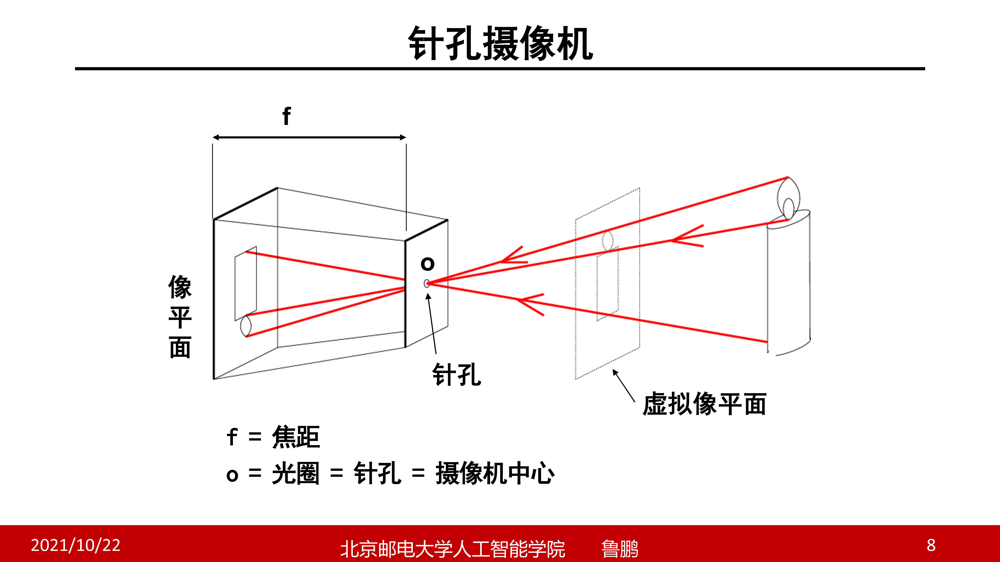

但是这种成像，得到的是倒立的像，而实际上在电子照相机中都有专门的计算单元进行处理，得到正向的图像，所以我们假设在光心和物体中间的位置上，有一个虚拟成像平面，从而简化计算，避免了正负号的变化。

然后在这种情况下，在摄像机坐标系（以光心为原点的三维坐标系）中，物体上的点投影到像平面上的过程就是一个相似三角形的过程，也就是三维点P到像平面点P'的映射.

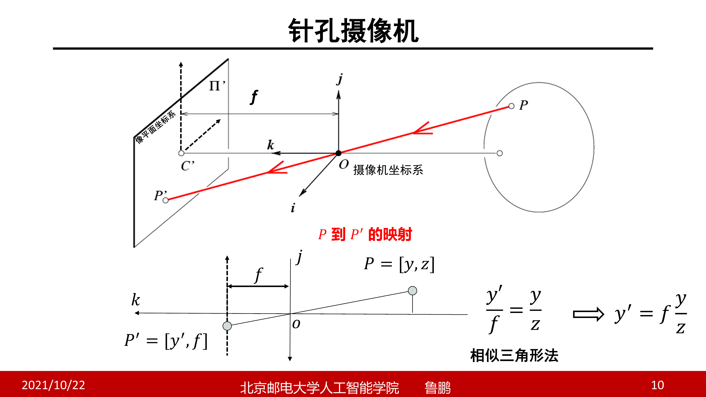

光圈的尺寸也很重要，如果光圈太大，真实世界中多个点的光线就会照射到成像平面上的同一个点，就会造成模糊等情况，也就是说，光圈越小，成像越清晰，但是也越暗，所以就加装透镜，来增加光照的强度，从而增加照片的亮度。

所以就得到了新的成像模型，也就是近轴折射模型，实际上只是改变了焦距f——使用Z'代替。

但是，基于透镜成像还会带来其他的问题，比如说失焦，也就是只有在一定深度的情况下，物体才能完成清晰的成像，否则就无法准确成像或者说成的是虚像，这个距离称为景深。

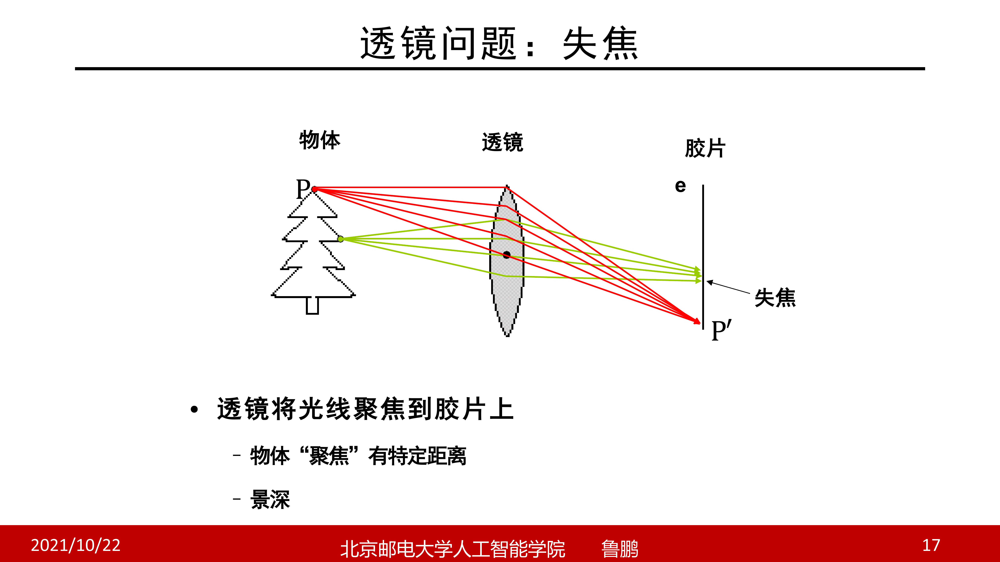

还有一个常见的问题就是畸变，比如说下图中的楼就是弯曲的，这就是产生了畸变，畸变产生的原因包括工艺问题等，比如说透镜越靠近边缘的地方折射率越高等，这样就会产生枕型畸变或者桶形畸变

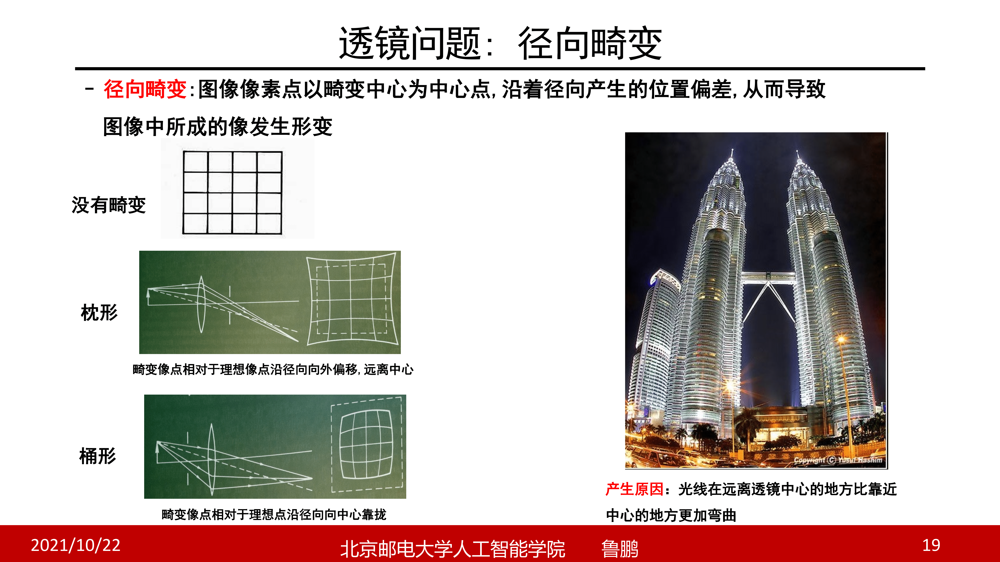

# 摄像机几何

## 像素坐标系

为了便于计算，我们把焦距统一定义为摄像机的焦距，而不是透镜或者小孔的焦距，这样可以避免歧义

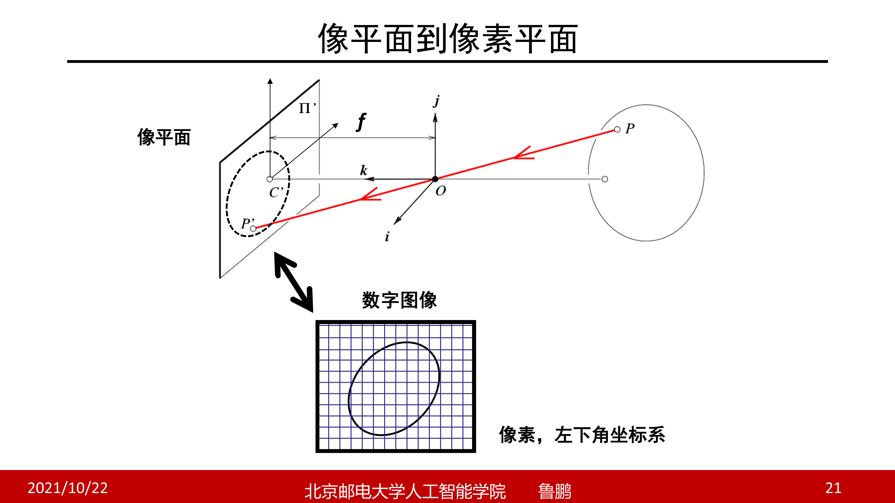

在现实中，通过相机得到的图像是数字图像，而实际上现实世界中的是模拟或者说连续图像，这就涉及一个图像离散化数字化的过程，也就是对象投影到像平面之后，怎么把像平面的图像转化为数字图像，因为实际上像平面就是一个中间的平面

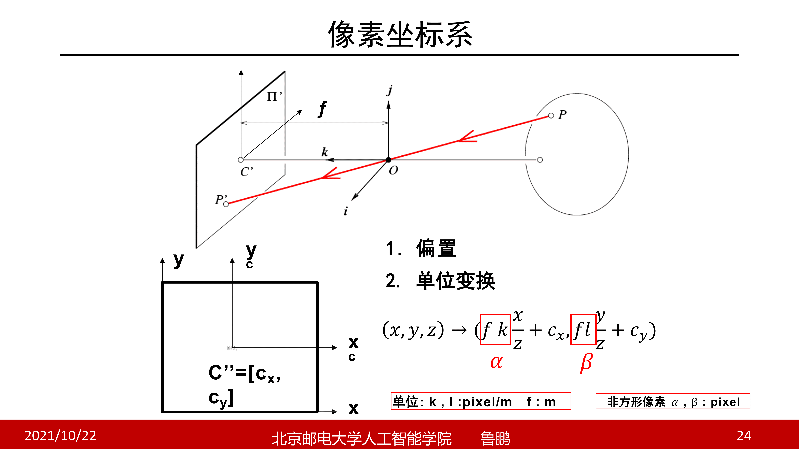

如上图所示，真实世界的物品按照相似原理投影到像平面之后，需要进行一个偏置，这样便于像素坐标系从左下角开始，这就涉及第一步也就是偏置，然后就进行第二步处理，把光学图像按照一定分辨率转化为数字图像，这就涉及单位变换，单位是像素/米，表示一米可以转化为多少个像素单位，这样就得到了数字图像

当然，可以简化一下，比如说焦距f和分辨率k、l都是相机内部参数，可以直接合并为$\alpha$和$\beta$，至于这两个参数具体是什么，其实不需要关系，只需要知道其为相机内部参数，可以实现单位变换即可

当然，注意一下实际上三维到二维的变换**不是线性变换**，因为实际上当x和y变化的时候，z可能就会变换，所以实际上不是线性变换

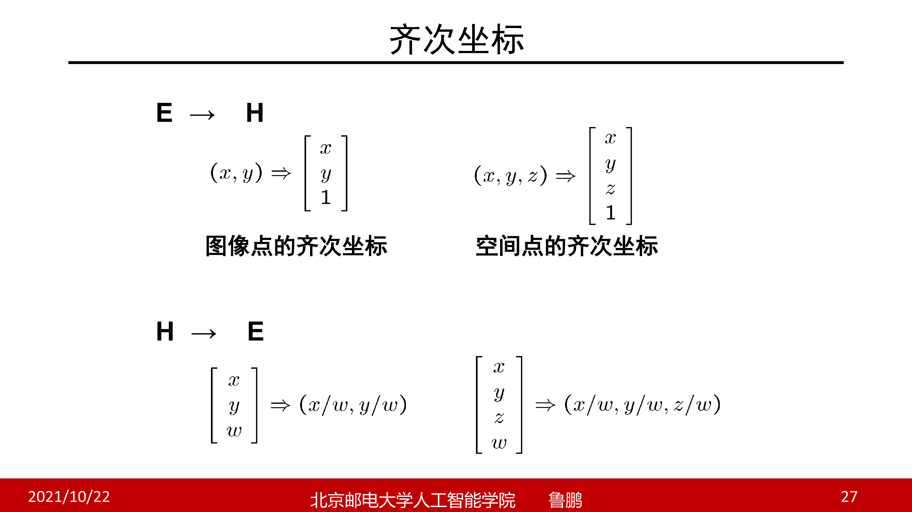

这里先介绍一下齐次坐标的概念，实际上齐次坐标就是在原始坐标上扩充了一维，比如说二维坐标的齐次坐标就是三维的，或者说二维欧式空间的坐标对应于齐次空间中的坐标，但是注意一下，欧式空间中的点对应齐次空间中的一个点，但是齐次空间中的很多点可以对应欧式空间的一个点，因为这个转换过程中需要除以最后一个维度，这个过程非常类似于三维投影到二维，实际上Z轴的信息被压缩到了X和Y轴中了

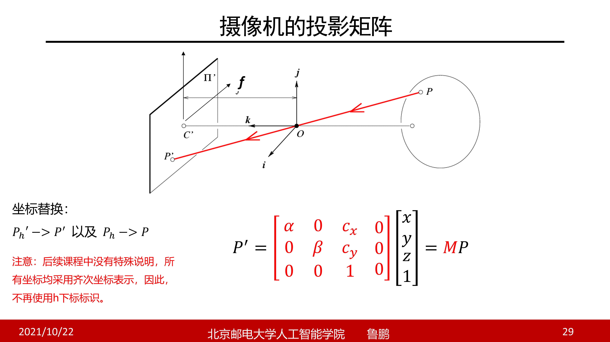

如果使用齐次坐标，就可以直接构建一个线性映射关系了，这样就可以直接使用一个矩阵乘法表示降维投影的关系，如上图所示，把相机内参构建为内参矩阵，然后基于三维点的齐次坐标就可以直接得到二维像素点的齐次坐标，简化了计算

当然，还有一个可能的问题就是摄像机倾斜问题，因为实际上相机成像平面的不是精确的垂直于相机Z轴，所以就会有一个倾斜角度，从而造成一定影响，所以需要在参数矩阵中加入这个角度的考虑

然后就可以得到了投影矩阵M，投影矩阵完全基于相机内参矩阵K完成，可以说，内参矩阵就代表了相机成像过程中所需的一切参数，这样操作就简化了成像过程的计算，而实际上内参矩阵有五个自由度，也就是可以使用五个参数表示

当然，有一种神奇的规范化相机，也就是内参矩阵中的参数全部为1，这种相机实际上是不存在的，只是一种状态，可以通过这种状态推导一些性质，因为在这种状态下，三维和二维可以说是一一对应的关系

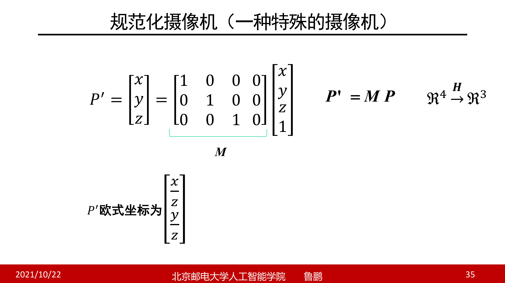

## 世界坐标系

当有了内参矩阵，就可以描述三维投影到二维的过程了，但是，面对同一个物体，不同的相机得到的图像并不相同，或者说，同一个物体在不同相机中并不一样，那么如何进行描述呢？这时候就需要世界坐标系了，在世界坐标系下描述物体，然后就可以很方便的去描述不同相机下的不同的物体了

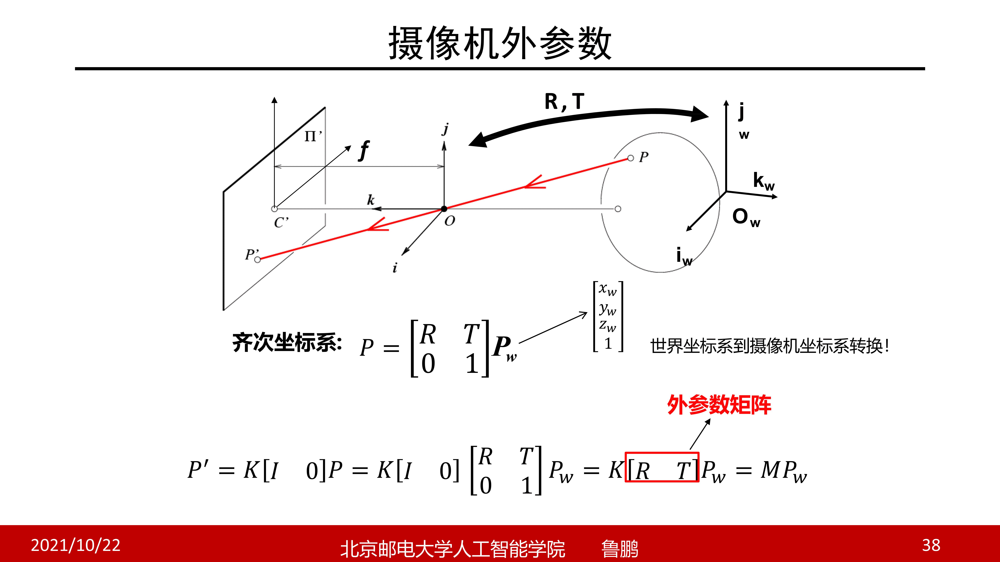

实际上，也就是描述相机坐标系相对世界坐标系的旋转和平移变换，然后就可以进一步描述世界坐标系下的某物体在某相机坐标系下的投影是什么样子，在这里，齐次坐标系之间的变换矩阵称为外参数矩阵，

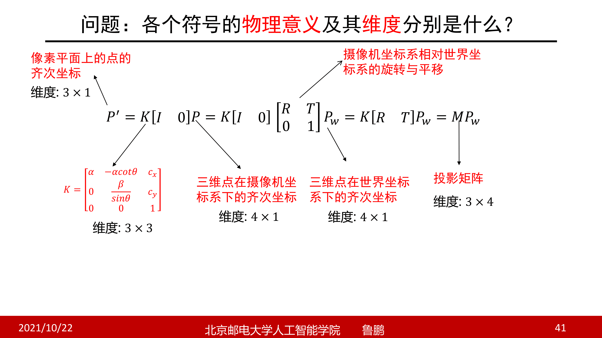

这样子，就构建了一套流程，在世界坐标系中的物体或者说点就可以通过一个矩阵，投影到相机中的二维图像中，投影矩阵合并为一个，这个矩阵有11个自由度

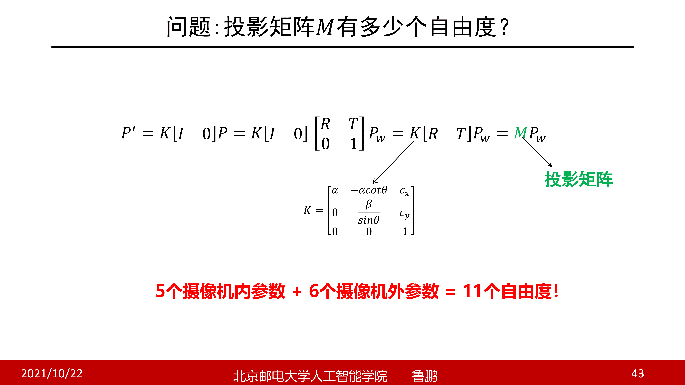

## 定理

然后就可以有一系列定理，比如说下图所示的定理

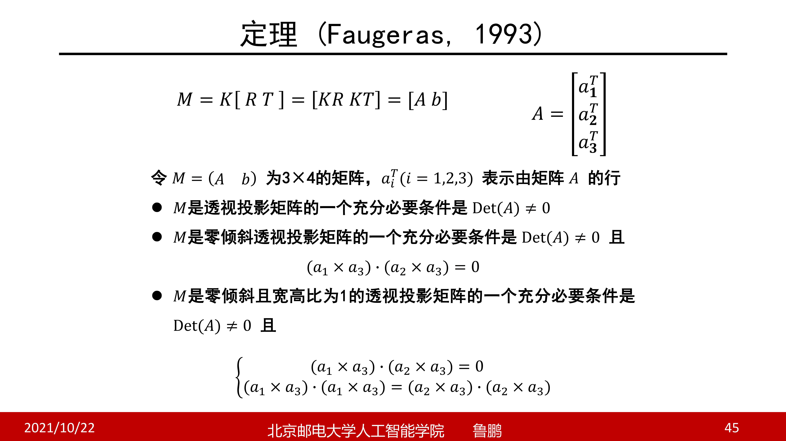

# 投影变换

在三维世界中的物体，投影到二维图像中的时候，会产生一些变化

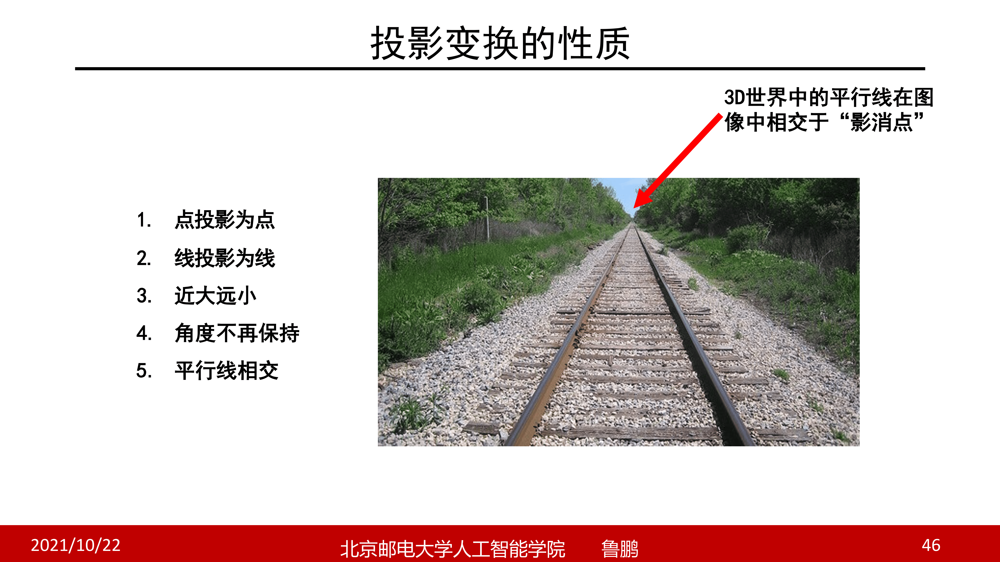

## 弱透视摄像机模型

这是透视投影摄像机的一个特例，当场景的相对景深，远小于其与相机的距离的时候，就可以把透视投影摄像机近似为弱透视投影相机

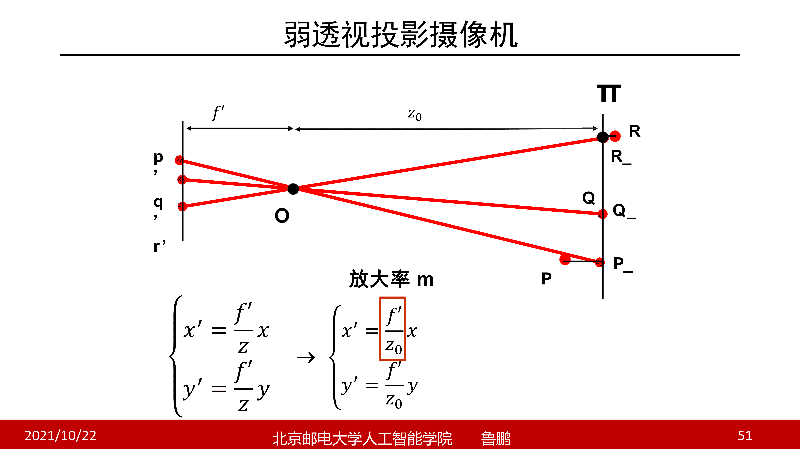

弱透视的意思，本质上就是忽略一些误差，认为所有的点都在一个平面上，比如说，有一个人站在相机十米位置上，那么可以认为其笔尖和眼睛在同一个平面上，或者说深度距离一致，这样子就可以减少计算量，并且避免了透视投影过程中的非线性因素，估算也方便，在后期重建的时候也会分为普通透视投影和弱透视投影

# 线性方程组的解

在线性方程组或者线性代数中，如何求解方程是一个很基础但是又很重要的任务，当方程组的系数矩阵是方阵并且满秩的情况下，方程组有唯一的解，但是在实际情况下，往往无法得到这种唯一解的情况

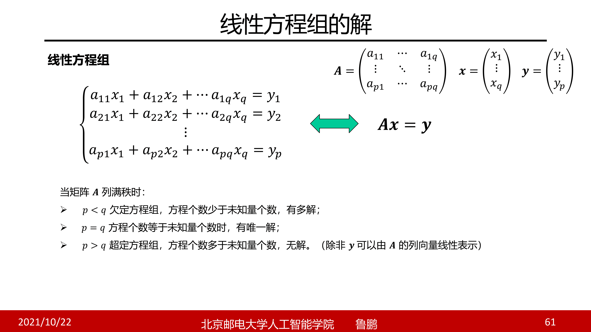

很多情况下，往往得到的是超定方程组，也就是方程数大于未知数数量，这种情况下是无法得到解的（一般是噪声导致），只能求出近似解，也就是最接近真实解的解，也称最小二乘解

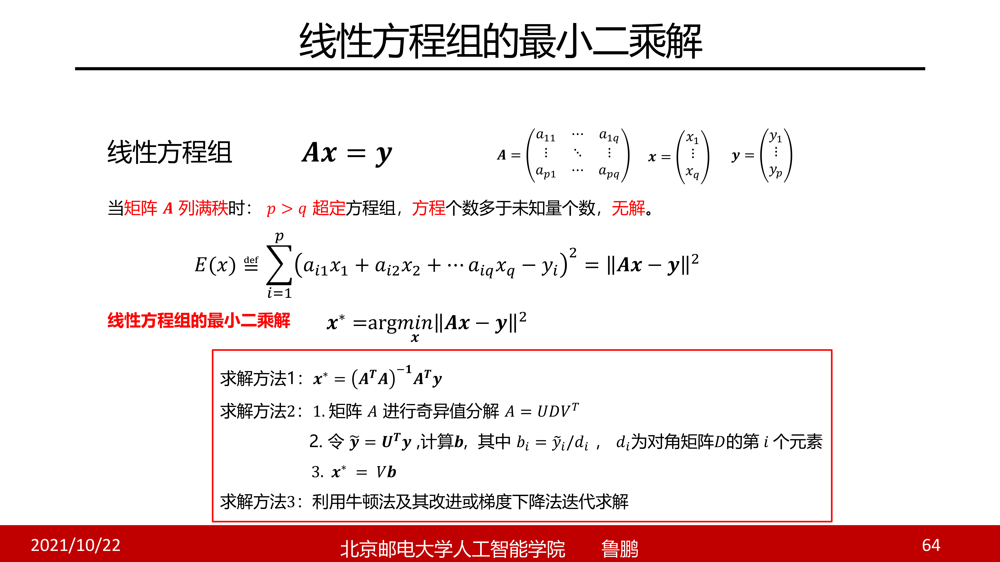

求解方法有三种，最小二乘法、奇异值分解和迭代求解方法

然后是齐次线性方程组的解，也是分三种情况的，其中超定方程组也是一个特殊情况，因为其他情况下只有零解

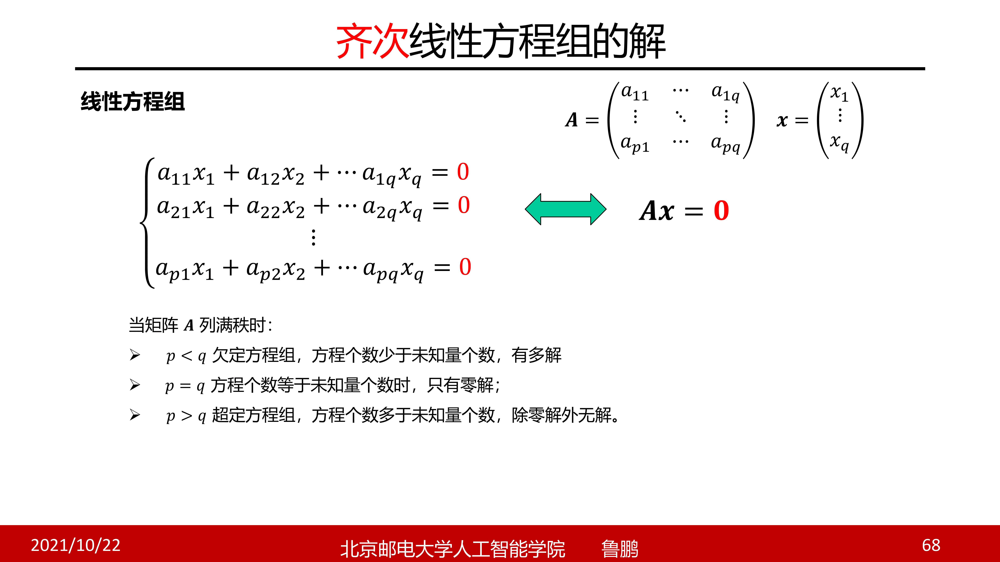

然后基于最小二乘的思想进行求解，但是这里问题是Ax=y为零，所以要进行一个限定，也就是假定x的长度为1，这样求解出来的近似解只会有一个数量级的差距，或者说有一个常数的差距

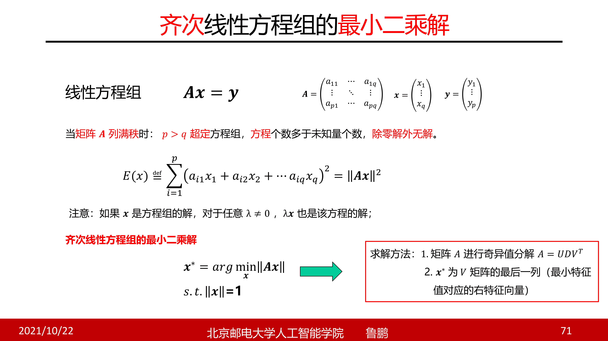

最后就是非线性方程的最小二乘解，对于非线性方程，无法直接使用线性方法求解，所以就需要一些其他的方法进行，比如说L-M方法等完成，这种方法有一定随机性，比如说局部最优的情况与起始点有关

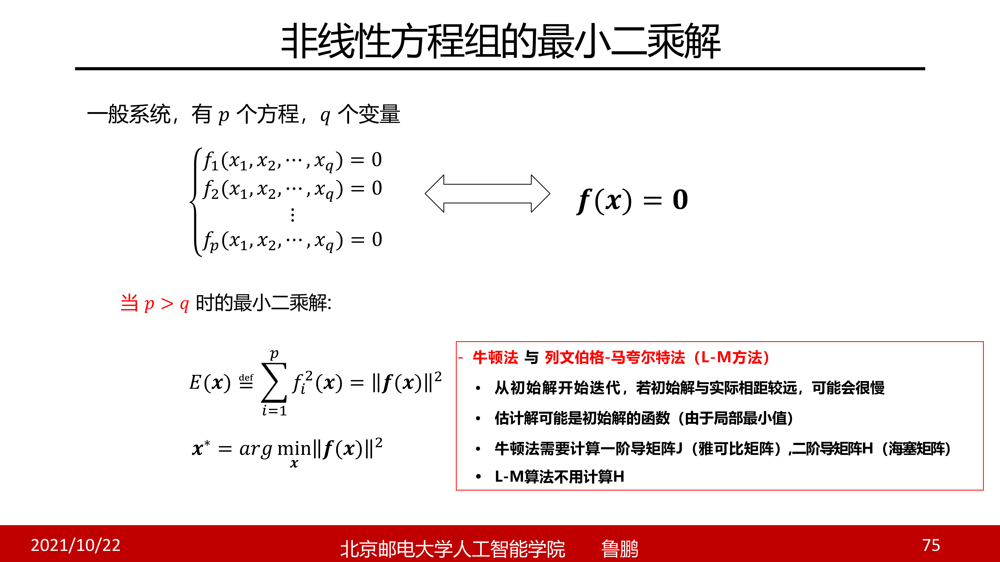

实际上，在使用的时候不需要手动去实现求解，只需要把问题做成规范形式，然后调用API就可以求解，因为在实际工程中，最经常碰到的问题就是无解的超定方程，所以需要专门研究如何求出近似解