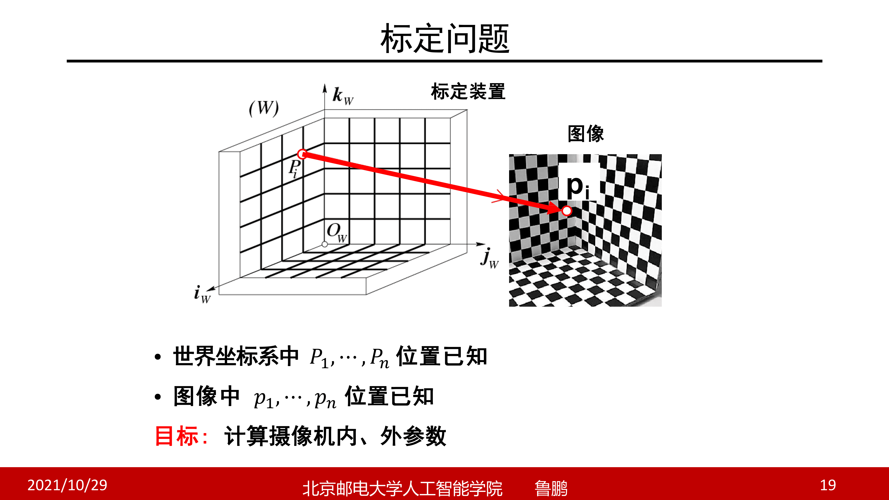
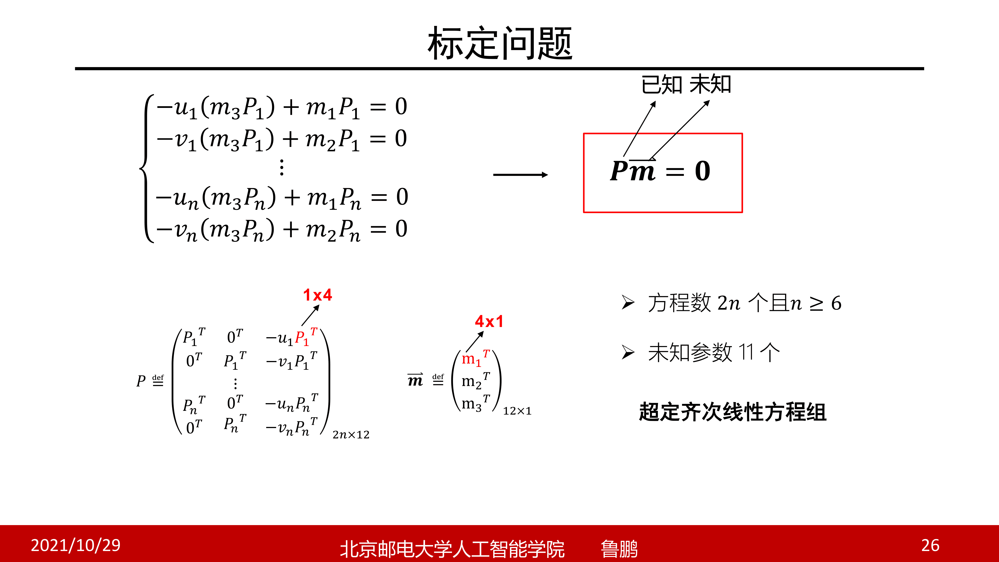
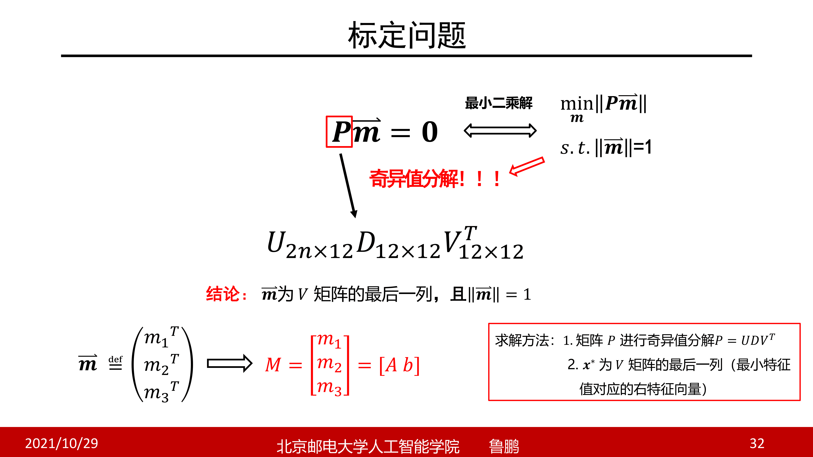
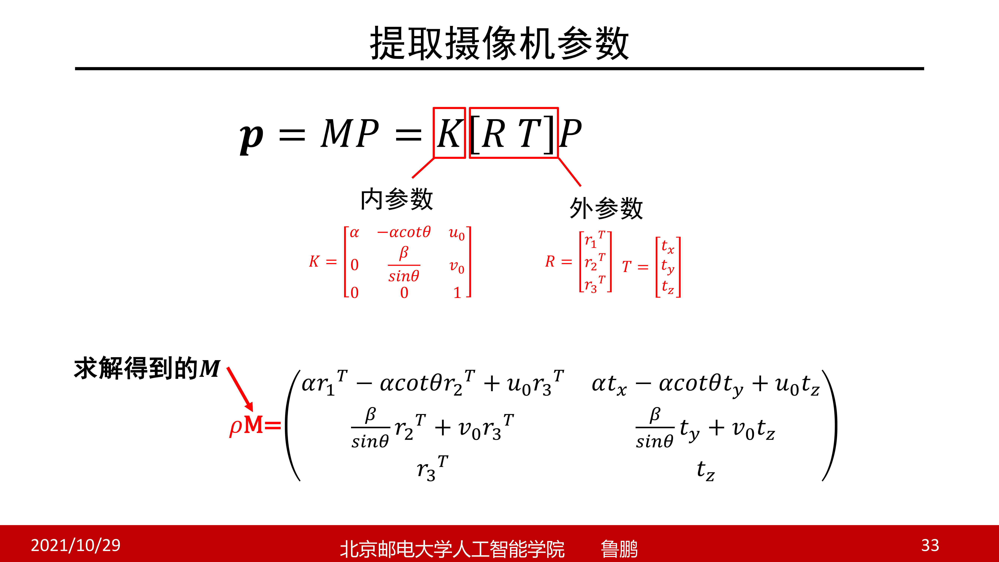
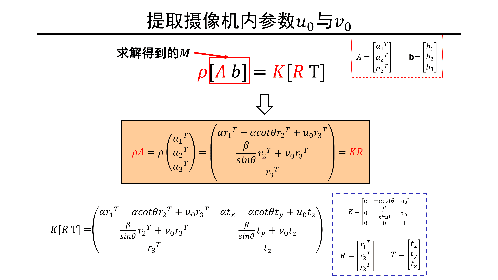

# 相机标定

在相机观测过程中，参数矩阵是非常重要的一个过程，但是如何得到参数矩阵呢？实际上厂家也不会给出一个标定好的矩阵直接给我们使用，所以就必须通过标定的方法求解。

摄像机标定，就是求解摄像机的内外参数矩阵，目标是从一张或者多张图像中估算内外参数矩阵

在标定过程中，默认大写 $P$ 是世界坐标系下的三维点，小写 $p$ 是像素坐标点

一般来说是有一个专门的标定装置（如上图所示），然后这种每个面上均匀分出一些黑白格子，这样就可以确定其中所有的点（主要是黑白格子的角点）的位置，并且在图像中也可以确定所有的三维点在图像中的位置

但是当有了这种装置之后怎么估计内外参矩阵呢？回想世界坐标系和投影矩阵的概念，我们有
$$
M=K[R \quad T]=
\begin{bmatrix}
m_1\\
m_2\\
m_3
\end{bmatrix},m_i\in \mathbb R^{1\times 4},i=1,2,3
$$
然后对于每个点有齐次坐标方程
$$
p_i=MP_i=\begin{bmatrix}
m_1P_i\\
m_2P_i\\
m_3P_i
\end{bmatrix}
$$
转换到欧式坐标有：
$$
p_i=
\begin{bmatrix}
u_i\\
v_i\\
\end{bmatrix}
=
\begin{bmatrix}
\frac{m_1P_i}{m_3P_i}\\
\frac{m_2P_i}{m_3P_i}\\
\end{bmatrix}
$$
然后对每个分量进行单独列方程分析，或者说转化为方程组
$$
u_i=\frac{m_1P_i}{m_3P_i}\to u_i(m_3P_i)=m_1P_i \to m_1P_i-u_i(m_3P_i)=0\\
v_i=\frac{m_2P_i}{m_3P_i}\to v_i(m_3P_i)=m_2P_i \to m_2P_i-v_i(m_3P_i)=0
$$
因为有11个未知量（内参矩阵五个参数，加上旋转和位移各自三个参数），所以需要六个点对应，但是实际操作中使用多于六对点来获得更为鲁棒的效果

然后整个标定问题就可以转化为上图中的超定齐次线性方程组的求最小二乘解问题，然后回顾一下求解方法，应用到此问题中即可进行求解

在进行 SVD 分解（基于现成的库完成此操作）之后，得到了下图所示的 $x^*$​，然后将其转换为投影矩阵即可

不过因为模长也是人为给定的，所以求解出来的投影矩阵和真实矩阵之间有一个系数的差距（或者说是尺度差距）

这样，我们可以得到投影矩阵 $M$​，但是这个矩阵是一个组合的矩阵，我们需要将其拆解开来，得到内参矩阵等

这里的变换矩阵使用向量进行书写，每个向量相互垂直，并且模长为一，这样可以简化计算过程，然后进行列代数方程（注意一下，下图右侧的矩阵也是3x4的矩阵，因为此矩阵第一列实际上是使用向量计算的），然后留一个 $\rho$ 表示尺度因子

然后可以进一步推导公式，比如说将求解得到的投影矩阵分为两部分，然后每部分单独列方程

