# 单视几何与变换

## 概述

当标定之后，一样无法通过像素位置确定三维位置，也就无法恢复三维空间结构

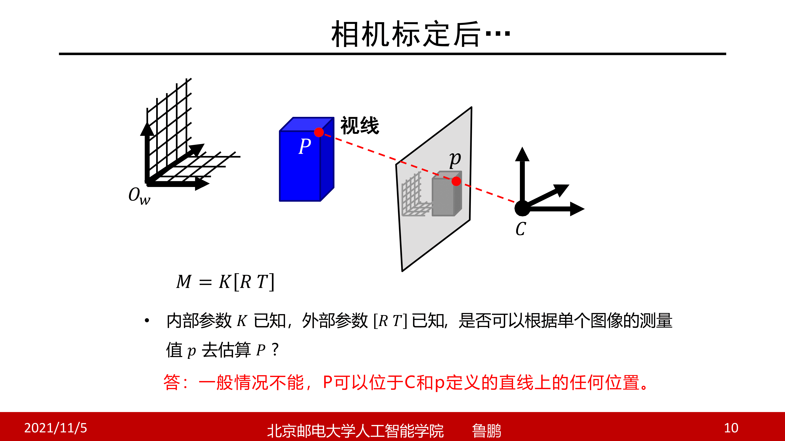

所以必须通过其他的方法，来确定点在三维空间中的位置，以此来恢复三维空间的结构

## 二维变换

实际上在二维空间上有两种主要变换，一种是欧式变换，这种情况下不会改变原始图形的形状，是一种等距变换

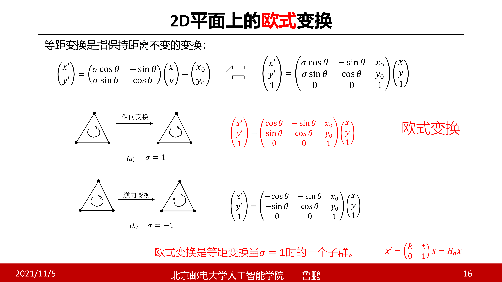

另外还有一个相似变换，就是在欧式变换上加上一个均匀伸缩变换，可以对原始图形进行缩放，得到一个相似的新图形，可以说欧式变换是相似变换的特例

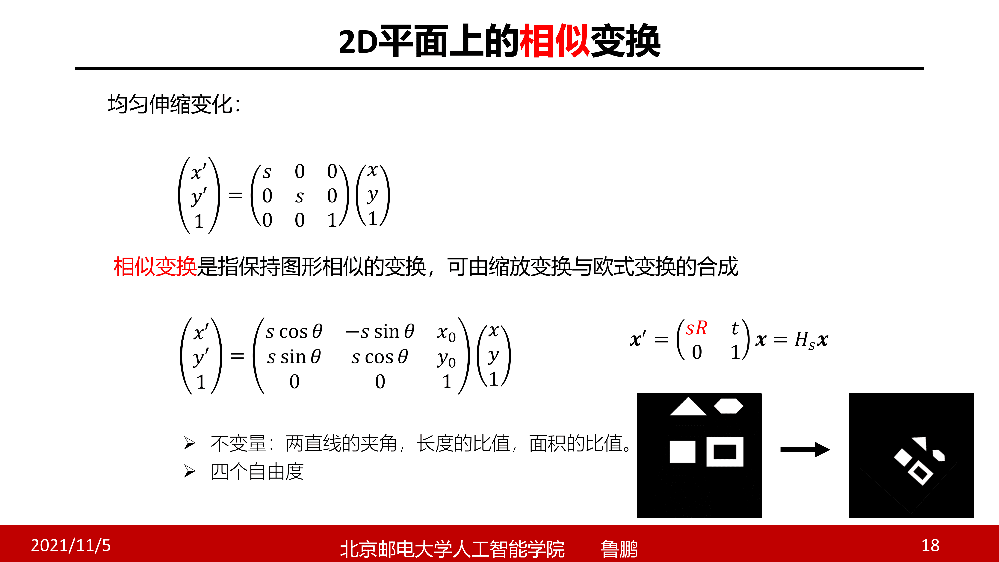

还有就是仿射变换，仿射变换保持了直线、平行线和比例关系，但不一定保持角度和距离，相似变换是仿射变换的一个特例

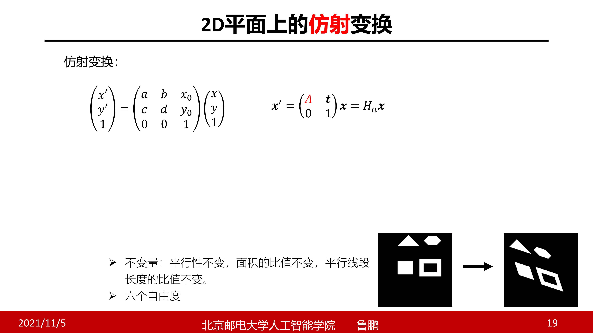

当然也可以进一步，也就是透视变换，这是一种更广泛的变换，仿射变换也是此变换的特例，这种方式类似相机成像过程中的变换

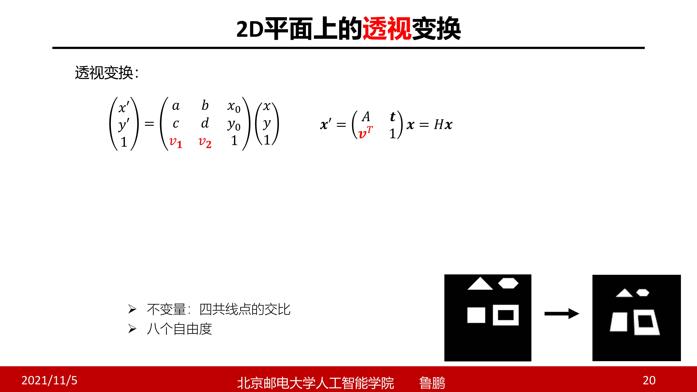

## 三维变换

二维中的变换，三维中也存在，比如说相似变换（包括欧式变换）

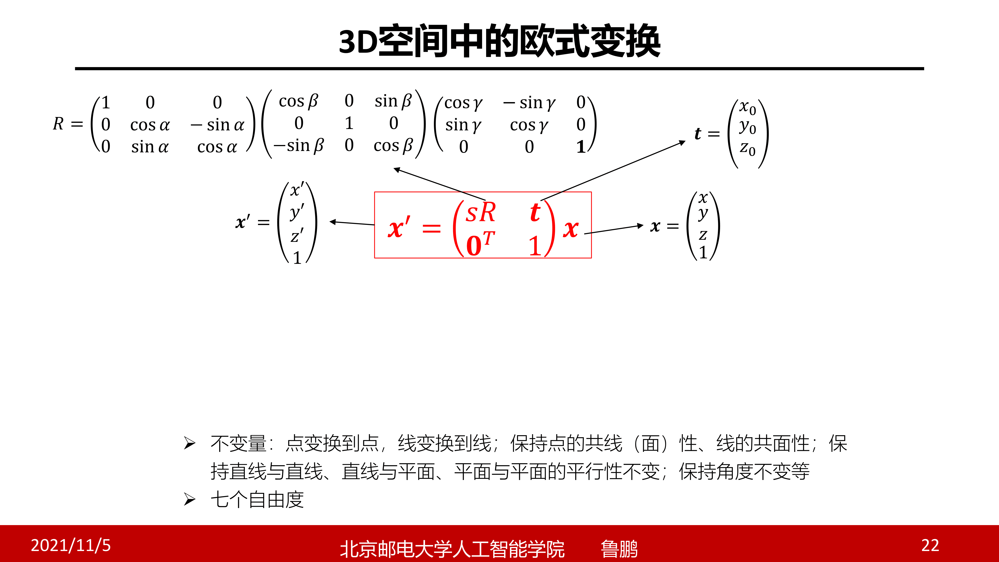

# 单视测量

## 无穷远点、无穷远线、无穷远面

对于二维平面上的点和线，可以使用下图中的方法进行表达，可以说 $l$ 决定了这个直线，或者说这个直线就是 $l$，因为二者参数是相同的

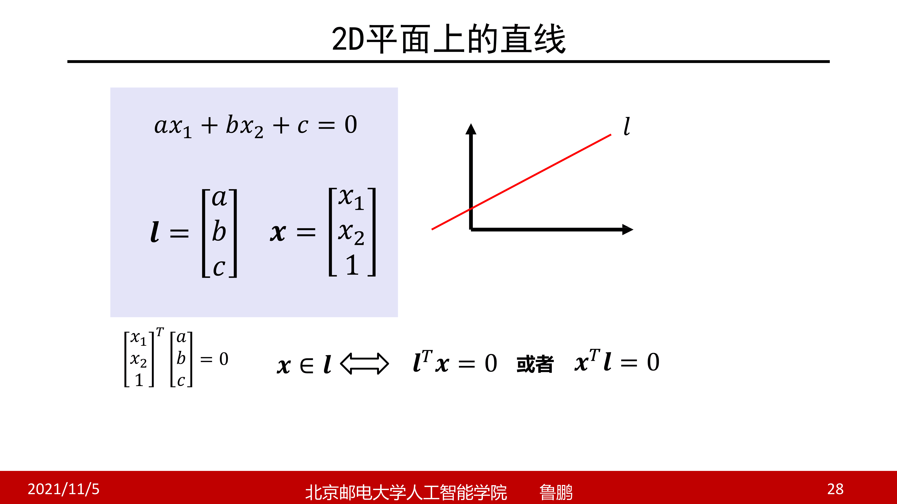

然后，对于这种记录方式，有一个性质，两个直线的叉乘等于交点的坐标，这样可以进一步简化交点的计算方式或者书写方式

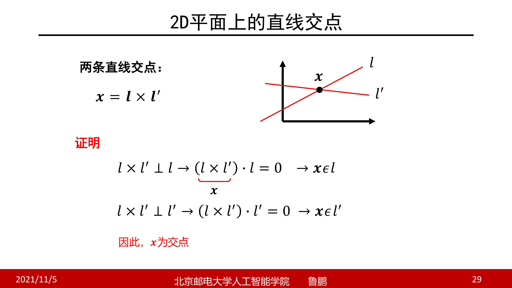

但是这也有一个缺点，当两个直线平行的时候，是没有交点的，这时候就需要定义交点为无穷远点，如下图所示，在齐次坐标下，可以定义无穷远点，这是欧式坐标无法做到的

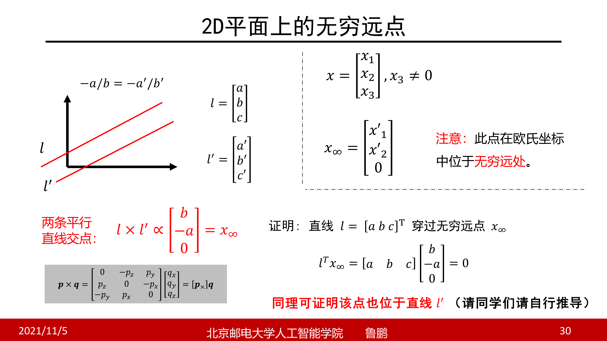

在无穷远点定义下，可以证明此点也位于两个直线

然后进一步提出无穷远线的概念，认为无穷远点都位于一个无穷远线上，这个线的向量，前两个维度为零，这样可以满足点积为零的定义

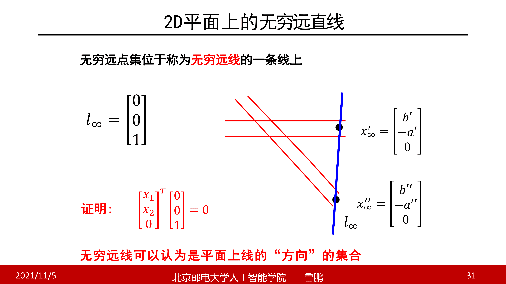

当然，这样扩充到三维空间也是类似的，只不过在三维空间中的直线是平面的交线，所以只需要关注直线的方向即可

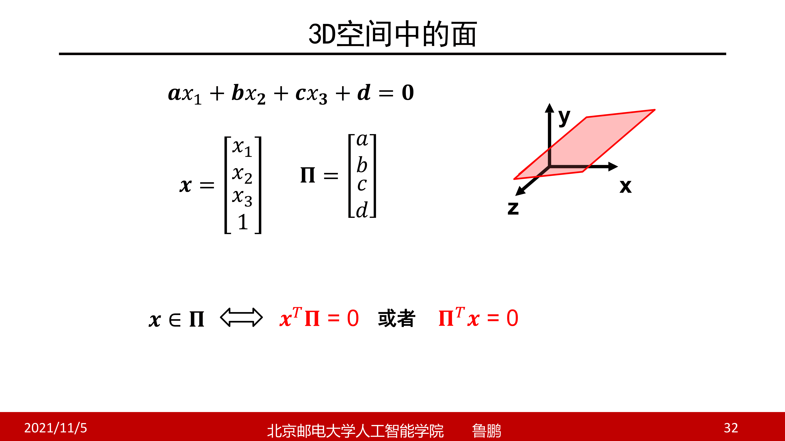

在三维空间中，无穷远点是第四个维度为零

在三维空间中，无穷远线是平行平面的交线，也就是无穷远直线，而多条无穷远线的集合则定义为无穷远面

实际上可以从两个角度看，第一个角度就是，两个平行平面上有无穷多对平行线，每个对行线都有一个无穷远点为交点，然后一对平行平面就有一个无穷远点组成的直线——无穷远线，然后多对平行平面就有多条无穷远线，这就组成了无穷远面；第二个角度就是，每对平行平面都有一个交线，这个交线只能是无穷远线，然后多对无穷远线组成无穷远面

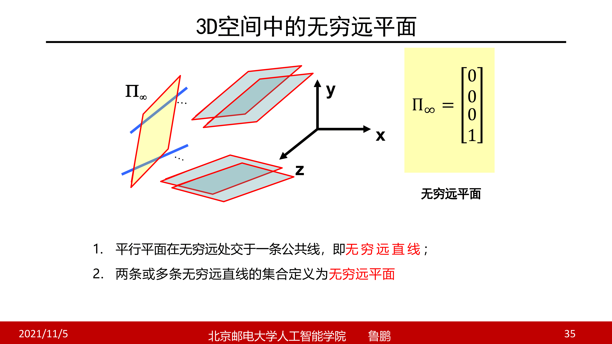

## 影消点和影消线

影消点和影消线就是无穷远点或者无穷远线投影到像素平面中的位置关系，可以用于三维重建

那么无穷远经过不同变换之后会有什么效果呢？定义一个二维变换矩阵 $H$​，然后完成点到点的变化

首先是透视变换，可知透视变换来处理无穷远点可将其变为非无穷远点，也就是平行线会相交，而仿射变换则不会导致这种情况

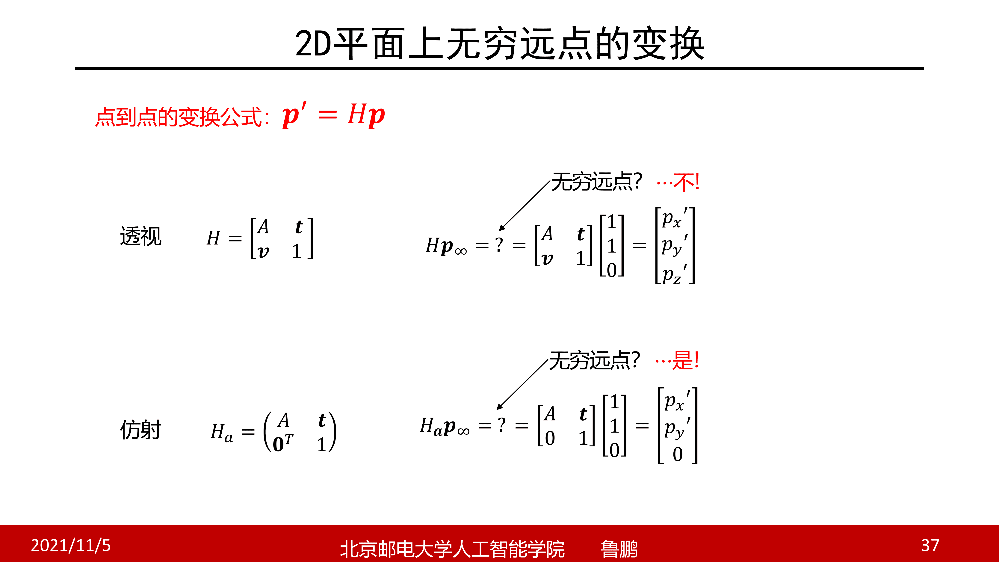

在确定直线和变换矩阵之后，对点和线都进行变换，进而得到线与线的变换公式

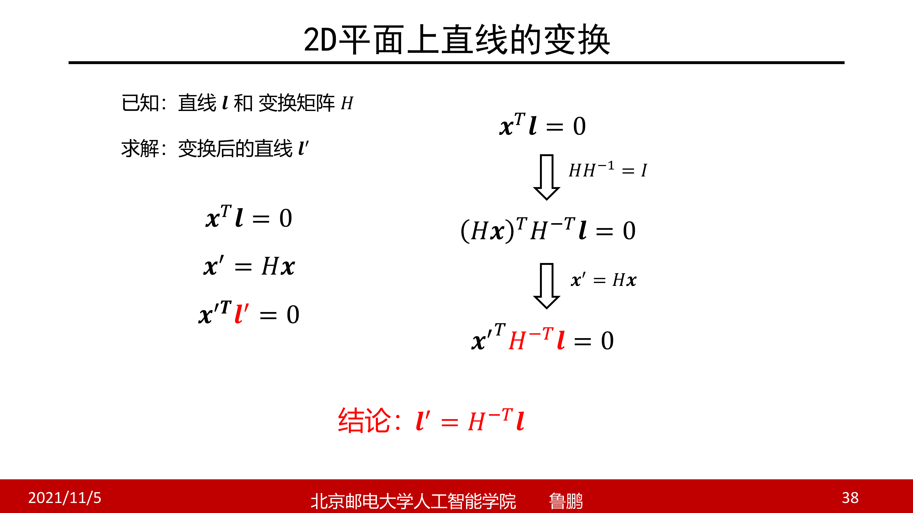

在得到公式之后，就可以使用透视变换矩阵来处理图像中的直线，从而得到“平行线相交”的结果

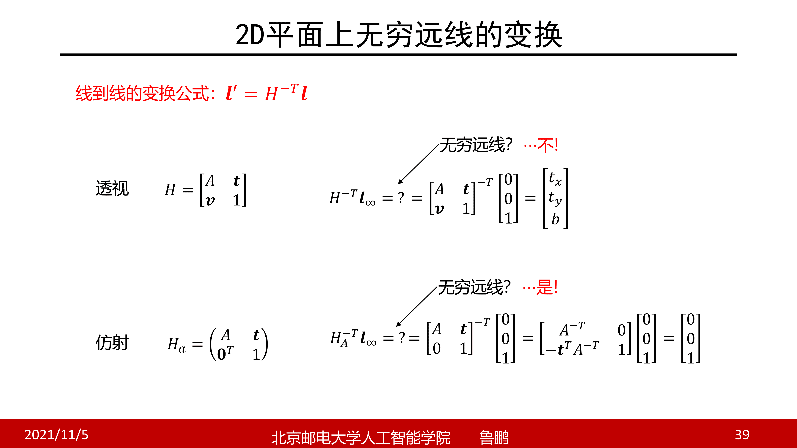

这就是影消点的概念，三维空间中的无穷远点映射到图像平面上之后，就是一个具体的点，而不是无穷远点了，可以在图像上标注出来，映射为一个像素平面上的点

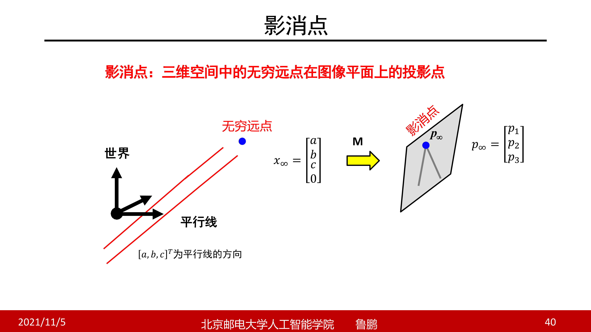

在知道了直线方向和相机参数之后，就可以把三维空间中的无穷远点映射到像平面上，同时还可以得到三维中直线方向和影消点之间的关系，可以利用影消点反向计算三维中的平行直线的方向，便于进一步进行单视图重建

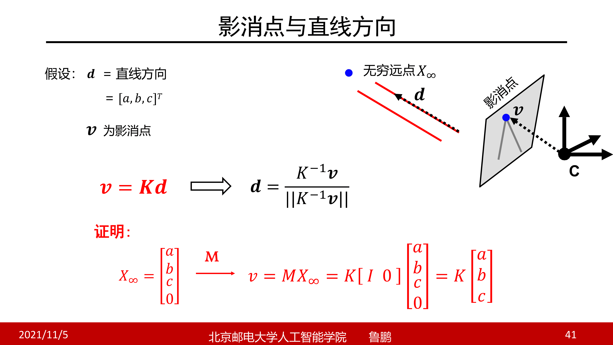

然后可以看一些例子，在某个平面上的每组平行线都会有一个无穷远交点，然后这些无穷远点位于无穷远线上，然后对无穷远线进行透视变化，就可以得到图像上的影消线，也就是某三维平面上的平行线，都会在三维空间中的一个无穷远线相交，然后映射到二维图像上，都会在一个影消线上汇聚和产生交点，可以理解成，三维空间中的一个平面就对应着一个无穷远线

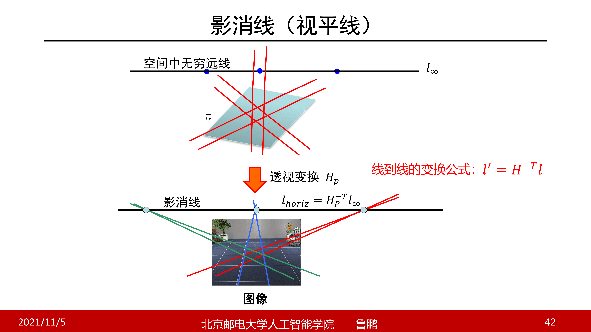

然后就可以在具体图像中计算影消线，而识别影消线有助于重构，因为如果图像中两个直线的交点在影消线上，那么这两条线就是三维空间中的平行线

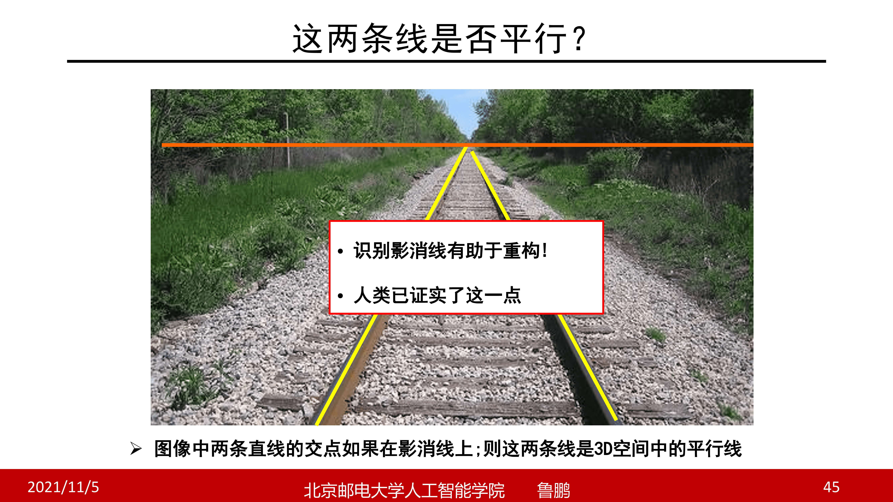

当得到了影消线之后，就可以利用相机内参矩阵，得到影消线对应的平面的法向量，因为无穷远线本质上还是在平面上，所以与法向量垂直，然后根据公式就可以计算出来平面法向量和影消线的关系，在已知影消线的情况下就可以得到平面法向量

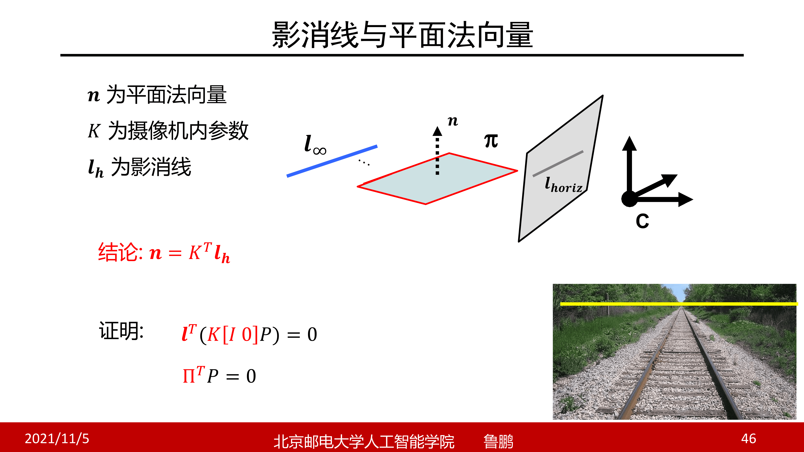

在投影过程中，无穷远线上的点都投影到了影消线上，也就是有三维空间平面 $\pi$ 所对应的无穷远线上的点 $P$ 对应像素平面上影消线的点 $p$，这个过程可以使用一个相机内参矩阵来表示，也就是：$p=K[I,0]P$

然后点 $p$ 在像素平面的影消线上，故有：$l^Tp=l^T(K[I,0]P)=0$

然后使用公式表示三维点在平面上：$\pi^TP=0$

然后可知，$l$ 是3x1的向量，$K$ 是3x3的向量，所以有：$[l^TK,0]P=0$，其中 $l^TK$ 是1x3的向量，可知其与 $\pi$ 的前三列成正比，所以平面 $\pi$ 的法向量 $n$ 与  $l^TK$ 的转置成正比，并且可以设比例为一，故有：$n=K^Tl_h$

这样就可以通过内参数矩阵，构建一些联系

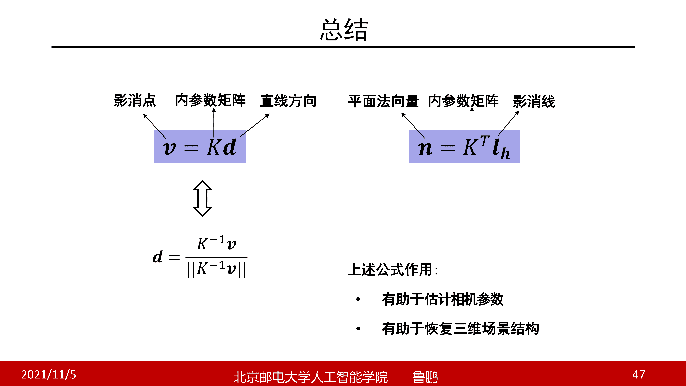

## 单视重构

在了解了上述的一系列关系之后，就可以研究单视重构了

如下图所示，在确定了两组平行线的影消点 $v_1$ 和 $v_2$ 之后，就可以通过内参矩阵反向求出两组平行线的夹角了

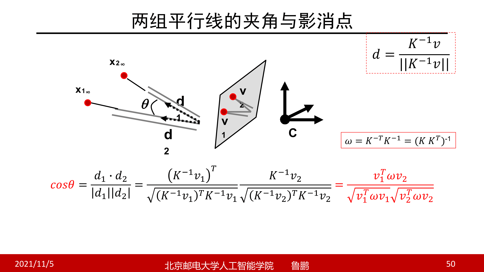

然后可以单独研究 $\omega$ 的性质，然后通过不同的影消点进行列方程求解，计算出来 $\omega$，实现单视图的标定

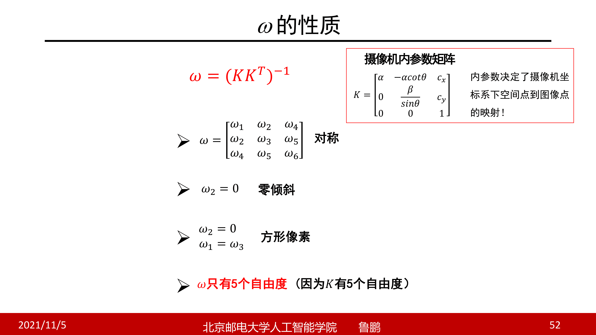

当然这种方法需要超过五对的影消点，比如说下图中，草地上的纹路是平行线，然后窗户的水平和竖直方向也是平行线，所以可以根据这些去列方程然后计算内参矩阵

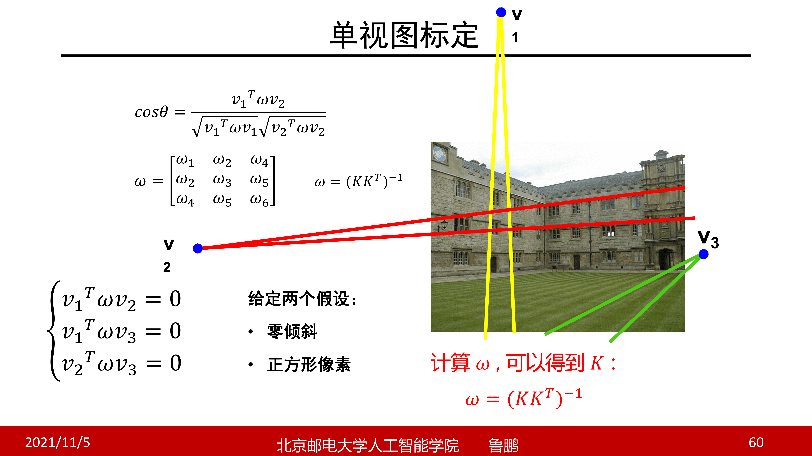

当然，上面只是利用了一种关系，还有一个影消线和面的关系没有使用，如下图所示，可以根据影消线计算平面方向，然后完成草地平面重构，类似的还可以完成两个墙面的重构

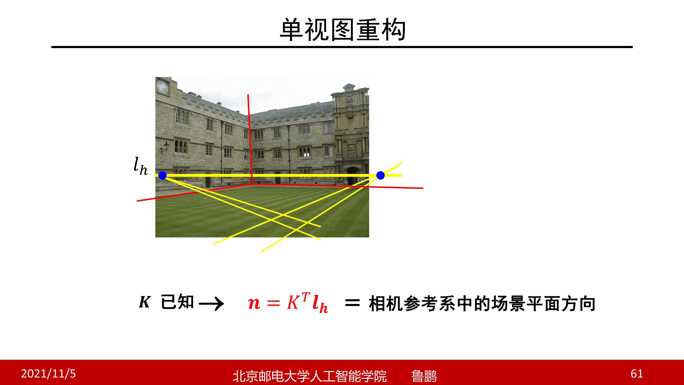

单视图恢复摄像机坐标系下的三维场景结构如下，但是有一个问题就是，场景的实际比例是无法恢复的，也就是相差一个比例系数，或者说重建出来的结构是原始结构的一个相似变换；而且也无法确定真实的朝向，这也是一个歧义性的问题。

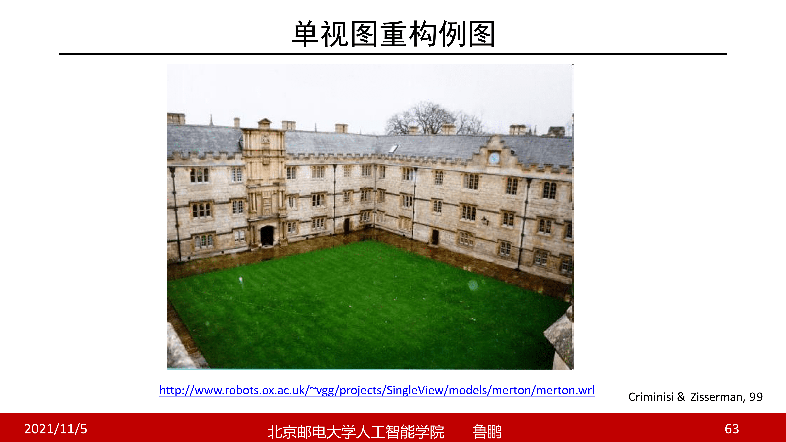

但是这种方法是有弊端的，就是实际上是通过人工手动选择影消线和影消点，然后手动给出场景先验信息，而不是由计算机自动去计算，这也是一个问题，因为很多情况下是没有这种先验信息的，需要人工输入到计算机中才可以

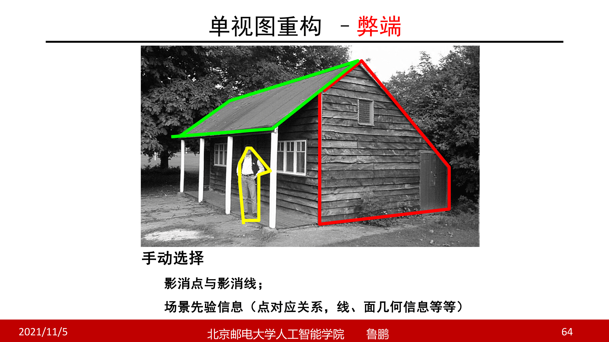

这些例子主要是说明了，三维空间中的点和二维像素上的点是有一定关系的，只要理解了图像中的几何结构，通过三维点在二维上的映射关系，就可以通过一些方法恢复三维空间的结构

总的来说，通过影消点-直线方向和影消线-平面方向的两个公式，就可以有效恢复三维空间的一些结构，比如说，一个平面有且只有一个无穷远线，通过无穷远线，就可以恢复这个平面的方向

接下来会尝试一些更普适的方法，不需要