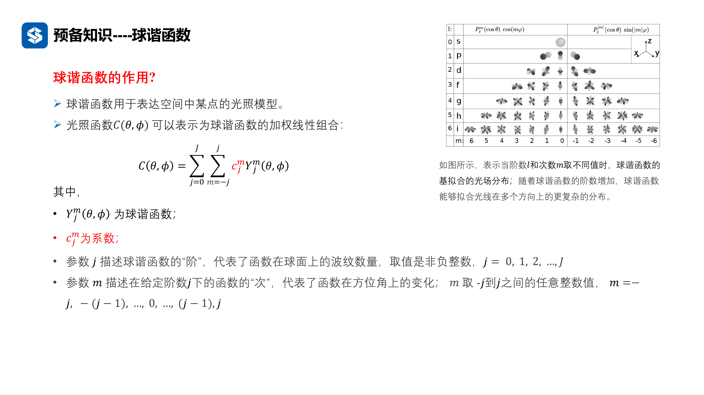
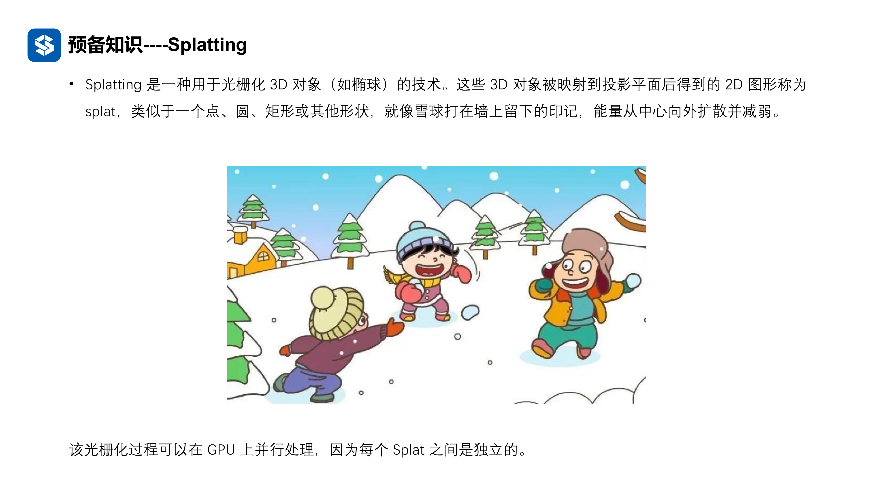
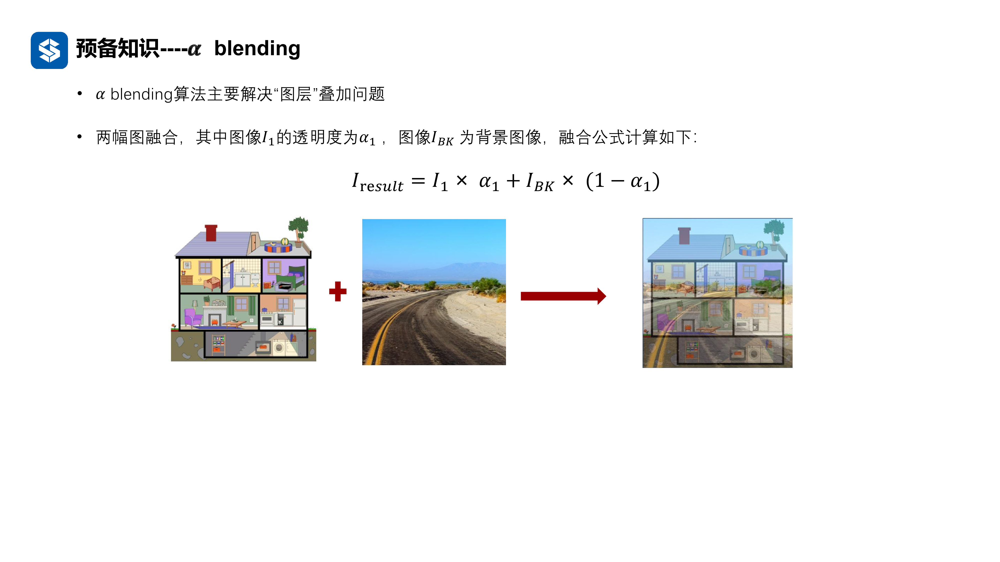
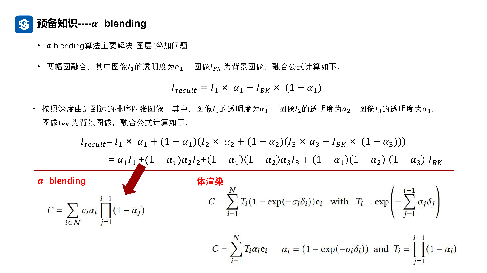
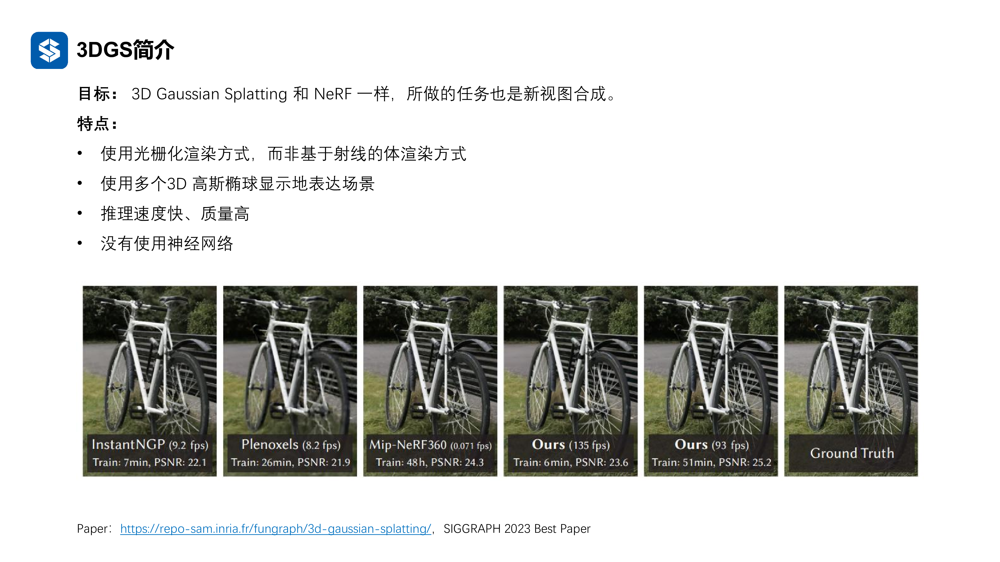
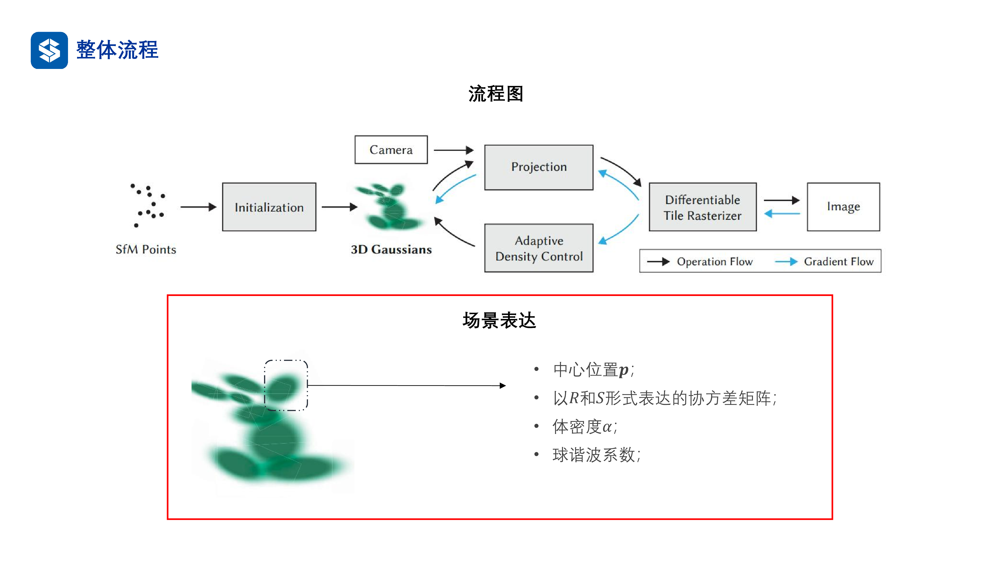
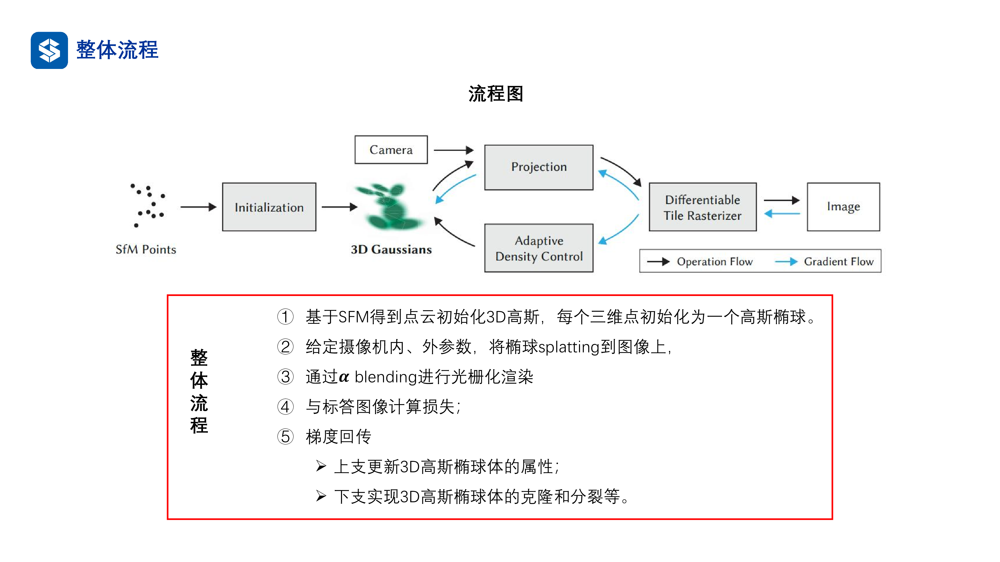
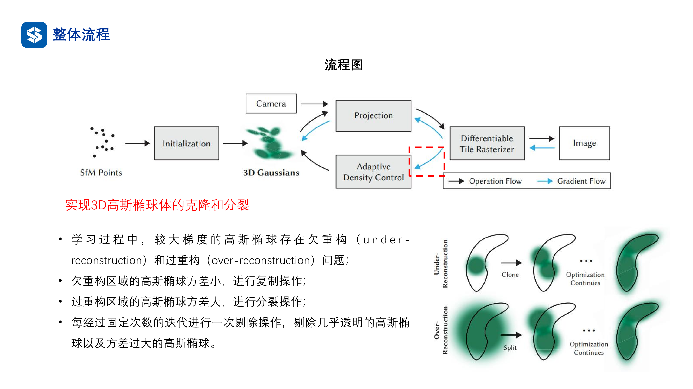
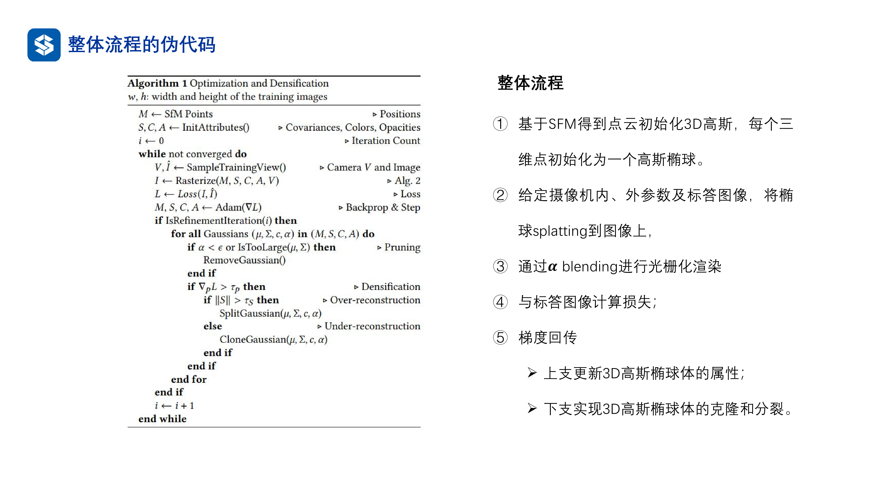

# 3DGS理论

通过更换渲染方式等，来实现更高效和更强大的渲染效果，这就是3DGS

在NeRF中可以知道，一个三维点从不同角度看，颜色可能是不一样的，那么怎么记录这个信息呢，因为无法记录每个点从不同角度看上去的颜色，在NeRF中是通过MLP来记录这个光照模型信息的，但是在深度学习出现之前，图形学中就有光照模型，给出视角，就可以得到颜色值

这个光照模型是通过一系列的球谐函数的加权来实现的，阶 $j$ 越大，模型表达能力越强，但是计算量越大，求解的系数越多；然后 $m$ 是次数，给定了阶数，然后就可以确定次数，然后就可以确定球谐函数和系数个数，确定光照模型，本质上就是确定阶数

## 光栅化过程：Splatting

实际上是一种光栅化的过程，也就是三维高斯球投影到二维的过程，其定义如下图所示

那么把三维空间中的一个个高斯球扔下来了，要如何去混合这些去形成像素呢，这就是 $\alpha$​ blending 要做的事情了

先从基础的图像融合去考虑，比如说有两张图，一张是背景，另一张的透明度 $\alpha_1$，那么就可以使用下图中的方法去进行融合，这样就可以同时看到两个图像的内容融合到一个图像上了 

当然对于多张图像的渲染，就可以如下图所示进行融合，在3DGS中，三维空间表达成一堆的三维高斯球，每个高斯都投影下来，从远到进开始融合，最终就按照下面的公式进行融合得到最终的图像

可以发现，体渲染的公式与这种形式是很接近的，或者说数学形式是一模一样的，把体渲染的公式中的一个因子带入一下，就可以得到了 $\alpha$ 渲染公式，当然实际上工作方式不一样，这种渲染是图形学中的操作，已经非常成熟了，有很多方法可以进行加速

## 多维高斯协方差矩阵

协方差矩阵是一个对称的矩阵，而且对角线上的系数通常不为零，也就是一个正定的矩阵，那么就一定有一个正交矩阵可以使其三角化

非对角线上的元素表示了两个变量的相关性，如果为零就表示两个变量是没有相关性的，是相互独立的

然后可以查看一下三维高斯与椭球体的关系，为了便于表示，从二维高斯来理解这种关系

如果输出是一个常数，那么输入的结果应该也是一个常数，也就是说输入会满足某种形式，当变量之间相互独立的情况下，有
$$
const=G(x)=e^{-\frac{1}{2}x^T\Sigma ^{-1}x}\\
const=-\frac{1}{2}x^T\Sigma ^{-1}x\\
const=
\begin{pmatrix}
x_1 \\
x_2
\end{pmatrix}^T
\begin{pmatrix}
\frac{1}{\sigma_1^2}&0 \\
0&\frac{1}{\sigma_2^2}
\end{pmatrix}
\begin{pmatrix}
x_1 \\
x_2
\end{pmatrix}\\
const=\frac{x_1^2}{\sigma_1^2}+\frac{x_2^2}{\sigma_2^2}
$$
也就是实际上是一个由常数确定的椭球，然后就可以使用这个高斯球来代表这个高斯分布的边界

如果三维空间中的点符合一个三维高斯分布，
$$
\overrightarrow{x}\sim G(x),u_x,\Sigma_x
$$
我想知道其转换到像素坐标系下的分布的均值和协方差，但是这个是无法直接进行转换的，因为需要通过相机坐标系（也就是通过欧式变换，转到相机坐标系下）进行转换，也就是有下图公式得到相机坐标系下的分布，一个高斯公式经过一个线性变换仍然是一个高斯分布
$$
\overrightarrow{y}=w\overrightarrow{x}+T\\
u_y=w\overrightarrow{u_x}+T,\\
\Sigma_y=w\Sigma_xw^T
$$
但是到像素坐标系下会有什么情况呢，因为相机坐标系下的点变到像素坐标系下的过程已经不是线性变换了，那么就需要在均值附近进行泰勒展开
$$
\overrightarrow{z}=F(\overrightarrow{y})\\
\overrightarrow{z} \simeq
$$
这样就可以三维点在二维像素平面上唯一确定的高斯分布了

## 3DGS技术

3DGS的目标和NeRF一样是做新视角合成，但是渲染方式是完全不一样的，而3D高斯的信息是存在硬盘中的，去显式的表达场景，没有使用神经网络，带来的好处就是推理速度极快、质量较高，推理速度是NeRF的数十倍甚至数百倍

3D高斯的流程和场景表达的方式如下图所示，其中决定高斯球的参数有59个，3个位置参数，7个协方差系数，1个透明度系数，48个球谐系数（也可以降低阶数），有了这些系数就可以完全确定了一个高斯球了，然后就可以通过一系列高斯球来表达场景

3D高斯的整体流程如下

1. 最左侧的输入是一些点云，这些点云是通过colmap这些软件得到的三维空间中物体表面的点，然后通过这些点云进行初始化高斯球，每个点云位置上放置一个高斯球，高斯球的所有参数都是随机初始化的
2. 当给定相机的内参和外参之后，就可以把三维高斯球投影到图像上
3. 投影的形态由协方差矩阵决定，每投影一个高斯球就得到了一个图像块，然后对这些图像块进行融合
4. 融合后的图像与标签图像进行损失的计算
5. 梯度回传
   - 更新高斯球的属性
   - 进行高斯球的克隆和分裂，比如说图像中哪些区域缺少覆盖

这里，高斯球投影到图像块的过程是一个确定的函数，不需要进行学习，这里要着重考虑的就是如何实现高斯球的克隆和分裂

也就是说，整个3DGS优化的只是内在属性，而不是学习网络，通过可微分渲染方式，就可以很好的去进行训练，并且因为不需要学习复杂的网络，可以实现非常快的训练和推理速度

实际上3DGS把一个学习问题变成了一个优化问题，没有中间可学习的部分，只有输入部分是可以优化的

然后就是高斯球的克隆和分裂，如果一个几何体，很难使用一个高斯球来描述其形状，就需要使用多个高斯球来描述，这就需要对高斯球进行克隆和分裂，克隆出来的高斯球与原高斯球方差一致，然后沿着梯度方向放置，也就是只有位置不同

还有就是过重构情况，高斯球太大了，覆盖几何形状但是还有很多区域不属于这个几何体，无法精细描述这个几何体，就需要进行分裂操作，降低方差

那么如何确定这个位置的高斯球要进行复制和分裂呢？判断依据就是梯度，如果梯度大，则认为出现问题，需要调整，就不进行高斯球参数更新，而是单独进行重构，然后进一步查看方差，决定是复制还是分裂

然后就是删除透明的高斯球，还有就是方差过大的高斯球，因为在有先验的情况下不认为可以有一个特别大的平坦表面（人工考虑）

## 算法伪代码

实际上与前面的流程图一一对应

在初始化部分，就是得到SFM的点之后就开始初始化方差、透明度和光照，然后就开始进行迭代

采样摄像机的内外参数，然后沿着视线方向，将高斯球投影到图像上，然后就对图像进行融合和损失计算

然后就根据损失去更新高斯球的参数，同时就是对高斯球进行克隆、分裂和删除这些

然后就是光栅化的伪代码，这里多了一个细节的地方，就是 光栅化投影的时候，实际上高斯球的能量是一个衰减的过程，也就是越接近投影中心，能量越高，越远离二维中心，能量越低，实际上系数是这个点属于这个高斯球的概率乘以透明度得到的