# 三维重建基础

之前讨论了基于单视图几何的重建，但是这种方法有很多限制，并且需要给出各种先验信息，所以就需要进一步研究更加通用的三维重建方法，也就是基于多视图的三维重建，使用多张连续的图像进行重建

而且从单视图进行重建是一种缺失尺度信息的重建，这种情况很容易造成歧义，比如说下图中的人竟然和塔一样巨大，这是一种违反常识的情况，这是因为相机会认为二者离相机的距离是一样的，也就是无法区分深度

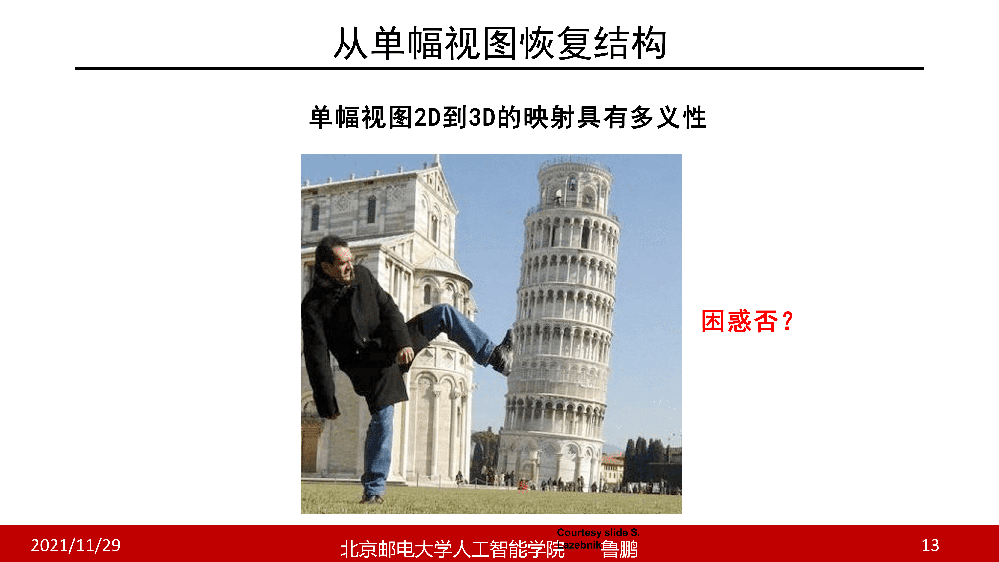

对人来说是不会出现这种情况的，也就是人会通过双眼去观测环境，然后会估计出来场景的深度信息，那双眼如何去解决这种问题的呢？

单个直线无法确定点的深度，但是两个直线就可以了，如下图所示，在两个视图上同时观测到一个三维空间的点 $P$，可知此点是两个直线的交点，也就是在知道了点在两个视图下的像素坐标，以及两个视图对应的参数矩阵，还有两个视图之间的坐标变换关系，就可以确定点的三维坐标，这个过程称为三角化

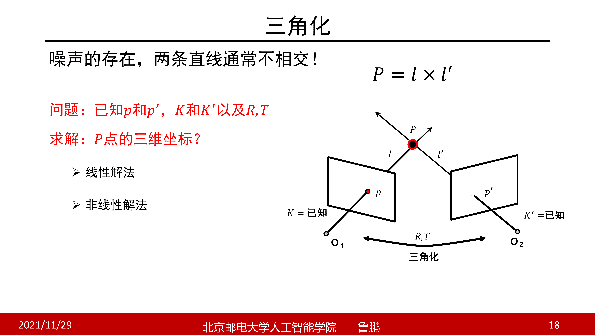

其中的线性解法，也就是超定齐次方程组的最小二乘法求解，如下图所示，要求解的变量有三个（三维坐标），而可以列出四个线性方程组

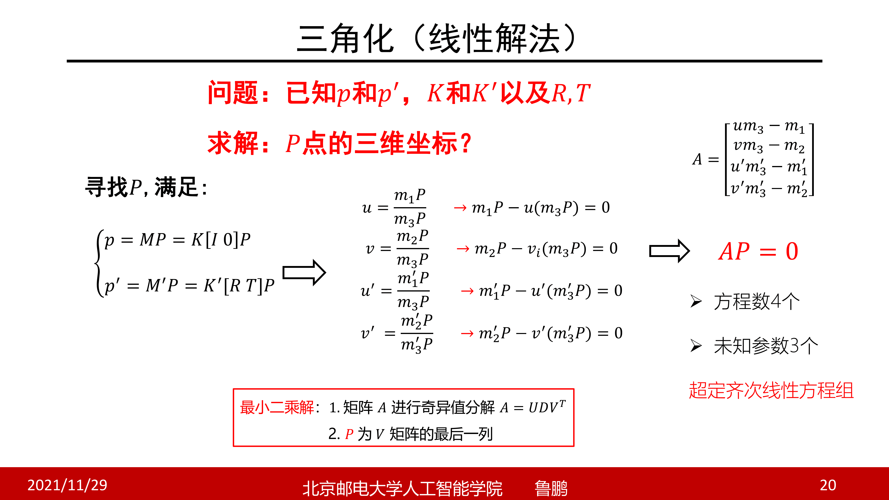

当然因为噪声存在的原因，两个直线不一定相交，所以可以使用能量最小化的非线性方法去进行求解

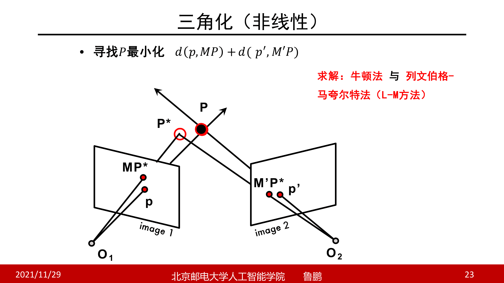

但是这种方法也需要各种的先验信息，比如说内参矩阵，两个图像上点的像素坐标，比如说旋转矩阵等，但是在实际应用中，往往是无法知道所有的参数的，比如说已知内参数和图像上点的坐标然后求解相机的姿态变换和点的三维坐标，再比如说已知点的像素坐标，求点的三维坐标和相机内参这些

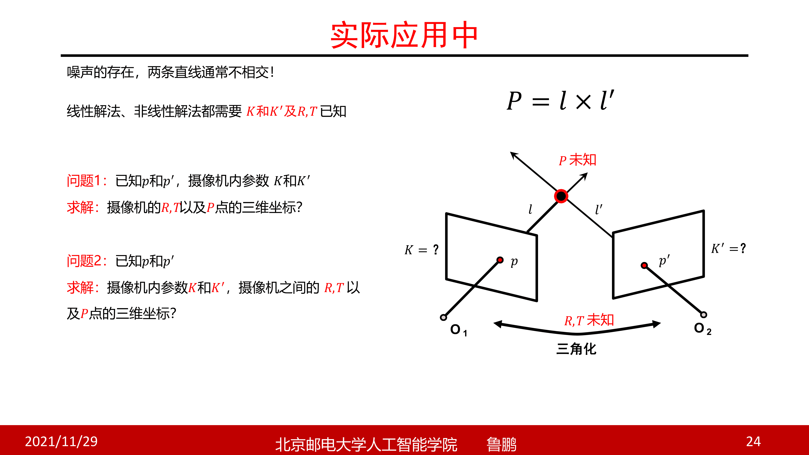

总的来说，多视图几何的关键问题有三个

- 摄像机几何：从一张或者多张图像中去估计或者求解出来摄像机的内外参数，最好可以自动完成标定
- 场景几何：通过二至多张图像寻找三维场景的坐标
- 对应关系：同一个点，已知在一个图像中一个位置，如何在另一个图像中找到其像素坐标

# 极几何与基础矩阵

极几何是一种描述视点关系的理论，描述了同一场景或者物体的两个视点图像间的几何关系，基础矩阵是其数学表达形式，此理论对应了上述的第三个关键问题

先看一下极几何的基础定义，如极平面、基线等等，然后在这些定义上去进行研究，其中极点是相对固定的，其与图像的移动和光心等有关

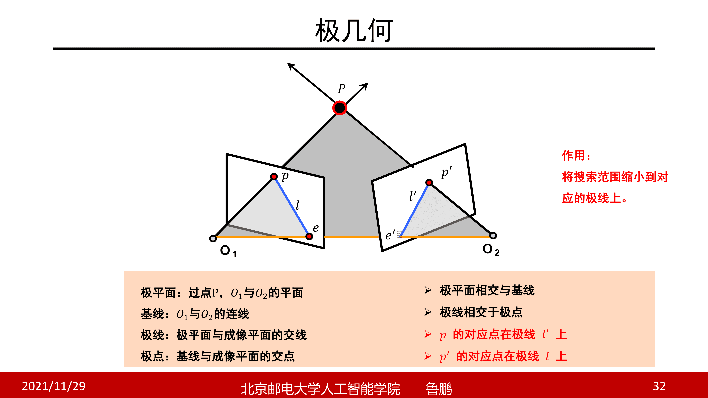

如果在第一个图像中确定了 $p$ 点，那么就可以确定了 $P$ 所在的平面，然后去寻找平面在另一个图像中的投影（也就是极线），可知 $P$ 点一定在这个极线上，只不过暂时不能确定具体在哪个位置，这样就降低了搜索空间，只需要在极线上寻找即可

因为两个视图或者图像之间的变换关系有一些复杂，所以要先看两个特例

## 平行视图

第一个特例就是两个视图是平行的，类似人的左右眼，这种情况下极点位于无穷远处，极线也平行于坐标轴的 $u$ 轴

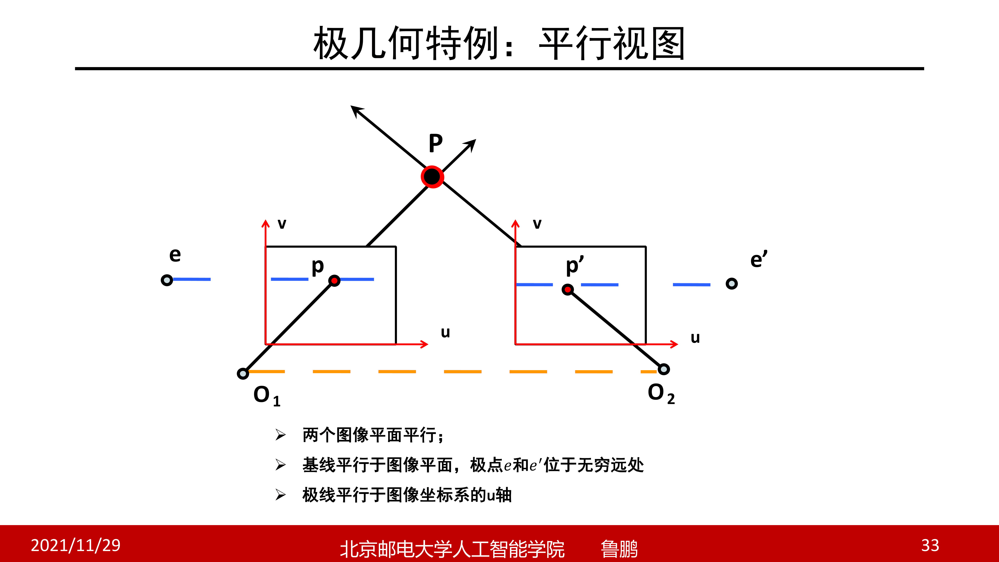

这是一个特殊的系统，有更为简洁的方法来完成重建，实际上这种情况就是双目立体视觉系统，其三角化方式更简单，这里不做深入讨论

## 前向平移（无旋转）

这也是一种特例，在这种情况下，两个图像上的极点位置是一样的，此时也称极点为展开焦点

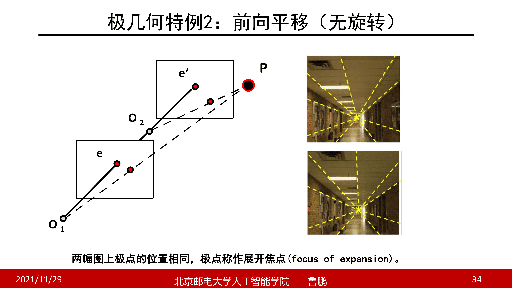

然后基于这种极几何约束，要去寻找一个三维点在两个图像中的投影点位置（往往是在一个图中确定，然后要去另一个图像中寻找）

本质矩阵对规范化摄像机拍摄的两个视点图像间的极几何关系进行代数描述

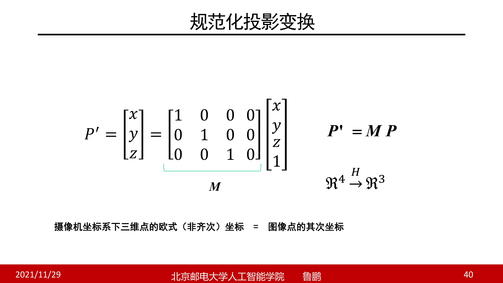

规范化相机指的是，旋转矩阵为单位阵、平移向量为零的情况，这种情况下，认为世界坐标系和相机坐标系重合，因为在这种情况下才可以进行推导（当然在实际应用中不会这样使用），规范化投影的数学公式如上图所示，其优点是可以直接通过三维欧式坐标和三维的齐次坐标一一对应

## 本质矩阵

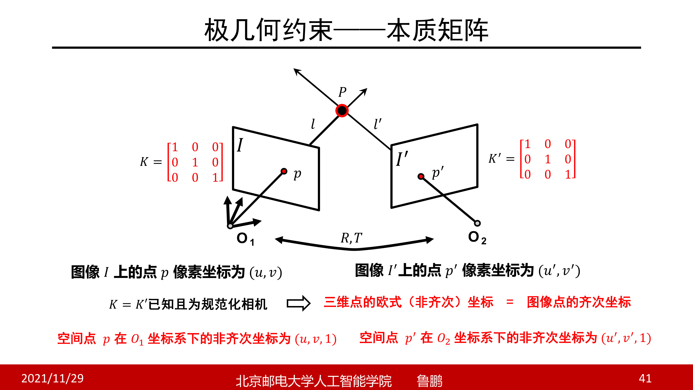

规范化相机的好处是可以直接根据两个点的图像齐次坐标得到其三维欧式坐标，反过来也是可以的，然后就可以计算点 $p^\prime$ 在第一个图像坐标系下的位置

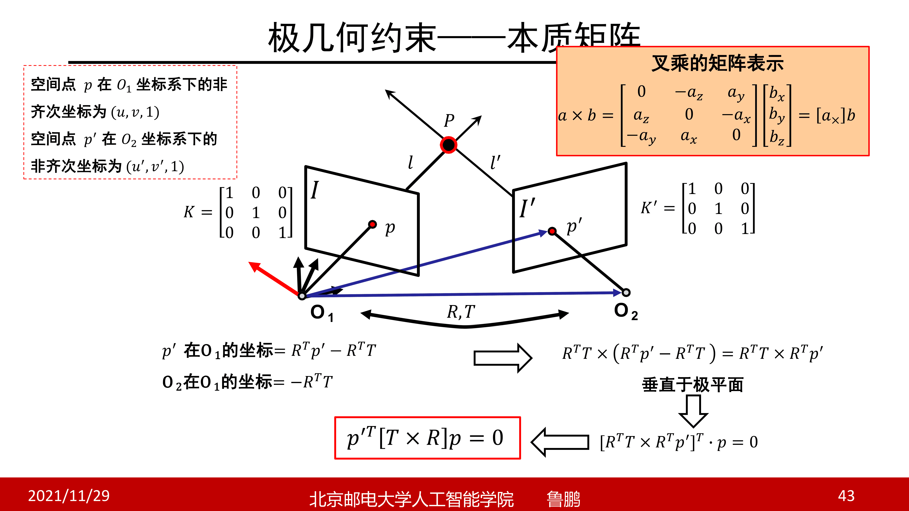

假设 $p^\prime$ 在第一个坐标系（也是世界坐标系）下的位置为 $p^{\prime *}$，然后已知旋转和平移矩阵，则有：
$$
p^\prime=Rp^{\prime *}+T \to p^{\prime *}=R^{-1}p^\prime-R^{-1}T\to p^{\prime *}=R^Tp^\prime-R^TT
$$
进一步得到第二个视图的光心在世界坐标系下的位置，然后就可以进行计算极平面的法向量了，因为 $O_1p^\prime$ 和 $O_1O_2$ 两个向量共面，可以进行叉乘计算，也就是如上图所示，得到了红色的向量，其公式为：
$$
R^TT\times R^Tp^\prime
$$
然后将此法向量与向量 $O_1p$ 进行点积，点积的值为零，这样就得到了两个点之间的关系或者说极几何约束，然后使用叉乘记号（或者说反对称矩阵这种形式）就得到了最终公式：
$$
p^{\prime T}[T \times R]p=0,其中[T \times R]\triangleq [I_\times]R
$$
然后可以发现，其中包含了三个部分，除去两个像素齐次坐标，剩下的就是本质矩阵，也就是通过本质矩阵，两个规范化像素坐标联系在了一起

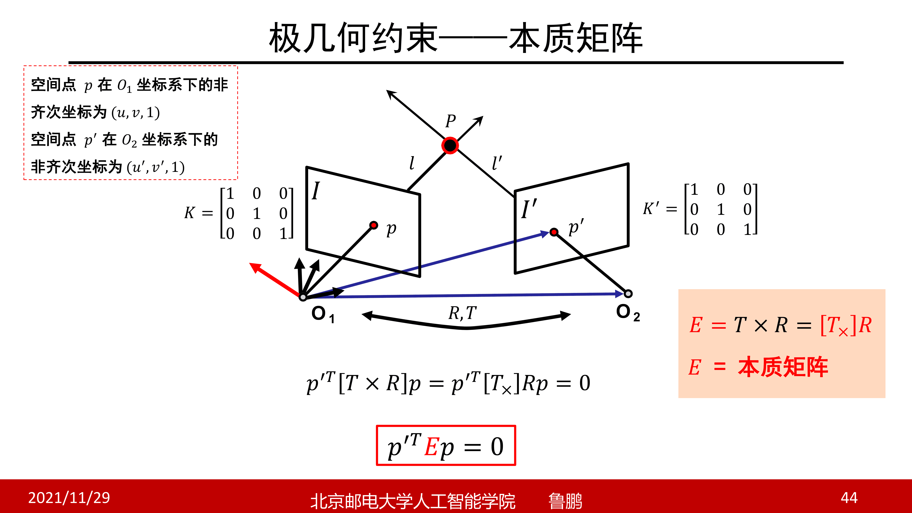

然后可以进一步推导本质矩阵的性质，因为两个点都在各自的极线上，所以有：$p^{\prime T}l=0$，然后又有本质矩阵方程，所以有：$l^\prime =Ep$

然后对极点进行推理，因为极点在极线上，所以点乘为零，也就是有：
$$
0=l^{\prime T} \cdot p^\prime = (Ep)^Tp^\prime=(Ep)^Te^\prime =p^T(E^Te^\prime)
$$
然后所有的极线都会过极点，然后点积总为零，故 $E^Te^\prime=0$

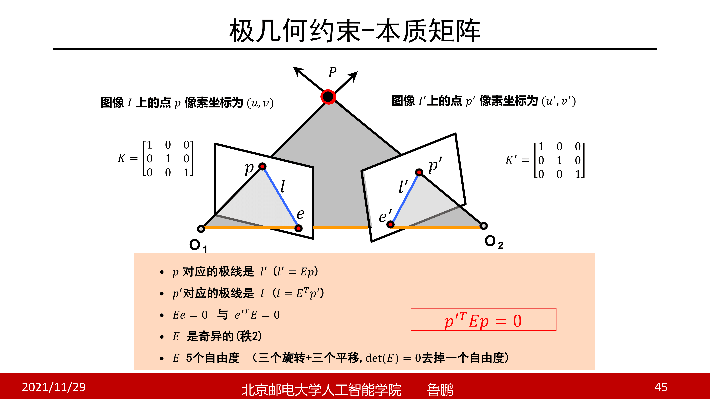

## 基础矩阵

但是上面的情况是在规范化相机情况下成立的，但是实际上那是一种特殊情况，需要把上面的理论扩充到一般情况下的相机，思想就是把一般相机变换到规范化相机

如下图所示，通过一些处理方法就得到了变换的公式，这样就可以把非规范化相机变为规范化相机，省去了直接处理相机内参的步骤，简化了计算

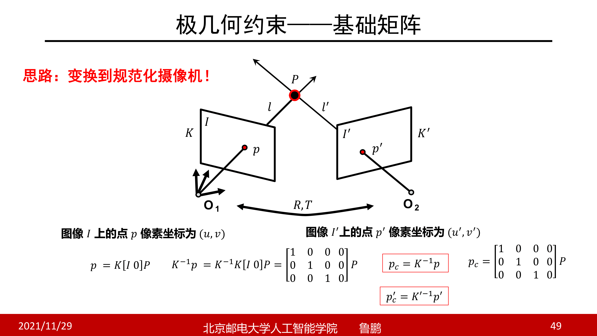

然后进一步就可以定义基础矩阵了，基础矩阵可以对一般的透视摄像机拍摄的两个视点的图像间的极几何关系进行代数描述，也就是一种扩充的本质矩阵，适应性更广

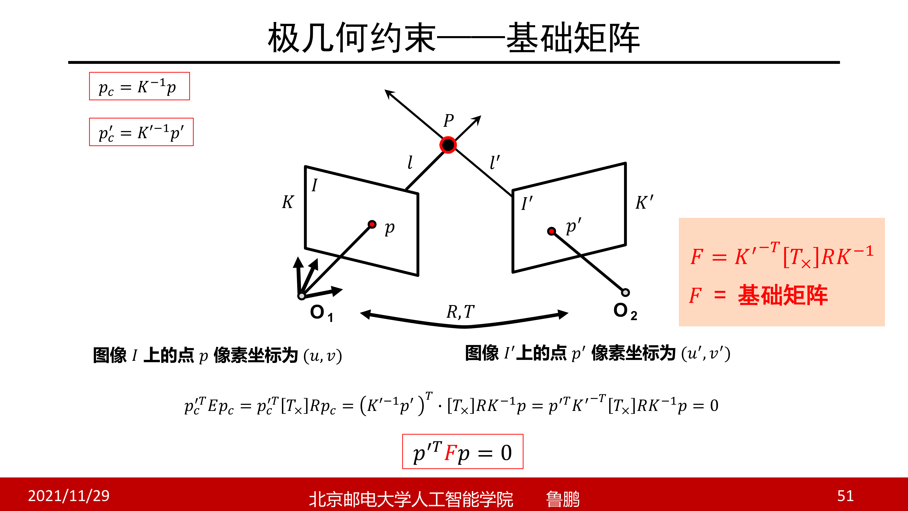

然后将规范化处理的结果带入原来的本质矩阵公式，就得到了上图中的公式，也就是基础矩阵公式，其说明了一般摄像机下的像素点对应关系，是更一般的情况（相比本质矩阵），然后基础矩阵记为 $F$，其性质如下

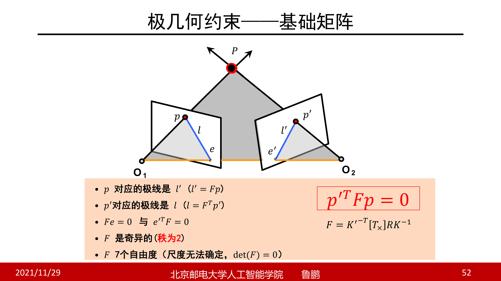

已知基础矩阵的情况下，无需场景信息以及摄像机内、外参数（因为基础矩阵已经包含了相机内参数），即可建立左右图像对应关系

# 基础矩阵估计

在了解了基础矩阵的理论之后，就是如何计算出来基础矩阵，这种估计可以通过寻找对应点来完成，这种操作就容易了很多，然后就可以进一步计算出来内参矩阵和旋转平移等等，借此进一步进行三维重建，估计的方法有业界常用的八点估计算法

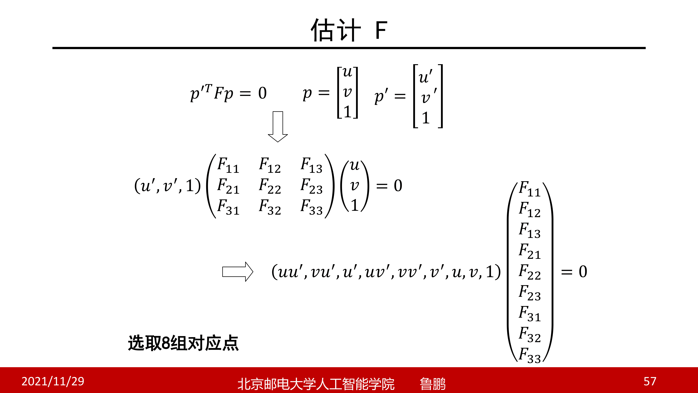

这种方法实际上就是把基础矩阵方程做成两个向量相乘（线性方程组）的形式，然后通过带入具体数值进行求解，实际上就是做成一个超定齐次线性方程组然后进行求解，然后就可以估计出来基础矩阵

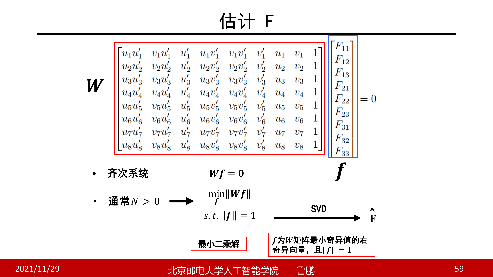

但是上图中求解出来的矩阵并不是所需要的基础矩阵，因为其通常满秩，而基础矩阵的秩为2，所以需要进行一些处理，来满足这个约束，具体操作如下图所示

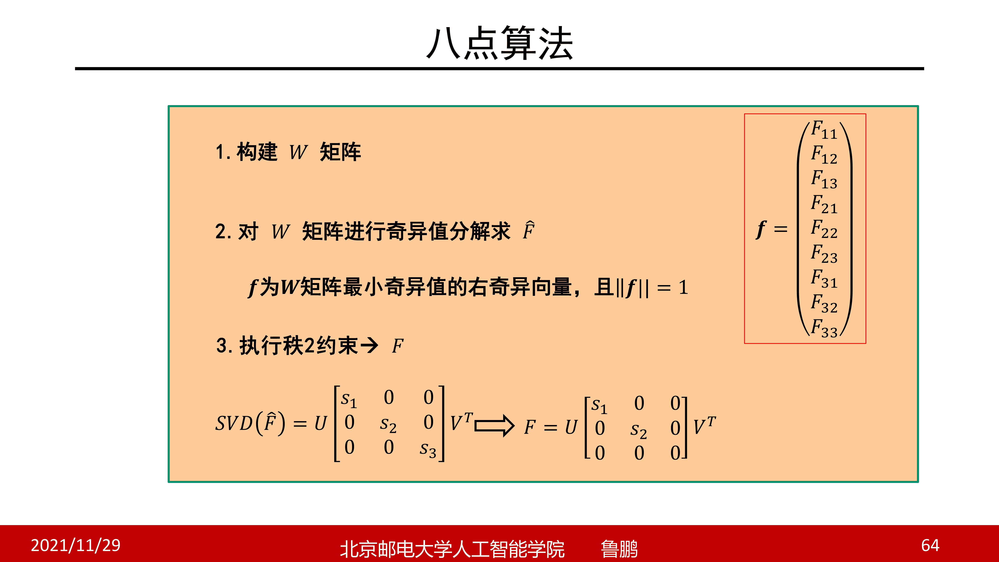

但是这种八点法还是有很多问题的，比如说精度较低，而且矩阵中各个元素的数值差异很大，以及奇异值分解的数值计算问题等等，所以后面提出了归一化八点法的方法来处理这种，就是把坐标进行归一化，具体操作就是对每个图像进行平移和缩放变换，使其满足下图条件

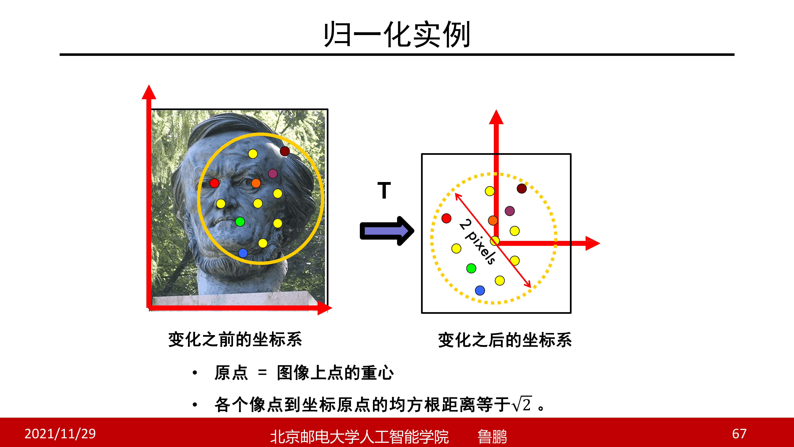

总体上，归一化八点法的出现，改善了原始八点法的很多缺陷（比如说数值误差过大），精度可以到亚像素级别（也就是误差在一个像素内），所以推荐使用

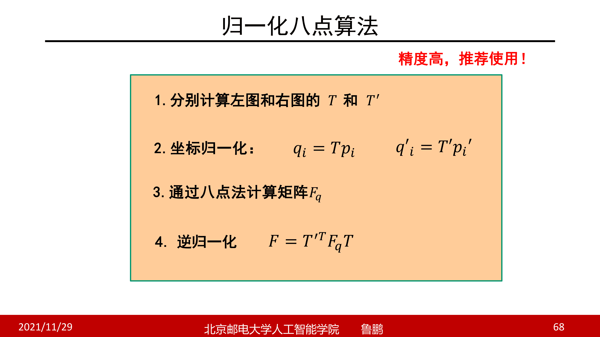

# 单应矩阵

如果图像中的点组都来自于三维空间中的同一个平面，那么就可以使用单应几何去处理几何关系，这样处理起来更为简单，因为这样有更多的约束，也就有了更多的信息，在这种情况下，两个图像上的点是一一对应的，使用单应矩阵进行估计更容易，其中对应方程如下
$$
P=HP^\prime
$$

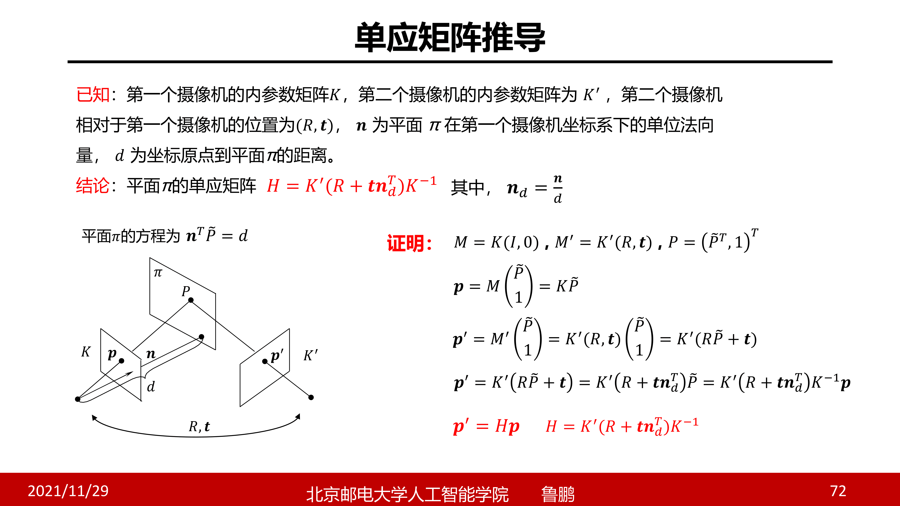

其中，平面的方程为，其中 $\widetilde{P}$ 是齐次坐标的欧式坐标部分
$$
n^T\widetilde{P}=d,P=
\begin{bmatrix}
\widetilde{P}\\
1
\end{bmatrix}
$$
当然，矩阵求解上也是类似操作

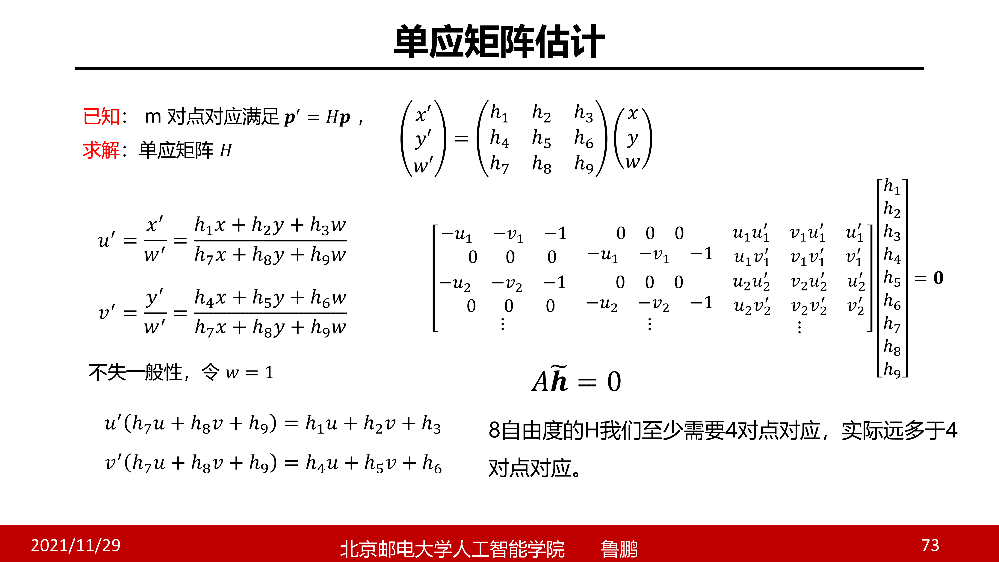

当然，具体在SLAM或者三维重建中，实际上是两种矩阵同时进行估计，而不是单独估计某一个

# 总结

在实际的slam或者三维重建系统中，往往是同时估计单应矩阵和基础矩阵的，因为在没有先验的情况下无法确定特征点是不是在同一个平面上的，所以一起估计，然后查看估计的准确性，选择准确性高的一个进行应用