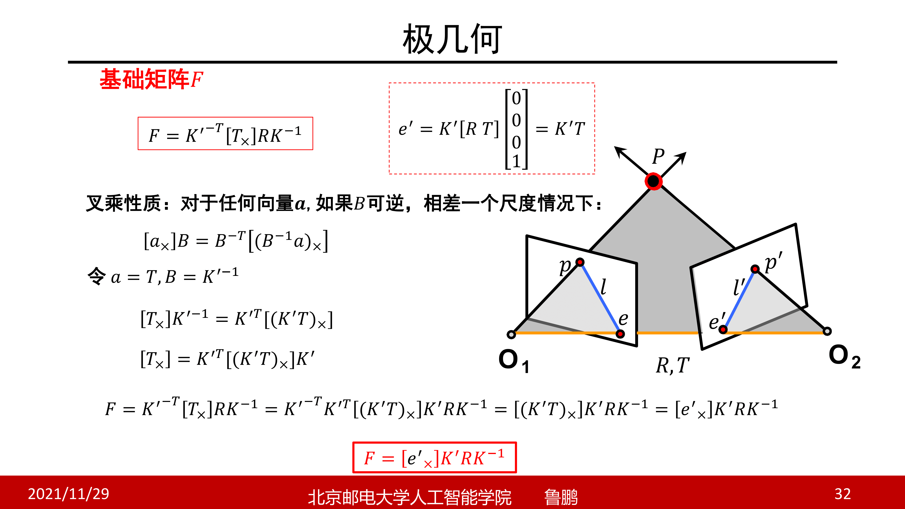
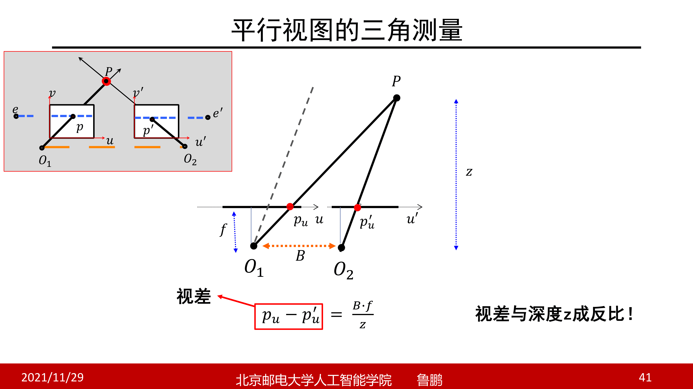
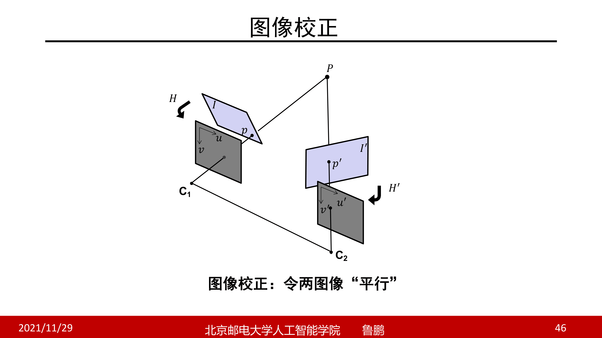
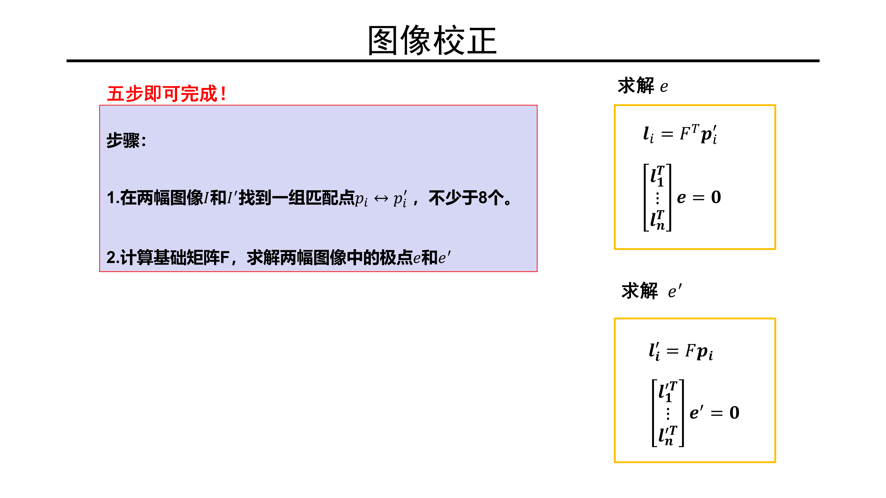

# 双目立体视觉基础

这是一个更容易进行计算的系统，因为视图是平行的，所以极线也是平行的，寻找对应点只需要在同一个水平线上寻找即可

在极几何中，有一个公式如下，表示了一种叉乘的性质，然后基于这种性质，可以得到基础矩阵的另一种公式，也就是在平行视图的情况下基础矩阵的表示

这里，两个相机的旋转实际上是单位矩阵（因为实际上只有平移没有旋转），平移向量只有一个维度有数值（因为只是沿着一方向移动），而其中 $e^\prime$ 是如下图所示的一个齐次坐标向量，因为其是图像上的无穷远点，而且图像上平行直线的方向就是 $[1,0]$，所以其向量形式就是仅有第一个维度为1，而且内参矩阵默认相等

基于这些数据，就可以计算出来平行视图下基础矩阵的形式

然后根据这些数据，计算极线的向量，得到极线实际上就是水平线的结论（也可以称为扫描线），也就是两个点的纵坐标是相等的，实际上只需要沿着扫描线寻找对应的点就可以了

只要告诉了两个像素点的像素坐标差距还有焦距和相机水平位移，就可以得到三维点的深度信息，这样实际上大大简化了计算，不需要进行三角化等操作

这种视差的原理也可以用于3D电影中

但是这种方法虽然好，但是仍然有很多问题，比如说如何保证两个视图就是平行的？还有如何建立点的对应关系呢？

# 图像校正

有了平行视图的理论，然后就可以通过这种方法更便捷的去计算，但是并不是所有的视图都是平行的，所以需要进行校正，让两个图像变成平行的

如上图所示，我们希望对原始的图像（紫色）找到一个等效平面（灰色），上面的点都是一一对应的，但是这两个等效平面构成平行视图，这就需要找到一个变换的矩阵来分别进行图像的变换

那么如何进行呢？首先就是要在两个图像上找到一系列的匹配点，不少于8个，然后就是计算基础矩阵，并且求解两个图像中的极点，借助方程进行计算（一个图像上的极点，对应另一个图像上的极线）

然后就是，对图像进行透视变换，这里第一步就是对图像进行平移，将图像中心点移动到像素坐标系原点
