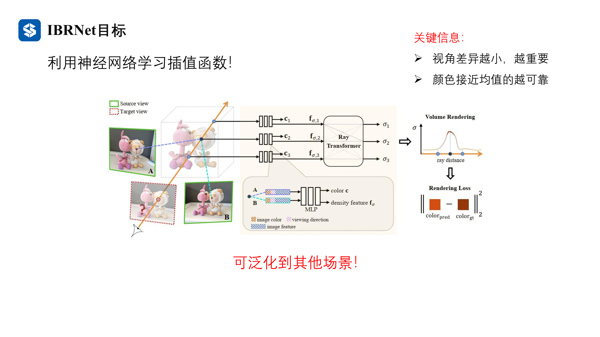
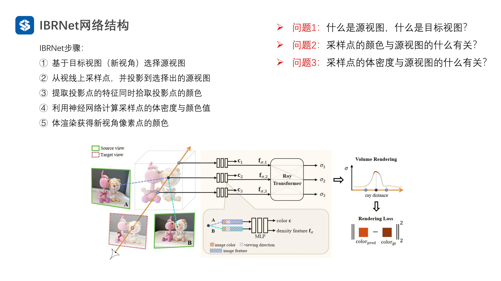
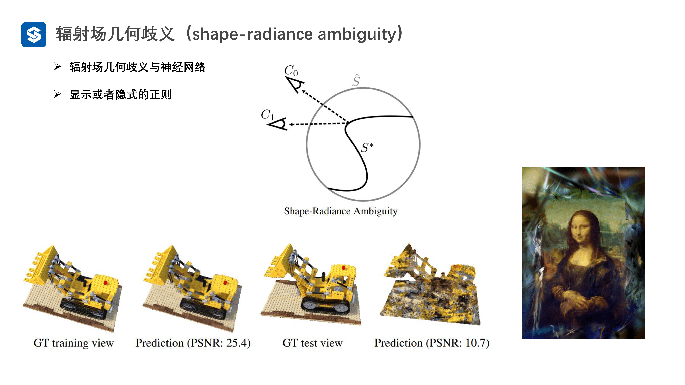
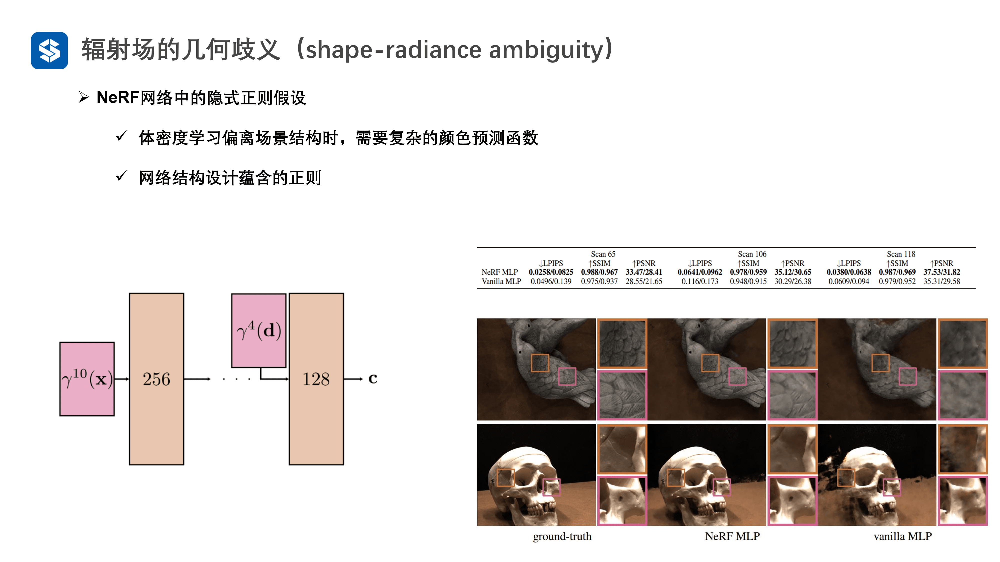
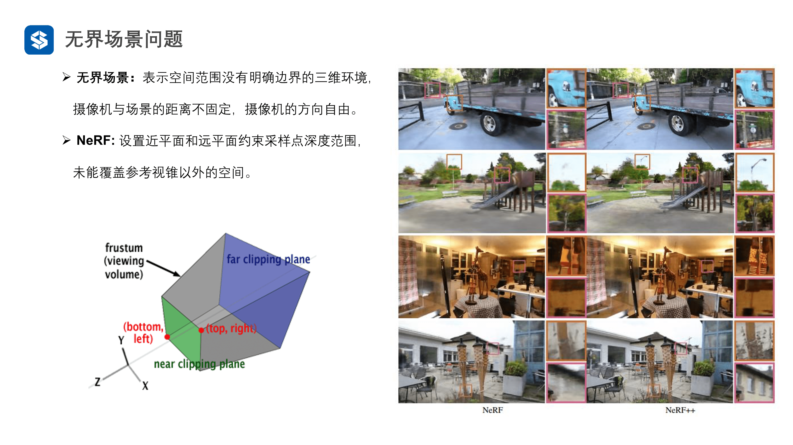
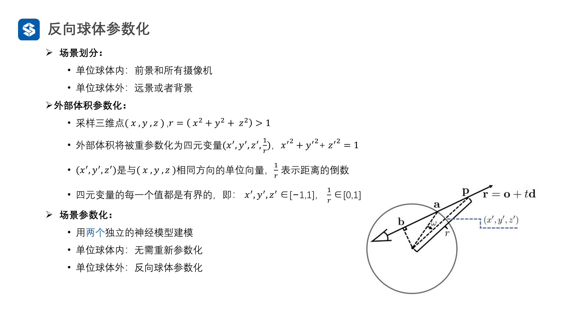
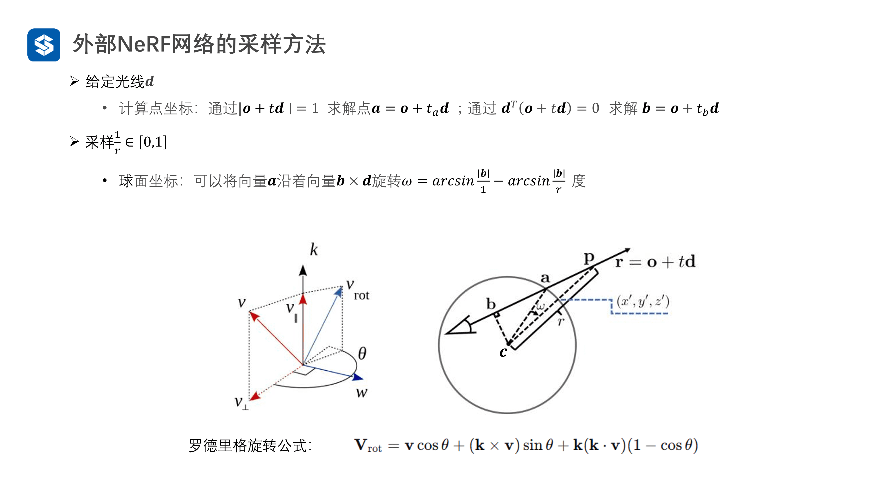

接下来就是NeRF在实践的时候碰到的一些问题，还有就是一些相关的解决方法，比如说在一个场景下训练好了，在另一个场景下也可以使用，还有就是在少视角情况下如何渲染出效果好的图像

# IBRNet

## 动机与目标

NeRF是通过神经网络学习辐射场信息的，但是实际上这种是有缺陷的，就是不同的场景必须单独训练，是没有泛化性的，所以需要一种可以泛化的模型，在一种环境下训练，在另一个环境下也可以使用（或者微调一下使用），但是这种方法明显是不行的，因为NeRF的设计就是构建一个物体或者场景的辐射场，所以IBRNet实际上没有完全设计成NeRF那种的辐射场架构，而是去通过神经网络学习插值函数

那么IBRNet如何生成的图像呢？在有了一个视角之后，就会从数据库中找到若干个与其最接近的视图（也就是源视图，从视角差异最小这个角度找），在生成的时候通过插值的方式把新的图聚合出来（通过相邻的图），而插值的方式是通过神经网络去学习的

实际上这个网络没有去学习一个场景

# NeRF++

这是第一篇无界场景NeRF的论文

## 辐射场几何歧义

首先看一个事实，在NeRF学习场景中的 $\sigma$ 和 $C$ 的时候，我们希望可以其可以反应三维场景的真实结构，然后渲染得到真实颜色，但是渲染之后，我们无法确定这是不是真实的结构，只能看到渲染出来的图像，所以认为，只要训练好的MLP可以生成这两个参数，就认为其是好的

但是几何歧义是什么呢？就是哪怕预测结果与输入样本一模一样，也不能保证光照和颜色是真实的，这是什么意思呢？如下图所示，我们定义了一个球形表面 $\hat{S}$，也就是在辐射场中学习到的这些参数，不论是真的还是假的，都可以生成一个很好的图像，但是如果学习到了假的参数，那么在视角变化的时候，渲染出来的图像就会出现严重错误

也就是NeRF实际上监督的是体渲染的结果和真实图像，并不能约束 $\sigma$ 和 $C$ ，也就是很多参数的组合都可以满足条件（有很多解可以组合出来正确的结果），如果NeRF不能很好的设计，那么就无法学习到真实的 $\sigma$ 和 $C$ ，网络会从这些解中随便抽出一些来渲染图像，此外作者还发现，当训练样本足够多的情况下，测试效果还可以，那么NeRF中到底有什么约束，导致其并没有真正使用这个位置的解，而是找到了附近的一些解，也就是几何上乱七八糟，但是图像上确是正确的

在NeRF中，当体密度学习到离真实体密度差很远的时候，则要求颜色学习网络必须有很复杂的学习能力，要不然一个错误的体密度和一个简单的 $C$ 是无法渲染出正确的结果的，也就是如果 $C$ 网络有很强的能力，那么整个模型就会作弊，导致只要结果正确就可以，过程不重要，甚至过程是错误的。

在NeRF中， $C$ 的产生是需要视线的，而视线是MLP的最后加入的，也就是此部分的学习网络小，学习能力弱，那么想要预测结果逼近真实，那就要求体密度学习的更为准确，更逼近真实的物体，也就是在控制颜色预测函数复杂度的情况下，就会迫使体密度更接近真实物体结构

然后就是方向编码实际上没有使用很高的维度，也就是不允许颜色变换学习更高频率的内容，而且要知道，越往后的网络部分是越支持学习高频信息的，会导致在颜色空间无法学习到高频信息，也就是限制了颜色预测函数的复杂程度

NeRF++指出，NeRF中没有隐式正则，那么网络是无法学习好三维网络的，比如说之前工作的深度正则，你要是无法学习到正确的表面，就无法得到正确的渲染结果

## 无界场景渲染

这是相对有界场景的概念，在NeRF中，空间范围在一个有边界的区域内，而NeRF是无法解决这种问题的

### 反向球体参数化

NeRF++中，实现无界场景渲染的方法就是反向球体参数化方法，此方法将场景划分出两个区域，划分为球体内和球体外，建立了一个球，球体内三维点就使用三维坐标表示，球体外的点使用一种四维向量表示，如下图所示，实际上就是对球体外的点 $P$ 将其与圆心连线，连线与球壳的交点的坐标就是 $(x^\prime,y^\prime,z^\prime)$，然后连线长度的导数为向量的第四个维度，这样就可以表示一个球体外的点了，虽然表示为了四维形式，实际上只有三个自由度（因为坐标是有约束的，知道了两个就可以知道第三个），这样就可以把一个无界场景压缩到了一个有界范围，这样就容易进行学习，因为对于一个无界场景来说，场景外的点是很稀疏的，如果没有很多正则信息的话，很容易学到严重错误的体密度，通过这个方法，那么所有的输入都变到一个范围中，这样也有利于进行采样

因为是有两种情况，所以要使用两个不同的MLP网络来学习和预测体密度值

那么NeRF++中是如何进行采样的呢

