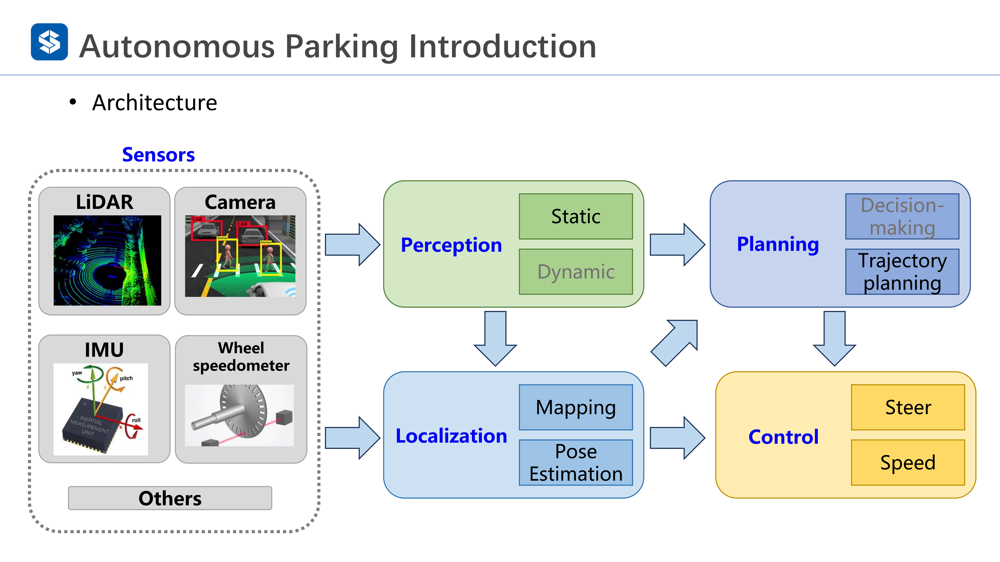
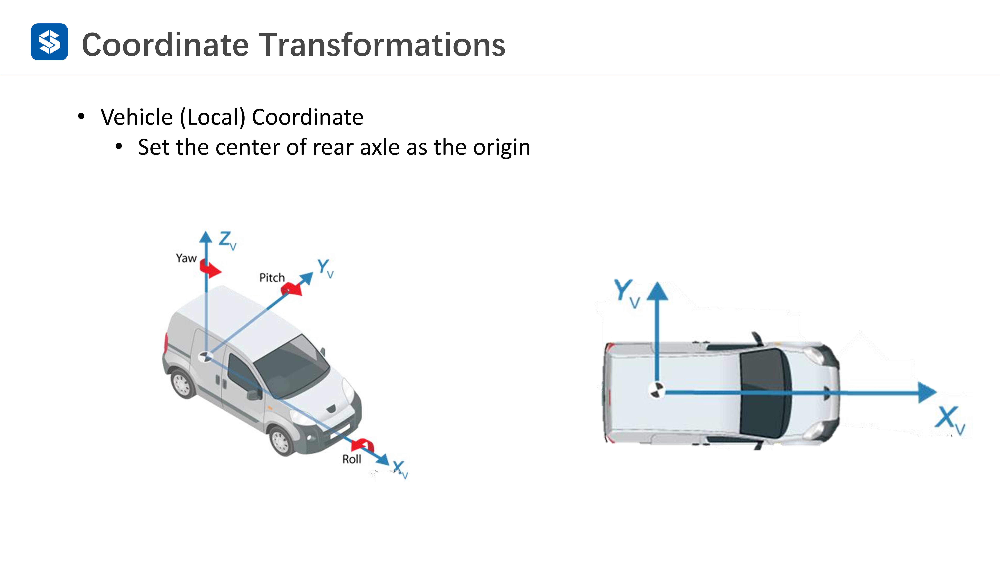
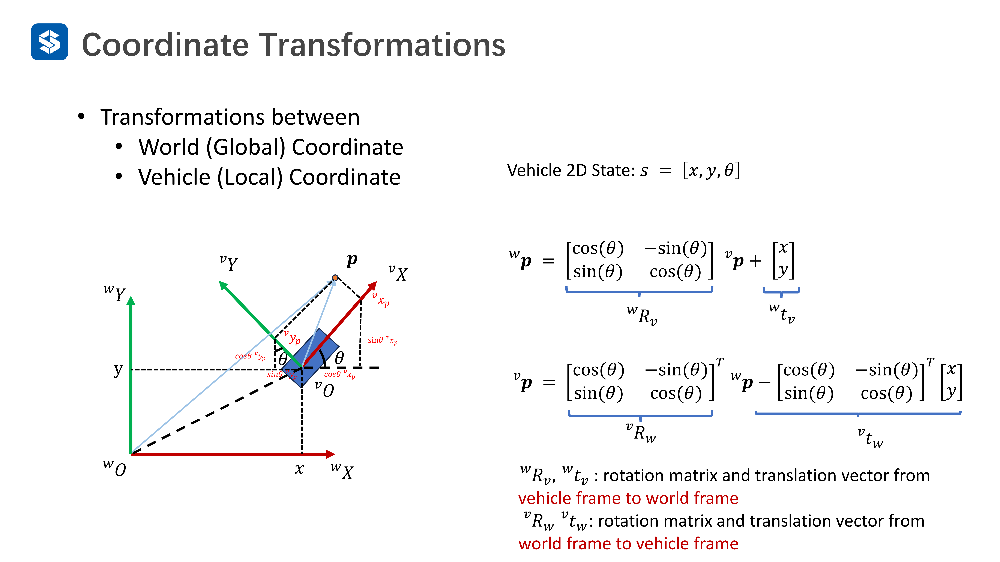

# 自动泊车的应用

自主泊车辅助完成的是泊车最后的泊入过程，在车已经到车位附近之后可以开启泊入过程

远程泊车辅助做的是通过远程遥控来实现泊入，其中APA 和 RPA 都是比较成熟的

记忆泊车有一个记忆巡航的过程，适合从停车场入口行驶到停车位的情况，并且会记住停车场的情况以便于下一次的泊车

最后就是 AVP，也是最复杂的，其语义地图会更加丰富，也可以包含多条轨迹和多个车位或者进行点到点的导航

# 框架

AVP 的框架如下所示，传感器会有很多种类，有视觉、激光、IMU 和里程计等，用于供给后面的感知和定位模块使用

感知模块会检测一些动态和静态的障碍物还有感知静态的环境

定位模块会使用感知模块的输出和传感器原始数据来进行建图和位姿估计

规划模块会结合感知和定位信息做一些决策，比如说路径规划和行为决策

最后就是控制模块，结合定位和规划进行具体的控制

# 常用坐标系

## 全局坐标系

地心地固坐标系，也就是 ECEF 坐标系，以地球坐标系为原点，以北极为 Z 轴，赤道为 XY 平面，X 轴是赤道和本初子午线的交界点，然后根据右手法则找到 Y 轴

然后就是局部的坐标系了，其中有东北天（XYZ）和北东地（XYZ）两个，相当于从地球表面做一个切平面

当然，还可以以任意的特定固定点为原点建立坐标系

## 局部坐标系

后轮车轴中心为坐标原点，这样很适合车辆动力学的计算

## 坐标系变换

坐标变换有两种基本组成，旋转和平移，平移可以直接以向量加减的方式给出，旋转需要以旋转矩阵的方式描述

