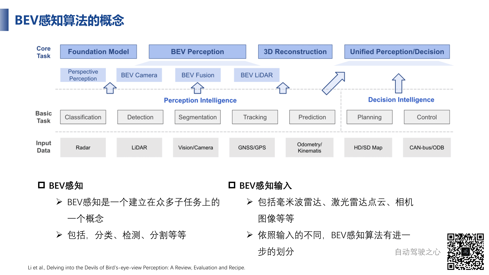
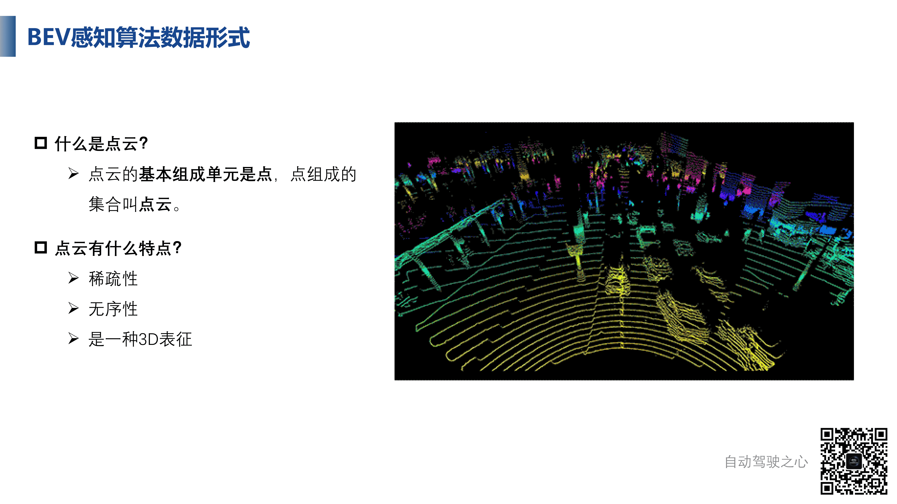
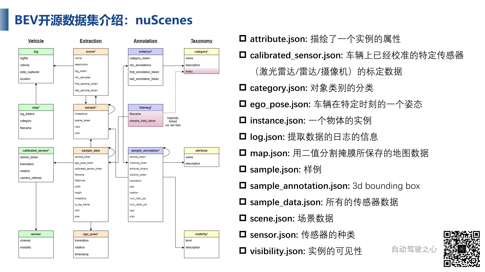
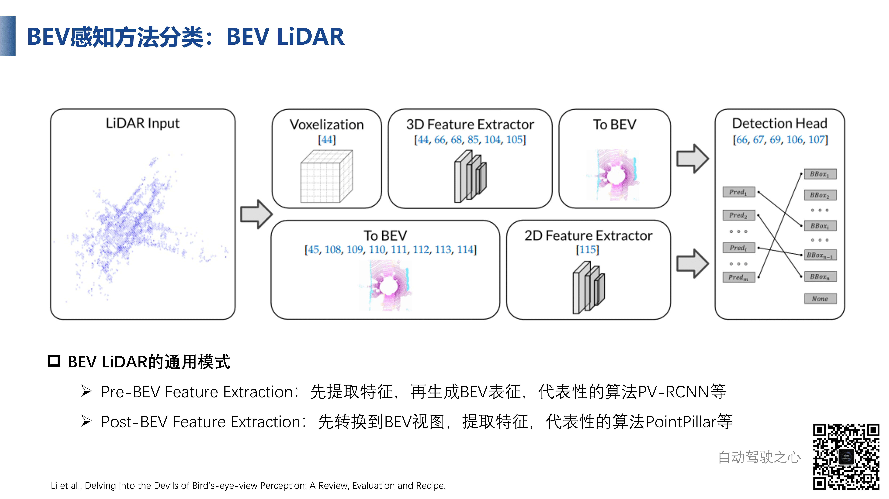
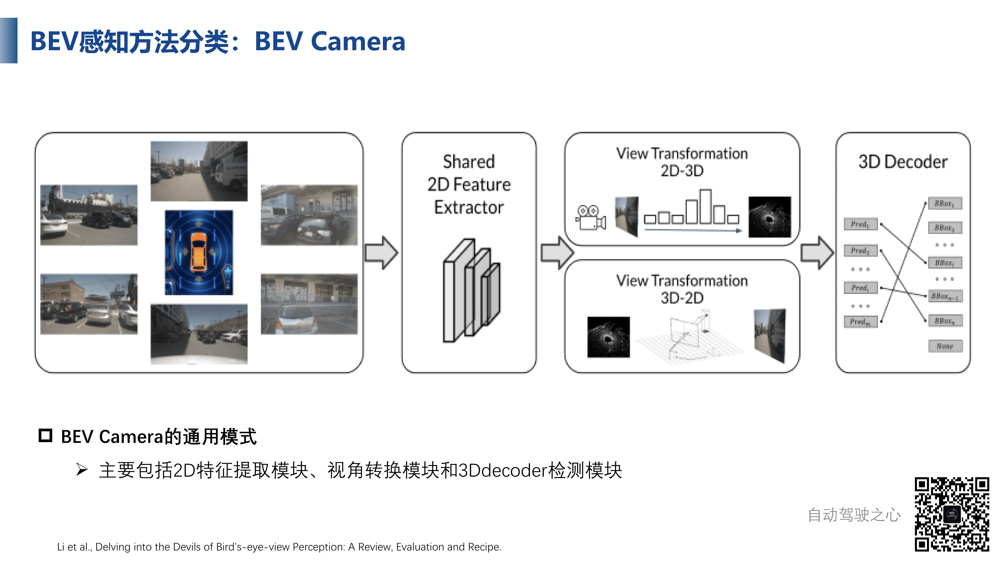
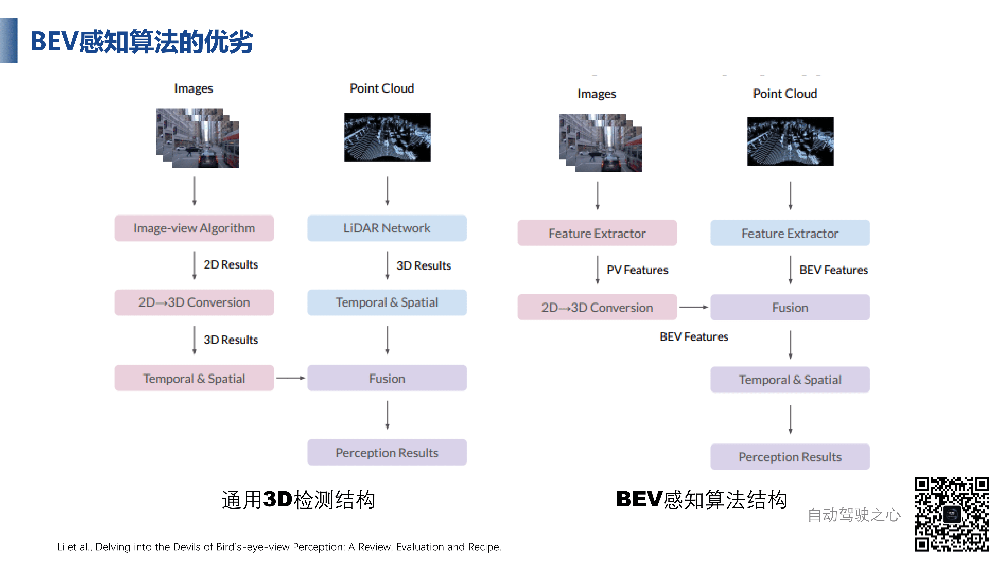

# 什么是BEV

## 基础概念

BEV也就是Bird's Eye View，也叫鸟瞰图、俯视图或者上帝视角，可以带来尺度变化小、遮挡小的优势

- 尺度变化小，是因为在二维视觉中有远小近大的特点，同一种目标的尺度有很大的变化，但是在BEV空间，尺度的变化就小，网络对特征一致的表达能力是更好的，有尺寸上的优势
- 遮挡小，比如说有两辆车挨得近，那么远一点的车就会被挡住，如果在视觉特征丢失的情况下，通过一个前视图的方法是很难预测后面的车的，但是在BEV下则可以对车进行完整的区分

实际上BEV空间已经提出很多年了，现在的问题就是如何进行感知，也就是将传感器数据投影到BEV空间下

最常见的输入数据就是雷达点云和视觉

如果输入的数据是纯雷达，那么就是BEV LiDAR，与传统的点云深度学习算法十分接近；如果输入的是点云和图像，就是BEV Fusion，同时处理点云和图像的数据

## 数据形式

主要包括两种输入（相机图像、雷达点云）三种形式（纯雷达、纯点云、融合）

图像是由相机生成的，是将三维世界中的坐标点（单位为米）映射到二维图像平面（单位像素）；图像的优势在于：密集表达、纹理丰富、成本低，基于图像的任务、基础模型相对成熟和完善，比较容易扩展到BEV感知算法中。

点云呢则是另外一种主要的数据形式

点云的特点有

- 稀疏性：除了颜色鲜明的前景区域，还有黑色的无点云区域，这是没有点云特征的，这是由于采集设备的限制造成的，并且有明显的远少近多的情况
- 无序性，点云是一个无序性的集合，排列顺序对点云本身没有任何影响
- 是一种三维表征，可以使用三维坐标表示

我们提取点云特征的方式就是Point-based或者Voxel-based得到关键点或者特征点

## 开源数据集

实际工作中，出于不同任务的需要，会分为目标检测数据集、语义分割数据集和轨迹规划数据集等

### KITTI

一个为无人驾驶准备的数据集，很常用

下面是一个很好的KITTI可视化，是官方的一个Demo，我们注意一下，下面的部分，两侧是有两个虚线的，这个表示的是摄像机的视角，表示了拍摄范围

只不过，KITTI是单个相机，也就是单视角

不过，虽然KITTI的点云数据是360度的，但是考虑相机只能拍摄前方，所以数据标注只在相机可以拍摄到的范围内

在官网中，左视图的数据是最常用的，下面还有右视图的数据，这种可以提供给双目模型使用

Velodyne的点云数据也是很常用的，并且搭配标注文件

同时要考虑进行坐标变换，实现多传感器数据的对齐

下图中，x是点云坐标，T矩阵是将点云变换到相机坐标系下的矩阵，R是畸变矫正矩阵，校准图像平面，可以让点云转换到图像坐标系下，P是相机内参矩阵，是让点云转换到2D坐标系下

KITTI中的标注文件是按照场景命名的，txt中的一行是一个物体

- 第一个是物体类别
- 第二个数字0.00表示是否被截断，或者说有没有完整被表示，是一个截断比例值
- 第三个数字0表示被遮挡的程度，是一系列离散值，具体为正整数，1表示部分遮挡，2表示严重遮挡，3表示离得太远无法看清，不清楚遮挡情况
- 第四个-0.20表示观测角度，是弧度，表示物体在相机的什么方位
- 第五个第六个表示物体边界框的左上角坐标，第七个第八个是右下角坐标
- 第七个到第九个1.89 0.48 1.20表示目标物体的高宽长
- 第十个到第十二个1.84 1.47 8.41是目标三维坐标
- 最后是置信度类别

### nuScenes数据集

这个是BEV中更常用，但是数据集更庞大，并且激光雷达频率远高于KITTI所用的，并且目标类别更为细致

在图像方面，nuScenes有六个相机的视野，远高于KITTI的单视图

一个nuScenes数据集下属四个文件夹

- maps：更多的用于决策
- samples：关键帧，已经标注好的图像
- sweeps：未标注的图像，其余帧没有提供标注，或者说nuScenes只给关键帧提供标注
- v1.0：各种标注的数据

标注文件如下

## 感知方法分类

### BEV LiDAR

这种方法输入是单点云的，以检测任务为例，有Pre-BEV和Post-BEV的分类，Pre-BEV指的是特征提取是在BEV之前完成的，Post-BEV指的是特征提取在BEV之后完成的（拍扁然后提取特征），可以看到特征提取网络明显不同，其中Post-BEV会很快，因为二维网络比三维网络少一维

我们首先看一下PV-RCNN的方法，先进行Voxelization，然后使用三维稀疏卷积提取特征，并且搭配多尺度处理和信息融合，然后投影到BEV空间下进行检测任务

### BEV Camera

通用方法就是先使用二维卷积进行特征提取，然后进行视角转换得到BEV特征，然后输入到解码器（检测头）进行检测

其中的视角转换模块就是将前视图等转换到BEV俯视图视角

### BEV Fusion

融合点云和图像两种模态，融合一般是在特征层面上融合

## BEV算法优劣

我们先看其与一般三维检测框架的区别

三维检测结构一般是通过特征提取然后得到相互独立的特征，然后进行处理，融合得到结果

BEV则是先融合，然后进行时间和空间的处理再得到结果

BEV最重要的部分就是多视角转换模块，也就是将多视角的图像转换到BEV结果

图像相对雷达，有更丰富的纹理和色彩信息，在车道线检测这种方向，相对雷达有巨大的优势

但是纯视觉的BEV的性能比纯点云的性能还是低一些的，还有很大的提升空间

## 应用

传统的自动驾驶感知方案，是各个传感器单独进行分析运算，然后将分析计算结果融合到统一的空间下进行决策规划，但是问题是各个传感器相互独立，并且有特定视角的局限，经过各自的分析运算，在后处理阶段融合之后误差会叠加，很难精准拼凑出道路实况

BEV的好处就是从宏观且全局的视角观看，各个传感器的数据先统一投影到BEV空间，然后使用统一模型进行处理，还可以进行时序融合，可以更好的判断道路，进行自动驾驶

目前很多企业都是使用BEV进行自动驾驶感知方案，其中Tesla等公司的一些资料是公开的，并且BEV也是Tesla带火的

Tesla的模型是自下而上的模型，从原始输入开始，先进行图像校正Rectify模块，然后进行两次二维特征处理模块RegNet和BiFPN，得到多尺度特征

图像特征处理使用三条线并行，是因为在BEV中，需要不同传感器搜集数据并且投影到统一空间下，但是不同摄像头的内参外参是不一样的，所以同一个物体在不同相机中是不一样的，所以我们不能在单一相机下处理数据，而是需要对不同相机的图像数据进行分开处理，所以三条线包含了不同摄像头在不同位置下拍摄的图像

Tesla在没有做BEV之前，是每个传感器单独进行感知，然后将感知结果进行融合，相当于直接跳过了中间的一些东西，并且这样子需要大量的超参数，调参起来非常麻烦，还有很多逻辑判断结构，甚至判断结果可能相互冲突，并且图像空间的输出对于后期的检测是不友好的，只能使用检测的结果而不能使用检测得到的特征，在做一些定位啊轨迹预测啊的任务的时候会难以处理

同时，单个相机有时候很难看到物体全貌，比如说距离较近的大型卡车，所以使用单目相机做检测是不准确的，所以Tesla增加了Feature Queue何Video Module这个模块，让特征从图像空间映射到BEV空间

同时，把多个视角的图像统一通过公共的特征提取器，投影到统一的BEV空间下，也就是PV Feature到BEV Feature，或者说这个模块就是View Transformation的模块，在有了BEV信息之后，我们可以引入时序信息和空间信息来增强BEV特征，然后得到检测结果

此外，地平线和毫末的感知方法是融合方案，同时有图像和点云等多模态输入，将三维和二维特征统一映射到BEV空间下，不过转换的模块比较隐晦

在地平线的方案中，图像特征在Cross Stream Alignment中到点云特征的转换就是二维到三维的转换，实际上就是视角转换的过程，其将二维特征转换到三维特征，然后拍扁到BEV空间下

毫末的方案中得到图像多尺度特征之后，通过视角转换，然后映射到Tensor Space中