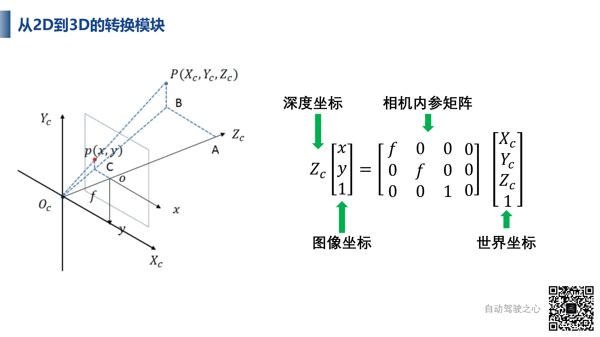
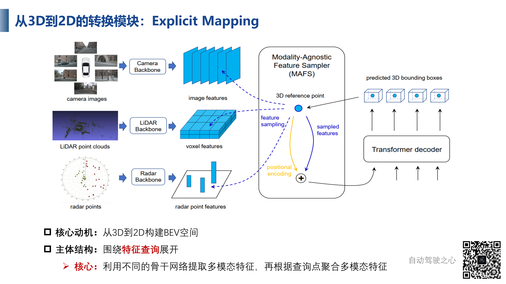
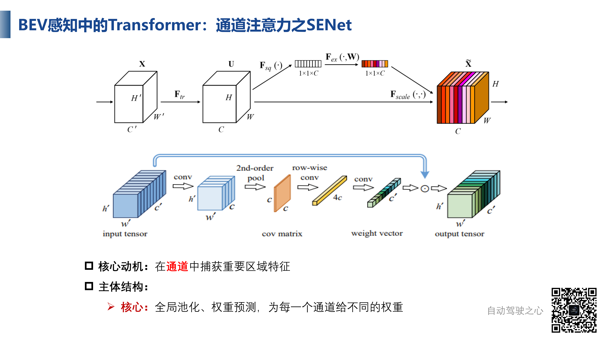
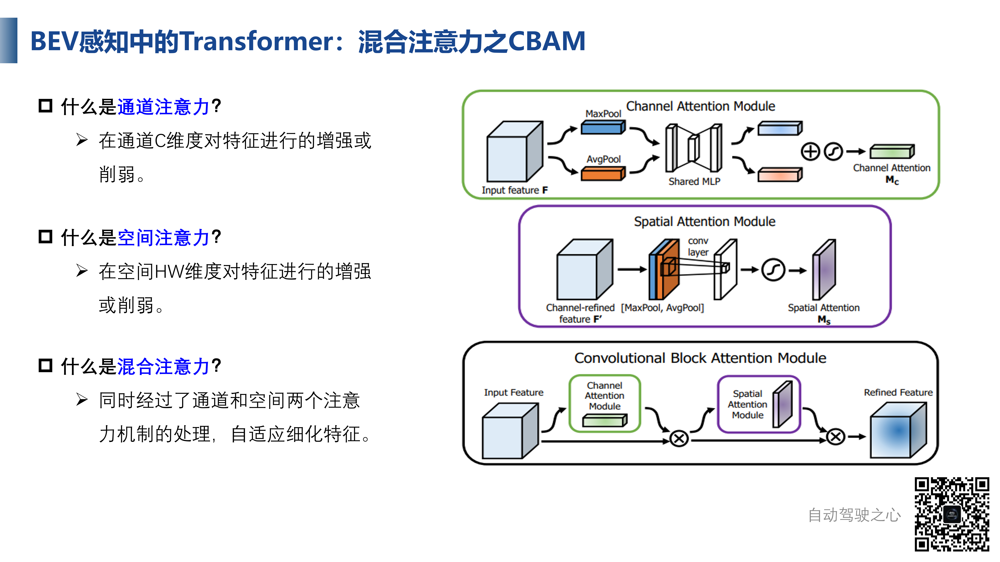
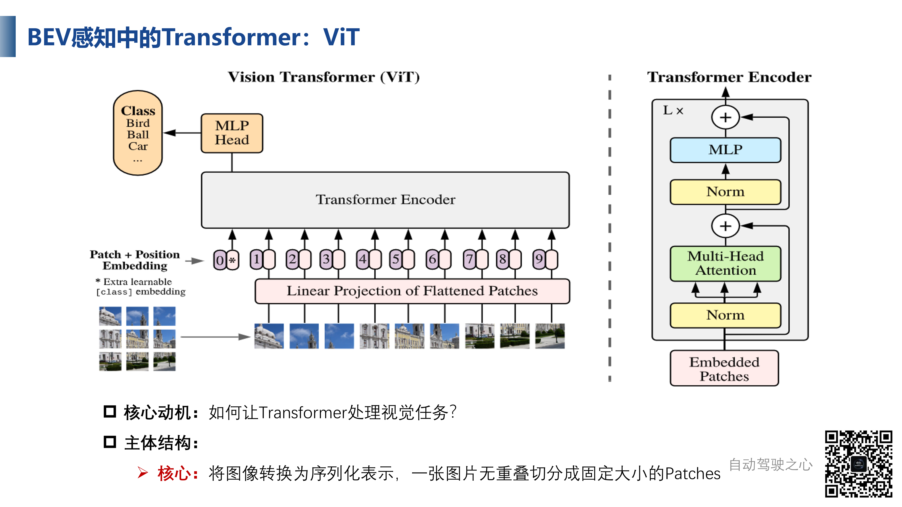

# 2D到3D的转换模块

最常见的传感器是相机，并且经常性使用环视图（如下图所示），但是输入是没有BEV空间的，所以需要将输入图像从2D转3D然后转换得的BEV空间，这也是一个很核心的任务，3D是一个很重要的媒介

我们知道，3D到BEV空间是很容易的，所以我们可以将图像从2D转换到3D下

我们先根据图像的生成原理。下面$O_c$是相机原点，$P(X_c,Y_c,Z_c)$是物体三维坐标或者说世界坐标，$p(x,y)$是图像坐标，有了内参矩阵和世界坐标，我们就可以得到图像坐标，但是反过来就不一定了，确定了一个图像坐标，无法反过来确定世界坐标，这是因为维度缺失（或者说深度缺失）的问题

但是如果我们已知$p(x,y)$是某个已知深度的三维点的投影，我们就可以做到反过来的一一对应

所以所有的2D转3D过程，都是离不开深度估计这个问题的

## LSS模块

这是英伟达发表于CVPR2020的工作，非常经典，可以从2D到BEV空间，很多工作比如说CaDDN和BEVDet都是根据这个工作去改进的

输入是多视图的图像，输出是BEV空间，

大概流程如下，首先对每个图像进行CNN+Lift深度估计分布，通过有效的深度估计，可以将图像投射到三维空间中，第二个模块，对三维空间进行编码到BEV空间，然后就可以进行下一步的子任务

那么是如何进行转换的呢？我们知道，二维转三维最重要的是深度信息，所以在这个算法中，我们将二维三维之间点与线的对应转为点与点的估计

因为在一条线上所有的点，投影到平面上对应的点只有一个，所以LSS的做法就是将线段离散为一段段，然后去评估概率分布，同时为每个像素分配一个长度为C的特征向量，表示像素特征，然后与概率向量相乘就得到了下图中的矩阵或者说特征图

这样操作总的来说容易很多

## Pseudo LiDAR

我们还可以做连续的深度预测，我们将这种方法称为伪点云

我们有图像和深度，就可以和三维空间的点一一对应了，这种是通过图像得到的点云，所以称为伪点云

这种方法的好处就是可以使用通用三维框架处理，但是这种方法是使用深度图得到的，所以如果深度图不准就无法得到良好的点云，自然会影响进一步的应用

# 3D到2D的转换模块

这一步就是生成BEV空间的步骤

前面的2D到3D，就是对于图像上的点，我们通过离散或者连续的深度分布，得到其对应的三维空间的点，从图像上看这是一个正向过程，但是我们怎么完成从3D到2D的映射（也就是投影到BEV空间）呢？这是一个相反的过程：在三维空间有一个点，我们去寻找其映射在二维平面上的位置

我们要完成的是，已经知道了特征在BEV空间中的位置，怎么去寻找其在二维空间对应的位置，我们利用输入这个像素位置的特征填充到当前BEV空间中，就可以构建一个完整的BEV Map

我们接下来通过一些经典的二维到三维目标检测的框架为例子，介绍其中的关键的3D到2D的模块

## Explicit Mapping

输入是环视图像，输出是三维边界框（或者说三维预测结果），这里我们主要是关注如何得到三维特征？我们看一下非常经典的DETR3D这个工作

### DETR3D

下图中，输入是2D的环视图，输出是三维的预测结果（3D Box），是基于三维特征的预测，这里研究的核心是怎么得到三维特征

这个转换流程与DETR类似，有一堆预先生成的初始化框的序列Object Queries，然后第一步就是蓝线部分，对Query通过一个子网络预测一个三维的参考点，这个参考点的作用就是将BEV空间中的点反投影到图像当中，拿到这个图像位置的特征对原始点的位置特征（也就是Object Queries）做一个补充或者说优化，或者说这就是一个Refine的过程。这就是3D到2D的一个映射过程

总的来说，是先生成初始的三维点，然后去寻找对应的二维点的特征进行补充，这就是经典3D到2D的过程，除去环视图可以这样处理，多模态的输入也可以这样处理

"Explicit Mapping"（显式映射）是一种用于从原始传感器数据（如摄像头图像）生成BEV表示的方法。这种方法直接利用几何变换将传感器数据映射到鸟瞰视图坐标系。

### FUTR3D

这是清华提出的一种BEV融合的方案，应该是第一种通用的可以多传感器融合并且端到端的三维目标检测方案

输入包括图像、点云和雷达，输出是三维检测结果

先使用不同的骨干网络提取特征，然后使用一种3D Reference Point的方法进行多模态的特征融合，那么参考点的作用是什么呢？我们有了三维的参考点，就可以投影到不同的模态上，从不同模态的不同位置拿不同的特征，实际上就是一个特征采样的过程

采样好的特征通过级联的方式经过一个MLP网络投射到共同的特征空间中，然后就可以用特征来做预测了，这样可以融合不同的信息来做判断决策

我们把这种具有显性参考点的方式称为显性映射，也就是我们明确需要这个参考点的特征

## Implicit Mapping

有了显式映射，自然也有隐式映射

在研究隐式映射之前，我们再看一下显式映射的DETR3D，首先有N个参考点，去预测一系列的Object Query，然后利用相机参数将参考点反投影回二维图像，对二维特征进行采样，以此进行三维映射，但是如果参考点不对，那么就无法做出正确的预测

还有一个问题，就是这个是Point到Feature的过程，Point是局部特征，对于其他位置是无法采样的，实际上这对BEV空间来说是一种稀疏表示，对全局特征的学习不够充分，所以需要改进

我们在想，能不能摆摊参考点的限制，使用一种自适应的方法去学习二维特征和三维空间的对应关系，并且尝试作一种全局的特征表达，这就是隐式对应的思想，PETR就是这样做的

### PETR3D

是22年初的工作，是DETR3D的改进版，在没有额外增加数据量的情况下，提高了性能表现，动机是学习二维图像特征和三维空间位置的隐式对应关系

输入除了标准的多视图，还有一个3D点生成器，输出也是检测结果

其中的三维坐标生成器，作用是将图像平面转换到世界空间，实际上就是一个2D到3D的转换过程，将相机视锥的覆盖区域映射到三维空间当中并且生成一系列坐标点

# BEV中的Transformer

Transformer实际上就是一种注意力机制

## 空间注意力：STN

这是一个很经典的空间注意力的工作，空间变换神经网络STN可以在空间中对形变的数据进行转换，并且自动捕获重要区域的特征

## 通道注意力：SENet

这是一种很重要的注意力机制，在很多BEV算法中都可以看到，其作用是可以加强某些通道的特征，削弱某些通道的特征，迫使网络更关注某些通道，或者说对某些特征明显的通道特征做重点关注，并且忽略一些不明显的通道特征

## 混合注意力

通道注意力和空间注意力是不冲突的，是可以叠加使用的，也就是混合注意力的模型，有代表性的是CBAM

其使用串行结构，先对通道特征进行加强，然后对空间维度进行加强，网络可以自适应的细化特征，当然还可以使用并行结构

## Transformer：self-attention

Transformer实际上是一个特征提取模块，动机是计算给定的序列的各个位置之间的关系（或者说影响程度）

这里的核心是三个量，查询向量Query，键值向量Key，值向量Value，这是一种查询机制，用来查询和其他特征之间的关系（包括自身），键值向量Key是被用来计算关系（或者说相似度的），比如说我们想得知$a^1$和$a^2$之间的关系，就可以拿前者的Query查询后者的Key

## ViT

Transformer主要是针对序列特征，其在NLP中是经常性存在的，但是CV中则不然，图像不是天然的序列，所以我们想使用Transformer处理图像，就需要将图像序列化

ViT是很经典的工作，其思想就是将图像切分为大小相等的图像块，每一个块称为一个Patch，每个Patch可以提取特征映射到特定的维度，在ViT中这个维度是768，这样，我们就可以将一个完整的图像转化为一个图像序列

但是，如果单纯的切分并且转化为序列，就会损失位置信息，Transformer并不知道某个Patch是图像的哪个部分的，无法衡量图像中的空间信息，所以作者引入了位置编码的方式，实际上就是将每个patch的位置信息编码融合到视觉特征中然后一起送入Transformer Encoder，然后得到的特征是包括输入特征两两元素之间的关系的，然后通过一个MLP进行映射分类（ViT提出的时候就是为了分类任务的）

这是一次非常重要的突破，并且其在大规模数据集的表现非常好，而且我们可以将其视为一个二维图像处理网络，应用到其他的一系列如分割检测任务上

## Swin Transformer

这是ViT的改进版，ViT在处理图像的时候是将整张图像进行划分的，所以自注意力机制是在全图进行划分的，所以计算Patch关系的时候是在全局上做的，但是对于自动驾驶等任务，目标不一定会占据图像的很大区域的特征，这时候ViT就会有所不足

Swing Transformer的思路就是，Patch中再划分Patch，块内再进行self attention

这两个也是Transformer在视觉中的最基础工作，也是最开始的应用

## DETR

然后Transformer在目标检测领域的开山之作是DETR，FaceBook在ECCV2020提出的

其框架主要是Encoder和Decoder，Encoder可以编码图像特征，Decoder可以将特征解码为检测结果

Encoder部分整体框架跟ViT一样，只不过输入的是图像的特征（通过CNN处理）和位置编码，然后进行Transformer处理，就得到了一个序列化的有自注意力关系的特征，并且可以作为一个2D Backbone存在，并且Transformer可以帮助网络很好地提取不同位置不同物体之间的关系

在Decoder部分，我们有了图像特征之后，我们使用Object Queries（这个决定模型最终预测多少个框），通过Query和特征进行查询，我们进行Self-Attention操作，得到最终的输出的框，在原始论文中这个数量是100，也就是说对任何图片都会输出100个框（会删除置信度过低的）

这种Encoder与传统CNN Backbone的区别就是，可以更好的关注图像内的相互关系，比如说物体和物体的关系、物体和背景的关系，这对检测是很有用的（比如说鸟常常成群结队，有一只鸟的地方往往有多只鸟）