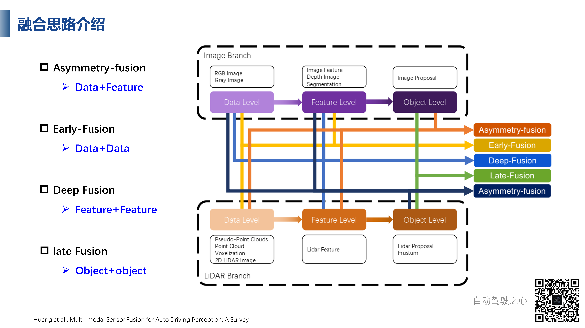
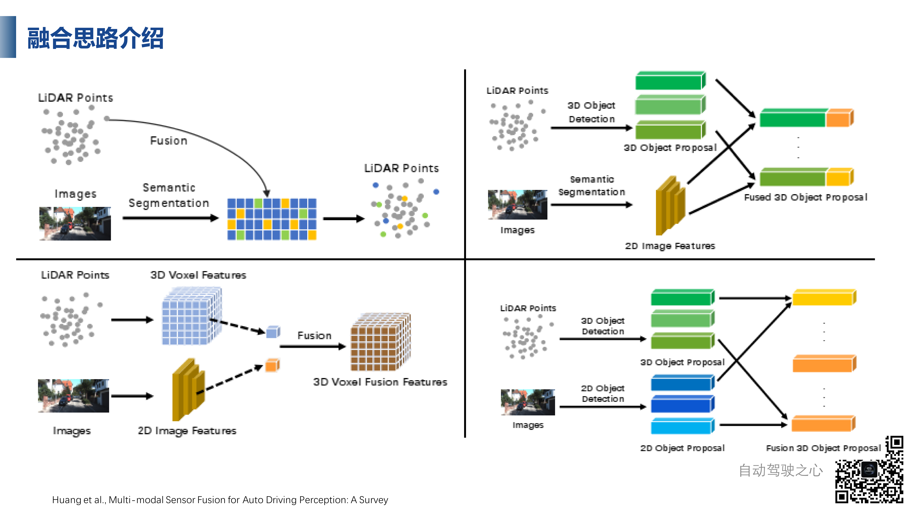
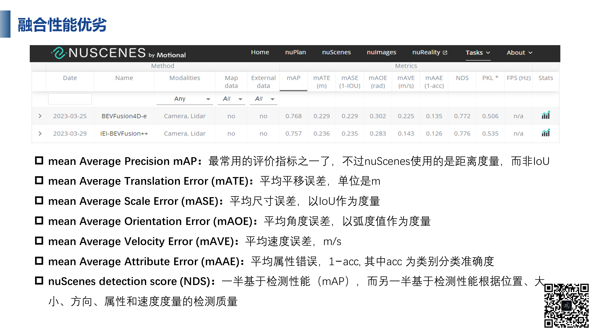
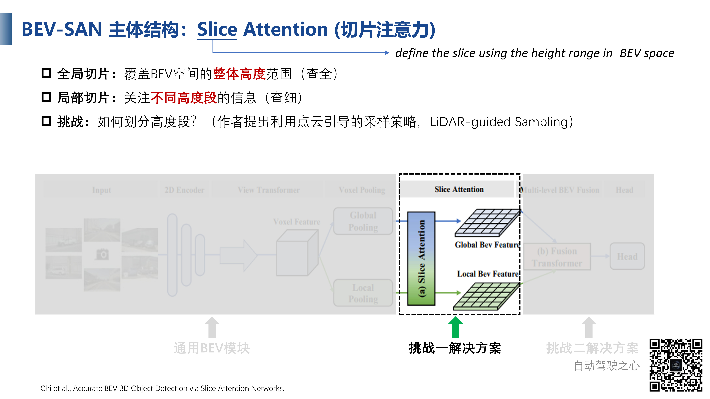
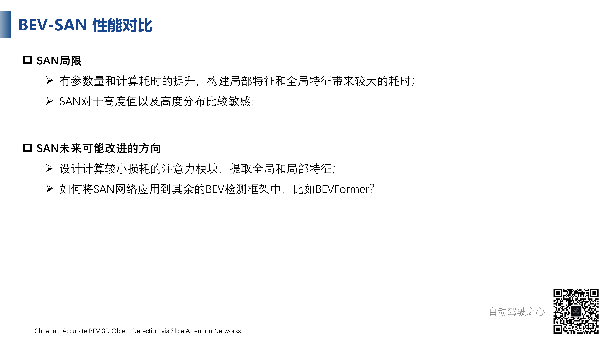
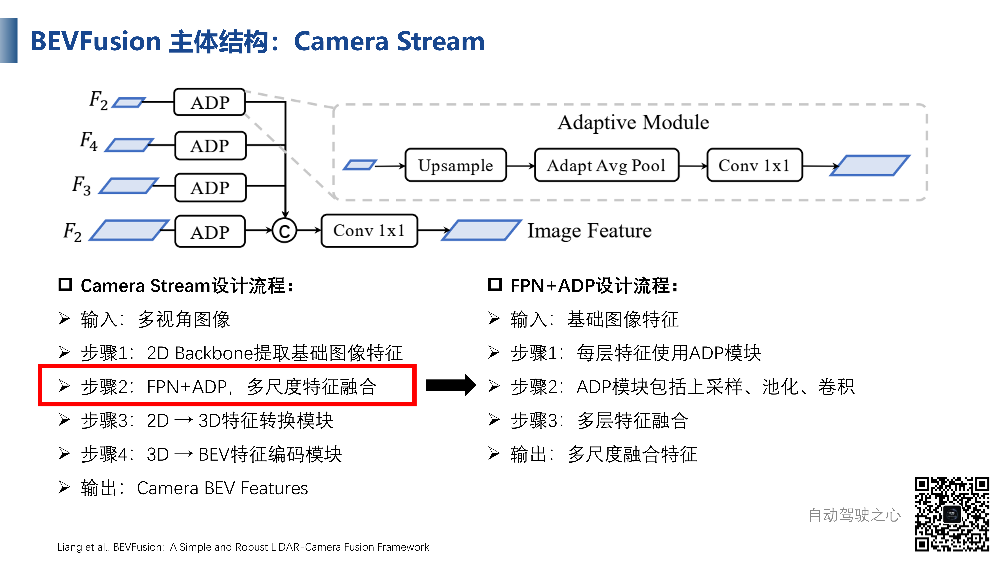

# 融合感知算法介绍

## 融合背景介绍

我们之前提到，BEV感知是一个建立在众多子任务上的一个概念，本身就很综合，输入宽泛（从主动传感器到GNNS/GPS等），我们可以把BEV算法进行一个分类

其中，以相机为输入的算法为BEV Camera，代表作品有BEV Former、BEVDet，以点云为输入的算法称为BEV LiDAR，代表作品有PV-RCNN系列，以图像和点云混合输入的算法称为融合感知方法，代表作有BEV Fusion

那么为什么要融合？我们希望融合可以达成什么目的？实际上，融合意味着模态信息互补，稳定，而且单模态有无法弥补的劣势，比如说相机主要是在前视图比较低的位置捕获，并且在复杂场景存在遮挡问题，存在信息丢失的情况，激光雷达受限于机械结构，在不同距离有不同分辨率，意味着采样点的数目会随着距离变化而变化，而且容易受到异常天气干扰 

## 融合思路介绍

我们的思路主要是在什么阶段进行融合

- 前融合（数据级融合）：直接融合不同模态的原始数据，比如说点云投影到图像的二维空间，生成伪2D图，或者生成伪点云的方法
- 深度融合（特征级融合）：点云和图像各自通过网络得到特征，然后在特征空间上融合
- 后融合（目标级融合）：偏向于后处理的方法，使用NMS等方法进行融合，是决策级的融合

我们可以更深入一些，划分的更详细一些

如下图所示，上面是图像分支，可以输入RGB图和灰度图，然后就是特征，特征的范围很广，有图像特征、深度图、分割，还有物体层面的检测结果

下面是点云分支，情况也类似，不过具体的种类有区别，数据可以是伪点云、点云、体素、二维雷达图像

点云和图像各有三个模块，可以两两之间融合，但是只是同层级的融合，那么我们能不能做不同层级的融合呢？实际上是可以的，这种方法称为非对称融合

如下图所示，第一种（左上）是点云和图像语义特征融合，我们将图像经过分割处理得到的前景点像素，映射到点云空间，和原始点云进行合并，可以看到，融合后的点云就有了语义信息，这是一种偏早期的融合

第二种（右上），点云通过目标检测算法得到物体的Proposal，图像通过分割网络得到图像特征，然后图像特征和三维检测结果进行融合

第三种（左下）通过对点云进行体素化处理，得到三维体素特征，然后二维图像通过CNN得到图像特征，然后在特征层面做融合

第四种（右下）是分别做目标检测之后在决策层面进行融合

我们介绍两种有代表性的工作，一种是数据级融合，点云数据为图像数据提供先验，一种是特征级融合，也就是DeepFusion的方式（下图所示），通过图像支路提取图像特征，通过点云支路提取点云特征，然后在特征合并，通过网络得到融合后的检测结果

## 融合性能优劣

下面是nuScenes的榜单排名

其中Map Data表示地图数据，External Data表示有没有使用额外数据（有没有额外标注或者额外数据集做预训练）

其中PKL是一个比较新的指标，即planning KL Divergence，规划KL散度，也就是我们基于这个检测结果，我们后续怎么做规划，这个规划的决策差异有多大，比如说一个决策应该要么走要么停，不能模棱两可的，所以说PKL越低越好

接下来我们看一下一些评价指标

- mAP：使用二维中心距离而不是IoU，因为物体的尺寸和方向都会有很大的影响
- mATE：二维空间的欧式距离

# BEV-SAN

这是一种BEVFusion算法，S表示切片，A表示Attention，N表示Network

## 动机

我们先看一下BEV算法的通用组成部分，主要有模态特征提取模块（与输入有关）、BEV特征构造模块（通过图像或者点云特征生成BEV表征）和检测头模块（通过BEV表征做检测）

BEV实际上是一个俯视空间，因此之前基于BEV的三维目标检测方法多数是基于高度维度展平到低维空间的，也就是拍扁到BEV空间，作者考虑这种直接的拍扁合不合理，在真实世界中，不同目标所处的高度是不一样的，比如说障碍物和卡车就在不同高度上，所以按照之前的方法对高度维度统一进行压缩会导致某些区分性特征的丢失

所以作者在想，有什么方法可以将高度维度表征出来，增强特征表示能力。有了这个想法，就需要统计分析，上图的图片中可以看到，我们对不同物体的三维边界框进行统计，不同类别的物体的高度区间是不一样的，或者说分布是不一样的，所以作者想充分利用目标的高度信息来提高检测性能

所以作者提出了Slice Attention Network，搜索不同类的目标在高度上的表达方式

## 主体结构

整体结构与BEV通用结构一致，不过作者更关注BEV特征构造模块

这里有两个问题，一个是如何选择特征提取的高度范围，二是如何融合多级特征

我们对结构进行拆解，然后看其构成

### 通用BEV模块

输入是环视图，然后使用共享的ResNet-50得到特征$F_k$，进一步使用View Transformer将其转化为Voxel Feature，然后我们使用$F_k$去预测图像深度，得到深度张量$D_k$，二者进行组合得到体素特征$V_k$，此为四维张量，实际上就是每个特征图的位置都带有一个D维的深度向量，深度向量的每个位置都有一个C维的特征向量

### Slice Attention（切片注意力）

什么是切片注意力呢？作者在文中给出的定义就是高度范围，就是BEV空间有一个高度范围，我们沿着高度范围将BEV切成一片一片的子空间，比如说BEV空间的范围是-1到3，那么可以切成0-1、1-2的空间

在分割成不同的区间之后，就可以根据子空间的情况赋予不同的权重，通过这种方式尽可能保留BEV空间的高度信息

切片有两种方式，一种是全局切片，覆盖BEV空间的完整高度，一种是局部切片，关注不同高度段的 信息，并且可以使用点云引导划分高度段的策略，或者说这是一种点云引导的采样策略，这也是将此工作归类为融合感知方法的原因之一，实际上这个工作仅仅使用了图像的输入

至于切片方式，全局切片实际上是根据经验来的，划分了三种不同的高度范围，其中$[-6,4]$这个区间我们可以认为包含了BEV空间的全部信息，只不过对应的BEV特征有很大的特征，而具体的切片则是在全局池化之后完成的

在全局池化之后，我们可以得到三种全局特征，分别对应不同高度范围，通过一个选择器（也就是注意力机制）选择一个合适的特征用于检测任务

局部切片则是关注不同高度段的信息，不同的目标分布在不同的高度段，我们如何去提取不同高度段的信息呢？实际上，我们可以认为局部切片实际上是全局切片的细分，希望可以更精细地提取目标的局部表征，所以作者提出了点云引导的采样策略，通过不同高度范围内点云分布来确定局部切片的区间，具体方法是将图像投影到BEV空间然后沿着高度计算直方图

比如说，$[-2,0]$的范围内都是相对小的目标，$[0,2]$里面往往是一些比较大的目标，作者划分了六个子范围（如上图所示），然后使用通道注意力机制在局部区间，有效聚合了不同高度的信息

### Mult-level BEV Fusion

我们得到了不同的特征，然后进行进一步的融合才可以更好地利用，也就是使用多级特征融合模块，才可以融合不同高度的特征，融合有两个阶段：SE模块（实现通道间的注意力）和Transformer融合（融合一阶段得到的全局特征和局部特征）

不过注意一下，因为一阶段得到了全局BEV特征和局部BEV特征，所以二阶段在Transformer中会输出两个序列，进行特征之间的交互，然后相加得到BEV空间的特征，进而用于三维检测任务

总的来说，BEV-SAN在BEV特征构造部分，没有直接拍扁，而是切分成多个子空间，每个子空间提取一种特征，比如说$[-6,6]$中提取全局特征，$[-2,-3]$中提取局部特征

## 性能对比

相对BEVDet、BEVDepth等方法的性能对比，可以看到有所提高

## 局限与改进方向

SAN是有参数量的提高，构建局部特征和全局特征带来较大的耗时，而且对深度值和深度分布较为敏感，如果分布有变化就可能导致性能下降，也就是鲁棒性有所欠缺

我们可以尝试提出一个损耗较小的注意力模块，提取全局和局部特征等

# BEVFusion

这是一个很经典的融合BEV方法，是图像和点云的融合方法

## 动机

 融合方法有三种

Point-level的策略是从点出发，从点云中采样一些点，然后通过相机的参数矩阵投影到图像上，采样出图像特征然后拼接到点云上，然后用融合后的特征做检测

Feature-level的方法是将两种模态的中间特征，使用Query的方法，通过参数矩阵做投影、拼接

那么这两种方法有什么问题呢？这两种方法都离不开映射的过程，也就是需要将三维的点映射到二维空间上做采样查询，这个时候就需要相机的内参外参矩阵了，内参矩阵在相机出厂后一般就恒定了，但是外参矩阵是衡量相机和雷达之间关系的，可能存在误差，这就会造成了检测性能的降低

而且除去这个问题，我们在做投影点的时候，可能相机在这个位置的成像效果不好，比如说遮挡、卡帧等，无法得到准确的特征

所以作者认为，之前的方法存在一个主次依赖的关系，比如说从点云出发就是点云为主，点云和外参如果不准，后面的检测就不准，BEVFusion想的就是尽可能降低这种主次依赖关系，对点云和图像进行分别处理，然后在BEV空间进行融合

并且，除了一个标准的检测头，在各个模态的特征后面还有一个检测头，便于独立工作，避免在极端情况下产生影响

## 主体结构

输入还是环视图和点云，图像有专门的Camera Stream进行处理，通过Encoder得到Feature，然后使用2D-3D转换器得到三维特征，然后投影到BEV空间得到Camera BEV Feature

然后使用3D Backbone得到点云的BEV特征，然后使用一个Fusion Module进行融合，得到混合特征用于预测，并且为了实现单模态也可以进行检测，在不同模态上加了Detection Head

### Camera Stream

我们先看图像支路，其输入是多视角图像，输出是图像的BEV特征，其中Encoder部分包括2D Backbone和多尺度特征融合，多尺度特征融合是一种通用方法，将不同尺度的特征通过ADP融合到一起，这是因为不同尺度的特征形状不一致，无法直接相加，需要ADP通过上采样、平均池化等操作才可以进行融合，最后我们得到了一个融合后的图像特征

然后就是2D转3D的特征转换模块，得到了一个伪体素特征

