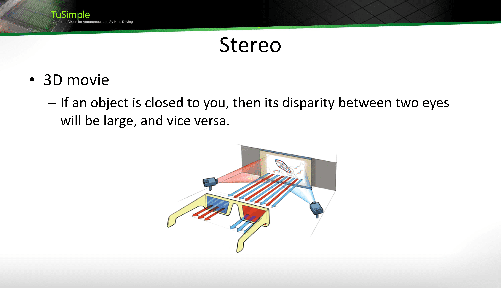
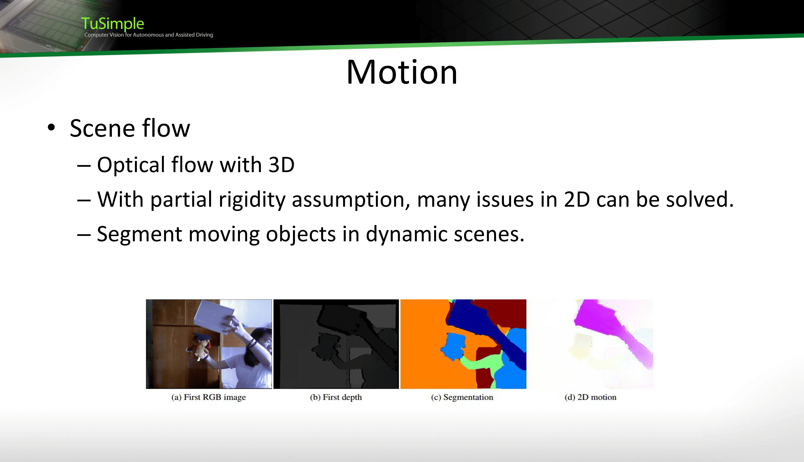

# 自动驾驶历史

## DARPA挑战赛

DARPA无人驾驶挑战赛算得上是自动驾驶中一个里程碑事件了，这个美国国防高级研究计划署（简称DARPA）发起的无人驾驶汽车挑战赛分别于04、05、07年举办，其中07年的城市挑战赛标志着自动驾驶技术的重大突破和自动驾驶产业的起源

不过，在刚刚起步的04年，甚至都没有车辆可以自主跑完全程（还有很多不靠谱的无法正常行驶的车辆），尽管这个时候，挑战赛中没有交通规则的限制，这在当时对广大研究者是一个不小的打击

不过在接下来的挑战中，自动驾驶技术有了很大的提高，有了更多队伍可以完成比赛，在07年的时候，挑战赛进行了升级，比赛环境改为了城市环境，同时要求车辆遵守各种交通规则，大大提高了难度，比赛在南方城市中一个废弃空军基地中举行，举办者将环境尽可能改造得接近城市，随着三年比赛时间的进行，09年有了令人满意的成果，美国国防部认为技术可以应用在实际中，于是不再举办挑战赛

当然，这只是无人车商业化的一个开始，后面谷歌就开始组建自己的车队，核心成员从DARPA优胜者中选择（主要是斯坦福和CMU团队）

## 自动驾驶的分级

自动驾驶中的分级

**SAE J3016分级：** 这是由美国汽车工程师学会（SAE）制定的自动驾驶分级系统，包括六个级别：

- Level 0（无自动化）：驾驶员完全控制车辆的所有方面，没有自动化功能。
- Level 1（辅助驾驶）：某些功能（如巡航控制或自动刹车）在特定条件下由车辆控制，但驾驶员仍然负责持续操控。
- Level 2（部分自动化）：车辆能够同时执行加速、刹车和转向控制，但驾驶员需要持续监控并准备接管车辆控制，类似于飞机的驾驶，也称为有监视的驾驶。
- Level 3（有条件自动化）：车辆能够在特定条件下实现自动驾驶，驾驶员可以放松但需要能够接管控制。
- Level 4（高度自动化）：车辆可以在大多数条件下实现自动驾驶，驾驶员不需要持续监控但需要在特定情况下接管控制。
- Level 5（完全自动化）：车辆可以在所有条件下实现自动驾驶，驾驶员无需参与操控。

## 技术概论

下面是早期的L3自动驾驶的一个可视化效果

L3级别的自动驾驶依赖于高精度地图和激光雷达，前者需要对周围静态的环境进行感知，后者去对移动的物体进行感知

高精度地图作用有两个，一个可以通过车上传感器对车身进行一个精确定位，一个就是对周围固定环境进行感知

或者说L3自动驾驶的核心就是激光雷达，依靠这个去感知环境

不过，通过视觉的感知技术，在12年深度学习出现之后，也发展了起来，因为在此之前计算机视觉技术不足以支持安全驾驶的需要

# 技术

## 双目视觉（Stereo）

### 三维电影

我们先从三维电影（3D电影开始），我们知道三维电影在观看的时候都需要戴一个特定眼镜，这个眼镜的原理就是，使左右眼接收到不一样的信息

拿普通的红蓝眼镜来说，投射的光线有红蓝两种，然后投射不同的影像，然后蓝色镜片只能看到红色的影像，红色镜片只能看到蓝色的影像，双眼接收到的信息不一样，这样就可以形成一种立体感

这也是双目视觉的原理，同一个物体，离双眼越近，同一个水平线上的视差就会越大，比如说一根手指放在眼前，单独用一只眼看，每只眼看到的手指位置是很不一样的

这是双目视觉的一个很好的性质，这样我们就可以做一个深度估计，入下图所示，离相机越近，颜色越暖，越远颜色越冷

当然，实际上这是很困难的一件事，比如说在缺少纹理的区域很难计算视差，匹配的奇异性还有存在遮挡的问题

当然，双目视觉的应用还是很多的，可以辅助语义任务，比如说某一块物体的深度是连续的，那么很可能就是同一种语义或者同一个物体，或者可以检测可行驶区域和障碍物，有利于导航任务

## 运动

在自动驾驶中，运动也是一个重要的技术，可以通过光流法去检测运动和估计运动，这里通过深度信息可以更好的去检测

当然，在检测运动的时候，光流法也有与双目同样的困境，同时如果运动很快的话，寻找的范围就会变得很大，噪声也会更大，当然，这些实际上都可以归结为**Dense Correspondence（密集对应）**的问题

密集对应是指通过对图像序列或场景中的像素进行匹配，建立起两个或多个时间点之间的像素级别的对应关系。

Dense Correspondence的目标是在不同时间点的图像帧中找到相似的特征点或像素，以测量物体或场景的运动。通过对应的像素对或特征点对，可以计算出它们之间的光流或视差，进而得到物体或场景的运动信息。

常用的Dense Correspondence方法包括光流法（Optical Flow）、稠密视差估计（Dense Stereo）、基于特征描述子的匹配等。这些方法旨在利用图像中的灰度、颜色、纹理等信息，通过匹配和优化算法来寻找匹配点或匹配像素。

Dense Correspondence在计算机视觉中具有广泛的应用。例如，在运动分析、目标跟踪、三维重建和视觉SLAM（Simultaneous Localization and Mapping）等任务中，通过密集对应可以估计物体的运动、深度信息和场景的结构。

通过Dense Correspondence，我们可以获得更为详细和准确的运动估计结果，相比于稀疏对应方法（如特征点匹配），密集对应能够提供更精细的运动描述和更丰富的场景信息。

当我们把光流和深度估计结合在一起，就得到了一个**Scene Flow（场景流）**，Scene Flow的目标是在时间序列的图像中，同时估计像素的三维运动和深度信息。它通过结合光流和深度估计的方法，得到每个像素在三维空间中的运动矢量和深度值。这使得我们可以获得像素级别的完整场景运动描述。

当然这里也会有很多歧义性问题，但是我们可以对三维空间中的物体做出局部刚性假设，可以解决二维中的一些不确定问题，比如说上图中我们可以对不同的深度进行分层，每层假设为一个刚性的运动，这样就可以很好地解决问题，得到一个三维运动信息

## 检测&跟踪

在自动驾驶中，检测和跟踪也是很重要的东西，但是也有一些挑战，比如说有遮挡情况下如何去检测，或者说怎么去找到一些特征去表示物体

# 常用数据集

## 常用目标检测数据集

- Cityscapes：这是一个城市中常见图像的数据集，不仅包括目标检测，还包括语义分割和实例分割
- BDD100K：以目标检测为主的数据集，也可以做一些分割，但是标注格式与车企常用格式不同
- CityPerson：主要是做行人的数据集
- KITTI，nuSceness、Waymo：常用的数据集，三维二维检测都可以，nuScenes数据集的对象标注是KITTI的七倍以上

其中BDD100K很重要，这个数据集是加州大学伯克利分校 AI 实验室（BAIR）于 2018 年发布的，是当时最大规模、内容最具多样性的公开驾驶数据集之一。其包含的 10 万个高清视频序列，时长超过 1100 小时。其中，每个视频大约 40 秒长、720p、30 fps，还附有手机记录的 GPS/IMU 信息和时间戳，以显示大概的驾驶轨迹。BAIR 还对每个视频的第 10 秒对关键帧进行采样，得到 10 万张图片（图片尺寸：1280*720 ），并进行标注。这些图片还被标记了：图像标记、道路对象边界框、可驾驶区域、车道标记线和全帧实例分割。这些注释有助于理解不同场景中数据和对象统计的多样性。数据集中的视频是从美国各地收集的，涵盖不同时间、不同天气条件（包括晴天、阴天和雨天，以及白天和晚上的不同时间）和驾驶场景。收集数据集的地理位置分布在纽约、伯克利、旧金山等地。数据集中，道路目标检测是为公共汽车、交通灯、交通标志、人、自行车、卡车、摩托车、汽车、火车和乘车人等 100000 张图片上标注 2D 边界框；

实例分割被用于探索具有像素级和丰富实例级注释，相关图像超过 10000 张；

车道标记是在 10 万张行车图片上的多种车道标注。车道标记类图片中，标注了实线、虚线、双线、单线等。

KITTI是另一个重要的数据集，不仅仅是用来做计算机视觉任务，还可以进行SLAM任务

KITTI数据集的采集平台如下

nuScenes数据集则大很多，也详细很多，包括1000个场景，140万图像，39万激光雷达扫描，140万毫米波雷达扫描和4万关键帧中的140万个边界框，并且是第一个提供来自自动驾驶汽车的整个传感器套件（6个摄像头、1个激光雷达、5个雷达、GPS、IMU）的数据的大规模数据集。与KITTI相比，nuScenes包含7倍以上的对象标注。

同时，1000个驾驶场景来自于波士顿和新加坡，这两个城市以其密集的交通和极具挑战性的驾驶环境而闻名，收集不同大陆的数据进一步使我们能够研究计算机视觉算法泛化能力，在不同位置、天气条件、车辆类型、植被、道路标记以及左右手交通的情况下

# YOLO系列

YOLO（You Only Look Once）是一种实时性高的单阶段目标检测框架

## YOLOv1

YOLO将两阶段方法重构为回归问题，直接将图像像素预测为目标及其边界框属性。如图所示，在YOLO中，输入图像被划分为一个S×S网格，目标中心所在的单元格负责检测它。一个网格单元预测多个边界框，每个预测数组由5个元素组成：边界框的中心(x,y)、框的维度(w,h)以及置信度分数。

这是最早的YOLO文章，即You Only Look Once: Unified, Real-Time Object Detection，作者提出了一种统一的检测方案，并且使用DarkNet库实现了算法的工程化，并且可以端到端学习，不过缺点就是无法接受任意大小的图片输入，只能接受固定大小的图片输入，并且对小目标和聚集目标的定位效果不是很好

这里的主要创新点有以下几个

1. 神经网络对整张图片的特征进行处理，换句话说，神经网络可以直接看到一整张图片，因此可以对类及其外观的上下文信息进行隐式的编码
2. 不同于之前的目标检测框架，YOLO将不同的模块整合为单一的框架，并且同时预测所有边界框，使得速度大大提高，同时可以使用更少的卷积层来得到更快的YOLO版本（Fast YOLO）

网络会将图片分为SxS个网格，如果一个目标的中心落在某个网格中，这个网格就会有响应，换句话说，每个目标中心所在的单元格负责检测该目标，每个网格单元预测B个边界框和对应的置信度得分，这些都会经过归一化处理，共计五个实数：x，y，w，h，confidence，xy是目标中心坐标，wh是边界框宽高，置信度也表示了IOU指标，当一个网格单元中不包括目标时，就会使得其置信度趋于零

因为有SxS个网格单元，每个单元预测B个边界框，边界框有五种属性，同时数据集有C种类别，那么预测结果就是一个三维张量，形状为SxSx（5xB+C）

YOLOv1的设计灵感来自用于GoogLeNet模型，该模型使用较小卷积网络的级联模块。它在 ImageNet数据上进行预训练，直到模型达到高精度，然后通过添加随机初始化的卷积和全连接层进行微调。

## YOLOv3

相比于v1版本，速度和性能都有所提高，涨点最大的原因就是在不同尺度上进行检测，以便于检测不同规模的目标

下图中的性能对比可以看到，在实时性上，近乎于碾压当时的RetinaNet，虽然在性能上限上有所不足，但是考虑到出色的实时性，足够其在工业界广泛应用

### 网络架构

其整体网络架构如下

首先我们对比Backbone的改进，v3使用了DarkNet53作为骨干网络，这个网络的特点就是更加轻量化（相比ResNet101），如下图所示

这个骨干网络主要是使用1X1卷积代替FC，减少了参数，提高了速度，但是最开始VGG和DarkNet都最大19层，这是因为对应Plain模型，网络越深，训练和测试误差就越大，精度可能不如浅层网络，因为随着网络的加深，会出现梯度的弥散，很多特征会消失在深层网络，导致结果没办法呈现到最佳的效果，这也是何凯明在ResNet中说明的

残差连接其原理主要是把卷积层前后的特征进行元素相加求和，如果特征是在这其中的某一个卷积后消失的，那么残差结构便可以找回丢失的特征。

### FPN的加入

一直以来，检测识别不同尺度的目标都是计算机视觉的一个挑战。基于图像金字塔构建的**特征金字塔（Feature Image Pyramid）**构成了标准解决方案的基础，该方法使模型能够通过在位置和金字塔级别上扫描模型来检测大范围范围内的对象，也就是每个层次上都进行预测。

前面提到的那些Backbone网络都会产生了不同大小分辨率的特征图，但由于不同深度导致了较大的语义差距。高分辨率特征图具有低层次的特征，这也损害了其对目标识别的表征能力。并且每层特征图并没有一个明确的目标去提取特征，这对结果并不友好

而SSD的金字塔特征层次结构，像是一个特征化的图像金字塔一样(图(c))。理想情况下，SSD金字塔将重用来自不同层的多尺度特征。但是为了避免使用低级特征，SSD放弃了使用已有的特征，而是从网络的高层开始构建金字塔，然后添加几个新层，这是一种冗余的设计。因此，SSD错过了重用特征层次结构的更高分辨率特征的机会。

当然，只进行金字塔分级提取也是不足的，如果在每层特征图（来源于网络输出或者对每层金字塔卷积）上单独进行预测，不同层之间就会没有交互，只在高层上进行预测就会造成对小目标不友好

所以新的FPN提出了，上图中右下角的就是示意图，从最高级特征图开始，将其进行1X1卷积和反卷积然后与低层的特征图进行融合，得到三个不同层次的特征图（包括一个包括较强语义和高分辨率的特征图），然后进行多层检测，细节如下图所示

这样子就可以充分利用不同层次的特征并且进行交互去做检测，有效检测一些大中小的目标，提高了精度

注意一下，特征融合的方式并不是直接相加，而是进行拼接

### Anchor机制

YOLOv3是使用固定的416X416输入的，这样子就会产生三个尺度的特征图，分别是13X13、26X26和52X52，分别预测大中小目标，也对应着Grid Cell个数，每个Cell产生三个Anchor Box进行预测，

