# 三维场景理解

我们这里介绍如何使用点云深度学习网络完成**三维场景理解（3D Scene Understanding）**，可以说PointNet等网络的发展，让我们可以更好的完成三维场景理解，而不是单纯的通过图像去理解

这里主要有两个主题，三维目标检测（物体识别）和三维场估计


与二维的视觉理解（包括分类、检测、分割等）一致，想对三维场景进行理解，也要先进行分类，然后再进行分割和检测，同时，因为实际上三维场景理解通常会使用多种传感器一起进行感知，所以任务会负责许多


### PointWeb：增强点云处理中的局部邻域特征

这是PointNet++之后的一个工作，其核心思想就是尽可能利用局部邻域中的上下文特征，以便于更好地表示该区域，其核心单元就是**自适应特征调整模块（Adaptive Feature Adjustment，AFA）**，此模块作用为寻找点之间的相互作用，以便于更好地对一个区域进行编码

## 三维物体检测概述

## 概述

检测与分类是要区别的，分类中每个图像只有一个结果或者标签，但是检测中会有大量冗余的输出，会输出大量的不同对象的检测框，所以就会有冗余和遗漏的情况出现，要基于匹配方法进行处理，比如说匹配同一个目标的标签和检测框，这样子才可以进行损失计算

同时，三维检测的输入往往包括点云，这是一种稀疏离散的数据，不像图像那么规范，所以需要使用很多方法进行处理，一种方法就是Voxelization也就是栅格化，得到规范的三维数据，或者就是BEV投影方法

点云实际上就是三维中的点所构成的几何，相对图像数据，有丰富的空间信息，但是也有稀疏性（在障碍物后面无法检测到）和无序性（难以找到点与点之间的关系）

### 方法分类

#### Point-based

这种方法是完全基于点云的，将所有的点云信息送入网络进行学习，优点是不会遗漏任何空间结构信息，精度上可能有优势，但是点一般是数以万计的，会造成计算量十分庞大，所以后面并不是主流方法


#### Voxel-based

这种方法主要是点云空间的体素化，然后体素中包含特征信息，可以消除点云的稀疏和不规则特性，这种表示方法更规范化，卷积起来效率比点云更高，但是会造成一些信息的损失和精度损失，尤其是在空间结构上有所损失


#### Graph-based

将点云转化为有序的图（点和边的集合），图理论更有数学理论支持，可以更加理论化，然后基于图神经网络进行处理，但是这种方法的计算量更大，更加耗时，甚至慢于点云卷积方法


#### Pillar-based

工业界的主流方法，非常高效，并且精度也不差，核心思想是将无序点云转化为伪图像然后使用二维卷积网络处理，具体方法是在俯视平面上划分网格，然后统计网格中点云数量并且形成一个个柱子（Pillar），并且使所有的柱子中的点云数量为N（多的剔除，少的补零）


这种方法较好的平衡了效率和精度，在保持了非常高效率的同时保证了精度，但是会损失高度信息

#### Point+Voxel

结合点和体素方法的优点，核心方法是基于Voxel进行proposal，然后只使用关键点的信息进行refine，而不是使用所有的点云信息，这样子可以保留一些点云的原始信息，同时主要使用Voxel的信息，使得网络非常高效

我们输入RGB-D数据，然后我们希望使用一组边界框去标出这些物体，下图中的示例是在图像中的表达，实际上我们还会有在空间中的表达，相对二维检测，空间维度上输出的信息会多很多


### 数据集

#### KITTI

这个可以说是最早的完备的三维检测开源数据集了，有约1.5万（训练测试各一半），但是不会直接给测试集标签，而是需要你提交模型去打榜，在线进行测试，防止作弊

不过相机坐标轴有点奇特，Z 轴向前，X 轴向右，Y 轴垂直向下

激光坐标系是 X 轴指向车辆前进方向，Z 轴竖直向上，Y 轴向左；激光雷达是64线的，并不是特别稠密

标注文件统一为 txt格式，每一行就是一个对象的标注，但是只有前向的标注信息

#### Waymo

相比KITTI，更新更先进，并且数据更多，摄像头集中在前面


七维向量表示（cx,cy,xz,l,w,h,theta）

#### nuScenes

这个数据集特别大，并且类别上特别细（23个类别），但是点云更加稀疏


那么这个数据集的标注文件或者说数据文件格式是什么样的呢

Vehicle表示采集车辆自身的信息，Extraction表示了采集场景中的样本信息或者说采集对象的信息，Annotation表示标注信息，Taxonomy表示类别信息

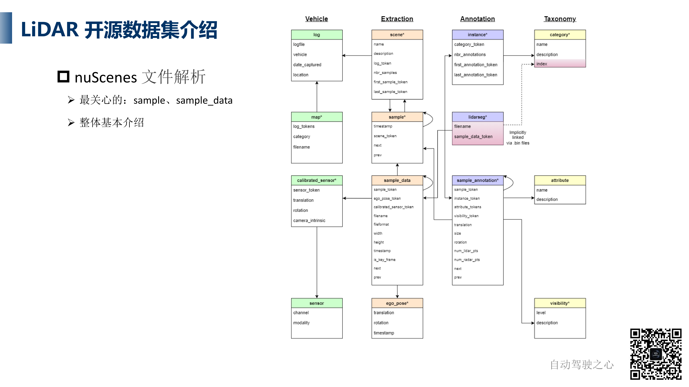

### 性能评估

#### 评测方式

网络会输出一系列的Box，我们需要先进行匹配然后进行计算，使用一些比较好的匹配算法去匹配标签Box和输出的Box（当然也会有一些漏检和错误出现的预测）

### 点云数据增强与处理

 点云数据增强，就是通过对点云数据进行一系列变换和修改，生成有别于原始数据特征的点云样本，以丰富训练数据从而提高模型的泛化能力。

点云数据增强出现的原因为：

- 点云数据的样本数量较少
- 点云数据的多样性不足

主要方法为

- 不改变点云内部的组成，只改变整体的空间特性（整体旋转、缩放等）
- 改变点云内部的组成情况（采样等）

#### 旋转、缩放、平移

这是最经典的数据增强方法，可以分为整体变换和个体变换两种方式，前者对整个点云数据进行处理，后者只对一些个体对象进行处理，比如说将某个车的点云进行单独旋转，将横向摆放的车辆换为纵向摆放，增加车辆信息的多样性

或者使用整体变换对道路尺寸进行缩放，否则模型可能认为道路尺寸都是一致的

不过缩放和旋转都是有限制的，不会变换的特别大

#### 点云数据处理

点云虽然本身就是无序的，但是在同一个数据集中是相似的顺序或者说相对有序，因为一个数据集中的点云数据都是同样的传感器获取的，所以我们需要真正的打乱，减少这种无用的先验知识，降低过拟合，提高模型的鲁棒性

随机Shuffle是一个数据处理的操作，其发生在数据增强之前，除此以外还有两类常见处理操作，也会跟随机Shuffle同期进行

- Mask Point and Boxes outside range
- 随机采样

在采集数据的时候可能范围很大，但是在训练的时候并不会使用那么大的范围，就会进行删减，去掉范围外的点云和边界框，但是评估的时候反而会考虑，会导致模型的性能因此下降一些

随机采样在基于点的方法中经常性使用，直接对点进行处理，将点云数量降低到一个程度

上面的操作都是出现在Data Processor中的，在数据增强之前出现的

#### Database（GT） Sampling

"Database Sampling"（数据库采样）是一种数据增强技术，旨在通过从预先构建的对象数据库中采样和插入新对象到现有场景中，增加训练数据的多样性和复杂性。这种方法特别适用于深度学习模型，实现前景点和背景点之间的更好平衡，可以显著提高模型对于不同对象、不同尺度、不同位置和不同密度分布的适应能力和鲁棒性，

实际上就是，把一个大数据集中的行人、车辆或者其他对象的点云数据，插入到当前场景的点云中，导致原有场景中多出了一些对象，以此增强场景的多样性

工作流程如下

1. **构建对象数据库**：首先，需要构建一个包含多种对象（如车辆、行人、树木等）的点云数据库。这些对象是从各种场景中预先提取出来的，并且包含了它们的三维点云表示。每个对象通常会包含有关其位置、尺寸和方向的元数据。
2. **采样与插入**：在训练模型时，从数据库中随机选择对象，并将它们插入到当前训练场景的点云数据中，并且将标签添加到当前采样场景的字典中，而不是添加到标签文件中（添加到文件中会很复杂）。这个过程可以通过调整对象的位置、旋转角度和尺寸来确保对象在新场景中的自然融合。插入的对象可以根据特定规则或随机选择的方式来增加场景的复杂性和多样性。
3. **避免遮挡和碰撞**：在插入过程中，需要确保新加入的对象不会不自然地遮挡场景中原有的重要特征，或者与场景中已有的对象产生不合理的碰撞。这通常通过设置一些规则或使用空间检测算法来实现。

### 数据流

#### 训练数据流

1. 初始化数据集和 DataLoader，其中数据集部分框架已经有了一些模板，比如说`kitti_dataset.py`中就定义了 KITTI 数据读取的方式，还可以定义读取数据集的情况，比如说批量大小等，记得一定要匹配数据集的具体情况
2. 初始化模型 -Detector3DTemple 和各个模块（模块都基于 `nn.module` ），Detector3DTemplate中已经写好了很多模模型（在OpenPCDet的逻辑中，每个模型称为一个Detector，每个Detector中都有若干模块），我们直接使用即可，也可以自定义，相对二维的模型更加复杂；我们可以根据config文件配置模型的架构和参数
3. 模型参数、学习率等超参数初始化，比如说体素大小、点云范围等
4. 训练模型：前向传播，依次通过各个模块
5. 损失计算，然后反向传播更新梯度


Detector3DTemplate模板类在 `pcdet\models\detectors\detector3d_template.py` 中尽显定义，继承 `nn.module` 类，其中

```python
self.module_topology = [
    'vfe', 
    'backbone_3d', 
    'map_to_bev_module', 
    'pfe',
    'backbone_2d', 
    'dense_head',  
    'point_head', 
    'roi_head'
]
```

定义了常用的模块，这些会按照固有的顺序进行执行

- vfe：体素化点云的模块
- backbone_3d：三维的骨干网络
- map_to_bev_module：投影到BEV空间下
- backbone_2d：在BEV空间下进行检测的网络
- pfe：与vfe相似，对点云的处理方法，针对纯点云的处理，不是必须的一个过程
- dense_head：得到初步的检测结果，接受2D骨干网络的特征
- point_head：进行二阶段进一步修正的时候使用
- roi_head：进行二阶段进一步修正的时候使用

所以在初始化的时候需要将这些模块都初始化，然后会在函数 `build_networks` 中（上图左侧函数）调用模块构建函数（例如三维骨干网络的构建函数`build_backbone_3d`，此函数如上图右下所示）构建这些网络（包括初始化等），然后分别将对象添加到列表中便于前向推理

具体的构建模块方法，就是使用一个具体的函数，流程如下

1. 查看传入的配置文件，检查是否有模块名称，如果没有则不构建
2. 定义函数的基本参数和属性，比如说通道数等

#### 推理数据流

在前半部分初始化环节与训练的数据流一致，然后加载训练好的模型权重，并且设置模型为验证模型，然后进行前向传播，得到结果后只进行匹配和计算AP指标等表现，衡量模型效果

### 可视化

可视化工具有 Open3D、mayavi.mlab 和 PCL，检测框的代码可以直接使用 OpenPCDet 的，这个代码是基于 Open3D 实现的

Open3D的可视化流程，就是先通过模型得的预测边界框，然后将其和点云一起送到可视化函数中显示即可，文件为 `tools\demo.py`

## OpenPCDet基础模块

OpenPCDet是OpenMMLab发布的开源点云目标检测软件框架，可以说是非常主流的框架，接下来介绍如何使用这些框架

### VFE模块：Voxel Feature Encoding Layer

这个模块的作用是从点的特征提取体素特征，最早由 VoxelNet中提出，可以说是点云体素化的开山之作

方法是对点云进行分区域Grouping或者说组队，分成一个个方块，每个Group中有一些点，并且会进行随机下采样得到特征，减少点的数量，并且尽可能使得各个方块中的点数量均衡

经过如上处理得到了 Point-wise Feature，这个作为输入送入编码器，编码器实际上前面部分是 VFE 层的堆叠，每个 VFE 层可以理解为使用全连接层处理输入，然后进行拼接（Concat），这样子就可以保留原始点云信息和处理后的点云特征，这样子点云特征会越来越丰富，而不是会逐渐丢失

然后经过一个全连接层，之后进行最大池化，留下特征最明显的代表体素网格的特征


不过总体来说，这个流程有些复杂，所以 OpenPCDet 使用了更简单的流程来实现，并且不会降低效果，其逻辑如下

1. 调用Spconv库（一个稀疏卷积库）的points_to_voxel生成体素网格，这里的操作相当于完成了Grouping操作，可以获取每个点所属的网格
2. 调用各类VFE方法进行从网格内点特征到体素特征的计算
3. 简化了VoxelNet的voxel特征计算过程（meanVFE、DynamicVFE）
4. VFE模块的输出为【以体素网格为维度的特征】

OpenPCDet 的 VFE 方法（更简单快速）

1. meanVFE：以每个 Voxel 为单位，对内部点对应的特征进行求均值，对于空 Voxel 进行点云数量强制约束为1，然后基于Voxel内部点的数量对特征求平均，但是这种方法忽略了体素内点的分布和关系，只不过大多数情况下足够达到预期

2. DynamicVFE：各个 Voxel 网格内点的数量分布特别不均匀的话就需要这个方法，其会动态扫描每个 Voxel 内点的数量并且求均值，这种方法引入了学习到的参数来动态地编码体素内的点云特征（或者说是自适应大小的Grid网格来划分），而不是使用简单的统计方法（如平均或最大池化）

3. PillarVFE：这是专门用于Pillar-based方法的，可以视为特殊的 Voxel 网格（高度维度是固定的），或者说是 XY 网格平面上的一个个柱体，柱体高度是点云整体的取值范围（考虑车辆和行人的平均高度），然后去计算柱体中所有点的特征

   比如说，平面上总共有 M 个柱体，每个柱体中有32个点，每个点添加十个维度的位置编码，编码分别为：每个点的坐标，每个点的位置到Pillar中所有点坐标均值的偏移量，每个点的位置到Pillar几何中心的偏移量，然后还有一个不太重要的特征，如此就得到了形状为(M,32,10)的张量，如果Pillar中的点不够，则需要补充虚构的特征为0的点，然后在位置编码上 Mask 掉

   最后，使用简化版的 PointNet 提取每个 Pillar 的特征，得到 (M,64) 的张量

### 3D Backbone

在 VFE 模块得到 Voxel Feature 之后，3D骨干网络会利用稀疏卷积来对其进行处理和进一步的特征提取，将基于空间形状等的信息转化为稀疏特征，spconv 的好处就是，忽略掉了空的体素网格，只对内部有点的Voxel进行处理

具体的卷积操作实现，首先就是 VoxelBackBone8x，8表示下采样的倍率，具有五层稀疏卷积层，也会输出多尺度的中间特征，并且可以输出稀疏特征用于后续模块，是最常用的 3D 稀疏卷积模块，用于SECOND和PV-RCNN等经典模块

其次就是类似的 VoxelResBackBone8x(Sparse Residual Convolution)，只不过是采用了残差思想，在输出中保留了原始输入信息便于长期的记忆学习，最后就是类似 UNet 的 Sparse UNet Convolution (UNetV2)，可以获得更多尺度的信息

当然，这些是基于体素方法的，也有基于纯点云的网络模块，比如说最经典的 PointNet++ 和相应的 PointNet2MSG 骨干网络，这个模块会调用 PointNet 代码库中的 SA(set abstraction，进行采样和组队) 和 FP(feature propagation) 模块实现，输出也是点云特征

### 2D BackBone

如果是基于 Voxel 的方法，就需要使用二维网络进一步进行处理，否则稀疏特征无法直接投影到 BEV 平面，步骤如下

1. Map to BEV：稀疏特征稠密化，然后在 Z 轴方向上压缩（也可以增加在 Z 轴上的感受野）
2. 特征提取：得到的特征很类似二维图像的特征了，可以进行多层的特征提取，可以根据config文件的参数构建卷积与反卷积层，最终输出的特征为 `spatial_features_2d`

Point 和 Pillar 的方法，在获得三维特征向量之后，就会直接输入专门的 Point 或者 Pillar 类型的检测头中获得预测结果，就不需要转换为二维特征

Voxel 这种方法主要是为了提高检测效率，所以采用了不一样的流程

### 点云Dense Head

#### 理论概念

使用 2D BackBone 得到特征之后，就可以使用 Dense Head 进行进一步处理，可能是初步提出 Proposal ，然后后面的模块会进一步优化，也可能是直接输出结果进行损失计算，前者实际上就是 RPN 模块，后者利用两个不同的网络分支对目标对象进行类别预测和检测框预测

首先看基于Anchor进行预测+修正的过程，比如说我们得到了 (B,384,248,216) 的二维特征张量，384是通道数量，248和216是长宽，然后分别使用两个网络预测类别和检测框，数据集有三个类别，类别使用 one-hot 向量，检测框使用7维向量 [x, y, z, w, l, h, rt]，分别是坐标、长宽高和旋转角

预测的结果包括了两部分，即分类和边界框，每个部分由一个单独的网络分支输出，分类的输出是 (B,248,216,18) ，边界框的输出是 (B,248,216,42)，数量是这样计算的：假设有三个类别，对每个类别我们预测两个边界框，每个 Anchor 都有事先设定的两个方向（旋转角度分别为0度和90度，或者说横向一个、纵向一个），然后我们不知道这个位置具体是什么类别，所以每个检测框有一个三维的向量进行分类预测，总共就有18维的长度；42是六个检测框每个有七个检测框属性，加起来有42维

不过注意一下，这里的七个属性并不是检测框真实的长宽高，而是相对原始锚框的编码后的值，包括中心的偏移和尺寸的偏移，方便我们在计算 Loss 时不会出现偏差，比如说在长宽高和位置上尺度可能不一致，会影响学习效果，所以会使用编码的方式进行缩放到 0-1 之间的同样尺度的小数上

这里会利用 assign_targets 函数对 Anchors 分配 GT boxes（或者说匹配，后面详细讲解），匹配之后计算 loss（由 cls_loss, reg_loss, dir_loss 加权构成）

有了这些信息之后，我们就可以知道怎么去基于 Anchor 进行预测

#### OpenPCDet处理方法：基于 BEV 的 Dense Head

在 OpenPCDet 中，基于 BEV 的 Dense Head 主要是`AnchorHeadTemple` 和 `AnchorHeadSingle` 来实现具体的检测头，模板的网络结构是这样的：

- 输入是 2D BEV Feature，特征由 3D Voxel Feature 压缩而来
- 有三个分支卷积网络：conv_cls，conv_box，conv_dir_cls(optional)，分别预测类别、边界框偏移量和检测框朝向网络（专门去分类检测框的朝向，判断边界框是正前方还是正右方，不是必须的）
- 有了三个分类结果之后，我们使用 `Assign_target` 对每个锚框分配 GT Box 或者说 Target，分配流程是这样的，每个位置有一些锚框，如果这个位置有 GT Box，我们就认为这里有一个锚框是可以匹配的，就被分配到 label 向量（或者说设置为1），没被匹配的位置的 label 信息就是0，这个权重会进入到 Loss 计算的
- 我们找到匹配了 Label 的位置的预测结果，然后对对应的 GT Box 的位置和长宽高等进行同样的编码，然后去进行损失计算，分类 Loss 也是类似的
- Loss 分别为 Focal Loss（分类用，RetinaNet，缓解类别不平衡问题）、SmoothL1Loss（检测框损失）、CrossEntropyLoss（方向分类Loss）

#### OpenPCDet处理方法：基于 Points 的 Dense Head

基于点云的特征是可以直接送到检测头中进行预测的，对应的模板类是 `PointHeadTemplate` 和 `PointHeadBox` 不需要经历二维骨干网络的，而且处理方法是对每个点进行预测，所以会在类别上有 (N,C) 形状的输出，N 是点云特征数量，C 是类别数量，在边界框上有 (N,7) 的输出，7表示边界框的偏移量属性

首先我们知道 GT Box 是一个盒子，我们会先判断点是否在盒子内部，以此来划分其为前景和背景，通过 `Assign_Targets` 函数来实现，如果点在 Box 内部，函数还会为其分配类别和盒子的大小

- Point_cls_labels：点所属分类的标签，0为背景，1、2等为对应的边界框的类别
- Point_box_labels：点所对应的 GT Box 的编码信息，只有前景点有，背景点默认全为0

有了这两个信息之后，就可以计算损失然后进行反向传播了，损失有以下几种：

- 对计算前景点背景点分类的损失
- 对前景点对应的 GT 和 Prediction 的损失
- 都是点维度的计算，然后最终进行求和和平均处理

### Target Assigner

这是很重要的函数，要分配 GT Box 和预测值的对应关系，不过对于 Voxel 方法和 Point 方法，实现上会有区别

我们先看 Point 方法，Point 方法相对简单，因为预测是对每个点生成一个检测框，分配的话直接判断每个点是否在某个 GT Box 内部即可，因为作为前景点的点云所生成的预测框，大概率和对应的 GT Box 有很高的重合度，那么就可以直接计算损失了

AxisAlignedTaregtAssigner （MaxIoUAssigner）

- 最基础、暴力的Label分配方法，去计算每个 GT 和 Anchor 之间的 IoU，根据预先设定的阈值来确定正负样本，并且找出 Anchor 和 GT Box 匹配程度最大的那一组，而且多数 Anchor 不会有对应的 GT Box，这种就是多余的，计算损失的时候不会考虑
- 比如说有 5 个 Anchor，2 个 GT，进行两两配对，计算 IoU是否超过阈值，我们可能发现只有 Pred 1 匹配上了 GT 1，但是 Pred 2-4 都匹配上了 GT 2，所以我们就需要计算四次 Loss，也就是实际上计算的是那些和 GT Box 匹配上的 Anchor，不论这些 Anchor 是否彼此冗余
- 缺点：可能会忽视极小目标的匹配度（Anchor容易被同一位置的较大GT匹配走）

ATSSTargetAssigner

- 修正上一个方法的一些缺陷，比如说在同一个地方有两个不同大小的 GT，那么在这里的 Anchor 大概率会被较大的 GT 匹配上，因为会更大的概率出现高 IoU 值，这样子匹配就不均匀，所以要多关注较小的 GT，其方法就是在每次匹配中动态调整阈值
- 先根据离GT的中心距离生成一些 Anchor 正样本的候选集合，再根据该集合的IoU统计分数确定该次分配的最终阈值

\- 优点：通过使用更少的anchor更高效、准确地完成Label匹配，不容易忽略小的 Anchor 和 GT

## 其他

### OpenPCDet框架

OpenPCDet是OpenMMLab开发的一个点云三维目标检测的开源代码框架，支持多种主流数据集，代码结构清晰简单，并且支持我们自己定义新的数据集和模型；同类型的框架有MMDetection3D

参数中注意一下，ckpt 是只使用模型参数，学习率等会重新初始化，而 pretrained_model 会继承训练参数（学习率等）

我们看一下`eval.py`是如何书写的，这个函数主要是用来做精度评估，路径为 `pcdet\datasets\kitti\kitti_object_eval_python\eval.py`，这个文件只调用了一个外部函数，就是计算两个相交四边形的相交面积

```python
@numba.jit
def get_thresholds(scores: np.ndarray, num_gt, num_sample_pts=41):
    scores.sort()
    scores = scores[::-1]
    current_recall = 0
    thresholds = []
    for i, score in enumerate(scores):
        l_recall = (i + 1) / num_gt
        if i < (len(scores) - 1):
            r_recall = (i + 2) / num_gt
        else:
            r_recall = l_recall
        if (((r_recall - current_recall) < (current_recall - l_recall))
                and (i < (len(scores) - 1))):
            continue
        # recall = l_recall
        thresholds.append(score)
        current_recall += 1 / (num_sample_pts - 1.0)
    return thresholds
```

其中，`scores`参数指定是 `np.array` 格式，这个参数的意义是overlap或者说就是IoU，比如说有八个标签七个预测，那么这个数组的形状就是7x8，也就是两两之间进行重叠率计算，筛选出来重叠率最高的那些

然后我们默认采样41个间隔去计算PR曲线的面积

### 配置文件

配置文件目录为 `tools\cfgs`，下面的配置文件是按数据集进行分类的，或者说是在不同数据集上进行训练的模型的配置文件，然后我们以 VoxelNeXt 为例进行学习，文件为 `tools\cfgs\nuscenes_models\cbgs_voxel0075_voxelnext.yaml`，为了便于理解，文件内容会做一些简化和删减

```yaml
CLASS_NAMES: ['car','truck', 'bus']#要检测的类

DATA_CONFIG:#数据配置参数
    _BASE_CONFIG_: cfgs/dataset_configs/nuscenes_dataset.yaml#数据集配置文件位置
    POINT_CLOUD_RANGE: [-54.0, -54.0, -5.0, 54.0, 54.0, 3.0]#点云范围
    INFO_PATH: {
        'train': [nuscenes_infos_10sweeps_train.pkl],
        'test': [nuscenes_infos_10sweeps_val.pkl],
    }#info文件目录
    DATA_AUGMENTOR:#数据增强手段
        DISABLE_AUG_LIST: ['placeholder']
        AUG_CONFIG_LIST:
            - NAME: gt_sampling#第一种手段
              DB_INFO_PATH:
                - nuscenes_dbinfos_10sweeps_withvelo.pkl
              USE_SHARED_MEMORY: False  #True  # set it to True to speed up (it costs about 15GB shared memory)
              DB_DATA_PATH:
                - nuscenes_dbinfos_10sweeps_withvelo_global.pkl.npy
              PREPARE: {
                filter_by_min_points: [
                    'car:5','truck:5', 'construction_vehicle:5', 'bus:5', 'trailer:5',
                    'barrier:5', 'motorcycle:5', 'bicycle:5', 'pedestrian:5', 'traffic_cone:5'
                ],
              }

              SAMPLE_GROUPS: [
                'car:2','truck:2', 'construction_vehicle:2', 'bus:2', 'trailer:2',
                'barrier:2', 'motorcycle:2', 'bicycle:2', 'pedestrian:2', 'traffic_cone:2'
              ]

              NUM_POINT_FEATURES: 5
              DATABASE_WITH_FAKELIDAR: False
              REMOVE_EXTRA_WIDTH: [0.0, 0.0, 0.0]
              LIMIT_WHOLE_SCENE: True

            - NAME: random_world_flip#对整个场景翻折
              ALONG_AXIS_LIST: ['x', 'y']

            - NAME: random_world_rotation#整体旋转
              WORLD_ROT_ANGLE: [-0.78539816, 0.78539816]

            - NAME: random_world_scaling
              WORLD_SCALE_RANGE: [0.9, 1.1]
            
            - NAME: random_world_translation
              NOISE_TRANSLATE_STD: [0.5, 0.5, 0.5]
              

    DATA_PROCESSOR:#预处理，比如说删除范围之外的点云、点云随机化和 Voxel 化
        - NAME: mask_points_and_boxes_outside_range
          REMOVE_OUTSIDE_BOXES: True

        - NAME: shuffle_points
          SHUFFLE_ENABLED: {
            'train': True,
            'test': True
          }

        - NAME: transform_points_to_voxels#体素化，并且设置参数
          VOXEL_SIZE: [0.075, 0.075, 0.2]
          MAX_POINTS_PER_VOXEL: 10
          MAX_NUMBER_OF_VOXELS: {#最大体素数量
            'train': 120000,
            'test': 160000
          }


OPTIMIZATION:
    BATCH_SIZE_PER_GPU: 4
    NUM_EPOCHS: 20

    OPTIMIZER: adam_onecycle
    LR: 0.001
    WEIGHT_DECAY: 0.01
    MOMENTUM: 0.9

    MOMS: [0.95, 0.85]
    PCT_START: 0.4
    DIV_FACTOR: 10
    DECAY_STEP_LIST: [35, 45]
    LR_DECAY: 0.1
    LR_CLIP: 0.0000001

    LR_WARMUP: False
    WARMUP_EPOCH: 1

    GRAD_NORM_CLIP: 10
```


```yaml
MODEL: #模型配置
    NAME: VoxelNeXt#模型名称
//农行
#VFE模块
    VFE: 
        NAME: MeanVFE

    BACKBONE_3D:
        NAME: VoxelResBackBone8xVoxelNeXt

    DENSE_HEAD:
    #因为三维骨干网络实际上输出的是稀疏特征，因此作者自己编写了一个 head 来代替 dense head 的位置进行检测
    #文件位于pcdet/models/dense_head/voxelnext_head.py
        NAME: VoxelNeXtHead
        CLASS_AGNOSTIC: False
        INPUT_FEATURES: 128

        CLASS_NAMES_EACH_HEAD: [
            ['car'], 
            ['truck', 'construction_vehicle'],
            ['bus', 'trailer'],
            ['barrier'],
            ['motorcycle', 'bicycle'],
            ['pedestrian', 'traffic_cone'],
        ]
        
        SHARED_CONV_CHANNEL: 128
        KERNEL_SIZE_HEAD: 1
        
        USE_BIAS_BEFORE_NORM: True
        NUM_HM_CONV: 2
        SEPARATE_HEAD_CFG:
            HEAD_ORDER: ['center', 'center_z', 'dim', 'rot', 'vel']
            HEAD_DICT: {
                'center': {'out_channels': 2, 'num_conv': 2},
                'center_z': {'out_channels': 1, 'num_conv': 2},
                'dim': {'out_channels': 3, 'num_conv': 2},
                'rot': {'out_channels': 2, 'num_conv': 2},
                'vel': {'out_channels': 2, 'num_conv': 2},
            }

        TARGET_ASSIGNER_CONFIG:
            FEATURE_MAP_STRIDE: 8
            NUM_MAX_OBJS: 500
            GAUSSIAN_OVERLAP: 0.1
            MIN_RADIUS: 2

        LOSS_CONFIG:
            LOSS_WEIGHTS: {
                'cls_weight': 1.0,
                'loc_weight': 0.25,
                'code_weights': [1.0, 1.0, 1.0, 1.0, 1.0, 1.0, 0.2, 0.2, 1.0, 1.0]
            }

        POST_PROCESSING:
            SCORE_THRESH: 0.1
            POST_CENTER_LIMIT_RANGE: [-61.2, -61.2, -10.0, 61.2, 61.2, 10.0]
            MAX_OBJ_PER_SAMPLE: 500
            NMS_CONFIG:
                NMS_TYPE: nms_gpu
                NMS_THRESH: 0.2
                NMS_PRE_MAXSIZE: 1000
                NMS_POST_MAXSIZE: 83

    POST_PROCESSING:
        RECALL_THRESH_LIST: [0.3, 0.5, 0.7]

        EVAL_METRIC: kitti
```

- 


# Voxel-based 方法

## VoxelNet

这是最早的点云体素化的三维目标检测论文，并且端到端和单阶段

基于 RPN 进行目标检测的算法，都有一个要求：数据是稠密的，比如说图像特征，但是明显点云特征是稀疏的，是无法直接用 RPN 方法输出候选区域的，所以就需要找到适合点云的区域网络，或者将点云转化为稠密特征

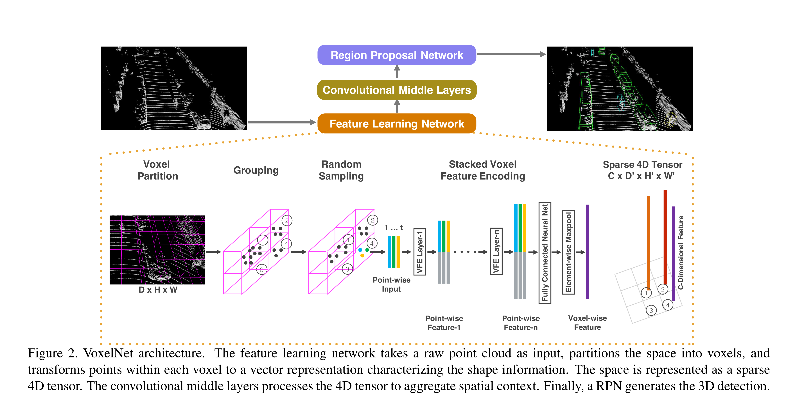

网络的整体架构如上图所示，先是点云体素化，然后是体素特征编码器的堆叠，最后得到稀疏的特征张量，最后使用这个特征张量进行目标检测

首先就是进行体素划分(Voxel Partition)，将所有的输入点云，使用相同尺寸的立方体或者说体素对其进行划分，这里使用一个深、高、宽分别为 (D,H,W) 的大立方体，或者说体素张量，去表示输入点云

然后Grouping（分组），一个 Voxel 所代表的空间中有一些点云，会进行统一处理，或者可以理解为先单独处理每个 Voxel 内的所有点云，得到一个可以表示此处特征的向量，然后统一处理所有的向量

之后是 Random Sampling（随机采样），为了减少不同 voxel 间点数量差距带来的不平衡和偏差，采取对每个 voxel 选取 T 个点（通过随机取样选取）进行后续处理的方法。

接下来就来到了核心的 VFE 模块，点云向量会包括四个属性，位置和反射强度，然后计算每个 Voxel 中的点云位置均值 $(v_x,v_y,v_z)$，然后计算得到七维向量，增加了三个位置偏移量的属性，这就是用于输入 VFE 模块的向量
$$
V=\{p_i=[x_i,y_i,z_i,r_i]^T\in \mathbb{R}^4\},i=1,\cdots,t\\
V_{in}=\{\hat{p}_i=[x_i,y_i,z_i,r_i,x_i-v_x,y_i-v_y,z_i-v_z]^T\in \mathbb{R}^7\},i=1,\cdots,t
$$
向量会不断经过全连接层（包括线性层、批量归一化饿 ReLU），得到 Point-wise Feature，然后新向量分为两个信息流，一个不做处理，一个进行 Element-wise MaxPooling 操作，然后将二者拼接起来（如下图所示），实际上这个 Element-wise MaxPooling 操作，就是将点云特征向量，按照点的数量的维度进行最大池化，这样子不论这个 Voxel 内有多少点云，都只会提取特征最显著的部分并且得到一个固定大小的特征表示也就是 Locally Aggregated Feature，从而进行后面的卷积操作

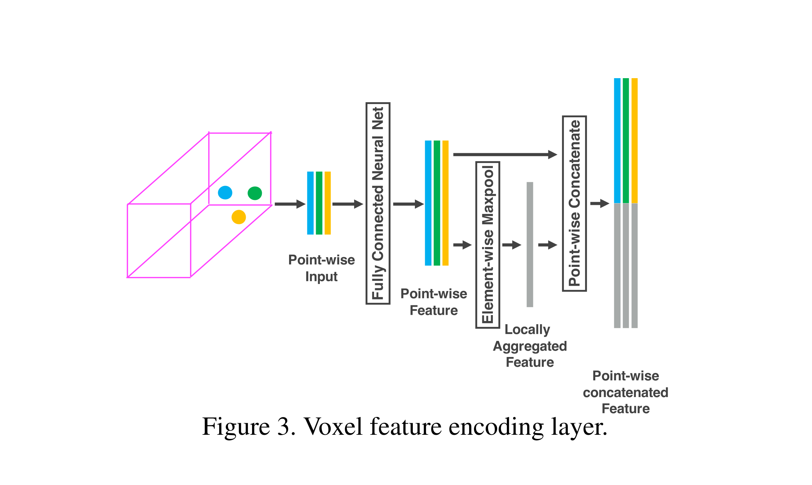

经过了若干个（原文中是两个，一个是7-32维，一个是32-128维）VFE 之后，就得到了一个拼接特征，然后对这个特征进行全连接层和池化，得到了一个特征向量，然后使用这个向量表示这个 Voxel 的特征，最终得到了一个 Sparse Tensor 的表示，稀疏的原因是原始数据中很多地方没有点云数据，在原始论文中，尺寸为（128x10x400x352）,128表示特征维度，后面是 Voxel 的尺寸

然后我们对得到的四维张量进行进一步的三维的卷积和反卷积，类似 FCN 网络，架构如下图所示，这些卷积层称为中间卷积层，可以进一步聚合基于体素的特征，增加上下文信息来描述形状，最后得到一个通道数量更多且空间分辨率更小的特征图

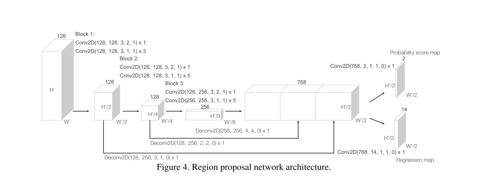

在得到输出的张量之后，就可以使用 RPN 进行最终输出了

当然为了适应点云的稀疏性，在GPU计算的时候才有了一些小技巧

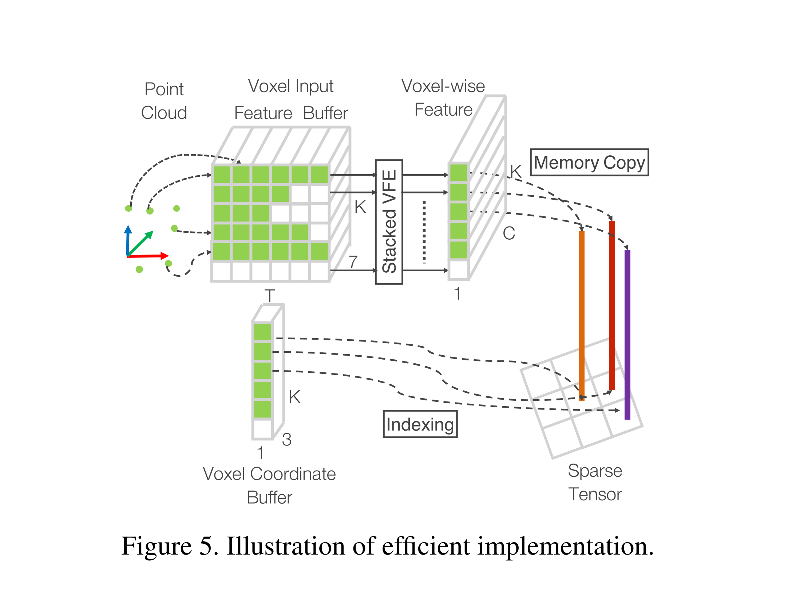

## SECOND

我们知道体素类方法离不开 VoxelNet，其可以将点云转化为体素特征，从而进行进一步的投影或者检测，但是其中三维卷积部分的开销过大，而且很多网格中没有点，但是还是需要进行计算，所以 SECOND 的改进思路就是提高卷积效率，核心就是使用稀疏卷积代替三维卷积，当然也额外提出了一些数据增强的方法，比如说提出了 GR Sampling 和转向角的损失函数

SECOND的结构如下，最开始也还是体素化处理和 VFE 体素特征提取，然后送入稀疏卷积层（这里是创新点所在）进行处理，后面就是 RPN 和检测头，检测头多了一个损失，用来学习朝向角


当然，其中最核心的还是稀疏卷积，其原理如下图所示，核心思想是使用哈希表加速计算，只计算非零元素的卷积操作


红色的张量是我们要计算的特征，其中只有阴影部分是非空的，当我们使用卷积核（蓝色框）去进行卷积操作的时候，我们会发现一些地方完全不需要进行卷积，比如说 5x5 张量左下角部分就不会涉及任何有意义的卷积，只有涉及阴影部分的区域的卷积才有意义，其他的地方需要排除掉（因为只是跟0元素进行卷积）

上图中，假设两个阴影部分分别为 P1 和 P2，卷积核为 3x3，特征图为 5x5，那么就需要先去计算$P_{out}$，也就是卷积核在此特征图上的输出，这个输出指的是所有的可能输出的位置，比如说这种情况下卷积结果也是一个 3x3 特征图，那么此处输出就是从九个坐标，从（0,0）到（2,2），然后去查询 P1 和 P2 分别对哪些输出位置有贡献或者说参与了计算

在上图中，P1 和 P2 分别参与了六个位置的输出计算，其中有四个位置是二者一起参与的，加起来是八个位置（在输出特征图中，仅有左下角元素是无意义的），这样就省去了一部分卷积运算，然后对

损失函数的设计也是一个亮点

首先是分类损失，我们知道每个点云特征向量都会生成一系列的 Anchor，实际上在整个场景中会生成成千上万个 Anchor，其中只有小部分会被分为正样本，更多的就是负样本或者背景点，导致正负样本非常不平衡，在 Binary Cross Entropy Loss 中会被放大，不利于学习，所以使用 Focal Loss


然后是角度回归的修正，在原本的 VoxelNet中，是直接对预测值和标签值的向量做 L1 Loss，但是有一些车辆的朝向预测是完全相反的，这就导致朝向角上的损失会非常大，甚至导致模型忽略了其他损失，所以作者使用了正弦函数，这样子在朝向完全相反的时候这部分损失是为零的，并且额外设置了一个朝向损失，来解决角度回归损失无法分辨前后朝向的问题

朝向损失具体是这样的：使用 softmax 损失，把朝向损失分割为两个维度的损失，一个维度是绝对方向（类似于直线方向夹角，在正负90度内），一个维度是解决是朝前还是朝后

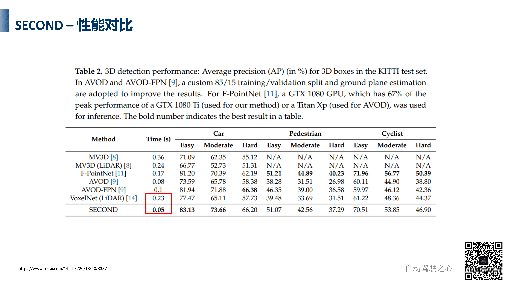

在性能上，SECOND 不但有着非常快的速度，并且在精度上也非常优秀

## Voxel R-CNN

### 背景

Voxel-base 方法的效率很高，但是精度稍有不足

Point-base 方法精度足够，但是 keypoint 特征提取过于耗时，而且 keypoint 过于重要，是保持高精度的关键，PV RCNN 结合使用了关键点特征提取，才可以达到那么高的精度

所以作者就想，是不是因为 PV RCNN 有两阶段的检测头，SECOND 只有一阶段的检测头，所以就精度够不上，于是作者就添加了一个基于 BEV 的检测头，发现 SECOND 模型在 easy 难度上可以精度超过 PV RCNN，但是在其他质量难度上还有差距，得出了结论：二阶段检测头是很有必要的提高精度的手段，在PV RCNN 中使用关键点特征提取来丰富空间点云中结构信息的操作有用且耗时

所以作者提出了一种新的方法，可以替代关键点特征提取手段来提取点云中的结构信息来提高精度，并且减少操作的耗时，这就是 Voxel ROI Pooling 模块，来进行二阶段检测框的修正

### 结构

网络结构如图所示，整体上是分为一二阶段的

1. 一阶段与 SECOND 非常类似，对点云输入进行体素化然后使用稀疏卷积层提取体素特征，然后特征投影到 BEV 平面得到二维特征，然后使用二维卷积和 RPN 方法进行候选区域的提出
2. 然后就是二阶段（蓝色框中部分），此阶段会尝试从体素特征中提取一些结构信息特征（会同时接受体素输入和候选区域），进一步优化区域信息并且输出最终结果，这里的核心就是 Voxel ROI Pooling，这里就与 SECOND 的BEV检测头不同，因为前者并没有采集三维空间中的结构信息，所以效果是不如 Voxel RCNN的

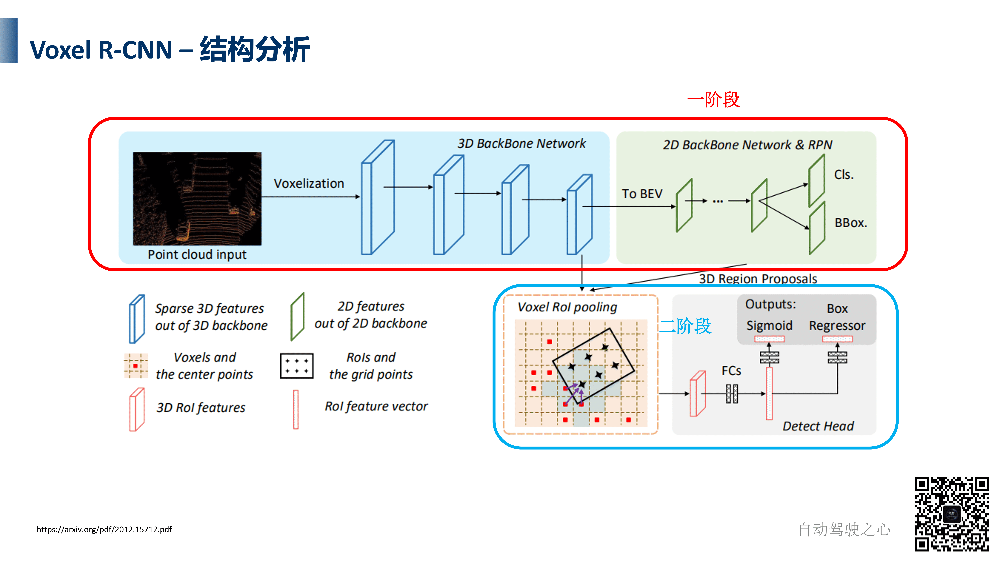

所以说 Voxel ROI Pooling 到底做了什么事情呢，首先作者提出了 Voxel Query 方法，让一个中心的Query Point，去采集周围较近的体素特征并且进行信息聚合，进行进一步的精细化，这类似于PointNet++ 中的 Ball Query 方法，但是对比 Ball Query的 O(N) 复杂度（N是所有非空体素数量），Voxel Query 的复杂度可以降低到O(K)，K是你要提取的最近非空体素的个数，大大降低了复杂度

Ball Query 是给定半径，搜索所有在半径内的体素或者点云，Voxel Query是基于已经分割好的体素空间，基于中心点位置，选择一些特定位置的体素，比如说三维体素空间中的以 Query Point 为中心的3x3x3的正方体，这样子只需要查找26次，然后选其中最近的 K 个特征，这样子就减少了计算


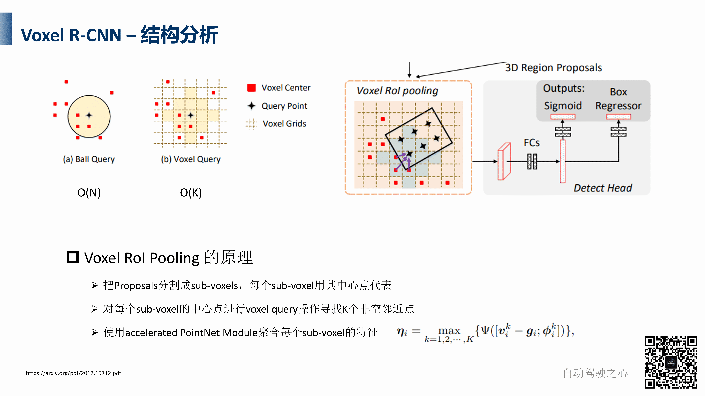

在 Voxel ROI Pooling 中，第一个输入就是一个个的检测框了，然后网络会将这些检测框分为一个个小的 sub_voxels 或者说是子体素网格，比如说上图中就分为了12个（实际上是两层），然后实际上每个子体素的中心点就是这个小体素的 Query Point，然后进行 Voxel Query寻找K个非空近邻点，使用 accelerated PointNet Module 进行特征聚合，公式如下
$$
\eta_i=\max \limits_{k=1,2,\cdots,K} \{\Psi(v^k_i-g_i;\phi^k_i)\}
$$
其中 $v_i^k$ 表示范围内第 k 个体素的坐标，其特征是 $\phi^k_i$，$g_i$​ 就是中心点 Query Point 的坐标，先使用 MLP 进行特征聚合（也就是函数 $\Psi$），然后使用 Max Pooling 提取最显著的特征，然后得到新的特征输出，这个特征图输出既包含了候选区域的特征，也包括了三维空间的结构信息，然后使用全连接层进一步输出最终输出

### 损失函数

此模型有两个损失，其中 RPN的损失与 SECOND 方法相似，都是分类损失和回归损失，只不过在计算回归损失的时候只会计算前景点（目标对象）的回归损失，如果是背景点则不会计算回归损失，最后除以场景中前景对象的数量进行平均

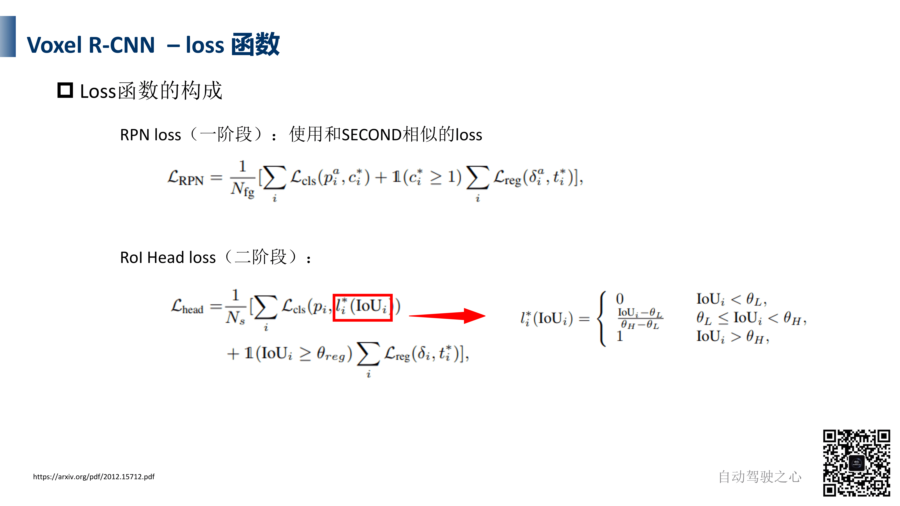

二阶段的损失则复杂一些，在分类损失部分，主要是计算一阶段的分类预测和 IoU 函数的损失，这里 IoU 函数是对二阶段的 IoU 做一个评估，判断是这样的：如果交并比小于背景阈值，就设置为0，认为这是背景；如果大于前景阈值，就设置函数为1，认为这是前景；如果介于中间就做一个线性计算，保证了结果永远在 0-1 之间；这样子可以让一阶段的 RPN 学习如何更好预测边界框

在回归损失部分，就是使用二阶段的输出和标签做损失计算了，并且只会在 IoU 大于一个特定阈值的情况下才会去进行计算，相当于剔除了背景点上的预测框的影响，只去关心正确的部分（或者说 IoU 比较大的部分）并且进行学习

### 表现

在保证了足够高的精度的情况下，速度有了巨大的提高，甚至精度超过了 PV-RCNN

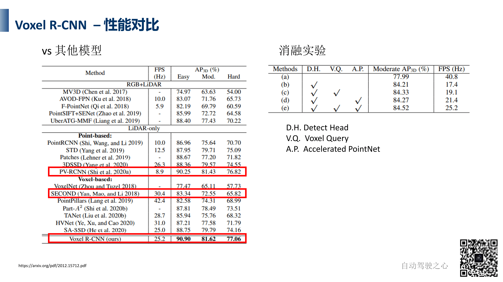

消融实验上也证明了这种方法的优秀，而且与其他的方法不会有冲突还可以相互配合

## VoxelNeXt

与 VoxelNet 很像

Voxel-based 方法的新瓶颈：需要将稀疏特征转换为2D稠密特征，以构建 anchor-based 或者 center-based 检测头，而这种 dense head显然不够高效，所以 VoxelNext 构建了一个完全稀疏的网络架构，不需要转换为稠密特征，并且一是提出了 additional down-sampling 来增大感受野，二是设计了 sparse max pooling 来节省检测头的计算量，同时可以避免使用 NMS

### 网络结构

我们看一下主流网络模型（左上角图），首先是体素化并且使用卷积得到稀疏特征，然后进一步转化为稠密特征，用于 BEV 投影或者 RPN 预测，然后得到预测结果，或者进一步进行精细化，在得到结果之后使用 NMS 进行匹配和损失计算等

此网络则不同，在得到 Voxel 特征之后，直接使用 Sparse Max-Pooling 直接得到需要或者说有用的体素，然后使用稀疏卷积或者全连接层进一步处理或者预测，这样子就会非常简洁，不需要 RPN 或者 NMS

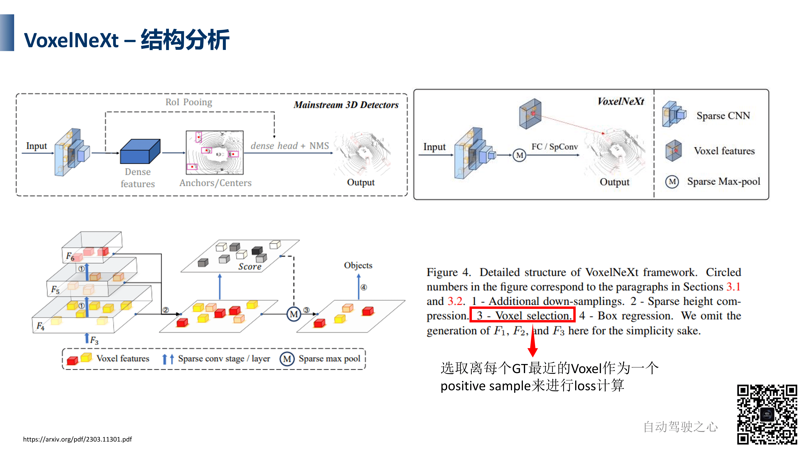

具体的流程是这样的：设置额外的下采样来增加稀疏卷积的感受野，得到更加丰富的特征输出，这样子可以弥补稀疏卷积中可能存在的信息不够丰富的缺陷；然后使用专门的稀疏高度压缩模块，将三维稀疏特征压缩到二维平面上（注意一下这里并不是 BEV Feature，还是稀疏的），这样可以实现减小搜索空间，然后使用 Sparse Max Pooling 操作，再基于二维平面上的特征的 Score （实际上就是对每个特征产生一个分类的分数）使用特征最显著的 Voxel 去产生检测框

最后，进行 Voxel Selection 做热力图损失计算，这个 Voxel Selection 有点类似于 Dense Head 中的 Target Assigner 操作，根据 Score 去选择离 GT 最近的那些 Voxel 作为一个 positive sample ，然后计算中间层的热力图（是对每一类绘制一个）进行 Loss 计算，可以在生成 Proposal 的过程中判断哪一些体素对生成检测框更重要

### 模块分析

接下来解析各个模块，首先是 Spatially Voxel Pruning（空间体素剪枝），在稀疏卷积网络中，下采样层会扩张所有的体素达到与卷积核同样的大小然后再去卷积，就如下图左上角所示，要把红色的点扩张一圈才可以卷积，这种操作应用到所有体素特征上的话是非常耗时的，所以这篇文章提出了一个想法，就是有选择性的扩张，因为在特征中，有大量的特征来源于背景点，这些背景点的特征对于预测是几乎没有帮助的，如果放弃对这些背景点的特征进行扩张，只去扩张重要的特征，就会降低检测框的数量并且不会对预测产生多少影响，核心想法就是在下采样过程中只扩张更重要的 Voxel

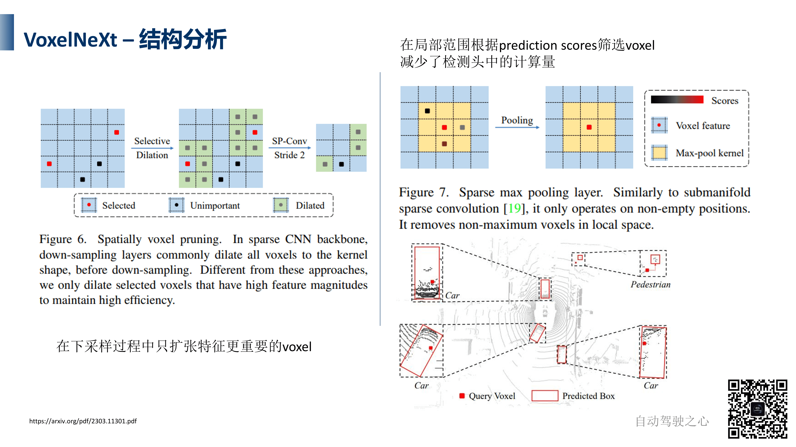

另一个操作就是用于替换 NMS 的 Sparse Max Pooling Layer，NMS 主要是在后处理环节中去掉冗余预测框的，但是非常耗时，所以就想在送到检测头之前就去处一些无用的 Voxel

VoxelNeXt 的检测框是这样生成的：在体素特征图中，有一个车辆对象，离它最近的体素就称为 positive sample，我们对这个体素去生成一个检测框，在这个过程中我们需要去筛选哪些体素是要去生成预测结果的，所以可以在 Sparse Max Pooling 中可以筛选掉一些不重要的体素，只保留最重要的那些体素去生成边界框（就比如说上图右上的红色体素），筛选标准就是 Score

当然，实际上分数最高的那个体素未必在检测框的正中心，甚至可能在检测框的外面，比如说上图右下的行人，用来预测的特征点就不在检测框内，当然这未必是一个坏事，作者团队在可视化过程中发现，分数最高的体素在检测框外面的话，反而可以更好的去生成检测框的大小和方向（或者说对方向更敏感），在检测框正中心的话反而因为对边的关注程度一致所以对方向不那么敏感

### Loss

这个的损失函数也是分类+回归两个部分，而且参考了二维检测中著名的 CenterNet 和三维的 CenterPoint，首先我们回顾预测框生成的部分，是使用 Voxel 生成的，所以会使用 Focal Loss 评估筛选出来的 Voxel 的准确度，这个操作与传统的 Target Assigner 是类似的，也就是把 GT 和 Anchor 去进行一个匹配，不过在这里是分配的 Voxel

我们会基于 GT 到周围 Voxel Feature 的距离去生成热力图（HeatMap），而且与 Voxel 越近，就会在 Voxel 处生成越大的热力图，对所有的 GT 进行热力图生成就得到了最终的 HeatMap，就可以知道哪里更热——也就是 GT 所在的那些地方，或者说模型更应该关注的地方，在模型推理过程中也会输出类似的热力图，这样子我们就可以跟使用标签计算得到的热力图进行 Loss 计算和对比进行学习，来判断 Voxel Selection 是否合理，这也是一个分类的过程，或者说这里热力图类似于一个中间层的类别标签

如果 Voxel 筛选的比较合理，就会根据筛选出来的 Voxel 特征进行生成检测框，然后与 GT 进行对比，使用回归损失进行学习

### 性能

当然其性能也是非常好的，在精度上超越了其借鉴的 CenterPoint

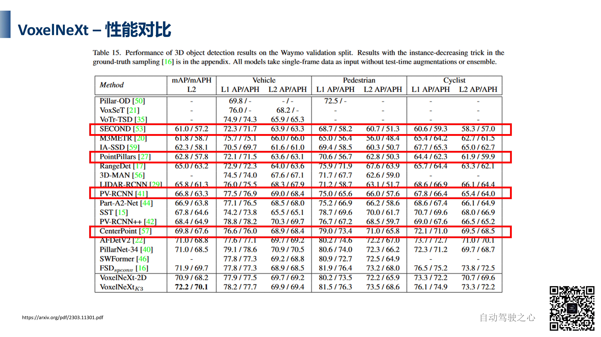

### 代码

实际上，代码上的实现方法与理论是要区别的

# Point-base 方法

## PointRCNN：点云目标检测算法

### 介绍

PointRCNN是CVPR2019录用的一篇三维目标检测论文，曾在KITTI的3D检测测试中排名第一，文章为[PointRCNN：3D Object Proposal Generation and Detection from Point Cloud][https://openaccess.thecvf.com/content_CVPR_2019/html/Shi_PointRCNN_3D_Object_Proposal_Generation_and_Detection_From_Point_Cloud_CVPR_2019_paper.html]，这是第一个两阶段的点云框架，先定位后精细化，与图像的两阶段目标检测算法思想类似


其两阶段的作用分别是：

- **第一阶段**：

  **目的**：分割前景点，并且生成 proposals

  **方法**： 通过使用PointNet++作为骨干网络，提取 point-wise feature vector（融合 context 信息），利用3D bounding box来生成ground-truth分割掩码，第一阶段分割前景点，同时在这些被分割出来的点中生成少些bounding box proposals。

  **核心思想**：学习point-wise 的特征来分割原始点云，在分割好的前景上生成3D 候选框。这样避免了在3D空间中使用大量预定义的3D框，极大地限制了3D建议框的搜索空间，从而减少计算

- **第二阶段**：

  **目的**：对生成的3D box进行微调

  **方法**：在3D proposals生成之后，用一个点云ROI pooling操作来处理第一阶段学习到的点。现存的3D方法都是直接估计全局box坐标，而作者的方法是将被池化的3D点转换到正则坐标，并且和来自阶段1的被池化的点的特征还有分割掩码结合，从而学习相对坐标微调。

  **优势**：充分利用了第一阶段分割和子网络提供的结果信息。

### 动机

基于点云的3D检测的困难主要在于点云的不规则性，常见3D检测的SOTA的方法：

1. 将点云投射到俯视图(AVOD)或者投射到前视图(MV3D)，利用2D检测的框架进行目标检测
2. 变成规则的3D voxels (VoxelNet)。

但这些都不是最佳的，而且投射的方法会遇到在量化过程中信息缺失的问题，并且三维卷积的计算量大。

后来有人提出PointNet，不将点云转换成voxels或其他的规则的数据结构来进行特征学习，而是直接从点云数据来学习3D表示，他们还在3D目标检测中应用了PointNet，从2D RGB检测的结果获得被截取点云，基于这个来估计3D bounding box（F-PointNet，视锥网络），但是这种方法过于依赖2D检测的表现，如果图像漏检或者重叠，都会带来较坏的结果。

面对这些情况，作者提出：在自动驾驶场景下，物体都在地面上，并且由于深度的不同物体点云都是可分离的，而且三维边界框标注可以提供语义分割信息（比如说在车辆边界框内的都是车辆的点云），但是直接在三维空间放 Anchor 是很麻烦且费时的，所以在原始点云上直接基于前景点分割的方式提出 Proposal

### 网络框架

整体的网络架构如下


这是一个两阶段的目标检测框架，第一阶段生成一些候选区域，第二阶段进行候选框的回归

- stage-1：基于点云分割的3D RPN

  

  使用PointNet++作为骨干网络（或者说Encoder和Decoder），提取point-wise feature vector，这些特征向量编码了每个点和周围区域的信息，然后区分前景点并且生成候选框

  （1）提取点云特征：使用PointNet++ 作为骨干网络提取特征point-wise feature vector

  （2）前景点分割，判断哪些是前景点：每个点的分类问题，由两个卷积层组成。输入是(bs,n,128)的特征，输出是(bs, n, 1)的mask（只是区分这个点是不是前景点）。由于背景点的数量远大于前景点数量，正负样本不均衡，所以分类误差损失函数选择使用focal loss，而且会把点的分割分数作为 Proposal 的质量分数，并且选一些高质量的点进行下一步的生成操作

  （3）基于bin区间的3D框生成：也是由两个卷积层组成。输入是(bs, n, 128)的特征，输出是(bs, n, 76)。3d目标检测里的bounding box，需要7个量来表示：[x,y,z,l,w,h,yaw]。这里用基于bin的预测方法使76个维度特征来代表这7个量，然后进行 NMS 操作，得到一批预选3d区域

  其中基于距离的NMS是这样处理的：

  - 在相机 0～40m距离内的bounding box，先取得分类得分最高的6300个，然后计算bird view IOU，留下IOU大于0.85的，到这里bounding box 又少了一点。然后再取得分最高的210个。
  - 在距离相机40～80m的范围内用同样的方法取90个。这样第一阶段结束的时候只剩下300个bounding box了。
  - 再送入stage-2进行置信度打分和bounding box优化。

- stage-2：基于bin区间的3d框回归

  

  3D box： ( x , y , z , h , w , l , θ ) 

  bin就相当于直尺上的刻度，用绿色大括号表示。这里设物理空间中0.5m是一个bin。通过分类的方式去预测每个点对于bounding box中心点偏移了几个bin（或者说预测中心点落在哪一个bin里面），而不是直接回归具体的位置，其中蓝色的是分割出来的前景点，紫色的是兴趣前景点，以兴趣前景点为例去进行预测

  旋转角也用这种基于bin的方法预测，是把π话分成若干个bin。由于bin是一个整数，还是无法精确定位，所以还需要预测中心点坐标在一个bin中的偏移量。

  此外，76维输出向量是如何对应7个参数的呢

  

  76维的前12维，x\_bin，是判断X轴的bin区间，判断中心点落在哪一个bin上，12维表示坐标轴正负各有六个bin，然后还有在每个bin上的回归，x\_res，也占了十二个维度，然后在XZ方向上都是如此操作，就占了48个维度

  但是在Y方向（或者说垂直方向）上没有这种划分，因为自动驾驶的目标物体都是在地面上的，所以不会出现太大的出入，只有一个一维回归

  然后YAW角也是基于bin的划分，12个bin区间和12个偏移量

  最后对长宽高也是有回归，占3维
  
  总的来说，就是先分类到某个具体的 bin 区间，然后进行回归确定具体的边界框，这样子精度更高

## 3D SSD

### 概述

3D SSD方法，原论文3DSSD: Point-based 3D Single Stage Object Detector，是一种借鉴二维SSD方法的

## CenterPoint：点云目标检测

### 概述

CenterPoint是一个点云目标检测的框架，借鉴了YOLO、SSD等单阶段二维目标检测框架的思想，直接检测隐式的物体中心，不需要候选框