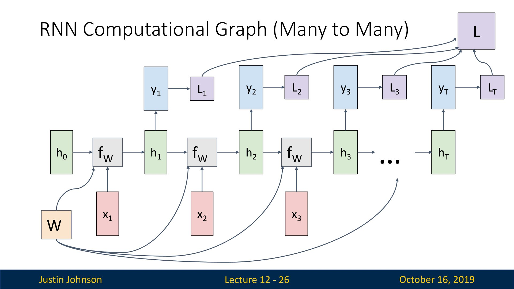
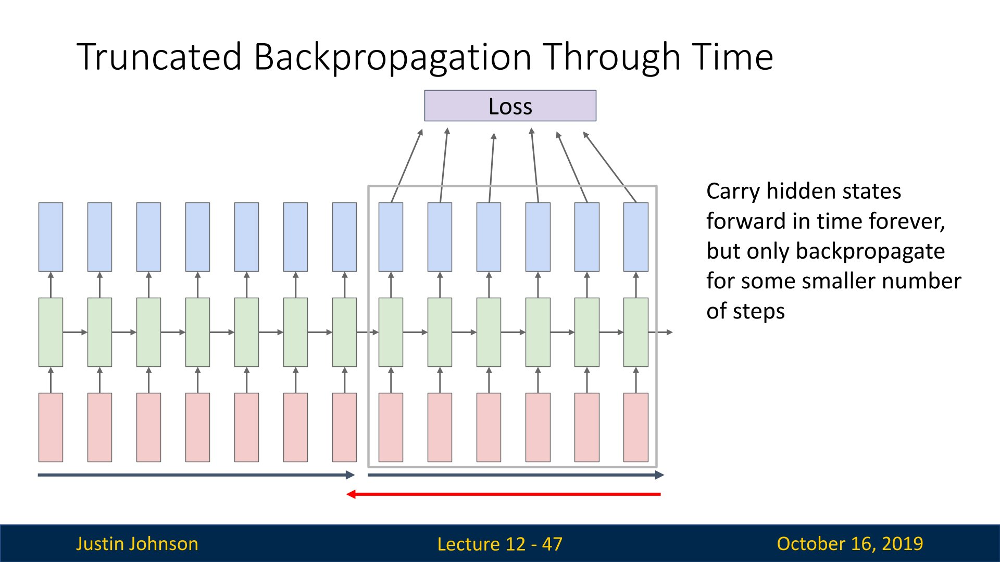

# 前文总结

之前已经讲了包括CNN结构、训练方法等，但是这些实际上只是一种前馈结构，所有的信息都是前向传播（有分支），每一层都接受单一输入（如图像等），每一层的输出都会进入下一层进行处理，最后输出一个单项，比如说一个完整的神经网络，我们输入一个图像，就可以输出一个标签（尽管这个标签未必是对的）

但是我们想要使用深度学习神经网络解决其他问题的话，CNN就难以解决了，比如说我们的输入不是一个，或者输出不是一个的情况（例如，输入一个序列，输出一个序列这样子）

此外，序列长度是不固定的，所以我们需要一种新方法来处理，这就是循环神经网络（Recurrent Neural Networks，RNN），实际上这种网络对于处理非顺序数据也非常有用（有人使用CNN来图像分类，每次读取图像的一小片）

## MNIST的RNN处理示例

有人使用RNN，对MNIST数据集进行分类，不过其分类的方法不同于CNN，CNN是整张图像输入，RNN则是大量的“glimpses”，可以理解为每次看到图片的一小部分（大小不一定相等），看到多次之后进行分类

## 图像生成

RNN可以实现图像生成，输入一连串指令，然后RNN就可以生成一系列图像

# 循环神经网络

## 结构

CNN只有三部分，内部固定参数、输入、输出，即输入X，经过内部参数之后得到Y输出

但是RNN则不然，多了一个内部隐藏状态（或者叫内部状态），每一次输入之后，都会使用某种公式来更新这个状态，可以使用一个递归公式给出

其可以处理任意长度的序列，处理时间看序列中包含元素的个数，其处理的计时单位是时间步，一个时间步处理一个元素，但是循环网络和权重都是相同的

根据任务不同，网络的处理方法也不一样

- 多对多的情况下，需要为序列中的每个点做出决定，类似于视频分类，我们需要为视频中的每一帧进行分类，这时候我们可以加上另一个权重矩阵$W_Y$，使得我们可以输出Y，然后处理得到标签$L_n$来进行预测，然后我们也可以在每一个时间步上应用损失函数来训练我们的模型：每个时间步的损失加在一起就是最终损失，然后就可以进行反向传播

  

- 多对一的情况下，我们最终产生一个标签，比如说我们想对这整个视频序列做一个分类，那么我们可以连接我们的模型，在序列的最后做一个预测

## 示例：Vanilla RNN

这是一个简单的循环神经网络

## RNN计算图

我们以计算图的方式思考RNN是怎么工作的

我们首先给定一个初始状态$h_0$，然后不断在输入中进行更新，每一次我们都将状态和输入提供给递归关系函数，然后输出第一个隐藏状态，依次递归

注意一下，序列每次运算都是相同的矩阵，或者说在序列的每个时间步使用完全相同的权重矩阵，所以你可以看到在计算图中这表现为有一个不变节点W

## Seq2Seq

序列到序列的学习（Sequence to Sequence，简称Seq2Seq）是一种广泛应用于自然语言处理（NLP）、语音识别、机器翻译等领域的深度学习方法。它的主要目的是将一个输入序列转换为一个输出序列，这两个序列的长度和内容可能会有所不同。

Seq2Seq模型通常由两个主要组件构成：编码器（Encoder）和解码器（Decoder）。

实际上，Seq2Seq就是先是一个多对一循环神经网络接受不定长度的输入序列（可能是英文句子），然后将整个序列的全部内容整合到一个输出的隐藏向量中，我们可以在编码器序列的末尾获取这个向量，然后将其作为单个输入提供给第二个循环神经网络（解码器），这是一个一对多循环神经网络

## 案例：语言模型

我们希望使用一个循环神经网络，接受数据之后来预测下一个字符或者单词是什么，这个称为语言模型

在训练的时候，我们使用独热向量来对输入序列进行编码，每个元素（一个字符）变成一个独热向量，然后输入到循环神经网络中进行处理，并且改变序列隐藏状态，然后我们就可以使用矩阵来预测每个点的词汇表中元素的分布，因为网络的任务是在每个时间点都试图预测序列中的下一个元素

如果已经有了一个训练有素的语言模型，可以用来生成新文本（以它学习到的文本的风格），这个过程是这样的

我们先给与一个初始种子（initial seed token，在这里给的是字符h），然后让网络生成以种子为条件的新文本，其工作方式将给予的种子转化为独热向量，然后得到对下一个字符的预测分布，然后采样出最有可能的字符，将其作为下一个时间步的输入，如此反复即可

# 训练方法

## 反向传播

BPTT（back-propagation through time）算法是常用的训练RNN的方法，其实本质还是BP算法，只不过RNN处理时间序列数据，所以要基于时间反向传播，故叫随时间反向传播算法。BPTT的中心思想和BP算法相同，沿着需要优化的参数的负梯度方向不断寻找更优的点直至收敛。综上所述，BPTT算法本质还是BP算法，BP算法本质还是梯度下降法，那么求各个参数的梯度便成了此算法的核心。

我们前面提到，循环神经网络的损失是将所有时间步上的损失进行相加，然后进行反向传播，但是这有一个问题，如果想处理很长的序列，这会耗费大量内存，尤其是一些超大的语言模型，所以我们在实践中训练循环神经网络的语言模型的时候，我们有时候会使用替代的近似算法，称为随时间截断的反向传播

我们要做的就是，截取序列的一些子集，比如说前十个序列或者前一百个序列，然后展开网络的前向传播，来计算梯度和传播，也就是说，我们将一些序列变为一个块，然后每个块来计算这个输出和梯度，这使得训练循环神经网络变得可行

也就是说，我们每给一块序列提供一个输入，得到输出之后就可以计算损失，然后就对这块序列进行训练

这样就可以携带隐藏状态一直向前，但是只会在某些时间步上进行反向传播，大大减小了训练难度

## 案例：莎士比亚作品集

这是将莎士比亚某个作品中的一段作为数据集进行训练的，可以看到，最开始就是胡言乱语，但是最后可以有逻辑的进行生成文本

甚至讲师还想用这个来训练抽象代数或者代数几何的文本内容（笑）