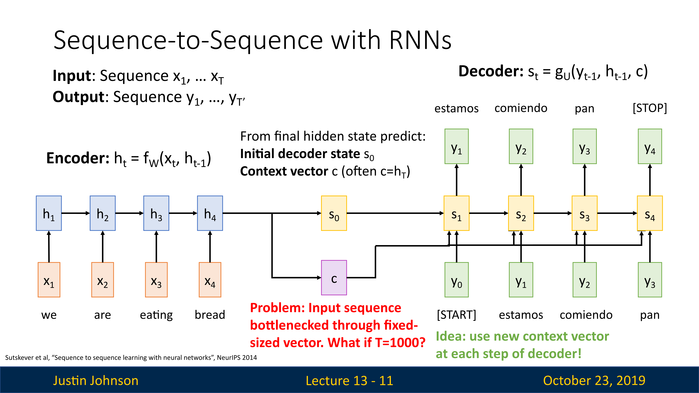
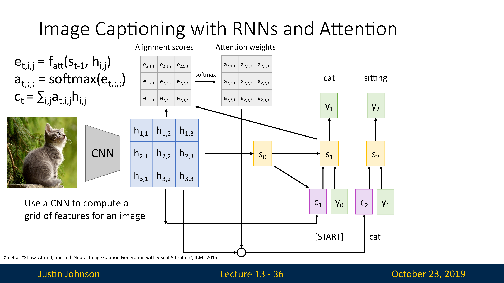
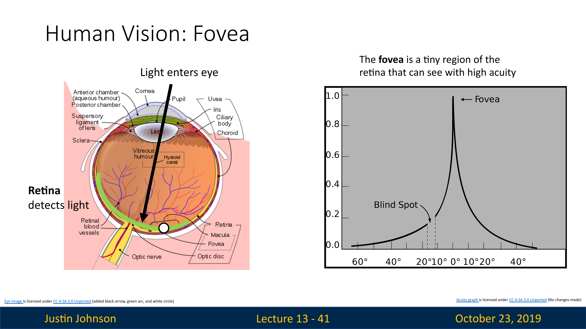
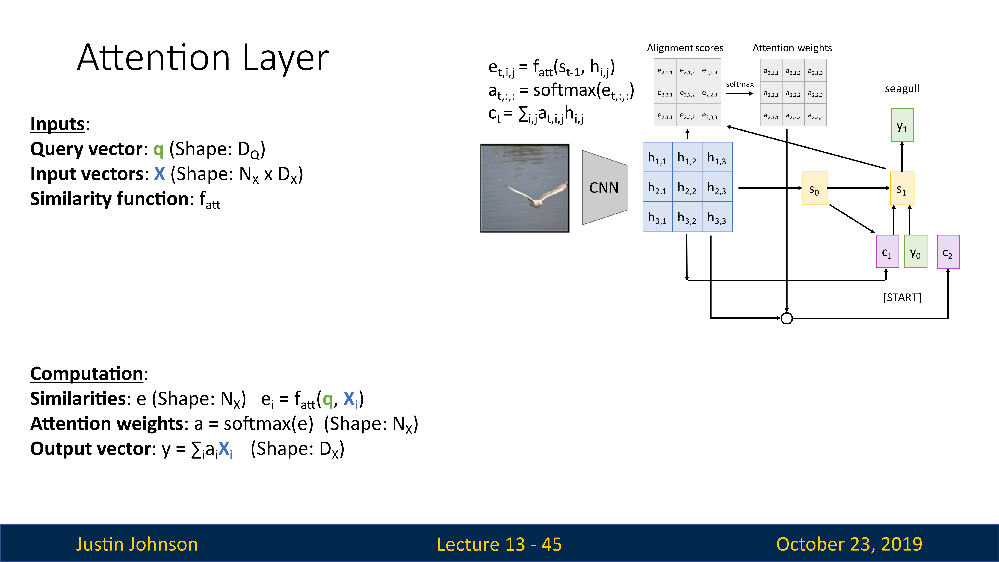
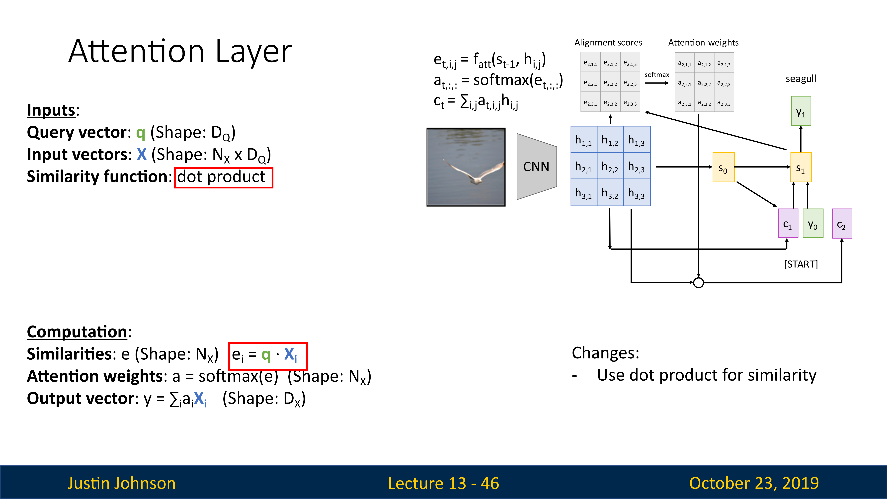
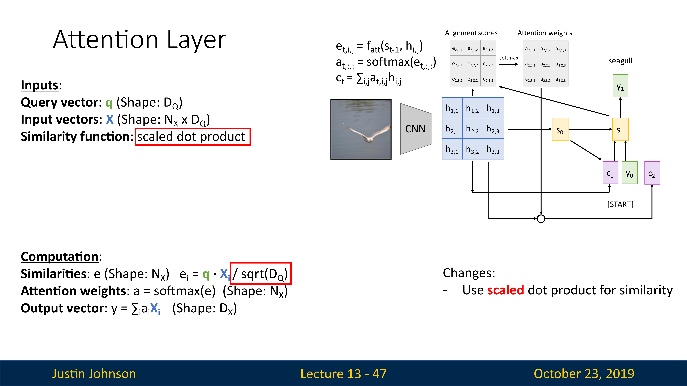
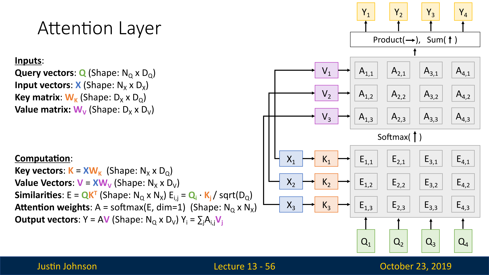

# 从RNN中得到启发

我们使用递归神经网络进行序列到序列的预测，接受一些输入序列然后输出一些序列（比如说翻译，或者视频字幕），其中的工作方式是一个称为编码器的循环神经网络接受并且处理原始输入向量，然后产生隐藏状态序列，并且在最后总结输入，产生两个输出向量（隐藏状态和上下文向量），上下文向量是要传送给解码器的每一个时间步的

在解码器的开始，同时接受隐藏状态和上下文向量，然后用开始标记作为输入

在这里，这个上下文向量式一个在编码解码序列之间传递信息的向量，所以现在这个上下文向量应该以某种方式总结解码器生成其句子所需的所有信息，然后进入解码器的每个时间步

但是，这里有一个问题，如果我们希望使用序列架构的RNN来处理非常长的序列，比如说我们想翻译一本书，那么这种架构是难以完成的，因为我们难以将一个很长序列的内容打包到一个上下文向量中（也就是说，一本书的内容难以打包），我们希望有一些机制，不要强迫模型把所有的信息都集中在一个单一的向量上

那么，我们可以在编码器的每个时间步上计算一个上下文向量，然后解码器可以选择上下文向量，或者说关注上下文向量的不同部分（也可以理解为关注输入序列的不同），我们称为注意力机制

# 带有注意力机制的RNN

## 结构

这种RNN的结构不同的地方在于，编码器每一步都会计算一个新的上下文向量

我们有编码器，将输入序列编码为一系列隐藏状态，然后使用解码器进行预测，然后使用一些对齐函数（可以理解成一个很小的全连接网络），这个对齐函数的输入是两个向量：当前编码器的隐藏状态，解码器的隐藏状态（公式在下图右上角）
$$
e_{t,i}=f_{att}(s_{t-1},h_i)\\
f_{att}\quad is \quad an\quad MLP(多层感知机)
$$
这些对齐函数会输出一个分数，这个分数表示，考虑到解码器的当前隐藏状态，我们应该对编码器的每个隐藏状态关注多少，不过最开始，这些分数也是随机的，因为是直接从前馈函数中产生的，没有经过反向传播的学习

我们会根据这个分数，以某种方式在解码器的每一步构建一个新的上下文向量，在使用比对分数的时候，我们将会使用这个对齐函数来比较$s_0$和$h_i$，比对分数代表模型认为隐藏状态对于预测输出隐藏状态$s_0$之后的单词所必须的程度

然后我们就得到了每个隐藏状态的对其分数编码序列，即
$$
\vec{e_{i}}=(e_{i,1},e_{i,2},\cdots,e_{i,n})
$$
然后我们经过一个Softmax操作，将这些分数转化为概率分布，这个分布说明，我们对于编码器的每个隐藏状态上放置多少权重（或者说关注度多少），这些分布也被称为注意力权重
$$
\vec{a_i}=softmax\left(\vec{e_i}\right)
$$
然后我们对隐藏状态进行线性加权求和，得到上下文向量

也就是说，这个网络可以自行预测我们要对输入序列的每个隐藏状态施加多少权重，并且我们可以为解码器网络的每个时间步动态改变该权重

然后，我们就可以使用我们计算出的上下文向量和输入来进行预测了（如下图所示）

我们输入上下文向量和第一个输入单词，然后我们得到的输出词可能对应于输入词中的一个或者多个单词，但是我们这里的上下文向量是动态生成的，它允许解码器专注于编码器网络不同的输入

这里给出了这种直觉：如果解码器网络想生成输出序列的特定单词，那么将专注于这个单词所需的输入序列中的重要部分

然后我们在使用解码器中上一步的隐藏状态来计算这一步的上下文向量（重复之前的对齐、概率分布计算等操作），来继续生成新的文本

## 意义

我们进行端到端的训练的时候，我们没有告诉模型它应该关注哪些部分，但是经过训练，模型可以在生成输出序列时选择关注序列的不同部分

这样，就可以解决之前的瓶颈：无法将所有信息塞入一个上下文向量，然后解码器一直使用这一个向量。现在，为解码器提供了生成新序列的灵活性 

在处理非常长的序列的时候，那么这将允许模型进行某种程度的转移注意力，将注意力集中在输入的不同部分，以此产生输出

## 例子

# 带注意力机制的CNN

因为注意力机制，实际上并不关心输入是一个序列这一个事实，只不过它可以用在RNN机器翻译上（这个任务的输入输出是序列），但出于这种注意机制的目的，它实际上并没有使用输入向量是一个序列的事实

所以原则上，我们可以使用完全相同的注意机制来构建可以处理不是序列的其他类型数据的模型，比如说CNN

## 图像标题生成

我们可以使用注意力机制，来生成图像的说明

我们使用CNN来计算图像的特征，然后使用注意力机制来生成字幕

模型通过对输入图像的特征网格进行加权重组来生成自己的新上下文向量

## 人眼视觉：焦点

人眼的视觉，是很奇特的

我们知道人眼是一个球体，然后你在一侧有一个晶状体，相当于一个透镜，然后在你眼睛的后部有一个叫做视网膜的区域，光线通过晶状体进入眼球，投射到视网膜上

视网膜上包括实际检测光的感光细胞，它们感光之后，产生信号并且发送给大脑，然后大脑进行处理并理解为我们现在看到的东西

但是，视网膜的所有部分不是平等的，实际上视网膜正中央的一个特定区域，学名为“fovea”，中文名"黄斑窝"或者"中央凹"。这是视网膜中央部位的一个小凹陷，直径约为1.5毫米，它的特点是细胞密度最高，主要由视锥细胞构成，负责我们的中心视力和色彩视觉。当我们集中注意力看某个物体时，我们的眼睛会自动调整，使得光线尽可能地落在黄斑窝上，这样可以得到最清晰的视觉效果。

从上图也可以看到，视网膜不同区域的敏感度不一样（或者可以表现为视力），越是边缘区，视力越差，在中央凹这里，视力达到最高

# 注意力机制的通用化：注意力层

## 通用的注意力层

我们尝试将注意力机制抽象并且概括，将其用在更多类型的任务中，尝试得到一个通用的层，然后直接插入到RNN和CNN中进行使用，这种方法可以很好地对注意力机制进行重建

我们的输入是一个查询向量（Query Vector，即$q$），这个将取代隐藏状态向量，查询向量的作用是帮助模型确定应该关注的输入数据的哪些部分，从而提高模型的性能和准确性。它是实现注意力机制的关键组件，使模型能够更好地处理复杂和大规模的数据。

我们也有一个输入向量（即$X$），来代替我们想关注的这组隐藏向量

然后还有一些相似函数，来对比查询向量和数据库中的每个输入向量

然后就是使用softmax，对相似函数的输出进行处理，得到注意力权重，然后对输入向量进行加权来计算输出向量

实际上，上面这种注意力机制中的相似函数$f_{att}$，是早期的工作，现在使用了更新的方法，也就是使用向量之间的简单点积，这样更有效而且性能更好

同时为了限制相似性函数计算结果过大过小，我们使用缩放点积（如上图所示），来使得相似性有一个限定范围，这样就可以限制梯度不会过大，导致梯度爆炸（因为这个相似性会进入softmax进行计算的，这个值太大，也会导致反向的梯度很大，同时如果向量e中一个元素远大于其他元素，也会导致一个非常高的softmax峰值分布，导致梯度几乎在任何地方接近消失）

此外，如果向量很长，那么就更容易产生非常大的数值，然后我们除以平方根，就可以消除这种影响

然后，我们想要允许多个查询向量，所以以前我们总是在每个时间步都有一个查询向量，在解码器中，我们使用该查询向量在所有输入向量上生成一个概率分布

现在我们想概括注意力机制，并且有一组查询向量$Q$和输入向量$X$（以矩阵形式出现的），对于每一个查询向量，我们想在每个输入向量上生成一个概率分布，以便于计算相似度

我们想计算每个查询向量和每个输入向量之间的相似度，我们就使用比例点积来作为计算相似度的函数（这里改进为矩阵乘法），然后我们计算概率分布的时候，就可以使用针对单个维度的softmax，在这里我们是在第一维上计算

然后我们使用softmax就可以得到注意力权重了，然后使用注意力权重矩阵来对输入矩阵进行加权求和，得到输出矩阵$Y$

这里实际上输入向量有两个功能，一个是计算注意力权重，另一个是计算输出向量，但是我们可以将这个输入向量转换为两个向量：键向量和值向量

这里我们使用两个可学习的矩阵完成这个操作，一个是键矩阵$W_k$，另一个是值矩阵$W_v$

我们这里使用查询向量和键矩阵来计算相似性，使用注意力权重矩阵和值向量来计算输出，这使得模型在如何正确使用其输入数据方面具有更大的灵活性

下图中，底部我们有四个查询向量，然后左侧是一组输入向量

首先我们使用键矩阵来计算输入向量的键矩阵，然后将键矩阵与查询向量进行对比，得到非标准化相似性分数矩阵

然后进行softmax操作，得到对齐分数，然后继续计算

## 自注意力层

在之前的情况下，我们都是有两组输入：查询向量和输入向量，但是实际上我们只有一组向量作为输入，并且我们想将输入集中的每个向量与其他向量进行比较，所以我们需要将输入进行转换，我们再使用一个可学习的查询矩阵$W_Q$，来获得查询向量

然后类似地，我们将使用键矩阵来获得键向量，然后计算查询向量和键向量之间的相似性矩阵$E$，然后使用softmax得到概率分布，加上值矩阵得到注意力权重矩阵，加权求和之后得到输出向量

## 例子：带有自注意力层的CNN

我们想在视觉任务中使用注意力机制

# 三种处理序列方法总结

## 循环神经网络

最明显的就是RNN，给定输入向量的序列，产生输出向量的序列

优点是非常擅长处理长序列，擅长在非常长的序列上传递信息，所以最终隐藏状态和输出，取决于整个输入序列

但是问题是，它并没有很好的并行处理，它非常依赖于数据的顺序，但是我们知道，我们构建大型神经网络都是使用GPU和张量来并行处理的，这就无法很好的利用算力，所以难以构建大型RNN

## 一维卷积

我们可以使用一维卷积的方式进行计算，因为序列中的输出元素可以独立于其他输出元素进行计算，可以打破循环神经网络的顺序依赖性

但是问题是难以处理长序列，除非堆积很多一维卷积层，因为输出序列中的每个点只能看到几个点，只有多层卷积之后才可以一个点看到整个序列

## 自注意力

可以克服前面两种方法的缺点，很适合在GPU上并行计算，如果给定一组向量，它将每个向量与每个其他向量进行比较，这类似于RNN，每个输出都取决于所有输入

但是缺点是，会占用大量内存

不过，结果证明，如果我们想构建一个处理序列类型的神经网络，我们可以只使用自注意力机制来完成，这种工作就是transformer

## Transformer

transformer就是将自注意力作为比较输入向量的唯一机制，工作方式就是首先接受一个输入序列，然后将其通过一个自注意力层，同时增加一个残差连接来完成归一化操作（对于序列模型也是有用的）

但是，归一化层不涉及不同向量之间的交互，仅仅是对单个向量完成归一化

在这个归一化层之后，我们得到的还是一组向量，就是应该前馈的多层感知机，这是一个全连接的神经网络，会独立地对每个向量进行处理

然后我们继续增加一个残差连接进行归一化处理，然后输出向量Y

我们一般将这些层封装为一个块，称为Transformer，它可以是处理向量序列的大型模型的基本构建块

输入是一组向量 x，输出也是一组向量 y，不会改变输入输出的数量，但是维度可能改变，向量之间的唯一交互发生在自注意力层内部，因为归一化和前馈感知机都是在单个向量上进行独立处理的

因为这些良好特性，所以这种模块非常适合GPU上进行并行计算

选择Transformer我们需要设置几个超参数，一个是模型深度

事实证明，我们可以使用这些模型为许多序列预测或语言预测任务实现非常相似的效果，或许这就是自然语言处理的通用范式