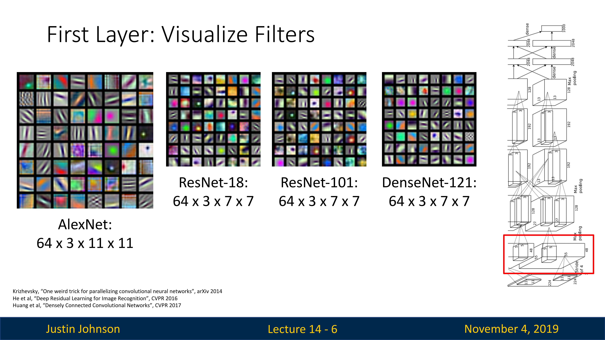
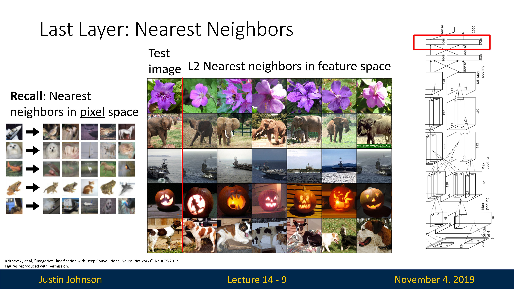
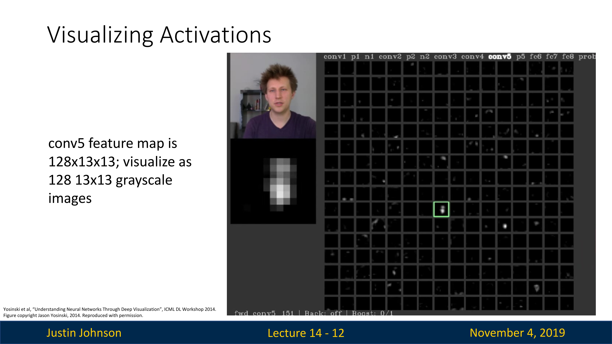

# CNN的可视化与理解

在之前我们讨论了一系列内容

- 注意力机制：注意力如何成为我们可以添加到当前的神经网络中的机制，让模型在不同的时间步长上专注于输入的不同部分，然后构建通用自注意力层，用来构建新的神经网络模型
- Transformer：我们可以使用自注意力来构建这个新的神经网络模型，它完全依赖于对注意力的处理

但是我们在面对视觉任务的时候，我们如何判断神经网络学到了什么，假设我们训练了一个卷积神经网络模型，那么神经网络内部寻找的中间特征是什么，如果能够观察神经网络内部并了解不同的层在寻找什么特征

## 卷积层可视化

我们有这样的想法，即线性分类器正在学习一组模板，每个类都有一个模板，并且类分数是由我们的线性分类器计算的，是学习模板和输入图像的内积

当我们推广到卷积神经网络的时候，我们也有同样的想法

对于网络中第一层的卷积核，经过学习之后，当它继续围绕图像滑动之后，就可以获取一个内积（代表匹配度）

如果我们将这些卷积核可视化，那么就会发现，过滤器作为一个图像，可以对匹配的图像给出强烈响应，所以通过可视化卷积核的方法，我们可以对这些层所要寻找的特征有所了解

下面是四个不同模型，在ImageNet数据集上进行预训练之后，将第一层卷积核进行可视化

我们可以看到，尽管不同模型的架构不同，但是第一层卷积核想寻找的特征却是很接近

如果我们想将可视化方法应用在更高层上，会有一些问题，这是因为在第一层卷积层，卷积核通常会学习到一些基本的视觉特征，如边缘和颜色。例如，一个卷积核可能会在检测到垂直边缘时产生高的激活值。我们可以通过将这些卷积核的权值可视化为图像来查看这些特征。

但是在更深的卷积层，卷积核通常会学习到更复杂的特征。由于这些特征是在高维空间中学习的，因此可能难以直接可视化。然而，可以通过一些方法（例如，反卷积或特征反向投影）来尝试理解这些特征。

但是我们仍然可以在第二层上看到一些情况，那就是，他们仍然在寻找一种斑点图案或边缘，但现在不再寻找边缘或RGB特征空间中的斑点，而是寻找特征空间中由前一个卷积层产生的斑点或边缘

但是我们仍然无法对这些卷积核在寻找什么这件事上有一种强烈的直觉，卷积核可视化这个方法也无法让我们理解更高层的卷积核在做什么，所以我们需要使用其他方法来尝试理解卷积神经网络的其他层在干什么

我们先尝试跳过前面的卷积层，然后直接尝试理解最后一个全连接层在干什么

## 全连接层可视化

AlexNet的FC7层有4096个特征，使用线性变换之后可以提供ImageNet数据集中一千个类的类分数，所以我们可以尝试做的一件事是理解这个4096维向量表示什么

这个训练好的AlexNet在干什么呢？它获取我们的输入图像并将其转换为4096维向量，然后在该 4096 维向量之上应用线性分类器，所以我们可以尝试通过了解4096 维向量内部发生的事情来可视化地理解

我们使用训练好的AlexNet模型，在测试集的图像上进行前向推理，然后记录每个图像所生成的4096维特征向量，一旦我们收集了这类图像数据集及其特征向量，我们就可以尝试使用各种技术将它们可视化，首先我们在这些特征向量上使用最近邻算法

回想我们第一次使用最近邻算法的时候，是直接使用像素进行计算的，这个时候最近邻算法倾向于包含相似像素的图像判定为一类，尽管同一个类别的图像并不是真的同一个类别

在这里，我们使用AlexNet计算的特征向量进行最近邻搜索，这可以让我们理解分类器是如何学习特征空间中图像彼此之间的接近程度的，或者说，分类器是如何根据图像的特征向量来判断哪些图像是一个类别的

我们看上图中的例子，以第二行的大象类别为例，尽管不同图像中的背景和大象有不小的区别，但是仍然可以很好地完成分类，或者说，AlexNet在对图像进行处理的时候，忽略了图像中很多低级像素内容

亦或者可以这样理解，在这个向量中以某种方式编码像大象这样的东西，然后得到这样一个很好的特征向量

## 降维方法可视化

我们可以在4096维特征空间中训练分类器，但是我们这些三维空间中的人类很难去理解这个高维空间，所以只能想办法进行降维，让维数降低到二维三维，才可以进行人类可理解的可视化显示

这里首先是主成分分析（principal component analysis，PCA）方法，这是一种线性降维方法，可以尽可能保留高维特征空间的结构，并且进行线性的降维投影

然后还有一种方法就是t-SNE算法（t-Distributed Stochastic Neighbor Embedding），这是一种用于数据可视化的降维技术，特别擅长处理高维数据。这种算法由Laurens van der Maaten和Geoffrey Hinton于2008年开发。t-SNE主要用于可视化高维数据集在二维或三维空间的分布，特性是非线性、保留局部结构和高维可视化

1. **非线性**：与主成分分析（PCA）等线性降维技术不同，t-SNE是一种非线性降维技术。这使得它能够处理复杂的数据模式。
2. **保留局部结构**：t-SNE尤其擅长保留数据的局部结构。这意味着在高维空间中相近的点在低维空间中也会相近。
3. **高维可视化**：由于t-SNE通常用于将数据降维到二维或三维，因此它是一种非常有用的数据可视化工具。

需要注意的是，尽管t-SNE有很多优点，但它也有一些限制。例如，t-SNE对超参数的选择很敏感，对于不同的超参数可能会得到非常不同的结果。此外，t-SNE的运算成本相当高，对于大规模数据集可能难以处理。

然后，我们对AlexNet在MNIST上计算的特征向量进行降维可视化，就可以看到，对于十种数字，的确倾向于不同的区域，这让我们知道，这个网络的确可以以某种方式对不同类进行编码

## 卷积激活的可视化

另外一种理解卷积神经网络想寻找什么东西的方法，就是将中间层的卷积激活可视化

比如说AlexNet的第五个卷积层，其输出特征图是13x13大小，128通道，这意味着第五个卷积层中有128个卷积核，所以我们可以尝试将特征图转化为灰度图，当然，其中会有大量的纯黑色图像，因为激活函数的存在

对于特征图不为零的，我们与原始输入图像对齐，以下图为例，我们输入一张人像图，其中的一个卷积核实际上类似于人脸形状，这就是因为这个卷积核以某种方式与人脸或者人类肤色对齐了，所以让我们感觉，也许这个神经网络这一层内的卷积核以某种方式学会了对人脸或人类肤色做出反应

