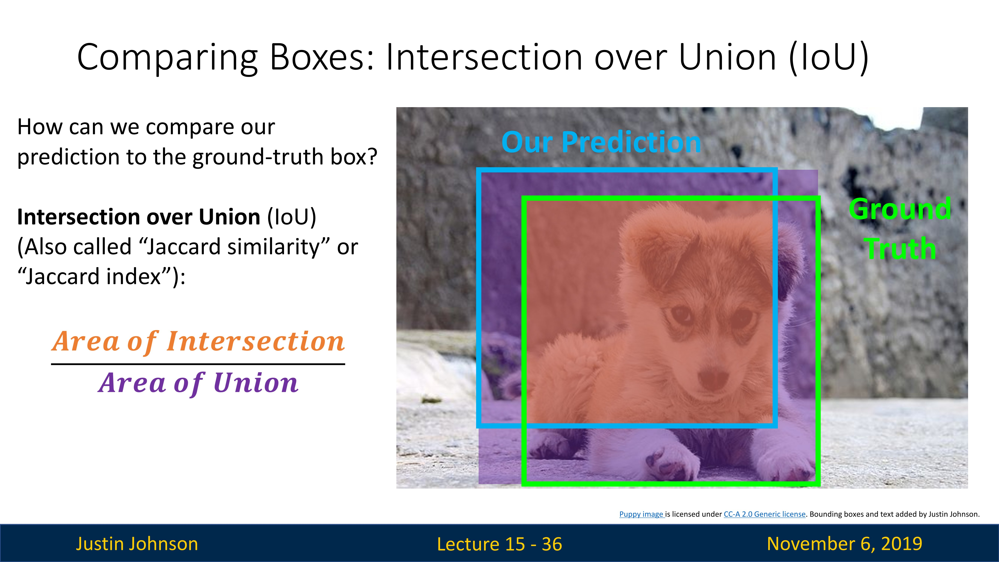
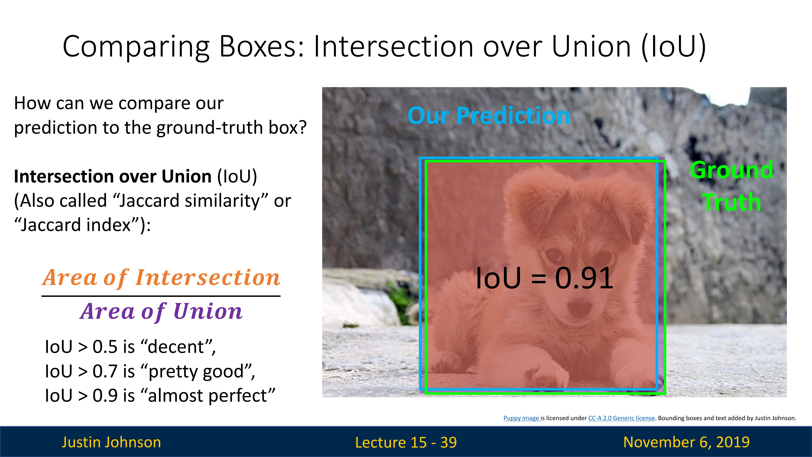
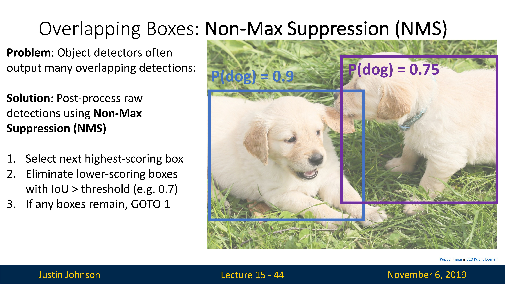
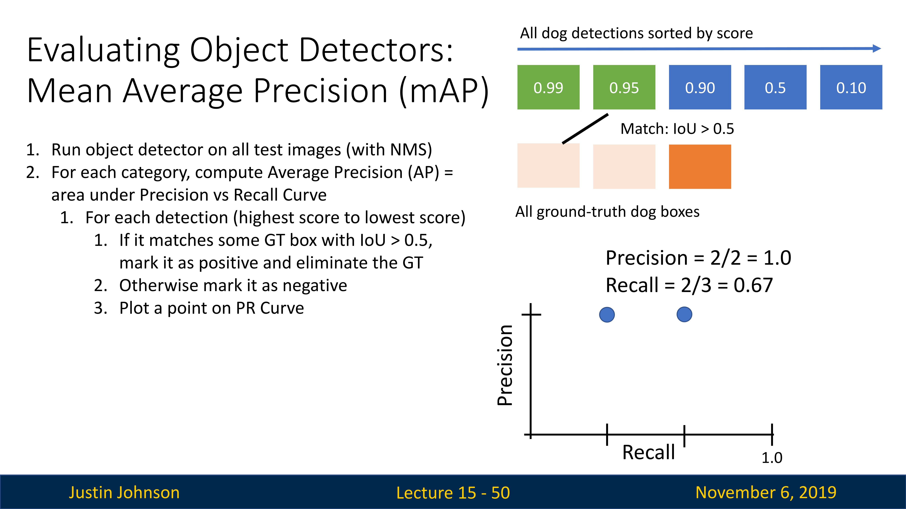
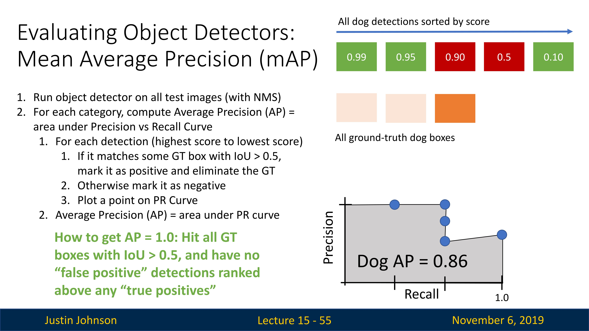

# 目标检测

## 任务定义

目前我们已经实现了卷积神经网络处理图像并且输出类别标签，并且理解了为什么CNN可以工作和CNN在干什么，但是这只是计算机视觉任务的一种，我们还需要完成计算机视觉的其他任务，这些任务涉及识别图像中对象的空间范围，比如说目标检测

那么什么是目标检测呢？我们输入一个彩色图像，输出是一组检测到的对象，我们希望所有的对象都可以识别到，比如说下图中，我们希望识别到图像中所有的猫和狗，那么模型就应该检测出来

在这个任务里面，对于我们想检测的每个对象，模型将输出两个内容

- 类别标签：表示检测到的对象的类别
- 边界框：给出图像中该对象的空间范围（或者说具体位置）

我们通常使用四个参数来描述这个边界框，x和y描述框的中心位置，w和h描述框的高和宽，当然我们可以使用其他形状的边界框或者使用旋转的边界框，但是为了标准化，我们统一使用方形边界框，原因如下

- 参数量少，只有四个参数，计算量小
- 便于进行裁剪、缩放等图像处理
- 泛化能力强，虽然方形边界框可能不能完全匹配目标的形状，但它能够提供足够的信息来识别和定位目标。对于大多数实际应用来说，完全匹配目标形状的精确边界框并不是必需的
- 兼容性好，大多数目标检测的数据集（如PASCAL VOC、COCO等）都是使用方形边界框进行标注的。使用方形边界框可以确保模型和数据集的兼容性。

## 面临的挑战

一旦从图像分类转向目标检测，我们需要处理的最大问题之一就是如何完成多输出任务，这也是第一个挑战，在图像分类中，模型总是为每个图像做一个单一的输出，一个单一的类别标签

现在有了图像分类，就需要为了一个图像需要输出一整套检测到的对象，每个图像可能有不同数量的检测到的对象，所以现在我们需要以某种方式建立一个模型，它可以输出大小不一的检测结果

第二个挑战是如何产生两种类型的输出，标签和边界框

第三个挑战是，在目标检测任务中，我们通常会面临更高分辨率的图像

## 从检测单个对象开始

我们先从一个最简单的情况开始，那就是检测一个只有一个目标的图像

比如说，我们有一张图片（如下图所示），其中只有一个猫（我们想检测的对象），我们运行一个训练好的CNN，比如说VGG或者ResNet这些，然后得到一个4096维的特征向量，在传统的图像分类任务中，我们只需要使用这个特征向量进行分类即可，但是在这里我们会将其分为两路，一个用于分类，一个用于输出边界框

我们使用一个全连接层将特征向量降维到四维，也就是边界框的坐标，然后使用损失函数进行训练，比如说L2正则化损失，然后就有两个损失函数，因为我们要求我们的模型预测两种不同的事物，但为了计算梯度下降，我们实际上只需要以单个标量的损失函数来完成，所以我们只能将两个损失函数加权求和，得到一个总的损失函数，以此来克服这个问题

这么做的原因主要有两个：

1. **捕捉不同的任务目标**：在目标检测任务中，我们的目标是识别出图像中的对象（分类任务），并确定它们的位置（回归任务）。这两个任务有不同的目标，因此需要不同的损失函数来衡量模型在这两个任务上的表现。通过将这两个损失函数结合起来，我们可以同时优化模型在两个任务上的表现来得到一个多任务模型。
2. **权衡不同任务的重要性**：不同的任务可能需要不同的权重。例如，对于某些应用，准确地确定对象的位置可能比正确地分类对象更重要。在这种情况下，我们可以通过增大回归损失的权重，使模型更重视位置预测的准确性。权重的选择通常需要基于实际问题和数据进行调整。

这是一个多任务网络模型，我们想训练一个网络来同时完成多个任务

## 检测多个对象

但是我们想检测的图片里面，对象的数量是不定的，所以我们需要从网络模型中输出很多不同的数字，或者说我们需要模型为图像中可能看到的每个不同物体输出可变数量的对象，有一种相对简单的方法可以做到这一点，称为**目标检测的滑动窗口方法**

我们的想法是，假设一个有了一个训练好的CNN，让它对输入图像的窗口或者说子区域进行分类，每个子窗口输出一个类别，但是注意一下，如果我们想检测N个类别，那么实际上的输出是N+1个类别，额外增加的一个是背景类别

比如说下图中，第一个滑动窗口检测的是背景，所以实际上应该输出背景类别，并且没有边界框输出

第二个窗口里面是狗，所以输出也是狗

但是，如果我们有一个$H\times W$的的图像输入，就会有更多种可能的位置，假设我们的边界框的大小为$h\times w$，那么可能的x洲位置就有$W-w+1$种，可能的y轴位置有$H-h+1$种，那么可能的位置就有$(W-w+1)\times (H-h+1)$种，这是一个非常庞大的数字

如果我们考虑所有大小的盒子，那么这个数字更为庞大，是
$$
\sum_{h=1}^H\sum_{w=1}^W(W− w + 1)(H − ℎ + 1)\\
=\frac{H(H+1)}{2}\frac{W(W+1)}{2}
$$
这是一个天文数字，我们的硬件无法支持如此庞大的计算量，所以我们必须想办法去解决这个问题

## 候选区域（Region Proposals）

这个想法就是，在图像每个可能区域上评估目标检测器

使用算法在图像中生成一组候选区域，以便候选区域给出一个相对小的集合，这些区域很可能覆盖图像中的所有对象

当然，这只是一个想法，并且最终会被神经网络所取代，所以无需过多关注

## R-CNN：Region-Based CNN

R-CNN是14年CVPR的一篇论文，可以说是目标检测方法的起点，具有非常高的影响力（可以说是深度学习中最有影响力的论文之一了），但是他的工作方式实际上非常简单

从输入图像开始，然后运行候选区域方法，比如说选择性搜索，然后选择性搜索会给出一些图像中的候选区域（这个一些可能是数百甚至上千个候选区域），这些候选区域可能是不同大小和不同纵横比，所以我们需要将每个候选区域变为统一的224x224大小（需要图像放缩的方法），然后单独输入到CNN中进行分类，然后由分类结果判断是否包含对象（或者只是背景）

但是，上面的方法不足以解决所有问题，比如说候选区域与我们想在图像中检测的对象不完全匹配，例如一个候选区域里面包含了一个马的一部分，另一个区域包含了另一部分这样子，而且这里的边界框只不过是完成了输出，输出的边界框没有进行学习

所以我们需要改善我们的方法，也就是使得输出的边界框可以自我学习，或者说我们应用一个新的损失函数来进行学习

CNN还要输出一个额外的变换，将候选区域框转换为我们实际需要的包含目标的最终框，或者说这是一个回归的想法，我们想修改候选区域，让其可以适应图像中的目标

总的来说，R-CNN的步骤如下

1. 使用候选区域法，计算出两千个候选区域
2. 将每个区域变为统一大小，独立使用CNN进行标签和边界框预测
3. 使用阈值来选择框
4. 与真实标签进行对比

## 比较边界框：交并比

我们使用算法预测了一个边界框，但是我们如何去判断这个边界框是否位置和大小都合适呢？所以我们需要使用一种叫做Intersection over Union（IoU）的方法去进行对比，我们使用这种方式去计算两个盒子之间的相似性

首先，我们计算两个边界框的交集，也就是图像中橙色的部分，然后计算两个边界框直接的并集（有点类似于和空间的概念），也就是图像中的紫色部分，可知计算结果是一个0-1之间的数字（这个叫做**交并比或者IoU**），而且数字越高，边界框之间的匹配程度越好

看下图，IoU是0.54，可知两者并不是十分匹配，看图也可以看到效果

如果IoU是0.9，就可以发现，基本上二者高度一致

但是实际上还有另一个问题，那就是实际上，这些对象检测方法通常会输出一组重叠的边界框，这些框都围绕着相同的对象，如下图所示，图像中有两只小狗，但是目标检测器输出了四个边界框，并且每一个都包括了实际上的小狗对象，所以我们需要某种机制来减少边界框的数量

## 筛选边界框：非极大值抑制

上面我们说到，在目标检测任务中，目标检测器会输出非常多的框（这个也是原始输出），这些框的数量会远超图像中目标的数量，同时可能会在同一个物体的不同位置产生多个边界框。这些边界框可能会有很大的重叠，而我们通常只希望保留一个边界框来表示一个物体。因此，我们需要一种方法来去除这些重叠的边界（或者选出最合适的边界框，消除冗余边界框），也就是使用**非极大值抑制（Non-Max Suppression，NMS）**的方法去筛选出最合适的边界框

以上面这张图为例，图像中有两个目标（都是狗），但是有四个原始边界框，每个边界框都带有不同的分类概率（概率由CNN计算），那么我们如何进行筛选呢？

1. 对所有候选的边界框根据其得分（一般是模型预测的置信度或类别概率）进行降序排序，选取得分最高的边界框，并将其加入到最终结果列表中
2. 计算这个得分最高的边界框与其他所有候选边界框的交并比，移除那些与得分最高的边界框具有高I交并比（通常设定一个**阈值或者threshold**，例如0.7）的所有候选边界框
3. 如果还有其他边界框存在，继续上面的处理

NMS的基本思想是，对于重叠的边界框，我们只保留得分（例如，目标检测模型预测的置信度或类别概率）最高的一个，同时抑制（即删除）其他的边界框。在实际操作中，我们通常会设置一个交并比（Intersection over Union, IoU）阈值，如果两个边界框的IoU超过这个阈值，那么得分较低的边界框就会被删除。

通过NMS，我们可以有效地减少冗余的边界框，使得每个物体只被一个边界框表示，从而提高了目标检测的准确性和效率（如下图所示）。

这是一个十分合理的算法，并且基本上所有的目标检测算法都依赖于某种非极大值抑制算法来消除冗余边界框，当然，非极大值抑制算法也有一点问题，那就是如果图像中有很多高度重叠的对象，会造成一些麻烦，而且实际上并没有一个很好的解决方法

## 评价物体检测器：平均精度（mAP）

我们前面找到了IoU这种方法来判断物体检测器在在单个图像上的性能表现，但是我们还需要一种在数据集上评价物体检测器表现的指标，也就是mAP指标

在理解mAP之前，需要先理解Precision和Recall两个概念，以及它们与ROC曲线和PR曲线的关系。

1. Precision：也叫查准率，表示所有被模型判定为正样本中，真正的正样本的比例。
2. Recall：也叫查全率，表示所有真正的正样本中，被模型判定为正样本的比例。

在目标检测任务中，通常会为每个物体类别绘制一个PR曲线（Precision-Recall曲线），然后计算该曲线下的面积，即AP（Average Precision，平均精度）。AP值越高，说明模型在该类别的检测性能越好。

mAP则是所有类别AP值的平均，它能够反映出模型在整个数据集上的整体性能。

计算mAP的方法如下

1. 在所有测试图像上运行物体检测器（用NMS）

2. 对于每个类别，计算平均精度（AP），这个等于精度与召回率曲线下的面积（对每个类别独立计算）

   1. 对于该类别中的每个检测（从最高分到最低分，检测结果来自于整个测试数据集）来说

      - 如果它与一些**GT边界框（Ground-Truth Box）**相匹配，且IoU>0.5,将其标记为正并且认为这是一个正确的检测，并消除该GT边界框

      - 如果不能匹配任何一个GT边界框，那么标记为负值

      - 基于检测是否正确，在PR曲线上画出一个点（如下图所示）

        

      - 不过注意一下，这里计算的方式是累计的，比如说第一个0.99置信度的检测匹配了一个GT边界框，那么就算一个正样例，第二个0.95置信度的检测匹配了另一个GT边界框，再次画点的时候是加上之前的计算的

   2. 平均精度（AP）就是PR曲线下的面积，是一个0到1之间的数，比如说在这里，狗类别的AP就是0.86

      

3. 平均精度（mAP）就是所有类别的平均精度的平均数

至于为什么使用这种指标来评估物体检测器，那是因为对于不同的程序，你可能希望有不同的选择，你可能需要不同的权衡，比如说在自动驾驶中不希望误判任何周围物体，或者在某些程序中，误判是可以容忍的，所以不同的用例需要不同的阈值和精度之间进行权衡

但通过计算这个平均精度指标，它总结了精度和召回之间权衡的所有可能点，所以这就是为什么人们倾向于使用这个指标来评估对象检测

实际上，mAP的优点如下：

1. **全面性**：mAP考虑了检测模型的查准率（Precision）和查全率（Recall），这两个指标反映了模型在精确性和覆盖率方面的表现。只有当模型在这两方面都表现良好时，mAP值才会高。
2. **平均性**：mAP是所有类别的平均精度（AP）的平均值，因此它能够反映模型在整个数据集上的总体性能，而不仅仅是在某个类别或某个图片上的性能。
3. **稳健性**：在目标检测任务中，预测结果的置信度阈值的选择可能会对模型的性能产生很大影响。mAP通过对所有可能的阈值进行平均，使得模型的性能评估更加稳健，不受阈值选择的影响。
4. **易于比较**：mAP提供了一个单一的、范围在0到1之间的分数，因此它很容易用来比较不同模型的性能。
5. **广泛接受**：mAP是目标检测任务中最常用的性能评估指标，许多比赛和研究论文都使用它来评估模型的性能。因此，使用mAP可以方便地与其他模型进行比较。

