# 目标检测

## 任务定义

目前我们已经实现了卷积神经网络处理图像并且输出类别标签，并且理解了为什么CNN可以工作和CNN在干什么，但是这只是计算机视觉任务的一种，我们还需要完成计算机视觉的其他任务，这些任务涉及识别图像中对象的空间范围，比如说目标检测

那么什么是目标检测呢？我们输入一个彩色图像，输出是一组检测到的对象，我们希望所有的对象都可以识别到，比如说下图中，我们希望识别到图像中所有的猫和狗，那么模型就应该检测出来

在这个任务里面，对于我们想检测的每个对象，模型将输出两个内容

- 类别标签：表示检测到的对象的类别
- 边界框：给出图像中该对象的空间范围（或者说具体位置）

我们通常使用四个参数来描述这个边界框，x和y描述框的中心位置，w和h描述框的高和宽，当然我们可以使用其他形状的边界框或者使用旋转的边界框，但是为了标准化，我们统一使用方形边界框，原因如下

- 参数量少，只有四个参数，计算量小
- 便于进行裁剪、缩放等图像处理
- 泛化能力强，虽然方形边界框可能不能完全匹配目标的形状，但它能够提供足够的信息来识别和定位目标。对于大多数实际应用来说，完全匹配目标形状的精确边界框并不是必需的
- 兼容性好，大多数目标检测的数据集（如PASCAL VOC、COCO等）都是使用方形边界框进行标注的。使用方形边界框可以确保模型和数据集的兼容性。

## 面临的挑战

一旦从图像分类转向目标检测，我们需要处理的最大问题之一就是如何完成多输出任务，这也是第一个挑战，在图像分类中，模型总是为每个图像做一个单一的输出，一个单一的类别标签

现在有了图像分类，就需要为了一个图像需要输出一整套检测到的对象，每个图像可能有不同数量的检测到的对象，所以现在我们需要以某种方式建立一个模型，它可以输出大小不一的检测结果

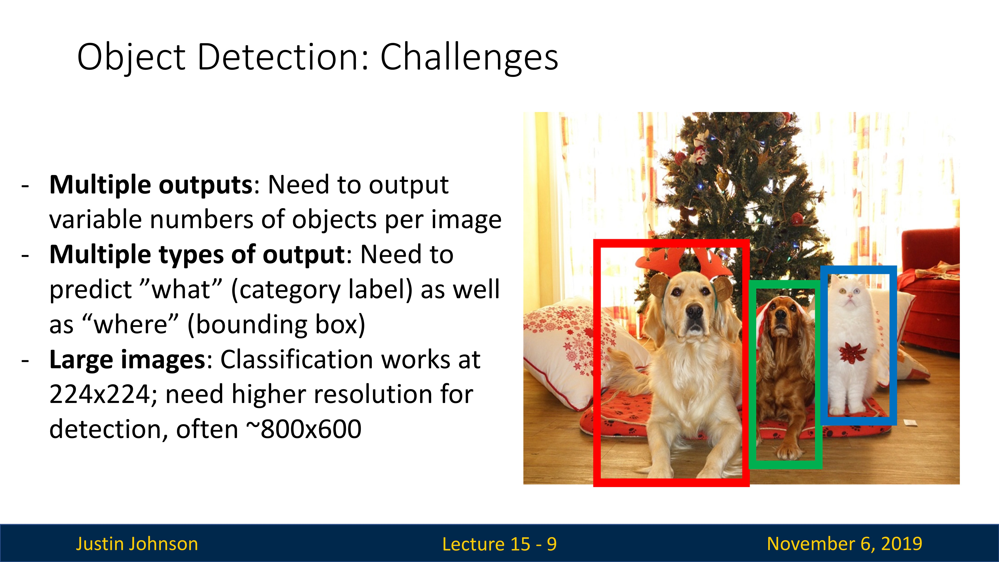

第二个挑战是如何产生两种类型的输出，标签和边界框

第三个挑战是，在目标检测任务中，我们通常会面临更高分辨率的图像

## 从检测单个对象开始

我们先从一个最简单的情况开始，那就是检测一个只有一个目标的图像

比如说，我们有一张图片（如下图所示），其中只有一个猫（我们想检测的对象），我们运行一个训练好的CNN，比如说VGG或者ResNet这些，然后得到一个4096维的特征向量，在传统的图像分类任务中，我们只需要使用这个特征向量进行分类即可，但是在这里我们会将其分为两路，一个用于分类，一个用于输出边界框

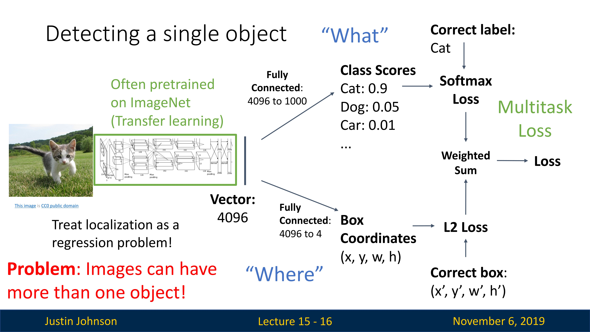

我们使用一个全连接层将特征向量降维到四维，也就是边界框的坐标，然后使用损失函数进行训练，比如说L2正则化损失，然后就有两个损失函数，因为我们要求我们的模型预测两种不同的事物，但为了计算梯度下降，我们实际上只需要以单个标量的损失函数来完成，所以我们只能将两个损失函数加权求和，得到一个总的损失函数，以此来克服这个问题

这么做的原因主要有两个：

1. **捕捉不同的任务目标**：在目标检测任务中，我们的目标是识别出图像中的对象（分类任务），并确定它们的位置（回归任务）。这两个任务有不同的目标，因此需要不同的损失函数来衡量模型在这两个任务上的表现。通过将这两个损失函数结合起来，我们可以同时优化模型在两个任务上的表现来得到一个多任务模型。
2. **权衡不同任务的重要性**：不同的任务可能需要不同的权重。例如，对于某些应用，准确地确定对象的位置可能比正确地分类对象更重要。在这种情况下，我们可以通过增大回归损失的权重，使模型更重视位置预测的准确性。权重的选择通常需要基于实际问题和数据进行调整。

这是一个多任务网络模型，我们想训练一个网络来同时完成多个任务

## 检测多个对象

但是我们想检测的图片里面，对象的数量是不定的，所以我们需要从网络模型中输出很多不同的数字，或者说我们需要模型为图像中可能看到的每个不同物体输出可变数量的对象，有一种相对简单的方法可以做到这一点，称为**目标检测的滑动窗口方法**

我们的想法是，假设一个有了一个训练好的CNN，让它对输入图像的窗口或者说子区域进行分类，每个子窗口输出一个类别，但是注意一下，如果我们想检测N个类别，那么实际上的输出是N+1个类别，额外增加的一个是背景类别

比如说下图中，第一个滑动窗口检测的是背景，所以实际上应该输出背景类别，并且没有边界框输出

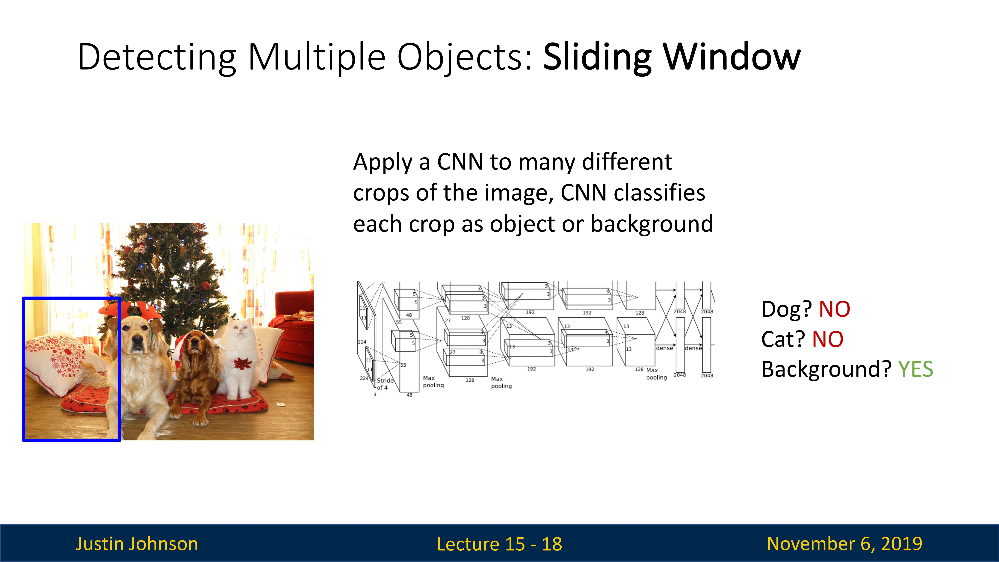

第二个窗口里面是狗，所以输出也是狗

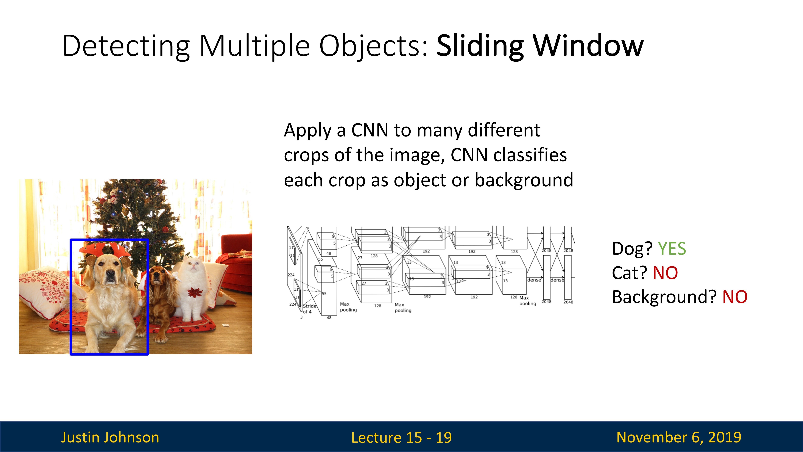

但是，如果我们有一个$H\times W$的的图像输入，就会有更多种可能的位置，假设我们的边界框的大小为$h\times w$，那么可能的x洲位置就有$W-w+1$种，可能的y轴位置有$H-h+1$种，那么可能的位置就有$(W-w+1)\times (H-h+1)$种，这是一个非常庞大的数字

如果我们考虑所有大小的盒子，那么这个数字更为庞大，是
$$
\sum_{h=1}^H\sum_{w=1}^W(W− w + 1)(H − ℎ + 1)\\
=\frac{H(H+1)}{2}\frac{W(W+1)}{2}
$$
这是一个天文数字，我们的硬件无法支持如此庞大的计算量，所以我们必须想办法去解决这个问题

## 候选区域（Region Proposals）

这个想法就是，在图像每个可能区域上评估目标检测器

使用算法在图像中生成一组候选区域，以便候选区域给出一个相对小的集合，这些区域很可能覆盖图像中的所有对象

当然，这只是一个想法，并且最终会被神经网络所取代，所以无需过多关注

## R-CNN：Region-Based CNN

R-CNN是14年CVPR的一篇论文，可以说是目标检测方法的起点，具有非常高的影响力（可以说是深度学习中最有影响力的论文之一了），但是他的工作方式实际上非常简单

从输入图像开始，然后运行候选区域方法，比如说选择性搜索，然后选择性搜索会给出一些图像中的候选区域（这个一些可能是数百甚至上千个候选区域），这些候选区域可能是不同大小和不同纵横比，所以我们需要将每个候选区域变为统一的224x224大小（需要图像放缩的方法），然后单独输入到CNN中进行分类，然后由分类结果判断是否包含对象（或者只是背景）

但是，上面的方法不足以解决所有问题，比如说候选区域与我们想在图像中检测的对象不完全匹配，例如一个候选区域里面包含了一个马的一部分，另一个区域包含了另一部分这样子，而且这里的边界框只不过是完成了输出，输出的边界框没有进行学习

所以我们需要改善我们的方法，也就是使得输出的边界框可以自我学习，或者说我们应用一个新的损失函数来进行学习

CNN还要输出一个额外的变换，将候选区域框转换为我们实际需要的包含目标的最终框，或者说这是一个回归的想法，我们想修改候选区域，让其可以适应图像中的目标

总的来说，R-CNN的步骤如下

1. 使用候选区域法，计算出两千个候选区域
2. 将每个区域变为统一大小，独立使用CNN进行标签和边界框预测
3. 使用阈值来选择框
4. 与真实标签进行对比

当然，R-CNN的这种方式是非常慢的，因为我们需要进行两千次的前向推理，所以我们需要想一些方法来减小计算量，但是在这之前，我们先介绍一下R-CNN中的一些指标，或者说目标检测中的一些评价指标

## 比较边界框：交并比

我们使用算法预测了一个边界框，但是我们如何去判断这个边界框是否位置和大小都合适呢？所以我们需要使用一种叫做Intersection over Union（IoU）的方法去进行对比，我们使用这种方式去计算两个盒子之间的相似性

首先，我们计算两个边界框的交集，也就是图像中橙色的部分，然后计算两个边界框直接的并集（有点类似于和空间的概念），也就是图像中的紫色部分，可知计算结果是一个0-1之间的数字（这个叫做**交并比或者IoU**），而且数字越高，边界框之间的匹配程度越好

看下图，IoU是0.54，可知两者并不是十分匹配，看图也可以看到效果

如果IoU是0.9，就可以发现，基本上二者高度一致

但是实际上还有另一个问题，那就是实际上，这些对象检测方法通常会输出一组重叠的边界框，这些框都围绕着相同的对象，如下图所示，图像中有两只小狗，但是目标检测器输出了四个边界框，并且每一个都包括了实际上的小狗对象，所以我们需要某种机制来减少边界框的数量

## 筛选边界框：非极大值抑制

上面我们说到，在目标检测任务中，目标检测器会输出非常多的框（这个也是原始输出），这些框的数量会远超图像中目标的数量，同时可能会在同一个物体的不同位置产生多个边界框。这些边界框可能会有很大的重叠，而我们通常只希望保留一个边界框来表示一个物体。因此，我们需要一种方法来去除这些重叠的边界（或者选出最合适的边界框，消除冗余边界框），也就是使用**非极大值抑制（Non-Max Suppression，NMS）**的方法去筛选出最合适的边界框

以上面这张图为例，图像中有两个目标（都是狗），但是有四个原始边界框，每个边界框都带有不同的分类概率（概率由CNN计算），那么我们如何进行筛选呢？

1. 对所有候选的边界框根据其得分（一般是模型预测的置信度或类别概率）进行降序排序，选取得分最高的边界框，并将其加入到最终结果列表中
2. 计算这个得分最高的边界框与其他所有候选边界框的交并比，移除那些与得分最高的边界框具有高I交并比（通常设定一个**阈值或者threshold**，例如0.7）的所有候选边界框
3. 如果还有其他边界框存在，继续上面的处理

NMS的基本思想是，对于重叠的边界框，我们只保留得分（例如，目标检测模型预测的置信度或类别概率）最高的一个，同时抑制（即删除）其他的边界框。在实际操作中，我们通常会设置一个交并比（Intersection over Union, IoU）阈值，如果两个边界框的IoU超过这个阈值，那么得分较低的边界框就会被删除。

通过NMS，我们可以有效地减少冗余的边界框，使得每个物体只被一个边界框表示，从而提高了目标检测的准确性和效率（如下图所示）。

这是一个十分合理的算法，并且基本上所有的目标检测算法都依赖于某种非极大值抑制算法来消除冗余边界框，当然，非极大值抑制算法也有一点问题，那就是如果图像中有很多高度重叠的对象，会造成一些麻烦，而且实际上并没有一个很好的解决方法

## 评价物体检测器：平均精度（mAP）

我们前面找到了IoU这种方法来判断物体检测器在在单个图像上的性能表现，但是我们还需要一种在数据集上评价物体检测器表现的指标，也就是mAP指标

在理解mAP之前，需要先理解Precision和Recall两个概念，以及它们与ROC曲线和PR曲线的关系。

1. Precision：也叫查准率，表示所有被模型判定为正样本中，真正的正样本的比例。
2. Recall：也叫查全率，表示所有真正的正样本中，被模型判定为正样本的比例。

在目标检测任务中，通常会为每个物体类别绘制一个PR曲线（Precision-Recall曲线），然后计算该曲线下的面积，即AP（Average Precision，平均精度）。AP值越高，说明模型在该类别的检测性能越好。

mAP则是所有类别AP值的平均，它能够反映出模型在整个数据集上的整体性能。

计算mAP的方法如下

1. 在所有测试图像上运行物体检测器（用NMS）

2. 对于每个类别，计算平均精度（AP），这个等于精度与召回率曲线下的面积（对每个类别独立计算）

   1. 对于该类别中的每个检测（从最高分到最低分，检测结果来自于整个测试数据集）来说

      - 如果它与一些**GT边界框（Ground-Truth Box）**相匹配，且IoU>0.5,将其标记为正并且认为这是一个正确的检测，并消除该GT边界框

      - 如果不能匹配任何一个GT边界框，那么标记为负值

      - 基于检测是否正确，在PR曲线上画出一个点（如下图所示）

        

      - 不过注意一下，这里计算的方式是累计的，比如说第一个0.99置信度的检测匹配了一个GT边界框，那么就算一个正样例，第二个0.95置信度的检测匹配了另一个GT边界框，再次画点的时候是加上之前的计算的

   2. 平均精度（AP）就是PR曲线下的面积，是一个0到1之间的数，比如说在这里，狗类别的AP就是0.86

      

3. 平均精度（mAP）就是所有类别的平均精度的平均数

至于为什么使用这种指标来评估物体检测器，那是因为对于不同的程序，你可能希望有不同的选择，你可能需要不同的权衡，比如说在自动驾驶中不希望误判任何周围物体，或者在某些程序中，误判是可以容忍的，所以不同的用例需要不同的阈值和精度之间进行权衡

但通过计算这个平均精度指标，它总结了精度和召回之间权衡的所有可能点，所以这就是为什么人们倾向于使用这个指标来评估对象检测

实际上，mAP的优点如下：

1. **全面性**：mAP考虑了检测模型的查准率（Precision）和查全率（Recall），这两个指标反映了模型在精确性和覆盖率方面的表现。只有当模型在这两方面都表现良好时，mAP值才会高。
2. **平均性**：mAP是所有类别的平均精度（AP）的平均值，因此它能够反映模型在整个数据集上的总体性能，而不仅仅是在某个类别或某个图片上的性能。
3. **稳健性**：在目标检测任务中，预测结果的置信度阈值的选择可能会对模型的性能产生很大影响。mAP通过对所有可能的阈值进行平均，使得模型的性能评估更加稳健，不受阈值选择的影响。
4. **易于比较**：mAP提供了一个单一的、范围在0到1之间的分数，因此它很容易用来比较不同模型的性能。
5. **广泛接受**：mAP是目标检测任务中最常用的性能评估指标，许多比赛和研究论文都使用它来评估模型的性能。因此，使用mAP可以方便地与其他模型进行比较。

这里我们计算平均精度的方式，决定了它实际上并不关心定位框是否表现很好，因为当我们计算的时候，边界框的交并比阈值是0.5，所以我们是否获得真正准确的检测实际上并不重要，故在计算mAP的时候会使用不同的交并比阈值，这主要是为了评估目标检测模型在不同严格度的匹配条件下的性能

## Fast R-CNN

上面我们所说的R-CNN太慢，可以成为Slow R-CNN，所以研究者提出了一种新的方法，可以更快的完成目标检测任务，也就是Fast R-CNN

其相比于R-CNN的改进就是，改变了卷积处理和扭曲图像的顺序，在扭曲图像之前进行卷积操作

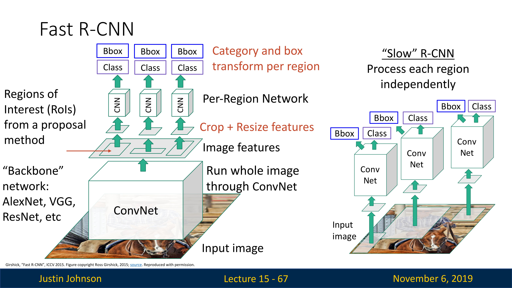

我们先使用一张卷积网络对整张图进行处理，提取特征得到特征图，这会为我们提供高分辨率图像的卷积特征，然后在特征图上进行候选区域法提取候选区域，进行变换，变换到指定大小，然后使用**区域网络（Per-Region Network）**完成分类

这会使得计算快很多，因为计算主要发生在**骨干网络（Backone）**中，也就是直接对原始图像输入提取特征图的地方，不过注意一下，这通常是通过预训练好的卷积神经网络（例如VGG16, ResNet等）来完成的，这样的网络通常包含多个卷积层和池化层，能够提取出图像的丰富特征。

然后我们得到了特征图，就在特征图上选择出一些**感兴趣区域（Regions of Interest，RoIs）**，然后对其进行裁剪（Crop）和变换（Resize），然后使用区域网络输出边界框和类别（如图所示），这里发生的计算很少，所以会很轻量化

也可以这样理解，目标检测本质上还是分类CNN的应用，只不过选择了一些更巧妙的算法

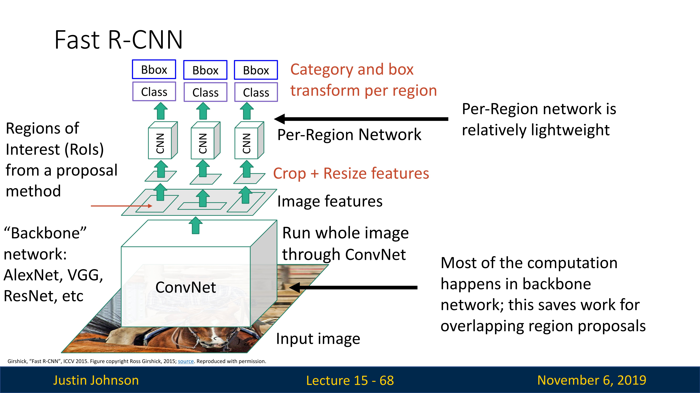

以AlexNet为例，骨干网络就是其所有的卷积层（下图中AlexNet绿色框中的部分），区域网络就是其最后两个全连接层

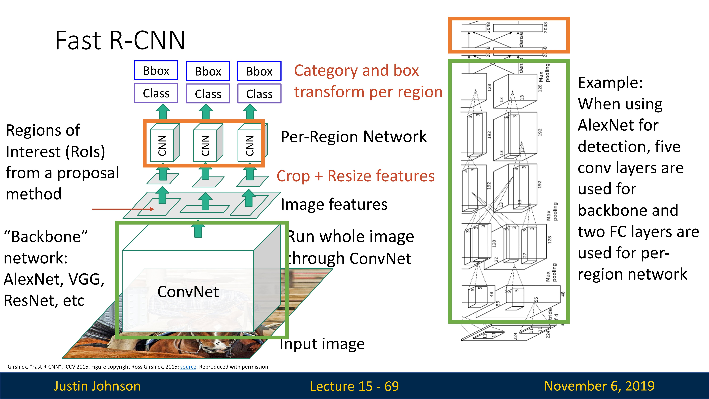

至于残差网络ResNet，我们使用最后一个卷积块作为区域网络，使用其余卷积块作为骨干网络

当然，其中还有一个问题，就是我们为什么要对特征图中的候选区域进行裁剪？又该如何完成裁剪呢？

### 特征裁剪：RoI池化

至于为什么要裁剪特征（Cropping Features），这是因为我们也需要针对骨干网络权重进行反向传播，所以我们需要一种可区分的方式裁剪这些特征，而这种方式就称为**RoI池化（RoI Pool）**，或者**感兴趣区域池化**

我们使用骨干网络进行特征提取的时候，会将区域投射到特征图上，不过特征图的长宽比保持不变（如下图所示，640x480的图像，特征图大小为20x15），因为这个网络是全卷积的，所以这个卷积特征图中的每个点都对应于输入图像中的点，我们可以做的是该区域投影到特征图上，然后我们可以捕捉那个特征

我们这样做，那个投影区域可能不会完全对齐到卷积特征图的网格（比如说特征图中一个特征向量可能对应原始图像中的32x32大小的区域），所以我们需要将特征图上的感兴趣区域投影分成大致相等的几部分（如下图所示），或者子区域

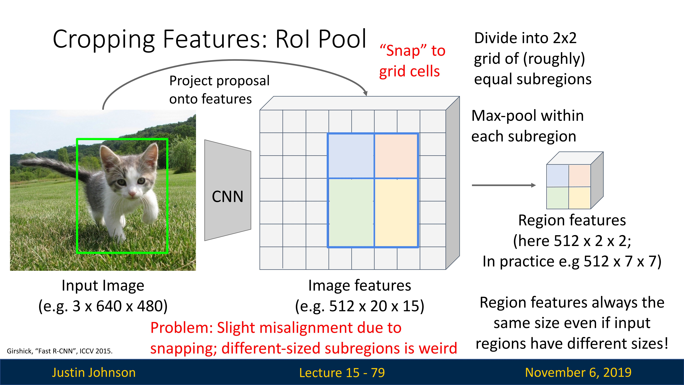

然后对每个子区域进行最大池化，得到一个区域特征向量

这意味着，尽管我们的输入区域可能有不同的大小，但是我们的RoI池化操作总是可以将其转化为应该相同的固定大小的张量，以便于我们将其提供给下游的CNN层，这样就便于我们去学习，当我们获得了上游梯度之后，我们就可以将其向下传播到图像特征中的相应区域

这对于训练Fast R-CNN非常重要，因为Fast R-CNN的损失函数包含了分类损失和边界框回归损失，我们需要通过反向传播来更新网络参数以最小化这个损失函数。通过RoI Pooling层的反向传播，我们可以将这个损失函数的梯度传播到前面的卷积层和全连接层，从而更新这些层的参数。

### RoI对齐

当然，这里还有一点小问题，那就是特征与原始区域可能存在未对齐的情况，这会影响检测精度，所以我们有一种对齐方法，也就是**RoI Align**

RoI Align操作的目标是消除这种量化引入的对齐误差。它首先按照RoI的精确坐标和大小（不进行量化）将RoI划分为固定大小的网格，然后在每个网格内进行双线性插值，从而得到该网格的特征值。这样，RoI Align可以提取出与原始RoI精确对齐的特征，从而提高检测的精度。

RoI Align是Fast R-CNN中的一个关键组成部分，它解决了Fast R-CNN中RoI Pooling的对齐问题，使得模型能够更精确地进行目标检测和实例分割。因此，如果你的任务需要精确的空间位置信息（例如，像素级的实例分割），那么使用RoI Align会是一个更好的选择。

### 性能对比

我们将R-CNN和Fast R-CNN的训练耗时和推理耗时进行对比

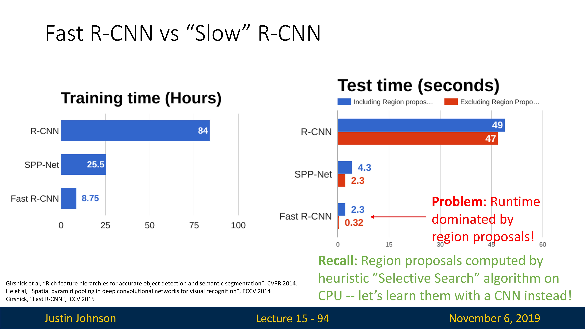

可以看到，在训练耗时上，二者相差十倍，在推理耗时上二者差距更大

## Faster R-CNN

我们想找到一些使用神经网络的方法来实际计算候选区域，希望继续改善

这种就是Faster R-CNN

首先，我们可以消除选择性搜索（这是一个启发式算法），然后训练一个卷积神经网络来预测我们的候选区域

我们来看一下Faster R-CNN的架构，我们首先使用骨干网络来提取特征，然后插入一个很小的网络，叫做**候选区域网络（Region Proposal Network，RPN）**，负责预测候选区域（如下图所示）

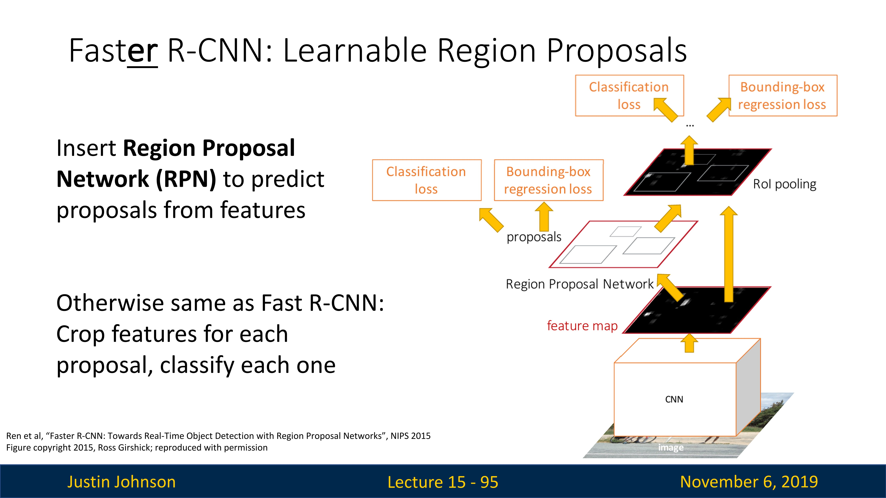

对于这个RPN呢，我们需要去了解它是如何工作的

首先，我们使用骨干网络将输入图像转化为特征图，这个时候，特征图与输入图像在位置上是对齐的，所以我们可以想象一个**锚框（anchor box）**，是一个固定大小的边界框，并且在特征图上滑动（如下图所示）

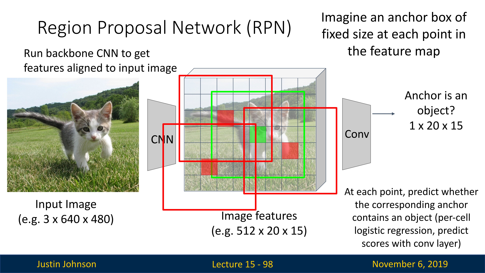

然后，我们训练一个小的神经网络，对这个锚框进行二分类（如上图所示），要么包括对象，要么不包括，当然这是一个很粗糙的分类方法，因为包括对象的地方可能包括的不是一个完整的对象，所以我们需要使用一种之前提到的方法——边界框变换，这将会把固定大小的锚框（下图绿色框）变为实际的边界框（下图黄色框），使用回归损失来训练

当然，这个还有不足，那就是固定大小的锚框通常没有足够的能力来捕获所有我们想识别的对象，所以我们在同一个地方使用若干个（或者说K个）不同形状的锚框来识别

这样我们就引入了很多超参数，比如说锚框的数量、比例和大小

当然我们再次进行性能对比的时候，就会发现，相当于Fast R-CNN，Faster R-CNN的速度又快了一个数量级

## 改进：单阶段目标检测

Faster R-CNN是目标检测的双阶段方法，这是因为算法内部有两个阶段的概念

第一个阶段就是骨干网络提取特征和RPN选择区域的阶段，将输出一些区域

第二个阶段是为每个区域进行特征裁剪和预测

但是有一个问题，那就是我们真的需要第二阶段吗？我们貌似实际上可以只使用第一阶段来完成所有的任务，以此达到更快的速度，这也就是**单阶段目标检测(Single-Stage Object Detection)**

在Faster R-CNN中，RPN输出的特征图，还要经过一个二分类来判断是不是目标，我们对其进行修改，直接使用一个分类网络输出所有类别（目标或者背景）和边界框变换

## SSD:Single Shot MultiBox Detector

这是一个很经典的单阶段目标检测算法，为16年ECCV的论文，超越了当时最强的Faster R-CNN

### 多尺度特征图

网络会在不同尺度的特征层上进行预测，这样可以提高对小目标的检测能力，这是SSD相比于Faster R-CNN的改进

Faster R-CNN的方法是先使用骨干网络提取特征，然后使用RPN预测一个区域，然后完成预测和回归等操作，但是随着高层语义化，图像的细节特征缺失，导致小目标检测效果很差，这是因为所有的预测都是在一个特征层上进行的，即骨干网络输出的特征层，这个特征层已经完成了高层语义化，细节特征缺失，对小目标的检测效果不好，那么我们在想，能不能在更低的层次上进行预测呢？答案是可以的，这也是SSD的一个改进

## 目标检测的变量选择

在目标检测中有一大堆超参数需要选择，比如说裁剪分辨率，锚框数量，锚框大小，IoU阈值，因为需要设置的超参数太多，很难在不同的对象检测方法之间进行公平比较

但是实际上2017年有一个非常棒的一篇论文实现了当时可用的所有对象检测方法，他们试图对所有这些不同的方法进行测试和比较，以便于人们在不同选择之间进行权衡

下图是测试结果，每个点都是训练好的目标检测器，x轴是GPU测试时的速度，y轴是mAP

从中可以看出，单阶段目标检测方法的速度更快，但是精度更低，双阶段的方法效率更低，但是精度更好，同时更大的主干网络会使得表现更好，但是计算速度更低

当然，随着技术的发展，GPU越来越强大，也有了更多方法去提高目标检测器的性能，下图就给出了很多方法去提高性能

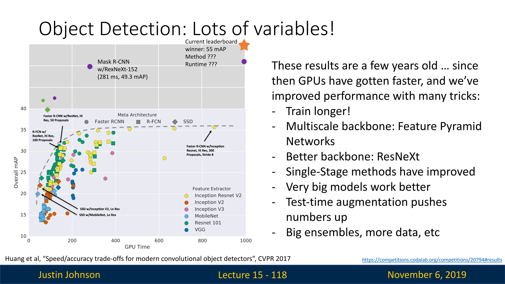

## CornerNet

这是一种新的目标检测方式，与上文中的预测边界框位置/边长的方式不同，它的思想是预测出物体的左上角和右下角，进而完成边界框的标示

以下是CornerNet的主要特点：

1. **关键点检测**：CornerNet的主要思想是将目标检测问题转化为关键点检测问题。具体来说，它试图检测目标的两个对角点，而不是预测目标的边界框。这种方法避免了对目标形状和大小的预设假设，使得模型能够更灵活地处理各种形状和大小的目标。
2. **双分支网络结构**：CornerNet使用一个双分支网络结构来分别预测目标的左上角和右下角。这两个分支共享卷积层，但在最后几层中分别进行预测。
3. **Corner Pooling**：CornerNet引入了一种名为Corner Pooling的新颖操作，它可以帮助网络更好地定位目标的角点。Corner Pooling操作可以捕获图像中的水平和垂直信息，从而提高角点的定位精度。
4. **训练和推理**：CornerNet使用了一种基于Focal Loss的损失函数来训练模型，这可以帮助模型更好地处理正负样本之间的不平衡问题。在推理阶段，CornerNet使用了一种名为Pairing的策略来匹配左上角和右下角，从而生成最终的检测结果。
5. **性能**：CornerNet在COCO数据集上的性能优于许多传统的目标检测方法，这表明关键点检测的方法在目标检测任务上是有效的。

总的来说，CornerNet是一种基于关键点检测的新颖的目标检测方法，它提供了一种避免预设目标形状和大小的新思路。

这个模型首先也是有一个骨干网络来提取特征，得到一个多维的**热力图（Heatmap）**，其含有C个通道（每个通道可能对应一个类别）

# YOLO系列

YOLO（You Only Look Once）是一种实时性高的目标检测框架

## YOLOv1

这是最早的YOLO文章，即You Only Look Once: Unified, Real-Time Object Detection，作者提出了一种统一的检测方案，并且使用DarkNet库实现了算法的工程化，并且可以端到端学习，不过缺点就是无法接受任意大小的图片输入，只能接受固定大小的图片输入

这里的主要创新点有以下几个

1. 神经网络对整张图片的特征进行处理，换句话说，神经网络可以直接看到一整张图片，因此可以对类及其外观的上下文信息进行隐式的编码
2. 不同于之前的目标检测框架，YOLO将不同的模块整合为单一的框架，并且同时预测所有边界框，使得速度大大提高，同时可以使用更少的卷积层来得到更快的YOLO版本（Fast YOLO）

网络会将图片分为SxS个网格，如果一个目标的中心落在某个网格中，这个网格就会有响应，每个网格单元预测B个边界框和对应的置信度得分，这些都会经过归一化处理，共计五个实数：x，y，w，h，confidence，xy是目标中心坐标，wh是边界框宽高，置信度也表示了IOU指标，当一个网格单元中不包括目标时，就会使得其置信度趋于零

因为有SxS个网格单元，每个单元预测B个边界框，边界框有五种属性，同时数据集有C种类别，那么预测结果就是一个三维张量，形状为SxSx（5xB+C）