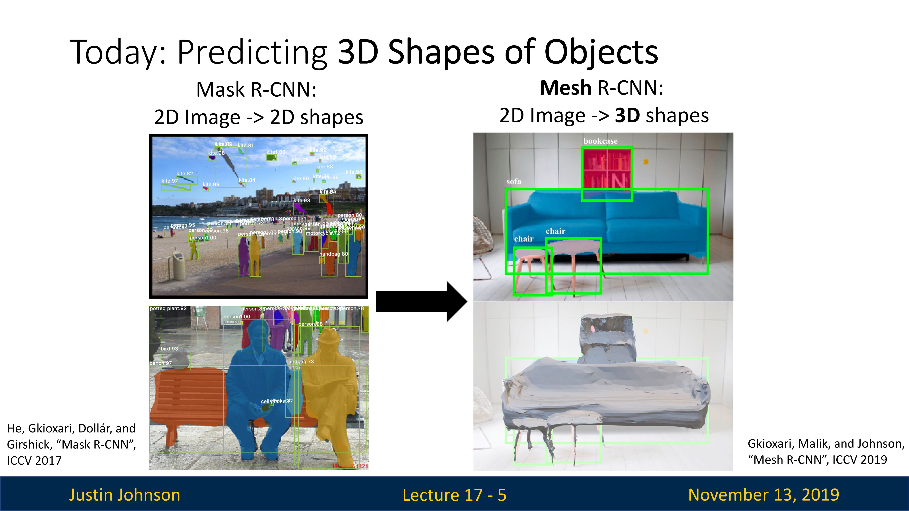
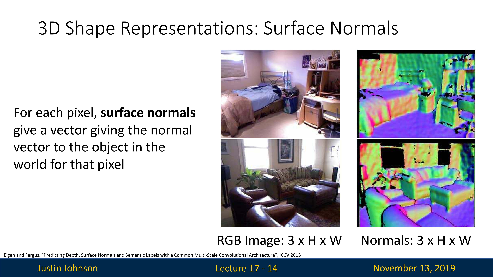
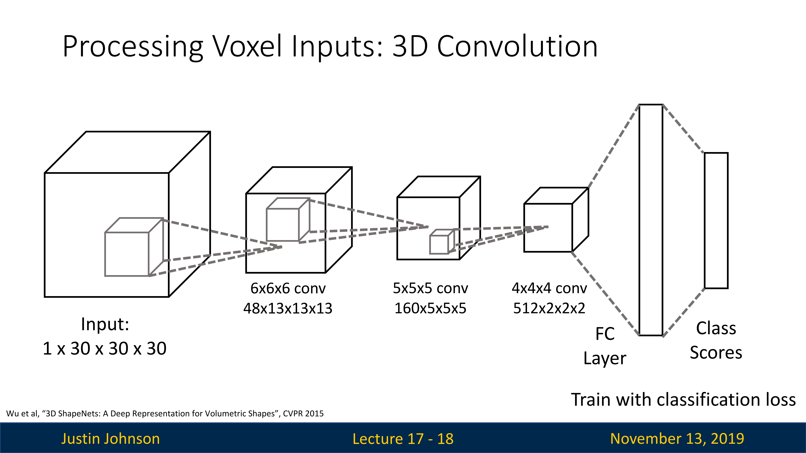
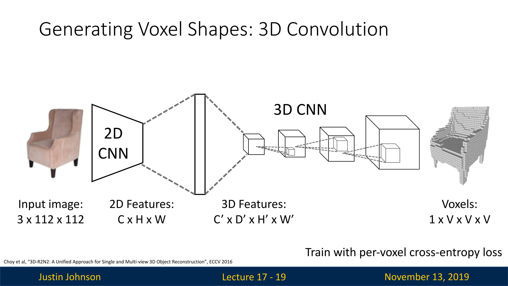
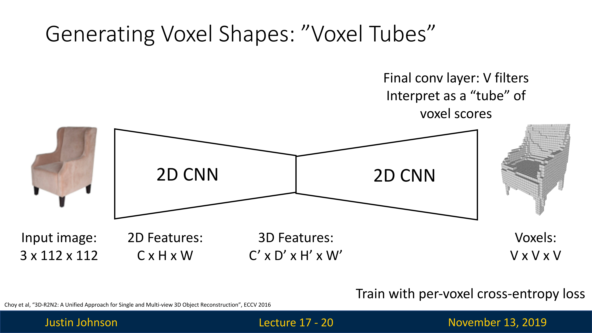

# 三维视觉概述

前面我们我们讨论了视觉中的不同任务，包括语义分割，目标检测，实例分割等等，我们还讨论了关键点估计的一些话题，这些算法在实际生活中有非常多的应用，当然，这些算法都是基于二维图像的

但是，我们的世界不是二维的，而是三维的，这是一个完全独立的研究领域，研究如何增加空间维度到我们的神经网络模型，所以今天的内容就是如何将三维信息传递到神经网络模型中

## 两类问题

我们这里要关注两类问题

第一个就是从单个图像预测三维形状的任务（如下图所示），我们输入一些彩色图像，然后输出该图像中对象的三维形状的表示

第二个就是形状预测的任务，输入一些三维形状数据，然后进行预测，比如说分类或者分割任务

这些任务都是基于监督学习的，所以我们有一个带有输入图像和对象三维形状的训练集（或者三维形状和对应标签的）

## 三维视觉中的更多主题

三维视觉的内容不仅仅是完成分类分割，实际上还有更多的相关主题（很多主题并不是基于深度学习方法的），这是因为三维视觉会涉及对象和世界的三维结构

我们可能有这样一直想法，就是我们想输入一个视频序列，这是一个二维图像帧序列，然后我们想通过视频，预测或者重建摄像机穿过三维世界的轨迹

但是在这里我们只涉及两部分，一个是有监督形状预测，一个是有监督形状分类

# 三维形状表示（3D Shape Representations）

首先，我们应该如何去表述三维形状呢？我们这里有五种表示方式，可以用来模拟三维形状和信息，这也是人们常用的类型，有不同的优缺点，每一种都可以用神经网络模型去预测和处理

下图中展示了五种表达方式，每一种都是相同底层三维形状的不同表示

## 深度图（Depth Map）

### 概念

深度图在概念上是一个非常简单的三维形状表示，深度图的作用是对于输入图像中的每个像素，分配从相机到该像素的距离，因为图像中的每个像素都对应于现实世界中的某个对象，现在深度图告诉我们，对于图像中的每个像素，相机与该像素试图表示的现实世界中的那个位置之间的距离是多少，单位是米。

不过深度图比以往的RGB图要多一个网格，其中每个像素值给了我们一个深度信息，有些类似于RGB图像的二维网格，只不过像素的值不是颜色，而是“深度”，以米为单位的深度，然后将其与RGB图像结合，深度作为第四个信息通道，提供深度信息

或者我们可以叫他为2.5D图像或者RGB-D图像，因为深度图不像一个真正的完整三维表示，因为它的缺点是不能正确捕捉被遮挡物体的结构，比如说上图中，书柜的一部分被沙发遮挡了，那么相应的深度图就没有沙发后面书柜的任何三维表示，所以说RGB-D只能表示图像的可见部分，出于这个原因，我们可能认为它是一种不是很强大或者不是很通用的三维表示

但是这种深度图类型的数据是很重要的，因为我们可以使用各种原始3D传感器去捕获深度图数据，比如说结构光相机

### 深度预测

不过我们可以想尝试一个任务，就是输入一个普通RGB图像，然后尝试逐像素地预测相机到对应物体的距离（如下图所示），使用全卷积网络完成这个深度预测任务

但是实际上这是不太可行的，因为在三维视觉中，会有**尺度/深度歧义（Scale / Depth Ambiguity）**的问题，比如说对于一张图片，无法区分出远处大物体和近处小物体，或者说仅通过单张二维图像，我们无法准确地确定物体的实际大小和距离

如下图所示，大猫是小猫的两倍大小，但是与相机的距离也是小猫的两倍，那么看起来是完全一样的大小

也就是说，绝对尺度和绝对深度在单个二维图像中并不明确，所以会产生这种问题，所以在处理任何类型的三维表示或者三维预测问题的时候，考虑这个潜在的问题是很有必要的

但是我们可以通过改变神经网络的结构来处理尺度/深度歧义问题，或者说我们可以通过改进损失函数来完成深度预测问题

因为尺度和深度实际上是不变的，假设我们的网络模型预测了一个深度，达到了Ground Truth Depth的某个恒定比例，那么上图中的尺度不变损失函数仍会将这个情况认定为零损失，或者说，这个尺度不变损失函数只会关心预测深度是不是匹配真实深度的某个固定倍数，这个属性细节叫做比例方差

### 表面法线（Surface Normals）

这是第二种三维形状表示，想法上与RGB-D深度图很接近，只不过在这里，我们给每个像素分配的是一个单位向量（或者说法线）

每个表面点的法线都是垂直于该表面的单位向量。对于平面，法线的方向是确定的，但对于曲面，每个点的法线可能都不同。在计算机图形学和计算机视觉中，表面法线被广泛用于光照计算，以判断物体表面的亮度和颜色。

理解表面法线也对物体识别和场景理解有重要作用。例如，通过分析一幅图像中的表面法线，我们可以推断出物体的形状和结构。在一些深度学习应用中，表面法线也被用作一种重要的特征来帮助模型更好地理解场景。

不过在这里，我们会使用RGB颜色来绘制法线的情况，比如说上图中，蓝紫色表示法向量是向上的，红色表示向前的

当然我们也可以使用一个网络来预测表面法线，我们可以输入RGB图像，然后去预测每个位置的三维向量

然后我们的损失函数是对比两个法向量之间角度的差异，这里我们使用点积除以范数的方式进行归一化，以此来训练网络

或者可以训练一个联合网络，同时完成语义分割、深度估计和表面法线估计

这是一个相对简单的表示，但是在实践中是有用的，因为一旦有了深度图和表面法线，就可以得到很多关于图像三维结构的信息

当然，缺点还是不能表示被遮挡的地方

## 体素网格（Voxel Grid）

### 概念

"Voxel"是"volume"（体积）和"pixel"（像素）的结合词，指的是在三维空间中的像素，也就是体素

体素网格就像是三维的像素网格，它将三维空间划分成了一系列的小立方体（也就是体素），可以使用某些方法看到每个体素是否被占用（比如一个bool值），这有点像我的世界一样。每个体素都可以存储一些信息，例如颜色、密度、表面法线等，有点像Mask R-CNN中物体背景和前景的表示。通过这种方式，我们可以在计算机中表示和处理三维对象。

体素网格在许多领域都有应用，如计算机图形学、医学成像、地质科学和机器人导航等。例如，在计算机图形学中，体素网格可以用于渲染复杂的三维场景；在医学成像中，MRI和CT扫描的结果通常就是体素网格；在机器人导航中，体素网格可以用于表示环境并进行路径规划。

然而，体素网格也有一些缺点，例如它需要大量的存储空间，而且处理速度可能比较慢，尤其是在需要捕捉非常精细的细节的时候，分辨率回非常高，比如说图中的椅子就使用了非常多的像素。因此，在实际应用中，人们经常使用各种优化技术，如八叉树（Octree）和稀疏哈希表（Sparse Hashing），来高效地存储和处理体素网格。

### 处理：三维卷积

如果我们想对这些体素网格进行分类的话，一样可以使用卷积网络的架构，不过我们需要使用一种三维卷积的方式去完成

输入数据是一个原始的体素网格，每个点都有占用或者未占用两种情况，如何我们使用三维卷积核（类似于一个立方体）去滑动来计算内积，有点类似于一个立方体滑动着遍历这个空间的每个地方，然后产生下一层的标量输出，若干次卷积处理之后进入分类层，这在架构上与之前的二维卷积完全一致

当然，这里维度还是稍微有所不同的，每个阶段的张量都是一个四维张量，三个空间维度和一个特征维度（或者通道维度，表示体素是否被占用，这个是二进制的）

### 预测体素：三维卷积

我们下一个想完成的任务就是使用RGB图像去预测三维形状的体素网格

左边输入的是一个RGB图像，两个空间维度和一个RGB通道维度，我们需要预测一个四维张量，带有三个通道维度和一个通道维度，可以通过网格中每个点的占用概率信息，这需要我们设置一些架构，来添加额外的空间维度，然后使用交叉熵损失来训练这个网络

一种常见的完成这个任务的方式就是使用桥接的方式去连接不同维度的张量

首先我们对这个RGB图像使用卷积网络处理得到二维图像的特征图（这是一个三维张量，空间维度加一个特征维度），然后展开成一个特征向量，然后使用一个全连接层将其重塑为四维张量，然后我们就可以使用上采样方式得到三维表示

当然，这种方式的计算成本很大，所以并不适合

### 预测体素：体素管

"Voxel Tubes"是一种从二维图像生成三维体素网格的方法。这个方法基于一个假设，即每个像素的颜色和亮度都对应于一个小的、垂直于图像平面的体素管（Voxel Tube）。这些体素管可以被组合在一起，形成一个完整的三维体素网格。

在这个方法中，每个体素管的高度（也就是在深度方向上的大小）可以由图像的亮度决定，而宽度和长度（在图像平面上的大小）可以由像素的大小决定。这样，我们就可以从一个二维图像生成一个粗糙的三维体素网格。

然而，这个方法有一些限制。首先，它假设图像中的每个像素都对应于一个体素管，这在许多情况下可能并不成立。例如，对于遮挡和反射等现象，这个方法可能无法处理。其次，这个方法生成的体素网格可能比较粗糙，不能精确地表示物体的形状。

为了解决这些问题，我们可以使用深度学习的方法，如卷积神经网络和生成对抗网络（GAN），来改进这个过程。这些方法可以学习从二维图像到三维体素网格的映射关系，生成更精确和细致的体素网格。