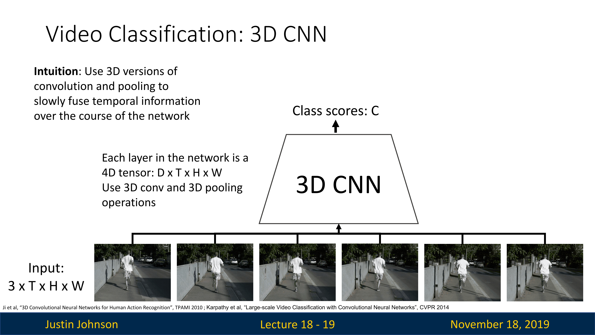
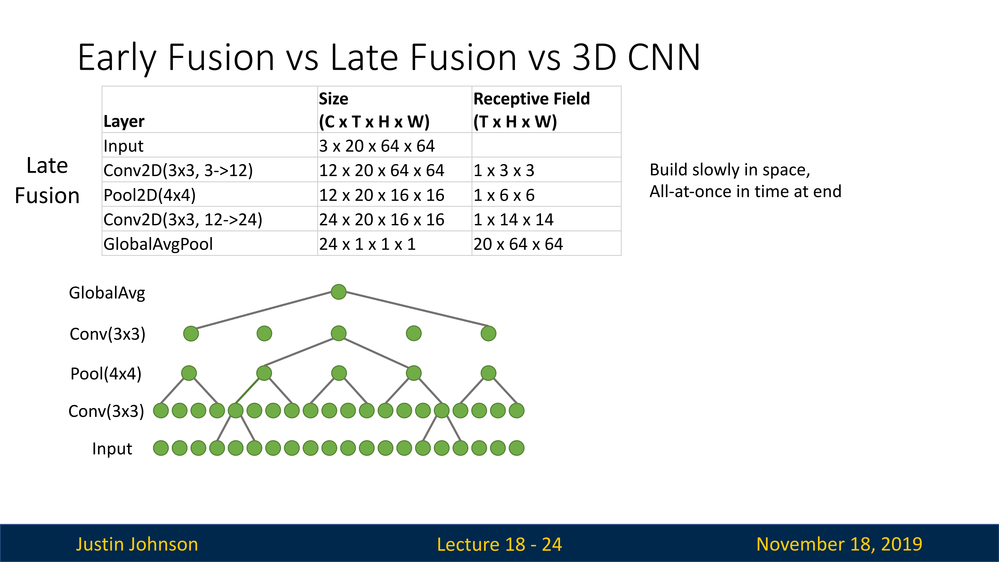
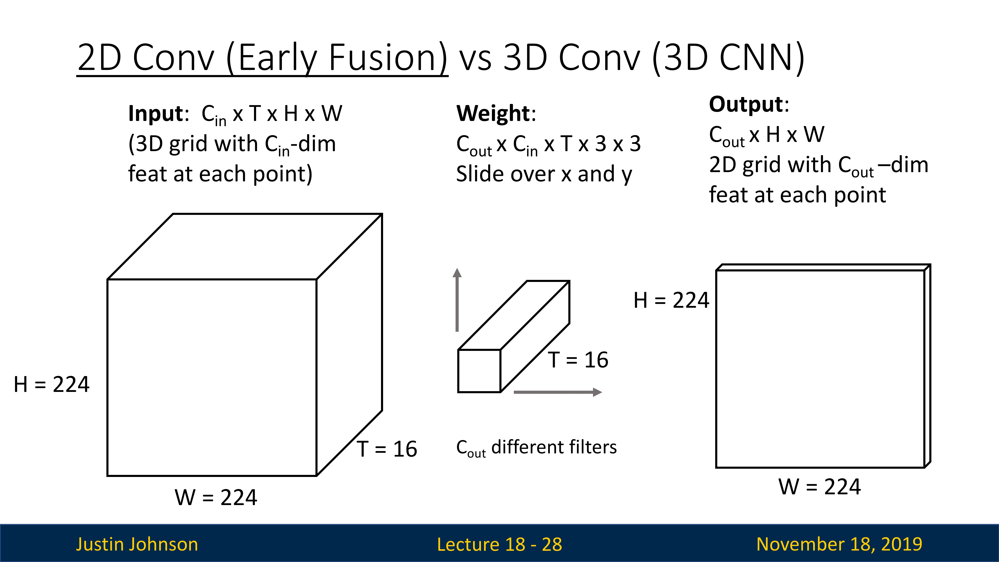

# 视频

## 概念

我们之前介绍了三维视觉，实际上三维视觉就是在二维视觉的基础上增加了一个空间维度，今天我们要讨论的视频，实际上也是这样的，不过这里增加的是一个时间维度，**视频就是一个随时间展开的图像序列**，或者说视频就是一个四维张量，两个空间维度，一个时间维度，一个通道维度

当然，这里的预测就复杂一些，因为传统的目标检测任务我们只需要确定单个图像中的不同对象就可以，但是在视频任务中，我们需要对动作来进行分类或者语义分割，数据集是一些带有类别标签的视频，损失函数毫无疑问就是交叉熵损失

实际上，我们在视频中识别是很有用的，我们在二维识别任务的时候，经常识别物体，但是这些都是具有某种空间范围的物体，但是在视频序列中，我们要分类的是动作或者活动，比如说游泳、跑步等等，这与二维任务有很大的区别

还有一点需要指出，大多数时候，在视频中我们所关心的动作实际上不仅仅是任意动作，而是人类正在执行的实际动作，所以实际上你会发现视频分类数据集的大部分视频中，大多数人都有一个类别标签，对应不同类型的动作

## 限制

但是，在视频分析中有一些限制，就是视频数据集很大，这是一个处理视频数据时候需要克服的主要限制

以每秒30帧的速度拍摄的视频，如果空间分辨率是640x480的话，那么每分钟会产生1.5GB的数据，这就是原始的视频数据集，如果是高清格式的1920x1080的话，一分钟的视频会是10GB大小，我们无法将如此之大的数据放入我们的GPU显存

当然也是有解决方法的，那就是我们只在一个短视频片段上进行训练，并且这个视频片段的帧率会比较低（通过采样方式），同时我们可能会使用各种下采样操作使得视频空间分辨率更低，这样就容易训练，比如说一段三五秒并且帧率为五的视频，大小可能为数百KB，或许这不是一个很好的方法，但是在计算限制的情况下，为了使得神经网络可以训练，我们不得不这样处理

在原始视频中，时间长，帧率高，所以我们在训练的时候，需要进行剪辑和子采样，得到一些**片段（Clips）**去训练；在测试的时候，我们可以在原始视频的不同地方进行测试

## 视频分类：单帧CNN（Single-Frame CNN）

在视频分类中，"Single-Frame CNN" 是一种基于单帧图像的卷积神经网络方法， "Single-Frame" 指的是单个帧图像，也就是视频的每一帧。该方法将视频分类任务简化为对视频中每个单独帧图像进行分类，并使用单帧的特征来表示整个视频，训练和测试也都是在单帧上进行。

这种方法的主要思想是将视频中的每个帧图像作为独立的样本，通过单帧图像的特征提取和分类来对整个视频进行分类。通常，这个方法将每个单帧图像输入网络中，提取图像的特征表示，然后通过全连接层或其他分类层进行视频分类。

这种方法的优点是简单直观，易于实现和理解。它适用于那些不涉及时间序列建模和动态变化的视频分类任务，例如静态场景下的动作识别或物体识别。

但是缺点是，他忽略了序列中的上下文信息，或者说忽略了时间维度的结构，对应动态场景下的视频分类可能有所不足

不过，这也是一个非常强大的Baseline，后面可以在上面进行各种的改进，去适应不同的视频分类任务

## 后期融合（Late Fusion ）

在视频分类中，"Late Fusion" 是一种融合多个模态（或多个特征）的方法，其中各个模态或特征的融合发生在分类的最后阶段。

"Late Fusion" 的基本思想是，首先对每个帧进行独立的处理，然后在最后阶段将它们的分类结果进行融合，以得到最终的视频分类结果。

每个输入图像都有四个特征维度，经过CNN提取特征之后，有时间维度、通道维度和两个空间维度，进行展开之后就变成一个很长的特征向量（融合了所有信息），然后使用多层感知机进行分类。这是最早的融合方法。

具体而言，"Late Fusion" 方法可以应用于多个不同的特征表示，如图像特征、音频特征和文本特征等。对于每个特征，可以使用相应的模型（如卷积神经网络、循环神经网络、文本分类模型等）进行处理和分类。然后，通过一定的融合策略（如简单的加权求和、投票或决策级联等），将各个特征的分类结果组合起来，得到最终的视频分类结果。

当然这种方法因为可学习参数过多，容易导致过拟合，所以我们进行了一些改进，我们使用全局平均池化方法，整合了所有的空间信息和时间信息，然后使用一个线性层进行分类，这也是一个简单的方法

后期融合的方式有一些缺陷，比如说上图中的多帧图像，人在重复性的完成抬脚这个动作，但是后期融合方法很难学习到输入视频帧中相邻像素之间的交互，因为我们实际上是将图像信息总结到一个向量中，所以网络难以比较这些低级像素

实际上后期融合也存在一些问题和缺陷，包括：

1. 信息丢失：由于每个模态或特征在分类前都是独立处理的，"Late Fusion" 可能会导致一些模态之间的信息丢失。模态之间的相互关系和交互可能无法被充分利用，从而降低了整体的分类性能。
2. 计算复杂性：当涉及到大量模态或特征时，"Late Fusion" 需要在最后阶段对各个模态的分类结果进行融合。这可能会增加计算复杂性和时间开销，尤其是在处理大规模视频数据时。
3. 高度依赖特征提取："Late Fusion" 方法的性能很大程度上依赖于每个模态或特征的独立特征提取过程。如果某个模态的特征提取不准确或不可靠，整个融合结果可能会受到影响。
4. 缺乏模态关联性：在 "Late Fusion" 中，模态之间的关联性和时序信息没有得到充分考虑。视频中的模态可能是相互关联的（如图像和音频），而 "Late Fusion" 无法有效利用这些关联性，导致潜在的信息损失。

为了克服这些问题，研究人员已经提出了其他融合策略和方法，如早期融合（Early Fusion）、多模态注意力机制（Multimodal Attention Mechanism）、多任务学习（Multitask Learning）等。这些方法旨在更好地利用模态之间的关联性和交互信息，提高视频分类的性能和鲁棒性。

## 早期融合（Early Fusion）

这里与后期融合相反，它将不同模态的特征在输入阶段进行融合，然后将融合后的特征传递给分类模型进行处理，具体方法如下：我们先使用二维卷积网络对视频帧进行处理和提取特征，不过这里的一个改进就是使用Reshape的方法，将输入的四维张量改为三维张量，沿着通道维度堆叠所有帧数据，这样可以折叠时间信息，然后就可以使用二维卷积网络进行特征提取了

使用这种方法，我们就可以学习相邻视频帧直接是否有局部像素运动，接近了后期融合的问题

但是，这种方法也有问题，它破坏了二维卷积层之后的时间信息，使得模型无法学习到视频序列中发生的时间交互

## 3D CNN

这种方法也叫Slow Fusion，有点类似于三维视觉中处理体素网格的网络，其用于处理视频数据的时空信息。与传统的2D CNN不同，3D CNN可以直接在视频序列中进行三维卷积操作，在网络的每一个层中，都有卷积和池化函数，从而捕捉视频中的时域和空域信息（或者说融合各种信息），不过这个速度比较慢，所以其被称为Slow Fusion。

3D CNN的基本思想是将视频序列视为一个时域和空域上扩展的三维数据体。它通过在时间维度上进行卷积操作，从视频序列中提取时域特征，并在空域上捕捉物体的形状、结构和运动信息。

优点如下：

- 3D CNN能够利用视频中的时域和空域信息，从而更好地捕捉视频的动态和运动特征。
- 它可以直接在视频序列中进行卷积操作，避免了手动提取时域特征的繁琐过程。
- 3D CNN在处理视频数据时具有较好的表达能力和泛化能力，能够有效地捕捉视频中的空间和时间关系。

缺点：

- 3D CNN在处理视频数据时需要大量的计算资源和存储空间，导致训练和推理的时间开销较大。
- 由于视频数据通常较长，3D CNN可能会受到长序列的内存消耗和梯度消失问题的影响。
- 3D CNN需要大量的训练数据来获得良好的性能，这可能对数据收集和标注带来一定的挑战。

## 对比

我们对上面三种不同的模型进行对比，比较内容就是他们如何处理数据的，以及不同阶段的感受野，我们先看一下后期融合方法

在后期融合中，我们使用全局平均池化层，实际上就是将感受野范围扩大到全局，获取不同视频帧的特征，后期融合中不同层对于输入数据的实际感受野如下图所示，可以看到，经过不同的层，实际上空间维度上的感受野是在缓慢增长的

然后对比一下其他方法

可以看到，前期融合与后期融合的唯一不同，就是第一层网络就在整个时间范围内建立了感受野

在3D CNN中，我们使用三维卷积核，在时间和空间上滑动，然后池化操作不仅仅是在空间维度上进行折叠，而是在空间和时间上都进行折叠，这时候，感受野在时间和空间上都在慢慢增长，网络在缓慢地融合时间空间信息

## 二维卷积 VS 三维卷积

虽然在上面的方法中，我们都是使用卷积操作建立了时间和空间上的感受野，但是二维卷积和三维卷积的卷积方式有明显不同，这种不同是有用的，我们回想一下早期融合方法

