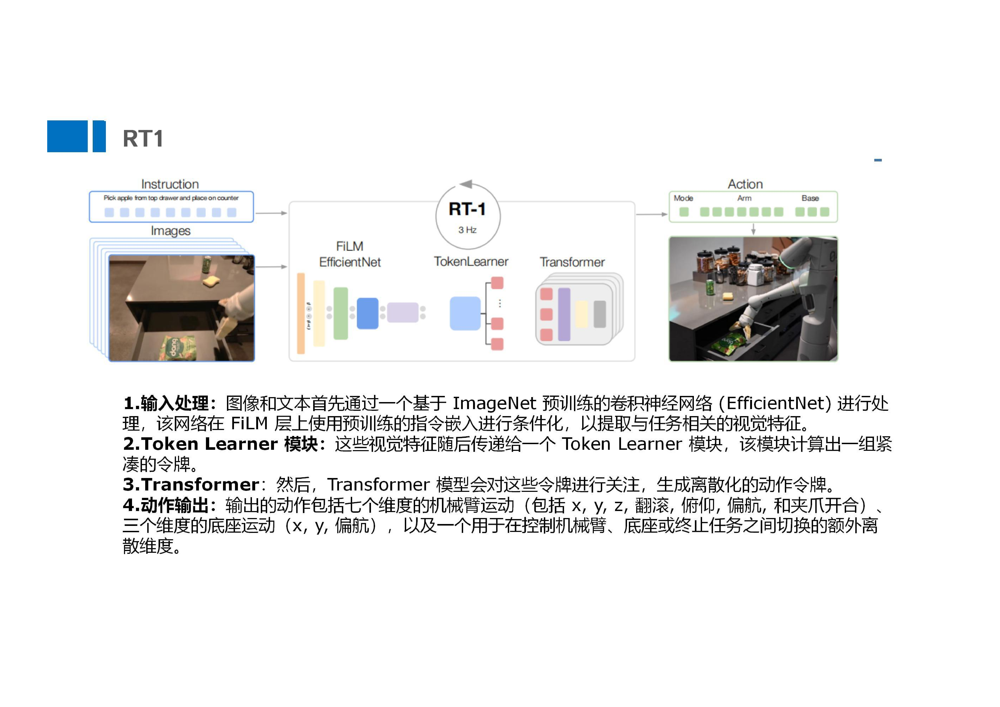
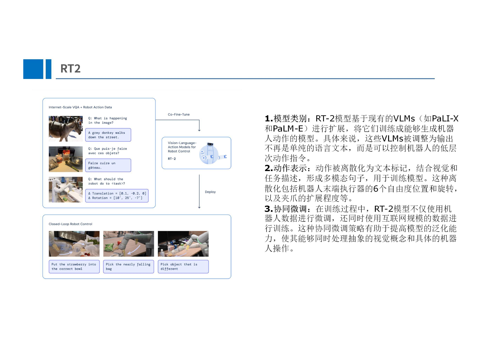
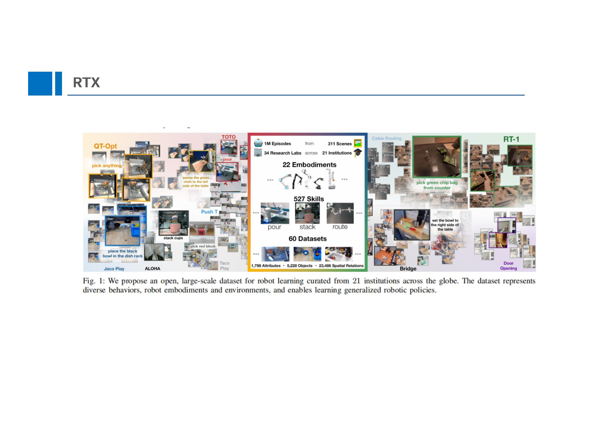
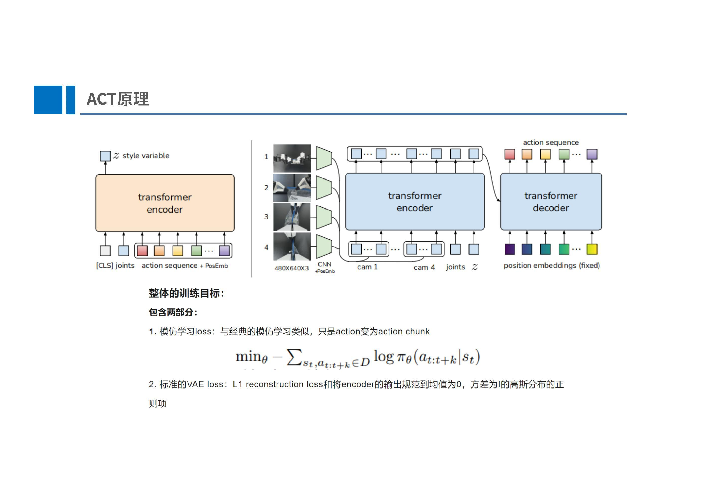
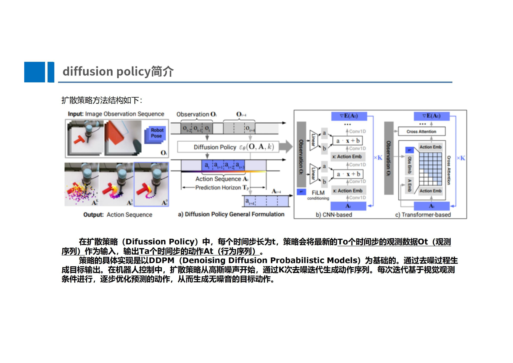
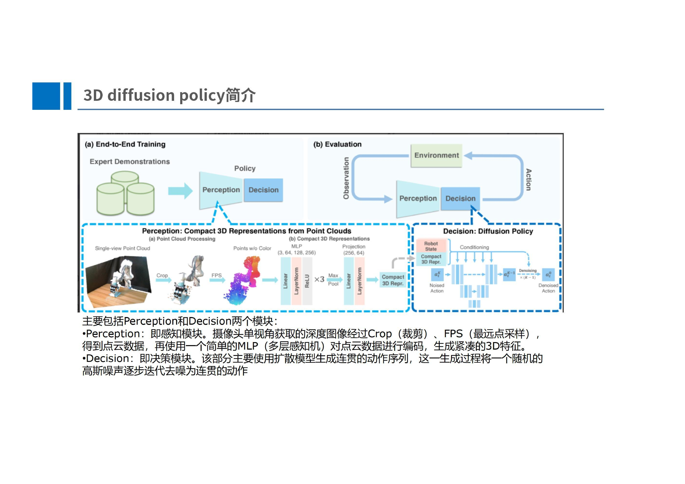
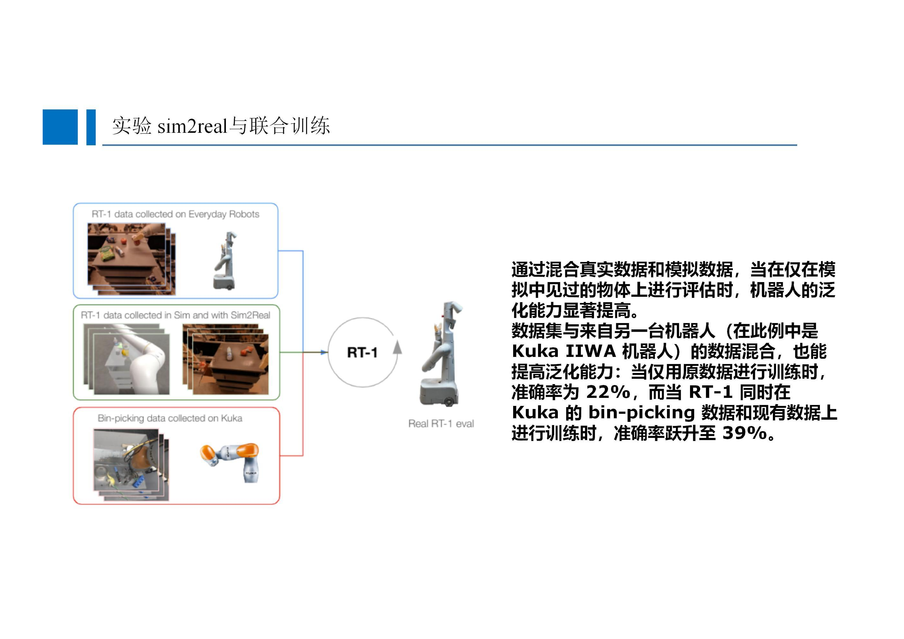
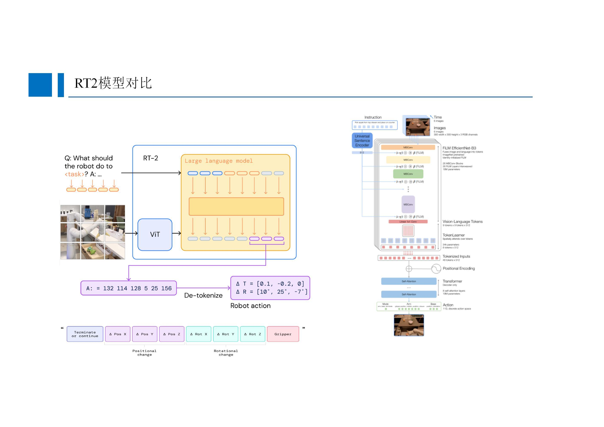
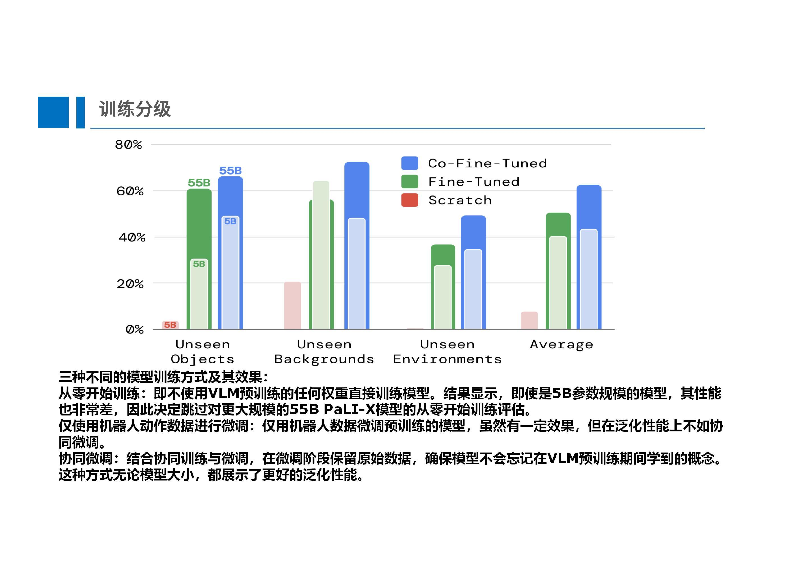

# 端到端概述

目前，随着 LLM 的兴起，抓取任务趋向于端到端和大模型驱动，而目前的端到端抓取模型分为三类，RT 系列、ACT 系列和 Diffusion Policy

RT 是 Robot Transformer ，也就是通过 Transformer 来生成动作指令驱动机器人执行的，也是谷歌的代表作

模仿学习就是把图像生成领域的方法迁移到了具身智能中，让模型学习人的行为的分别

Diffusion Policy 通过扩散和去噪的过程生成一个行为规划出来

## 谷歌 RT 系列算法

### RT1

RT1 就是一个融合结构，通过输入语言指令和图像，然后使用一个网络进行多模态融合，然后进行 Token 的学习，然后使用 Transformer 进行动作的生成

### RT2

RT 2的改进就是使用了多模态大模型然后增强了 RT1 的学习能力

### RT-X

提供了一个多任务、多机械臂模型、多数据集的数据集基准

## 模仿学习 ACT

ACT 是斯坦福研发的 Mobile Aloha 的核心算法，是一种很好的解决方案，目前国内各个公司采用的 demo 大多数是基于 ACT 方法的

这是一个 CVAE 的逻辑，这种逻辑之前是在图像生成的，去学习人类行为的一个分布，简单好用并且效果不错，但是泛化性可能相对较差

ACT 的输入就是动作序列和位置编码，通过一个编码器去进行分解压缩

## Diffusion Policy 

这种方法是扩散学习，最初有一条轨迹，为其加入噪音，然后在训练过程中进行去噪，从而生成一个比较理想的轨迹，算是一种探索性的学习，泛化性更好，但是计算量大

三维的话就是加入了深度图，在三维重建的基础上进行扩散学习，这样会更好的考虑三维环境

# Robot Transformer

RT1 的结构相对简单，其将机器人的行为视作一个类似语言的时序数据，输入则是一个指令语句和一系列的图像，然后使用 FiLM EfficientNet 来实现多模态特征提取，去指导机器人关注图像中的重要部分

然后就是 Token Learner 来生成 Token，最后进入 Transformer 来生成序列化的动作

不过因为机器人采集真实数据会很困难，所以会使用 Sim2Real 来混合真实和模拟数据，但是意外的是在这种情况下机器人的泛化性能反而会提高，也就是仿真的数据和其他机器人的数据都会强化模型的性能

而 RT2 就变成了一个视觉-语言-动作模型也就是 VLA 模型了，集成了视觉语言和机器人操作，其输出也不再是动作文本，而是底层的机器人操作指令

还有就是使用大模型来提取视觉和语言特征，这也是进一步的改进，增强了 RT 模型的泛化能力

其中在训练阶段也发现了一些问题，比如说模型越大性能越好，然后就是使用协同微调方法就会更好（就是也需要机器人的数据，也需要 VLM 训练的数据）

