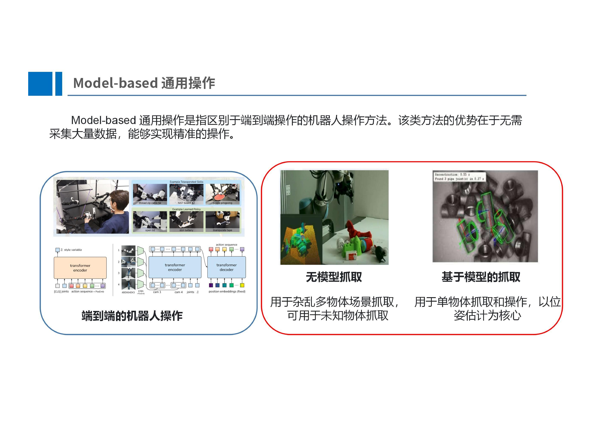
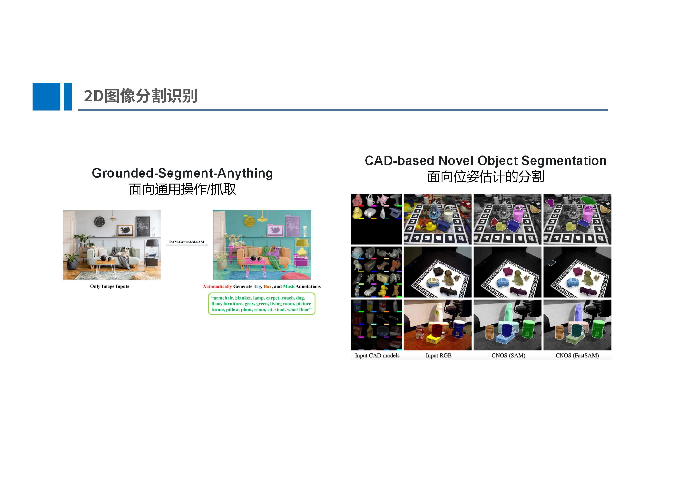
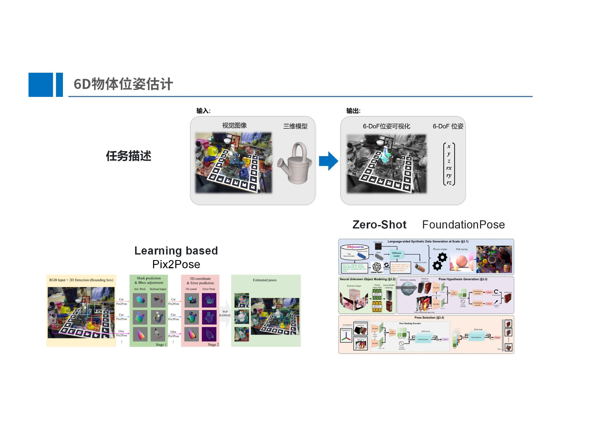
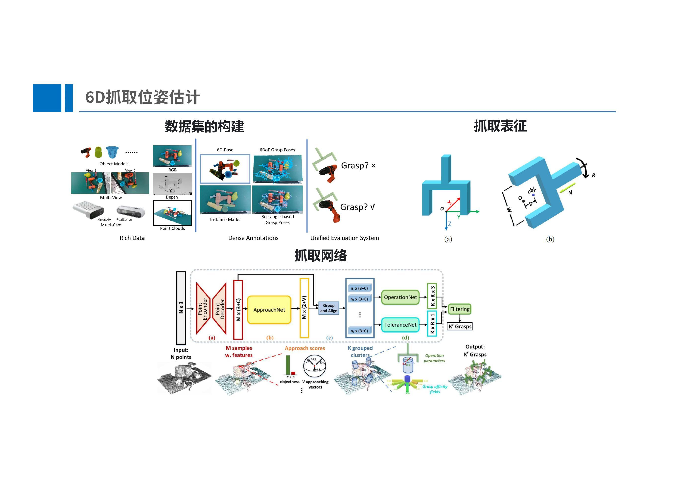
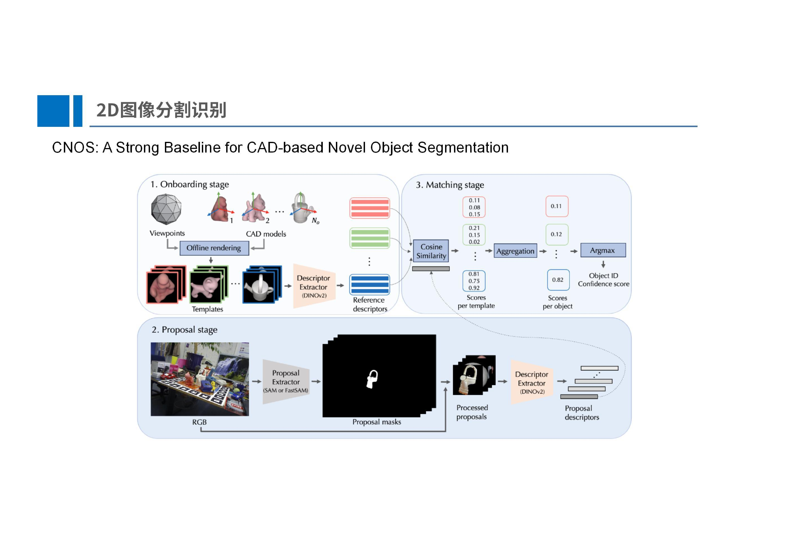

# 基于视觉的通用抓取概述

## 概述

实际上基于视觉的通用抓取是一种基于模型的策略，这种策略的核销是通过视觉判断物体位置和六维姿态，然后通过非轨迹规划的方法移动机械臂来抓取物体并且做出相应的行为，这种方法有别于端到端方法，但是好处是不需要基于大量的数据训练，在端到端大模型兴起之前，这种方法是一种主流，所有的操作都是基于位姿估计和变换完成的，精度相对较高，但是应用场景相对局限

这种抓取的流程是先通过一些特殊的语义分割模型（比如说 Grounded-Segment-Anything 可以实现强大的针对抓取任务的语义分割），然后得到物体的抓取位姿，然后就可以执行抓取操作

或者是基于位姿估计的分割，可以对场景中的所有物体进行分割，然后会元物体CAD模型所渲染的图像进行匹配，匹配成功之后就可以执行抓取，精度更高并且可以实现 zero-shot 效果

总的来说，我们的任务可以如此理解：我们知道了花洒这种实例的CAD模型，然后就可以通过视觉来准确的估计对象在相机坐标系下的六维位姿，进而实现抓取

对于这种任务，模型有两种，一种是 Learning-Based，但是这种方法需要制作一个庞大的CAD数据集，对每一种物体都要进行训练和位姿标注，并且需要加入相机内参进行训练，这种方法的可迁移性较差，相关工作有 Pix2Pose，这是一个相对经典的早起工作；另一种是 zero-shot 方法，其中代表作有 FoundationPose，精度较高，放入 CAD 图像等就可以直接预测出位姿，

## 手眼标定

手眼标定是准确实现抓取任务的必要条件，通过标定板和图像处理算法计算出相机和基座之间的位姿变换

## 平面抓取

在平面抓取任务中，会涉及一些图像特征提取的操作，比如说提取图像的一些应用于抓取的特征，如宽度特征、质量特征等

## 抓取位姿估计

这个任务与标准的位姿估计不同，位姿估计只是估计出物体的位姿，而抓取位姿估计估计的是适合抓取某个物体的夹爪的位姿，而数据集的构建则是分为两步，首先是对于单个物体去采样不同的抓取位姿，然后需要把各种物体散乱的放置在场景中，然后把抓取位姿映射进其中并且进行场景中抓取位姿的碰撞检测，符合要求的就是场景中所有的抓取位姿真值

## 图像分割

为了更好的进行抓取，可以考虑结合CAD模型和SAM模型对物体进行更好的零样本的分割

以 [CNOS](https://github.com/nv-nguyen/cnos) 这篇论文为例，其 pipeline 是这样的，分为三个阶段，如下图所示

1. 在线阶段：在有了场景中物体的 CAD 模型之后，就可以使用离线渲染方式得到一些视角下的图像（论文中是 42 张），然后使用 DINO 模型给每个图像处理成一个 1024 维度的描述向量，42 张图像就是 42 个向量
2. Proposal 阶段：然后在真实场景中，使用 SAM 模型得到所有物体的 MASK （可能有100张），进一步就可以根据 MASK 把原始图像中的对应物体分割出来变成一个图块（只包含这个物体本身的像素，所以很多物体在分割之后会变得残缺），然后使用 DINO 对这些图块进行提取，得到 100 个特征向量来描述这些图块，
3. 匹配阶段：对前两个阶段的特征向量进行余弦相似计算，得到一个评分矩阵，这个矩阵中的每个元素对应一个评分，目的是找到渲染图像中的物体在实际场景中对应的物体

## 物体位姿估计

6D物体位姿估计只能用于已知物体，对于未知物体需要进行三维重建得到 CAD 模型，优点在于已知物体位姿可进行任意操作。之前的位姿估计方法需要针对每一个物体进行训练，目前的位姿估计方法主流为zero-shot，即只需要 CAD 模型即可使用。
未来的位姿估计方法将会是更大的模型，更多的数据，使用语言作为先验知识，无需 CAD 模型即可直接获得物体位置直接获得物体位姿，如OV9D。