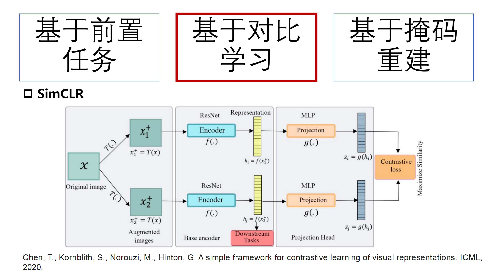
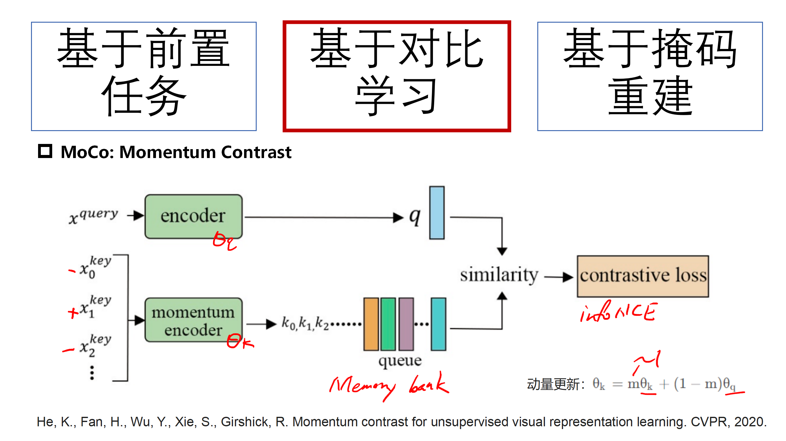
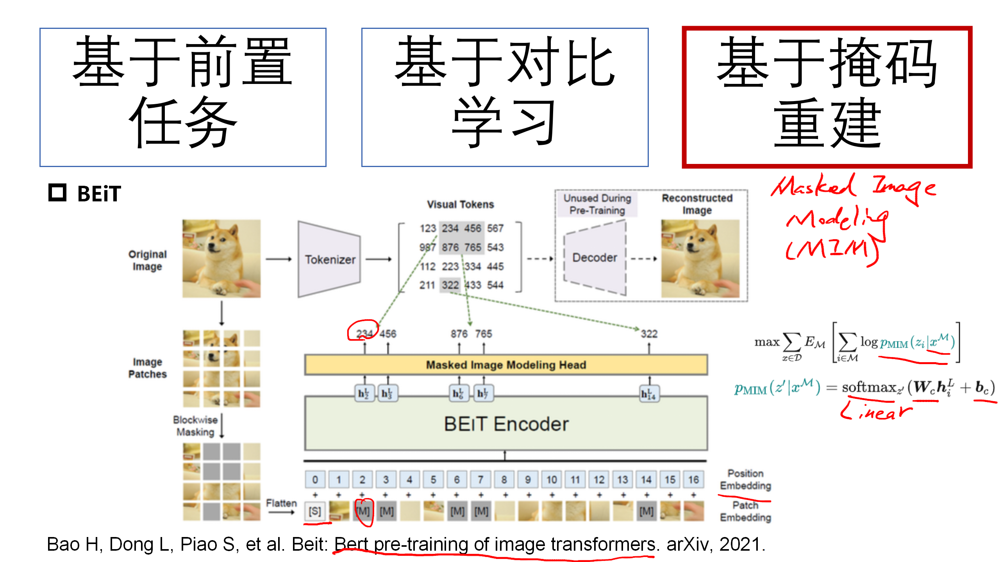
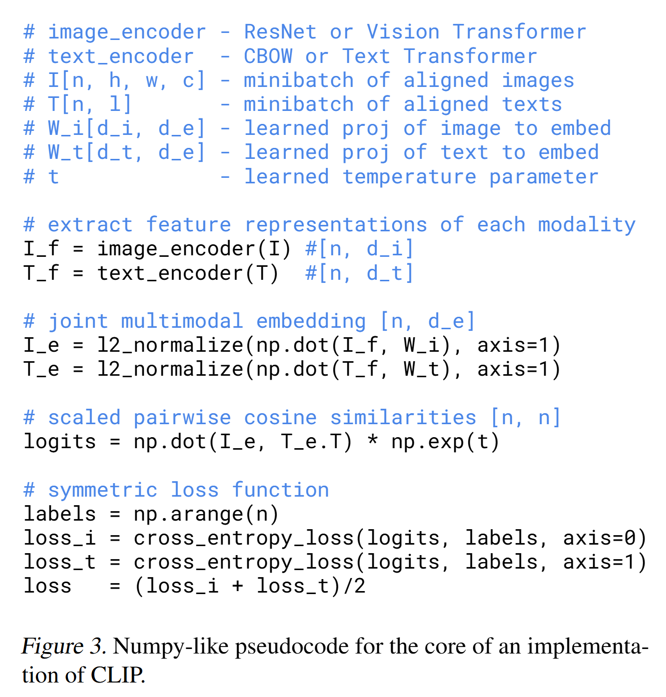
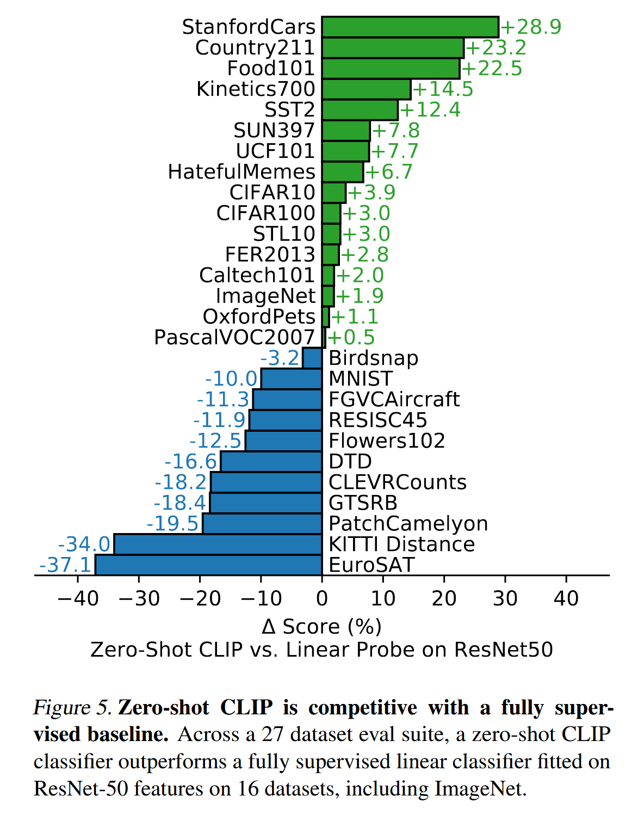
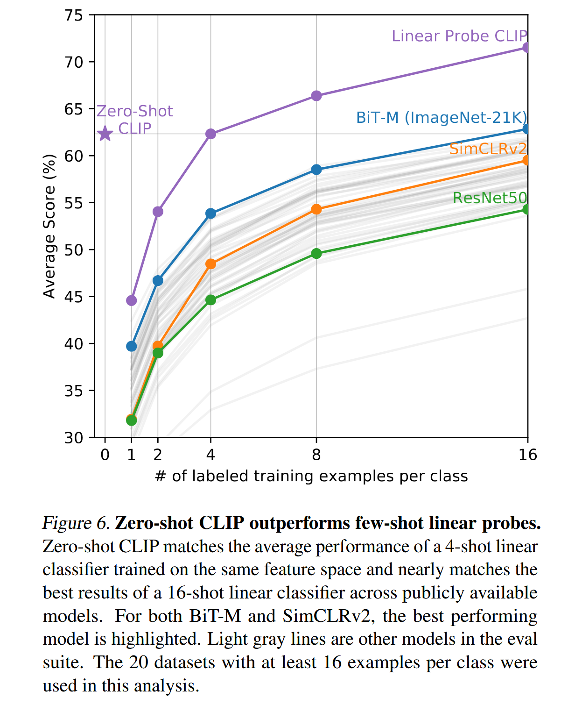
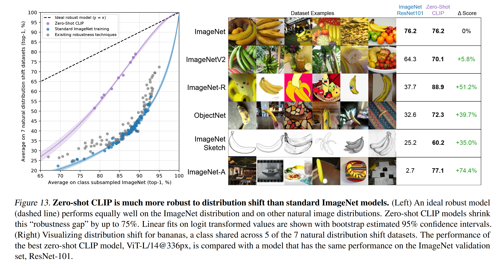
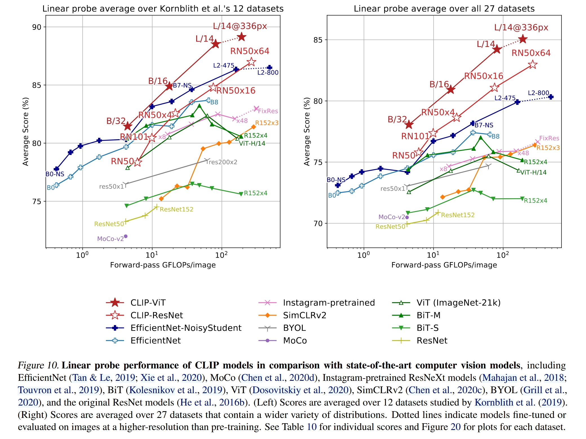

# Unimodal Representation

Unimodal Representation，也就是单模态表征，我们在学习多模态学习之前，先研究如何表示单个模态的数据，比如说如何表示图像

我们想对一张图片做一个分类


# 自监督学习

自监督学习是现在大模型训练的基石，方式一般是通过数据的一部分预测另一部分，使用的是数据的内部结构而非是人工给出的外在标签，这样做的一个好处就是可以避免人工标注的成本，并且可以进行统一，在有监督学习中，不同的任务有不同的标签，目标检测的标签是检测框位置与大小，姿态估计的标签是关节点位置，语义分割的标签是 Mask，而在自监督学习中，可以以一种统一的方式去训练模型，并且可以融合不同的数据集进行训练

自监督学习有三种常见方式，基于前置任务、基于对比学习、基于掩码重建，其中后两种是主要的自监督方式

## 基于前置任务的自监督

这种方法跟分类分割这种任务不同，在这种方式中，标签可以通过某种方式从原始数据中构建或者生成出来，不需要人工进行标注

比如说位置预测的任务，可借鉴 ViT 中图像块的方式，把图像拆分为若干块，并且让模型预测这些块之间的相对位置关系，或者就是拼图任务，可以使用一个模型，输入一个打乱的图像拼图，让模型尝试拼出原图的位置，类似的还有将图片旋转并且让模型预测旋转了多少度，或者把彩色图变为灰度图并让模型上色

## 对比学习

对比学习相对基于前置任务的学习会更加统一，并且让自监督学习的效果超越了有监督学习，这种方法的思路就是创建一对数据，并且让正样本之间的距离尽可能近，让负样本之间的距离尽可能远，比如说对一张图像使用数据增强得到两张有所不同的新图像，这两张图片使用网络提取特征，让两张图像提取出来的特征尽可能近即可

这种方法的经典模型就是 CLIP，CLIP 的训练策略就是先搜集大量的图像文本对，其中图像和文本是有关联的，然后分别使用图像和语言编码器提取图像和文本得到特征向量，然后对若干的图像文本对进行两两的相似度计算，并且最大化对应的图像文本对的向量相似度

### SimCLR

此外就是 [SimCLR](https://arxiv.org/pdf/2002.05709) 这篇论文，在编码器基层上加入一个 Head 进行映射，然后使用映射之后的向量进行对比学习，使用编码器的输出特征用于下游任务；此外这篇论文还有发现，同时使用随机裁剪和颜色抖动可以在图像任务上有更好的效果，并且 batch 越大效果越好、数据集越大效果越好、模型越大效果越好，这些奠定了大模型的基础



### MoCo

这是何凯明的一篇论文，其架构如下，有一个 query 的样本，若干 key 样本（其中有正样本和大量负样本，并且使用了 Memory Bank 的设计来存储对应的特征向量），然后有两个相互独立的编码器，当 query 向量分别与 key 特征向量进行对比的时候就会分别反向传播，并且 key 编码器会使用动量更新，或者说是引入一部分 query 编码器的参数



当然，这种方法并没有理论上的证明，只是实验效果比较好

代码中动量更新部分如下

```python
f_q = ResNet50()
f_k = ResNet50()
with torch.no_grad():
    for param_q, param_k in zip(f_q.parameters(), f_k.parameters()):# 遍历两个编码器的参数
        param_k.data = param_k.data * m + param_q.data * (1. - m)
```

当然，后续还有 v2 和 v3 两种更新的版本，其中 v2 使用了更多的数据增强方法和 SimCLR 中的映射层，而 v3 是使用了 ViT 架构，并且取消了内存银行的设计 ，而是通过大 batch 代替，其中包含大量的负样本，此外就是使用了双向对比的损失，得到了一个相似度矩阵来与对角单位阵进行对比学习（类似 CLIP）

## 掩码重建

这种方法英文名为 Masked Image Modeling（MIM），这种方法类似完形填空，把图像的一部分 Mask 掉，然后让模型补全图像，这种思想也应用在语言处理中，比如说大名鼎鼎的 BERT，而在图像中，有一种基于 BERT 的图像掩码重建工作 BEiT



这个工作借鉴了 ViT 的图像序列化操作和 BERT 的掩码重建

# DINO

这是 Facebook 的工作，属于对比学习的范式，以知识蒸馏的方式进行，也可以叫做自蒸馏

# CLIP(Contrastive Language-Image Pretraining)：从语言监督中学习可迁移视觉模型

## 概述

这是一个里程碑式的工作，实现了一种非常强大的零样本的性能，同时有非常好的迁移学习效果，也就是哪怕在从训练过的数据集上进行测试也可以取得非常高的准确率，甚至在大多数任务上，在一个从未见过的数据集中，可以与一个在此数据集上专门监督训练的模型打成平手，比如说在 ImageNet 上，在没有接受 ImageNet 训练集的情况下，可以跟一个完整训练的 ResNet50 打成平手

其核心的创新点就是，使用更高级的语义形式来监督视觉模型的学习，而不是使用固定的数据集类别标签（因为类别标签也是一种 one-hot 向量，是有限制的，这也限制了模型的泛化性），并且使用庞大的数据集来训练，这有助于模型真正地去理解图像中的语义信息（或者说增强了模型的泛化性能），可以说是一个巨大的进步，其真正的把图像语义和语言语义联系了起来，所以学习到的特征语义性非常强大

## 基础框架

实际上 CLIP 的框架非常简洁，其有两个特征提取网络，分别提取文本和图像特征，常用的文本特征提取器有 BERT、GPT2，图像特征提取器可以是 ResNet、ViT 等


训练的代码如下图所示，其中要注意的就是投射层，作用是学习如何从单模态变成多模态，然后损失是一起计算图像和文本的，这也是对比学习的常见方式；此外这里还有一个发现，在多模态的学习中，投射层是线性还是非线性关系不大



而想进行 zero-shot 推理的话则是需要进行一些处理，因为 CLIP 结构本身结构上没有输出部分，所以想进行推理任务（如分类）就需要进行一个相似度计算的过程，以此来判断此图像与哪一个文本描述最对应，然后认为最对应的这个文本所代表的类别就是图像类别，具体过程如下

1. 把数据集的所有类别标签整理成文本，然后加入一些修饰变成简单语句，比如说“a photo of cat”这种，进而使用文本特征提取器得到一些特征向量，有 N 个类别标签就会得到 N 个特征向量
2. 把图像输入特征提取器提取图像的特征向量，然后把图像特征向量分别与所有的类别文本特征向量进行相似度计算
3. 相似度最高的向量所代表的类别就是图像的类别

实际上就是，查看图像的特征与哪一个文本特征最为相似，那么哪一个句子就代表了图片的类别

## 动机

在 NLP 中，直接从原始文本中自监督地预训练一个模型从而学到一种非常泛化的特征，而非做一个特定的任务，所以其目标函数和模型架构也是跟下游任务无关的，这是一种趋势，可以达到非常好的效果，在很多下游任务中不需要使用非常专门的数据或者专门的输出头，只需要一些微调就可以取得不错的效果，甚至媲美专门训练的模型，并且在这种框架下，大量的没有专门标注的数据集反而比精心标注的数据集更好用

但是CV领域并非如此，大家还是倾向于在特定的数据集诸如 ImageNet 上进行训练，但是这种数据集上训练有一些缺陷，这些数据集的标签是固定数量的，如果想新增的话就需要扩充标注，可迁移性能很差，所以作者团队提出了这种从语言监督中训练一个视觉模型的想法，来监督模型的训练

当然，实际上这种想法并不是 CLIP 团队首创，在此之前已经有若干工作使用了类似的思想进行创新，比如说 VirTex、ICMLM 和 ConVIRT等，但是之所以 CLIP 脱颖而出，原因有三：一是 CLIP 使用了非常庞大的数据集，而三者只在几十万大小的数据集上训练；二是 CLIP 使用 Transformer 构建了庞大的模型，参数量大学习能力强；三是 CLIP 训练周期长（训练了若干加速器年，而三者仅有数十天）。核心就是数据规模和模型规模得上去，如此才可以在庞大的数据中学习到足够的通用视觉特征，从而达到良好的泛化性能

还有一个原因就是，NLP 的特征也并不是很容易学习，随着 GPT3、BERT 等模型和自监督方法的兴起，NLP 方面有了非常强大的上下文文本特征提取能力和强大的泛化能力，而自监督方式的兴起也为多模态带来的新的发展机遇，一是不需要单独标注数据了，只需要使用图片-文本的配对就可以了，自由度大了很多，二是可以把图像与语言联合起来了，而非单独学习视觉的单模态特征

## 高效预训练方法

但是，想在一个庞大的数据集上训练一个模型是非常耗费算力的，比如说一个 ResNet101 模型在 ImageNet 上训练需要数十个 GPU 年，这还仅限于是分类任务，如果变成文本生成任务的话会更加耗费算力，并且其中会有一个很严重的问题，同一个图像，不同人会给出不同的但是都符合事实的文本描述，这会进一步降低训练的效率，所以作者就提出了对比学习的方法，只需要判断文本和图像是否是配对的就可以，放宽了约束限制，这样会大大加快训练的速度

而且因为数据集非常庞大，所以不存在过拟合的问题，甚至不需要什么数据增强，也难以进行调参

此外就是作者选择了句子级别的对齐而非是 Token 级别的对齐，否则计算成本还会很大

另外就是进行了混精度和分布式的训练，混精度在绝大多数情况下不会掉点，甚至有可能涨点，并且会节省一半内存，而庞大的 batch size 也需要庞大的机器进行分布式的训练

## 提示工程

不论是英文还是中文，都有大量的词语具有多义性，并且可以根据上下文的不同解释为不同的含义，比如说 ImageNet 中，有两个类别，Construction Crane 和 Crane，分别对应起重机和鹤，如果在做图片和文本的对应的时候每次只用一个单词去做文本特征抽取就会碰到歧义性问题，从而造成相似度计算错误

还有一个问题就是，在 CLIP 训练的时候，文本都是一个句子，但是在做推理的时候会出现单一单词的问题，这就会出现一个名为 distribution gap 的问题，也就是你抽取出来的特征可能就不是很好

所以作者就提出了一个简单的方法，提出了一个 prompt template 的解决方法，把标签放于其中变成一个句子，所以就不太会出现 distribute  gap 的问题了，也可以解决一部分多义性的问题，这种方法直接让准确率提高了 1.3%

这种方法还可以迁移到其他类型的数据集上，比如说对于动物数据集，可以给出一个“a photo of a {label}，a type of pet”的模板，实际上 CLIP 团队给出了很多的 prompt template 来应对不同的情况，下面是一部分的模板

```python

imagenet_templates = [
    'a bad photo of a {}.',
    'a photo of many {}.',
    'a sculpture of a {}.',
    'a photo of the hard to see {}.',
    'a low resolution photo of the {}.',
    'a rendering of a {}.',
]
```

通过不同的模版，尽可能描述不同的可能的物体所处环境，比如说许多物体的图片、有遮挡的图片、模糊不清的图片等等，可以更好的让 CLIP 理解语义

## 迁移与泛化性能分析

为了进一步分析 zero-shot CLIP 迁移的性能，作者在 27 个数据集上与 ResNet50 进行了对比，其中 ResNet50 是在 ImageNet 上预训练好的，然后在其他数据集上冻住权重，仅训练最后的全连接层，CLIP 是直接进行了零样本迁移

结果发现，在常见物体的数据集上，CLIP 的性能非常好，但是在一些特定任务的数据集上，单纯的 zero-shot 是不足的，比如说对纹理分类的数据集和物体计数数据集，这可能是因为缺乏专业知识导致了性能的不足，可能使用 few shot 会更好一些



当然，作者也进行了一些小样本的实验来验证 CLIP 的性能，下面的几种模型都是使用了 ImageNet 预训练权重然后冻结参数，只训练线性层，同时使用了 zero-shot CLIP 作为对比，折线是 20 个数据集上平均准确率的结果，横坐标是每一个类别中训练样本的数量（因为有的数据集的某些类别没有 16 个样本，所以这些数据集被剔除了），可以看到，当训练样本过少的时候，零样本 CLIP 的效果反而更好，当在特定任务上有一定的训练样本来供 CLIP 模型学习的时候，模型就会取得更好的成果，这也验证了作者之前的说法



BiT 模型是谷歌的 Big Transfer ，其本身就是为了迁移学习而制作的，可以说是迁移学习中表现最好的模型之一，是一个很强的 baseline，但是仍然被 CLIP 击败，可见用文本引导视觉学习的多模态方法的强大

此外就是泛化性了，当



## 微调学习

如果使用了预训练的权重，然后在下游任务的数据集上完整的进行微调，CLIP 的效果会如何，然后就可以使用多种方式去判断模型学习到的特征好不好，常见的两种判断方式有 liner probe 和 fine tune

- Linear Probe：冻结预训练模型的所有参数，只训练一个附加的线性分类器（通常是一个线性层加一个softmax层）
- 微调：直接放开整个网络的权重进行端到端的学习，一般来说下游数据集较大的时候微调的效果会更好

实际上，作者采用 Linear Probe 来研究的原因如下

1. CLIP是为了探究一种与数据集无关的预训练方法，如果使用了微调去实验，那么可能在预训练阶段表现不好，但是在微调阶段性能反而上来了，这就无法分辨预训练的效果好坏，而 Linear Probe 只有分类器是可训练的，学习空间小，如果预训练阶段表现不好，那么最终的效果也不会很好，可以更好的
2. 可以调节的参数很少，大大简化了调参工作量，比如说下游数据集很大并且质量很高的话，那么就希望学习率偏大使得拟合效果更好，但是对小数据集就需要很小的学习率，但是在 Linear Probe 中，模型主体冻住的话，就只有抽取特征的功能，只有分类器部分可以训练，并且不论对于什么数据集或者任务，都是一个分类任务，有一个标准的测试流程

下面是 CLIP 在 Linear Probe 中的效果，在 12 个与 ImageNet 关联性很强的数据集上，CLIP 仍然优于其他的模型（在 ImageNet 上进行了有监督学习的模型），在所有的数据集上，CLIP 的优势明显更大



## 限制与不足

首先就是，zero-shot CLIP 仅仅是可以与 ImageNet 上训练好的 ResNet50打成平手，但是 ResNet50 并不是 SOTA 模型，最新的 ViT 系列模型等可以达到 88+ 的准确度，而 CLIP 虽然可以通过加大数据量或者增大模型效果来强化性能，但是随之而来的就是更加庞大的计算量

然后就是 CLIP 在一些细分类和抽象的任务上表现还是有所欠缺的，比如说小物体数量分类、区分监控视频中的异常帧，因为 CLIP 并不了解什么是异常和安全

然后就是泛化问题，虽然 CLIP 的泛化性能很强，但是当碰到分布偏移的实际任务或者 out-of-distribution 的情况的时候， CLIP 还是有很大的缺陷的，比如说 CLIP 训练所用的数据集中基本上没有与 MNIST 相似的图像，所以 CLIP 在 MNIST 数据集上 zero-shot 的表现很差，甚至低于一些传统方法

还有就是，虽然使用语言监督训练视觉模型是一个很强大的方法，但是对于一些难以用语言描述的任务或者说数据集，还是有所不足的

再就是，部分情况下，zero-shot 的性能反而比 one-shot 的性能更好，相当于一个没见过某个物体的人比一个