# CUDA概念

CUDA建立在NVIDIA的GPU上的一个通用并行计算平台和编程模型，CUDA旨在支持各种语言和应用程序编程接口，最初基于C开发，现在已经支持了多种语言，如C++、Python等
基于GPU的并行训练已经是目前大火的深度学习的标配，我们可以使用CUDA编程在GPU上加速部署深度学习模型

## API

在使用GPU时，我们需要使用CUDA调用API，CUDA 提 供 两 层 API 接 口 ， CUDA 驱 动(driver)API和CUDA运行时(runtime)API，两种API调用性能几乎无差异，课程使用操作对用户更加友好Runtime API

## Driver API

Driver API是早期cuda与GPU沟通的一种接口，后面发现其太过底层，细节太过复杂，所以进行进一步封装发展为Runtime API，这才是常用的API，对DriverAPI的理解有助于理解RuntimeAPI，但是实际上我们不会使用太多DriverAPI进行开发，所以不需要特别深入

Driver随着显卡驱动发布，要注意适配，要与cudatoolkit分开看，其对应于cuda.h（cudatoolkit中发布）和libcuda.so两个文件，是随着显卡驱动安装到系统中的，所以不能直接移植cuda.h等文件，否则可能无法匹配

关于context，有两种方法进行管理：

- 手动管理的context，cuCtxCreate（手动管理，以堆栈方式push/pop）
- 自动管理的context，cuDevicePrimaryCtxRetain（自动管理，runtime api以此为基础）

关于内存，有两大类：

- CPU内存，称之为Host Memory
  - Pageable Memory：可分页内存    
  - Page-Locked Memory（或者Pinned Memory）：页锁定内存
- GPU内存，称之为Device Memory     
  - Global Memory：全局内存     
  - Shared Memory：共享内存     
  - 。。。以及其他多种内存

## Runtime API

对于runtimeAPI，与driver最大区别是懒加载（用的时候才加载），即，第一个runtime API调用时，会进行cuInit初始化，避免驱动api的初始化窘境，第一个需要context的API调用时，会进行context关联并创建context和设置当前context，调用cuDevicePrimaryCtxRetain实现绝大部分api需要context，例如查询当前显卡名称、参数、内存分配、释放等

所以说，CUDA Runtime是封装了CUDA Driver的高级别更友好的API

- 使用cuDevicePrimaryCtxRetain为每个设备设置context，不再手工管理context，并且不提供直接管理context的API（可Driver API管理，通常不需要）
- 可以更友好的执行核函数，.cpp可以与.cu文件无缝对接
- 对应cuda_runtime.h和libcudart.so
- runtime api随cuda toolkit发布
- 主要知识点是核函数的使用、线程束布局、内存模型、流的使用
- 主要实现归约求和、仿射变换、矩阵乘法、模型后处理，就可以解决绝大部分问题

# CUDA Driver API

## cuInit：驱动初始化

cuInit的意义是，初始化驱动API，如果不执行，则所有API都将返回错误，全局执行一次即可没有对应的cuDestroy，不需要释放，程序销毁自动释放

初始化的流程大概如下，在`main`函数中完成

```c++
    /* 
    cuInit(int flags), 这里的flags目前必须给0;
        对于cuda的所有函数，必须先调用cuInit
        否则其他API都会返回CUDA_ERROR_NOT_INITIALIZED
        https://docs.nvidia.com/cuda/archive/11.2.0/cuda-driver-api/group__CUDA__INITIALIZE.html
     */
    CUresult code=cuInit(0); 
	//CUresult 类型：用于接收一些可能的错误代码
    if(code != CUresult::CUDA_SUCCESS){
        const char* err_message = nullptr;
        cuGetErrorString(code, &err_message);    
        // 获取错误代码的字符串描述
        // cuGetErrorName (code, &err_message);  
        // 也可以直接获取错误代码的字符串
        printf("Initialize failed. code = %d, message = %s\n", code, err_message);
        return -1;
    }
```

然后也可以获取设备的信息，比如说驱动版本、GPU型号等

```c++
    int driver_version = 0;
    code = cuDriverGetVersion(&driver_version);  // 获取驱动版本
    printf("CUDA Driver version is %d\n", driver_version); 
	// 若driver_version为11020指的是11.2

    // 测试获取当前设备信息
    char device_name[100]; // char 数组
    CUdevice device = 0;
    code = cuDeviceGetName(device_name, sizeof(device_name), device);  
	// 获取设备名称、型号如：Tesla V100-SXM2-32GB 
	// 数组名device_name当作指针
    printf("Device %d name is %s\n", device, device_name);
```

## 返回值检查

正确友好的检查cuda函数的返回值，有利于程序的组织结构使得代码可读性更好，错误更容易发现，就像上面的代码，我们可以根据返回值内容来判断是否成功，如果不成功的话是什么问题

当然，直接在程序中编写一大堆话是很麻烦且不美观的，调试起来也不够模块化，所以我们可以考虑封装为一个检查函数

```c++
#define checkDriver(op)  __check_cuda_driver((op), #op, __FILE__, __LINE__)

bool __check_cuda_driver(CUresult code, const char* op, const char* file, int line){

    if(code != CUresult::CUDA_SUCCESS){    
        const char* err_name = nullptr;    
        const char* err_message = nullptr;  
        cuGetErrorName(code, &err_name);    
        cuGetErrorString(code, &err_message);   
        printf("%s:%d  %s failed. \n  code = %s, message = %s\n", file, line, op, err_name, err_message);   
        return false;
    }
    return true;
}
```

这样子可以将返回值传入其中进行检查，从而实现了更好的程序设计

## 上下文管理

- context是一种上下文，类似于GPU上的进程，关联对GPU的所有操作，只是为了方便控制device的一种手段而提出来的
- context与一块显卡关联，一个显卡可以被多个context关联，但他们之间是相互间隔的。每个Context有自己的地址空间，在一个Context中有效的东西（例如某个指针，指向一段显存；或者某个纹理对象），只能在这一个Context中使用。
- 每个线程都有一个栈结构储存context，栈顶是当前使用的context，对应有push、pop函数操作context的栈，所有api都以当前context为操作目标，栈的存在是为了方便控制多个设备
- 试想一下，如果执行任何操作你都需要传递一个device决定送到哪个设备执行，得多麻烦，如果使用了context，一开始就创建一个context并且与device进行关联，同时push到栈中，然后进行空间开辟和释放等操作的时候直接传入context指针，就可以自动完成一系列的操作，用完之后也可以pop掉，可以减少大量的手动指定
- 由于高频操作，是一个线程基本固定访问一个显卡不变，且只使用一个context，很少会用到多context
- CreateContext、PushCurrent、PopCurrent这种多context管理就显得麻烦，还得再简单
- 因此推出了cuDevicePrimaryCtxRetain，为设备关联主context，分配、释放、设置、栈都不用你管，并且RuntimeAPI会自动使用此函数
- primaryContext：给我设备id，给你context并设置好，此时一个显卡对应一个primary context
- 不同线程，只要设备id一样，primary context就一样。context是线程安全的。并且代码会进一步简化

## 内存分配

实际上DriverAPI进行内存分配和销毁的过程是很复杂的，所以后面主要是使用RuntimeAPI进行内存分配

# 第一个CUDA程序-基于Runtime API

我们在目录下新建一个文件，命名为hello.cu，cu表示这是一个CUDA程序

```c++
#include<stdio.h>
int main()
{

        printf("helloword\n");
        return 0;
}
```

然后在此目录下打开终端，进行编译并且执行

```shell
nvcc hello.cu -o hello
./hello
```

然后就可以输出helloword了，nvcc是编译命令，hello.cu是待编译的文件，-o表示输出的可执行文件的名字，后面跟的hello就是这个名字的具体内容

这里的nvcc就是专属cuda程序的编译器，安装CUDA之后即可使用，如果使用gcc等编译器直接编译cuda文件的话会报错，实际上nvcc与g++的内容大多数是共用的，nvcc可以编译纯C++的代码，只不过nvcc有一些专门编译cuda函数的内容

当然我们可以使用CMake构建项目，而不是使用makefile，我们配置的CMakeLists.txt是这样的

```cmake
cmake_minimum_required(VERSION 3.8)
project(CUDA_TEST)
 
find_package(CUDA REQUIRED)
 
message(STATUS "cuda version: " ${CUDA_VERSION_STRING})
include_directories(${CUDA_INCLUDE_DIRS})
 
cuda_add_executable(cuda_test src/introduction.cu)
target_link_libraries(cuda_test ${CUDA_LIBRARIES})
```

使用CUDA package，include CUDA的路径，然后使用cuda_add_executable编译cu文件

当然，我们可以直接在LANGUAGES后面加CUDA，即可使用add_executable，否则无法cmake

```cmake
project(CUDA_TEST LANGUAGES CXX CUDA)
add_executable(cuda_test src/introduction.cu)
```

## 核函数（kernel function）

我们在之前做的helloworld程序，实际上就是一个C++程序，没有CUDA的内容，只不过使用了CUDA编译器编译而已，在这里我们将真正使用CUDA编程

我们知道，CPU才是决策者，是主处理器，GPU是协处理器，可以当做CPU的外设，所以GPU的执行过程需要经过CPU的控制，因此我们需要同时编写在CPU上执行的代码和在GPU上的代码，这里就需要核函数这个概念

核函数是在GPU上进行并行处理的函数，不过不需要开发人员手动进行并行执行，这个并行是由硬件完成的

核函数前面使用`__global__`修饰，返回值类型必须是`void`，并且两种修饰可以位置互换

```c++
__global__ void kerner_function(arguments arg)
void __global__ kernel_function(argument arg)
```

- 核函数只能访问GPU内存（或者说显存），目前CPU和GPU都有自己独立的内存，相互内存的访问是通过PCIE总线完成的，无法直接访问，需要使用运行时API进行内存访问
- 核函数不能使用变长参数，只能使用定长参数
- 核函数不能使用静态变量，不能使用函数指针，具有异步性

## 编写流程

对于CUDA程序的编写，大概流程是先写主机代码（主要是配置和数据处理方面的内容），然后调用核函数（并行加速数据处理），然后再主机代码（数据传输和内存释放），最后返回0，同时，**注意核函数不支持C++的iostream**

总的来说，运行在GPU中的核函数也是要在主机代码中调用的，调用完成后，数据传回CPU进行进一步处理并且释放空间

这里有一个很重要的函数需要注意，就是同步函数

```c++
#include<stdio.h>
__global__ void hello()
{
    printf("hello world from GPU!\n");
}
int main(void)
{
    hello<<<1,1>>>();
    cudaDeviceSynchronize();
    return 0;
}
```

`cudaDeviceSynchronize()`这个函数调用了CUDA运行时的API函数，作用是同步主机与设备，促使缓冲区刷新，去掉这个函数就打印不出字符了。我们要知道，在主机函数中调用核函数，只是启动了这个核函数，CPU还是要顺序执行，这样就会碰到GPU计算还没有结束但是CPU已经执行完的情况，这时候就需要主机和设备进行同步，然后统一进行顺序处理

cuda调用输出函数时，输出流是先放在缓存区的，而这个缓存区不会核会自动刷新，只有程序遇到某种同步操作时缓存区才会刷新。这个函数的作用就是同步主机与设备，所以能够促进缓存区刷新。

至此，我们就完成了一个基本的CUDA编程了，然后使用CMake编译，就可以运行了

## nvcc编译流程

nvcc进行编译的时候，会将源代码分离为主机代码和设备代码，前者是C/C++语言，后者是C/C++的扩展语言

nvcc先将设备代码编译为PTX（Parallel Thread Execution）伪汇编代码，再将PTX代码编译为二进制的cubin目标代码，在将源代码编译为 PTX 代码时，需要用选项-arch=compute_XY指定一个虚拟架构的计算能力，用以确定代码中能够使用的CUDA功能。

在将PTX代码编译为cubin代码时，需要用选项-code=sm_ZW指定一个真实架构的计算能力，用以确定可执行文件能够使用的GPU。

当然实际上会复杂很多，这只是流程的概述

# CUDA中的线程与线程束

## 概念

gpu不是单独的在计算机中完成任务，而是通过协助cpu和整个系统完成计算机任务，把一部分代码和更多的计算任务放到gpu上处理，逻辑控制、变量处理以及数据预处理等等放在cpu上处理，所以在这里会使用host代表CPU和内存，使用device来代表GPU和显存 。一个程序很可能是CPU开始执行，然后在某些时刻将某些计算放在GPU上计算，这个时候就需要用到kernel（核函数），这个kernel是一个以线程为单位来计算的函数，在这里的作用相当于一个入口

如下图所示，一个kernel会分配一个grid（或者说网格），一个grid是层级架构，一个grid里面就有多个block（线程块），一个block里面有多个thread（CUDA中编程的最小单位），**这里注意一下，grid和block是逻辑概念，实际上GPU中不存在物理意义上的grid和block，在编程中使用是为了方便**

thread是基本执行单元，在同一个block和grid中的thread会执行相同的核函数

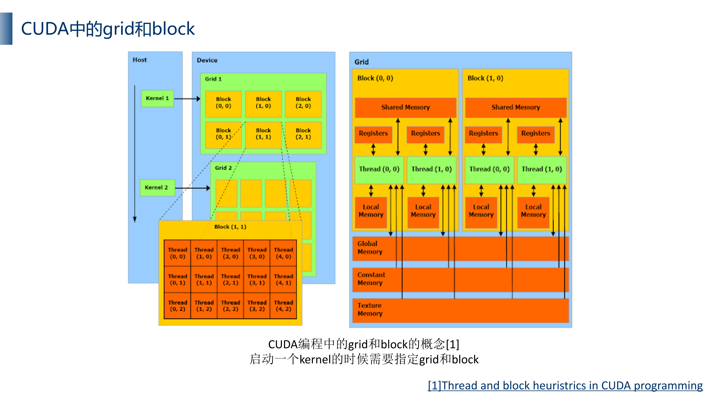

总的来说，grid是一组被一起启动的CUDA核心的集合，用于定义整个GPU上的 并行作业，grid中的block是一个小工作单元，包括了一组可写作的thread，提供了一种小范围内的数据共享和协作模式，每个block可以在GPU的一个多处理器上执行，grid和block都可以是一维、二维或者三维的，便于灵活组织数据

配置线程：kernel<<<grid_size, block_size>>>，表示一个核函数中有几个block和block结构，一个block中有几个thread和thread结构，在实际工程中，线程数可以远高于GPU的计算核心数，这样才能更充分的利用计算资源

在grid中，每个block都有一个shared memory（block级别的共享内存），并且还有多级的memory，同时每个thread都直接连接一个register（寄存器）和一个local memory

## 一维线程模型

每个线程在核函数中都有一个唯一的身份标识，唯一标识由这两个<<<grid_size, block_size>>>确定；grid_size, block_size保存在内建变量（build-in variable，使用的时候不需要去定义变量，这个变量是固定下来的 ，在核函数中可以直接使用），目前考虑的是一维的情况，内建变量有：

- gridDim.x：该变量的数值等于执行配置中变量grid_size的值；

- blockDim.x：该变量的数值等于执行配置中变量block_size的值。

- 线程索引保存成内建变量（ build-in variable）：
  - blockIdx.x：该变量指定一个线程在一个网格中的线程块索引值，范围为0~ gridDim.x-1；
  - threadIdx.x：该变量指定一个线程在一个线程块中的线程索引值，范围为0~ blockDim.x-1。

比如说`kernel_fun<<<2,4>>>()`，在内存中就会下图这个情况

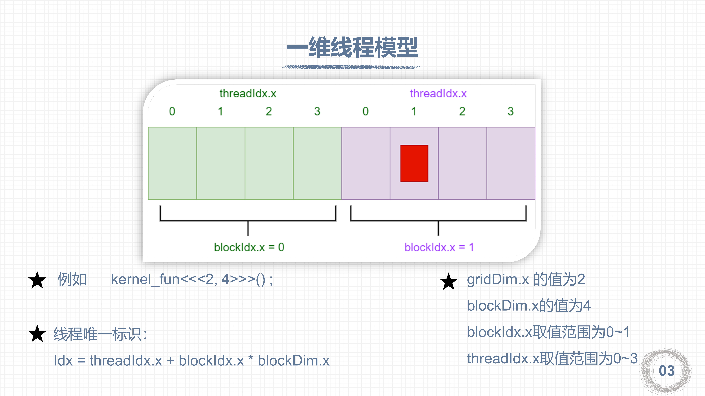

然后我们就可以在特定的线程中输出特定的信息，比如说输出线程本身的标识

```c++
#include <stdio.h>

__global__ void hello_from_gpu()
{
    const int bid = blockIdx.x;
    const int tid = threadIdx.x;

    const int id = threadIdx.x + blockIdx.x * blockDim.x; 
    printf("Hello World from block %d and thread %d, global id %d\n", bid, tid, id);
}


int main(void)
{
    hello_from_gpu<<<2, 4>>>();
    cudaDeviceSynchronize();

    return 0;
}
```

这里注意一下，输出的序号不一定是有序的，这反映了CUDA 程序执行时的一个很重要的特征，即每个线程块的计算是相互独立的。不管完成计算的次序如何，每个线程块中的每个线程都进行一次计算。

## 多维线程模型

CUDA最多可以组织三维的网格和线程块，blockIdx和threadIdx是类型为uint3的变量，该类型是一个结构体，具有x,y,z三个成员（3个成员都为无符号类型的成员构成）


并且gridDim和blockDim未指定的维度默认为1

我们在程序中定义多维网格和线程块的时候使用C++构造函数的语法

```c++
dim3 grid_size(Gx, Gy, Gz);
dim3 block_size(Bx, By, Bz);
```

举个例子,定义一个 2×2×1 的网格， 5×3×1的线程块，代码中定义如下:

```c++
dim3 block_size(5, 3); // 等价于dim3 block_size(5, 3, 1);
dim3 grid_size(2, 2); // 等价于dim3 grid_size(2, 2, 1);
```

**多维网格和多维线程块本质是一维的，GPU物理上不分块。**

每个线程都有唯一标识：

```
int tid = threadIdx.y * blockDim.x + threadIdx.x;
int bid = blockIdx.y * gridDim.x + blockIdx.x;
```

tid就是每个线程块中线程的索引，bid是一个网格中线程块的索引

对三维的情况有


并且注意一下数量有限制

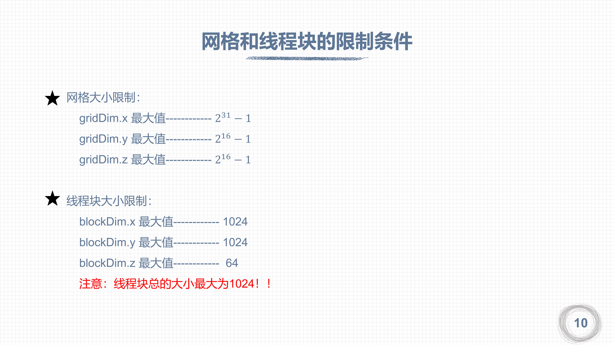

## 组织线程模型

在实际计算当中，我们会经常性执行矩阵乃至张量的计算，就需要组织线程模型，而在内存中，数据是以线性、以行为主的方式存储（与C++的方式一致，MATLAB是列为主的）

想发挥GPU的性能，就需要让不同的核心负责不同的计算，就要分配好每个线程，让不同的线程互不干扰，也需要防止不同的线程胡乱访问内存

### 二维网格二维线程块

这个是对应矩阵的一种情况


图中不同颜色的方块代表不同的线程块，这样子我们就将一个矩阵分解为了若干块，接下来我们就研究如何对应上去

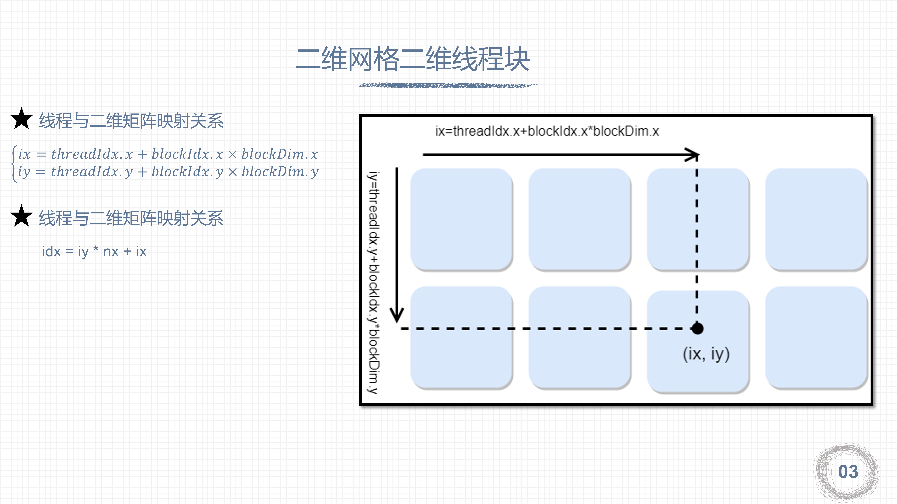

两个方向上的索引计算公式如图

### 二维网格一维线程块

如下

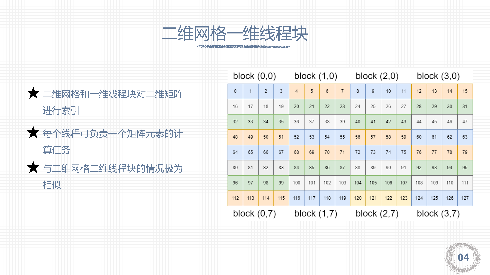

## block和thread的索引与遍历

一个kernel中有这么多的子单元，我们自然想的是如何进行遍历

如下图所示，我们一共有八个thread，那么就设置inputSize为8，每个block有四个thread，我们就设置blockDim也就是维度为4，然后gridDim自然就是2，然后我们进行传参

在 CUDA 编程中，`dim3` 是一个用来定义三维空间尺寸的struct数据类型，包含三个无符号整数成员：x, y, z。这些成员分别代表三维空间中的尺寸，dim3在指定核心（kernel）启动时的 grid 和 block 的尺寸时非常有用。在 CUDA 编程中，`dim3` 通常用于定义 grid 和 block 的尺寸，比如例程

```c++
dim3 blockDim(16, 16); // 每个 block 有 16x16 个 threads
dim3 gridDim(10, 10);  // grid 尺寸为 10x10 个 blocks
kernel<<<gridDim, blockDim>>>(...); // 启动核心
```

`dim3` 类型是 CUDA 特有的，主要用于简化并行计算任务中对多维数据的管理

如果不指定 `dim3` 的某个维度，该维度的默认值为 1。例如，`dim3 dim(16)` 相当于 `dim3 dim(16, 1, 1)`。

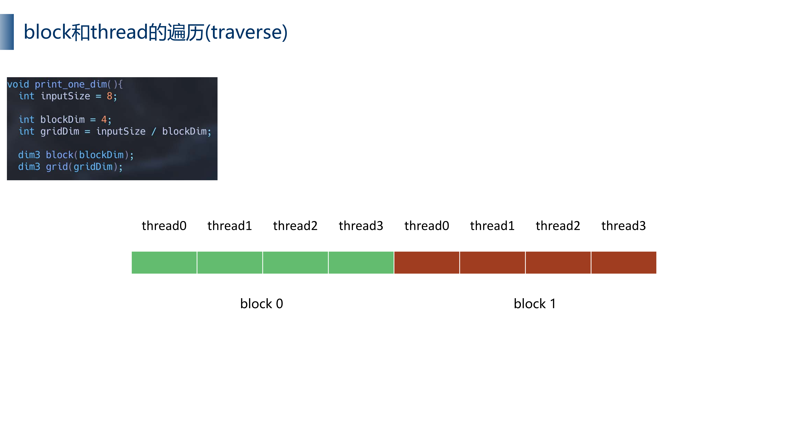

可以进行遍历，每个thread和block都有一个索引值，也就是threadIdx和blockIdx


核函数一定要加`__global__`来表明其为一个核函数，这里有个遍历用的核函数

```c++
__global__ void print_idx_kernel(){
    printf("block idx:(%3d,%3d,%3d),thread idx:(%3d,%3d,%3d)\n",
          blockIdx.z,blockIdx.y,blockIdx.x,
          threadIdx.z,threadIdx.y,threadIdx.x)
} 
```

不过需要注意一下遍历顺序，是先遍历z，后y，最后x，或者说，z是最高的最外层的维度，x是最低的最内层的维度，就好比说你是某市z学校的y班的x学生

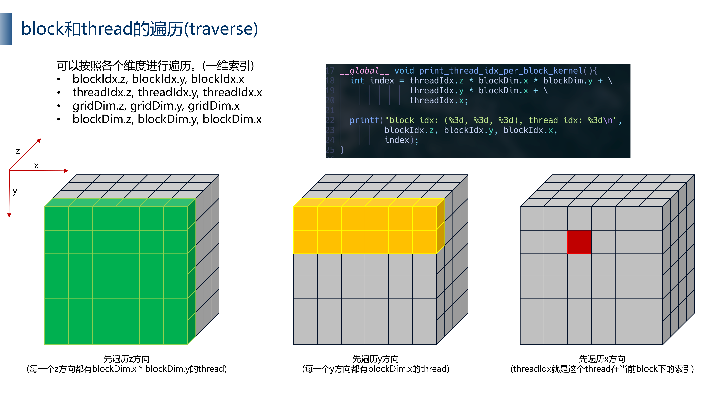

然后索引的求法如下

求block在网格中的索引blockId，求thread在线程块中的索引threadId，还有线程在所有线程中的索引id

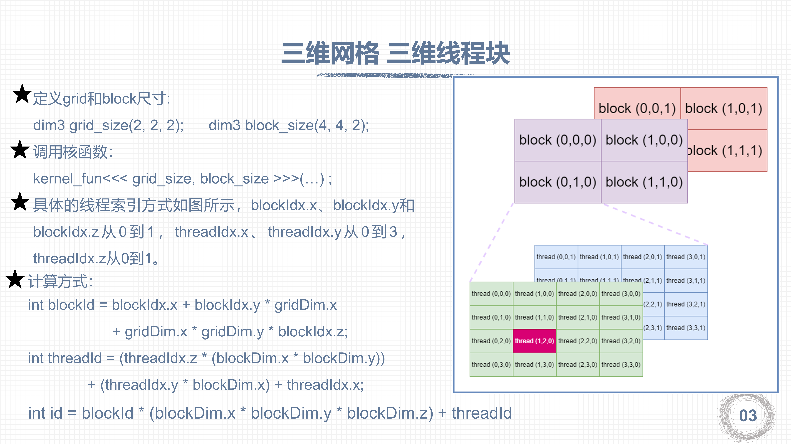

# 程序兼容性问题

## 概念

不同的GPU有不同的计算能力，可以使用版本号表示其计算能力（如下图所示），以`X.Y`的形式表示，不同的版本号在计算资源和架构上有所区别，文件在不同的架构上不一定通用，也就是说在一种版本的GPU上编译的文件，放到另一个主版本号不同的GPU设备上很可能无法执行

主版本号相同，次版本号不同的GPU，配置差异不大，仅仅在性能和功能上略有差异


## 指定虚拟架构计算能力

为了解决兼容性问题，C/C++源码编译为PTX时，可以指定虚拟架构的计算能力，用来确定代码中能够使用的CUDA功能，可以看出来，C/C++源码编译PTX这一步是与GPU无关的，虚拟架构更像是对所需GPU功能的一个声明，实际上，虚拟架构计算能力是一个衡量 GPU 功能特性的版本号，定义了 GPU 支持的特定功能，如双精度浮点运算、原子操作、并行线程执行模型等，计算能力是非常重要的，因为某些 CUDA 特性只在特定的计算能力版本或更高版本上可用

**虚拟架构**（Compute Capability）主要关注的是软件层面，即 CUDA 程序可以利用的 GPU 功能和指令集。

编译指令（指定虚拟架构计算能力）：

```shell
-arch=compute_XY
nvcc helloworld.cu –o helloworld -arch=compute_61
```

XY：第一个数字X代表计算能力的主版本号，第二个数字Y代表计算能力的次版本号

PTX的指令只能在更高的计算能力的GPU使用，上面的例子编译出的可执行文件helloworld可以在计算能力>=6.1的GPU上面执行，在计算能力小于6.1的GPU则不能执行。

从工程实践角度说，最好低一点，便于可以在更多设备上成功运行，如果可以确定实际要运行的GPU版本，最好指定当前GPU真实架构计算能力为虚拟架构计算能力，以便于更好的匹配设备

## 指定真实架构计算能力

PTX指令转化为二进制cubin代码与具体的GPU架构有关，真实架构指的是 GPU 的物理硬件架构，如 NVIDIA 的 Pascal、Volta、Turing 或 Ampere，真实架构决定了 GPU 的物理构造，包括核心数量、内存带宽、功耗、制程技术等。

虽然真实架构与虚拟架构紧密相关，但它们不是同一回事。一个真实架构（例如 Turing）可以支持多个计算能力版本

编译指令（指定真实架构计算能力）

```shell
-code=sm_XY
```

XY：第一个数字X代表计算能力的主版本号，第二个数字Y代表计算能力的次版本号
**注意**

1. 二进制cubin代码，大版本之间不兼容！！！
2. 指定真实架构计算能力的时候必须指定虚拟架构计算能力！！！
3. **指定的真实架构能力必须大于或等于虚拟架构能力！！！**
4. 真实架构可以实现低小版本到高小版本的兼容！

## 指定多个GPU版本编译

为了使得编译出来的可执行文件可以在多GPU中执行，可以同时指定多组计算能力：
编译选项

```shell
-gencode arch=compute_XY –code=sm_XY
```

例如：

```shell
nvcc ex1.cu -o ex1_fat -gencode=arch=compute_35,code=sm_35 -gencode=arch=compute_50,code=sm_50 -gencode=arch=compute_60,code=sm_60 -gencode=arch=compute_70,code=sm_70
```

这样子编译出的文件可以同时在这些GPU上执行

-gencode=arch=compute_35,code=sm_35 开普勒架构
-gencode=arch=compute_50,code=sm_50 麦克斯韦架构
-gencode=arch=compute_60,code=sm_60 帕斯卡架构
-gencode=arch=compute_70,code=sm_70 伏特架构

编译出的可执行文件包含4个二进制版本，生成的可执行文件称为胖二进制文件（fatbinary）

注意

1. 执行上述指令必须CUDA版本支持7.0计算能力，否则会报错
2. 过多指定计算能力，会增加编译时间和可执行文件的大小

## NVCC即时编译

NVCC 支持即时编译（JIT, Just-In-Time Compilation），这是一种在运行时而非传统的编译时对程序进行编译的过程

在可执行文件中保留PTX代码，当运行可执行文件时，从保留的PTX代码临时编译出cubin文件

nvcc编译指令指定所保留的PTX代码虚拟架构：

```shell
 -gencode arch=compute_XY ,code=compute_XY
```

- **编译过程**: 当 CUDA 程序运行时，NVCC 即时编译器可以根据运行时的环境（尤其是目标 GPU 的计算能力）动态编译 CUDA 核心（kernel）。
- **PTX 代码**: NVCC 通常首先将 CUDA C/C++ 代码编译成中间形式的 PTX （Parallel Thread Execution）代码。PTX 是一种 GPU 上的伪汇编语言，允许更多的硬件独立性。
- **SASS 代码**: 在程序运行时，根据具体的 GPU 架构，PTX 代码会被进一步编译为具体的 SASS（Streaming ASSembler）代码，即真实的 GPU 指令。

缺点是可能不能充分利用GPU架构的计算性能，并且会增加程序的启动时间，因为编译发生在运行时

注意

- 两个计算能力都是虚拟架构计算能力
- 两个虚拟架构计算能力必须一致

一致的原因，举个例子，比较新的安培（Ampere）架构版本号是8，我的电脑是帕斯卡（Pascal）架构版本号是6，我的电脑直接编译是不能在安培架构上运行的，设置即时编译，就可以在生成的可执行文件中嵌入PTX代码，在安培架构上运行时，就可以直接在安培架构上运行PTX代码，但是有可能无法充分利用安培架构性能

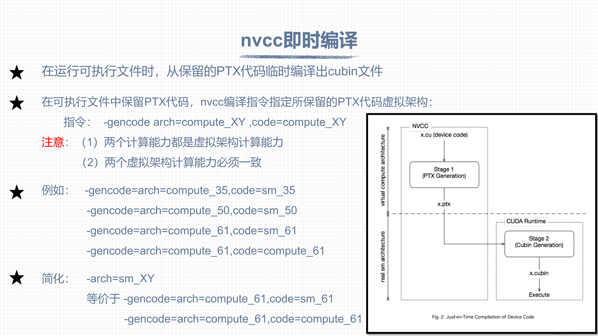

## nvcc编译默认计算能力

不同版本CUDA编译器在编译CUDA代码时，都有一个默认计算能力，我们如果不声明计算能力版本号，nvcc会根据CUDA版本自动设置

- CUDA 6.0及更早版本： 默认计算能力1.0
- CUDA 6.5~CUDA 8.0： 默认计算能力2.0
- CUDA 9.0~CUDA 10.2： 默认计算能力3.0
- CUDA 11.6： 默认计算能力5.2

# CUDA的矩阵乘法计算实现

## 流程概述

首先，矩阵计算肯定是基于CPU和GPU联合处理的，也就是需要host端到device端的数据传输

这里需要在两端进行内存空间的分配，这一操作是在host上执行的，还有配置核函数参数、数据传输等，总的来说GPU只需要启动核函数进行计算

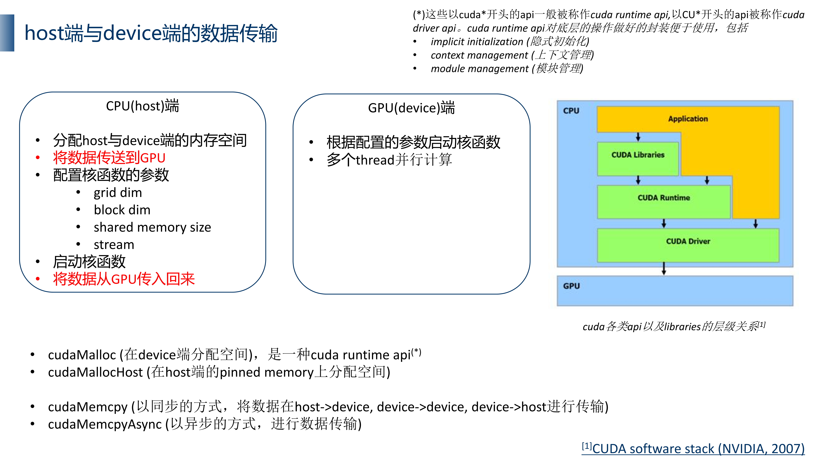

程序端可以调用三种层级的CUDA API，但是基本上只调用相对顶层的API（除去Driver这个很底层的）

所以我们实现一个CUDA的程序，大概就是先设置GPU设备，这可以通过运行时API来实现，比如说查看GPU数量，确定使用哪一个GPU进行计算

步骤如下

1. 设置GPU设备，决定哪些GPU进行计算
2. 在主机端分配主机和设备内存
3. 初始化主机中的数据，把我们想计算的数据存入主机内存
4. 数据通过使用运行时API从主机复制到设备，因为GPU在运行时核函数只能直接访问显存中的数据
5. 调用核函数在设备中进行计算
6. 将计算得到的数据从设备传送到主机，通过PCIE总线实现
7. 释放主机和设备内存

## 设置GPU设备

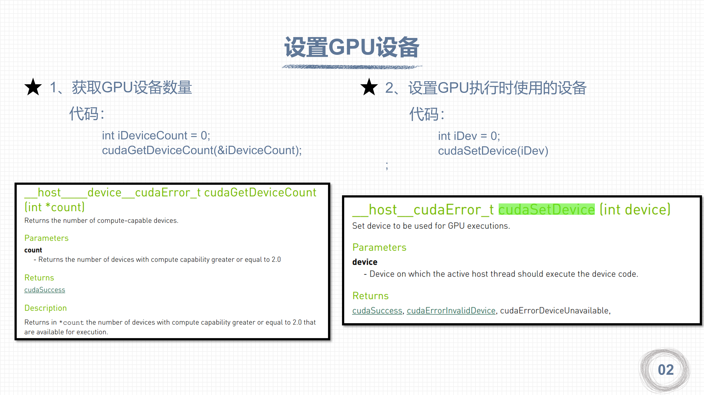

### 获取GPU设备数量

这里涉及两个运行时API函数

```c++
int iDeviceCount = 0;
cudaError_t error=cudaGetDeviceCount(&iDeviceCount);
```

`cudaGetDeviceCount`是一个可以在主机或者设备上运行的函数，作用是修改传入int类型指针变量的值，使其等于可使用的GPU数量

注意一下，几乎每一个运行时API都有一个返回值，这个返回值定义为cudaError_t，作用是返回一个错误代码，通过返回不同的错误代码，提供关于函数调用是否成功执行的状态信息

`cudaError_t`是一个枚举类型，它定义了各种可能的错误代码。这些错误代码可以用来表示各种情况，比如内存分配失败、非法操作、设备不支持等等。通过检查这些返回值，开发者可以得知自己的CUDA代码是否正确执行，如果出现问题，可以根据错误代码进行调试和修复。

例如，如果一个CUDA函数调用返回了`cudaSuccess`，这意味着函数调用成功完成。如果返回了其他值，如`cudaErrorMemoryAllocation`，则表明在内存分配时出现了问题。

### 设置GPU执行时使用的设备

代码如下

```c++
int iDev = 0;
cudaSetDevice(iDev);
```

我们要将其设置为我们想要使用的GPU的索引号

这是一个只能在主机函数中使用的函数

### 示例

```c++
#include <stdio.h>

int main(void)
{
    // 检测计算机GPU数量
    int iDeviceCount = 0;
    cudaError_t error = cudaGetDeviceCount(&iDeviceCount);
    
    if (error != cudaSuccess || iDeviceCount == 0)//判断是否成功获得GPU数量且数量不为0
    {
        printf("No CUDA campatable GPU found!\n");
        exit(-1);
    }
    else
    {
        printf("The count of GPUs is %d.\n", iDeviceCount);
    }
    
    // 设置执行
    int iDev = 0;
    error = cudaSetDevice(iDev);
    if (error != cudaSuccess)
    {
        printf("fail to set GPU 0 for computing.\n");
        exit(-1);
    }
    else
    {
        printf("set GPU 0 for computing.\n");
    }

    return 0;
}
```

## 内存管理

CUDA 通过内存分配（开辟内存空间）、数据传递、内存初始化、内存释放进行内存管理，且CUDA内存管理函数与标准C的内存管理函数非常相似，就是在标准C的内存管理函数前面加上cuda

| 标准C函数 | CUDA C函数 |     功能     |
| :-------: | :--------: | :----------: |
|  malloc   | cudaMalloc |  内存的分配  |
|  memcpy   | cudaMemcpy |  数据的传递  |
|  memset   | cudaMemset | 内存的初始化 |
|   free    |  cudaFree  |  内存的释放  |

### 内存分配函数

主机分配内存：`extern void *malloc(unsigned int num_bytes);`

代码： 

```c++
float *fpHost_A;
fpHost_A = (float *)malloc(nBytes);
```

设备分配内存：此函数可以在主机和设备上使用，返回值也是cudaError_t类型

```c++
float *fpDevice_A;
cudaMalloc((float**)&fpDevice_A, nBytes);
cudaError_t cudaMalloc(void **devPtr, size_t size);
```

**参数**

- **devPtr**: 是一个指向分配的设备内存的指针的指针，是一个二级指针。这个指针是在调用 `cudaMalloc` 后设置的，用于在之后的 CUDA 函数调用中引用这块内存。
- **size**: 需要分配的内存字节数。它指定了在设备上分配多少内存。

### 数据拷贝

在主机的标准C语言中，我们只需要指定数据的原位置和目的位置就可以，然后就可以完成主机数据的拷贝

设备数据的拷贝，只能在主机端完成

```c++
cudaError_t cudaMemcpy(void *dst, const void *src, size_t count, cudaMemcpyKind kind);
```

**参数**

- **dst**: 目标内存地址。这可以是设备内存地址或主机内存地址，取决于拷贝方向。
- **src**: 源内存地址。与目标地址一样，这也可以是设备或主机内存地址。
- **count**: 要复制的字节数。
- **kind**: 数据传输的方向。它是一个 `cudaMemcpyKind` 枚举类型，指定数据是从主机复制到设备(`cudaMemcpyHostToDevice`)，从设备复制到主机 (`cudaMemcpyDeviceToHost`)，还是设备之间(`cudaMemcpyDeviceToDevice`) 的复制，或者主机到主机（`cudaMemcpyHostToHost`）。当然也可以设置`cudaMemcpyDefault`也就是默认值，会根据我们实际传入的数据判断是哪一种方式，但是默认方式只支持在统一虚拟寻址的系统上使用，否则会报错

下面是一个例程，从主机复制到设备，是先开辟，然后得到指向新空间的指针，然后拷贝

```c++
float *h_array = (float *)malloc(size * sizeof(float));
float *d_array;
cudaMalloc((void **)&d_array, size * sizeof(float));

// 从主机内存复制到设备内存
cudaMemcpy(d_array, h_array, size * sizeof(float), cudaMemcpyHostToDevice);
```

### 内存初始化

这一步的目标是将申请开辟的新空间初始化，设备内存初始化函数只能在主机调用

```c
cudaError_t cudaMemset(void *devPtr, int value, size_t count);
```

参数

- **devPtr**: 指向需要初始化的设备内存的指针。
- **value**: 要设置的值。这个值是一个整数，但实际上它会被转换成一个无符号字符（`unsigned char`），并用这个字符的值来填充内存。这意味着实际设置的值是`value`的低8位。
- **count**: 要设置的字节数。

例如，如果你想在设备内存中分配一个float类型数组，并将每个元素初始化为0，可以这样做：

```c
float *d_array;
size_t size = 100 * sizeof(float); // 假设我们需要100个float

// 在设备上分配内存
cudaMalloc((void **)&d_array, size);

// 将设备内存初始化为0
cudaMemset(d_array, 0, size);
```

注意事项

1. **内存类型**: `cudaMemset`仅适用于设备内存，不能用于主机内存。
2. **值的限制**: 由于`value`参数实际上是作为一个无符号字符处理的，因此只能用来设置0到255之间的值。
3. **同步性**: `cudaMemset`在默认情况下是阻塞的，即它会等待操作完成才返回控制权给CPU。如果需要异步执行，可以使用`cudaMemsetAsync`函数，但这需要配合CUDA流（`cudaStream_t`）使用。
4. **错误处理**: 检查函数返回的状态，确保内存设置操作成功。

### 内存释放

```c++
cudaError_t cudaFree(void *devPtr);
```

- **devPtr**: 指向需要释放的设备内存的指针。

注意事项

1. **仅设备内存**: `cudaFree`仅适用于释放使用CUDA内存分配函数（如`cudaMalloc`）分配的设备内存。不应该用它来释放在主机上分配的内存（使用`free`或`delete`）。
2. **重复释放**: 避免对同一内存地址进行重复释放，这可能导致不可预测的行为。
3. **空指针**: 如果传递给`cudaFree`的指针是`NULL`，那么操作没有效果，也不会报错。
4. **错误处理**: 检查`cudaFree`的返回值，确保释放操作成功。如果释放失败，这通常指示程序中存在更严重的问题，如非法内存访问。
5. **内存管理**: 在大型应用中，合理管理内存分配和释放是至关重要的。不仅要确保每次`cudaMalloc`调用都有相应的`cudaFree`调用，还要注意在程序的适当位置进行这些调用，以避免内存泄漏。

## 计算过程

计算过程示意图如下，blockSize为1

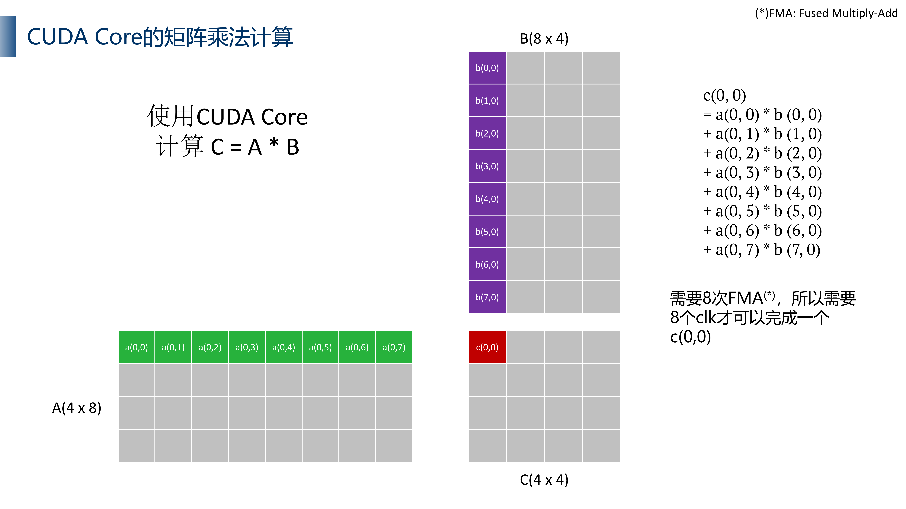

一个FMA就是一个加法乘法混合运算


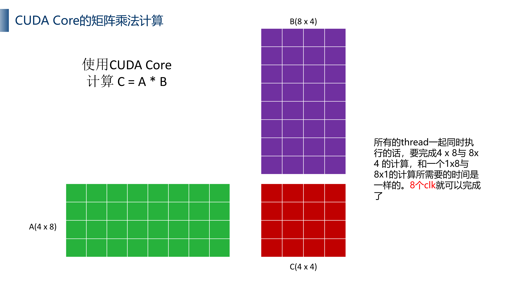

我们可以基于Grid和Block的逻辑进行切分计算，这样可以大大加快计算的效率

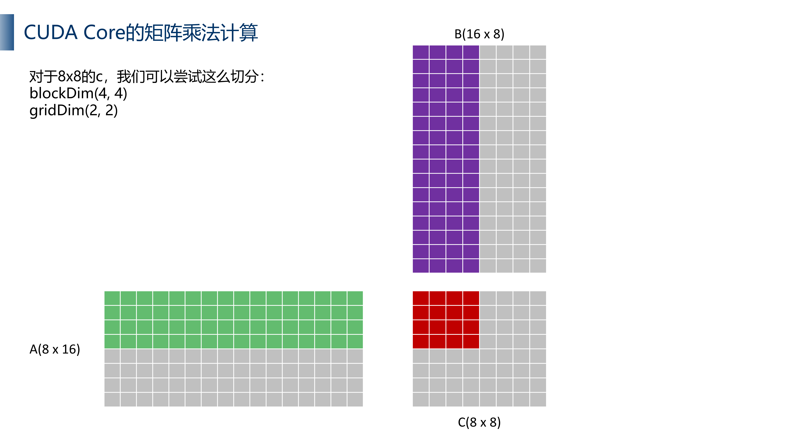

CUDA中有个规定，就是一个block中可以分配的thread的数量最大是1,024个线程。如果大于1,024会显示配置错误

GPU的warmup：GPU在启动的时候是有一个延时的，会干扰对算法执行时间的测量，所以可以先启动GPU让其完成一点任务，然后再测量

## 程序流程

这里借用了B站权双大佬的开源程序进行讲解

首先我们导入头文件，其中我们将设置GPU的函数放入common.cuh头文件中，比如说检测GPU的数量并且设置0号GPU为使用的GPU

```
#include <stdio.h>
#include "../tools/common.cuh"
```

然后我们看

```c++
#include <stdio.h>
#include "../tools/common.cuh"

__global__ void addFromGPU(float *A, float *B, float *C, const int N)
{
    const int bid = blockIdx.x;
    const int tid = threadIdx.x;
    const int id = tid + bid * blockDim.x; 

    C[id] = A[id] + B[id];//每个线程计算一次加法
    
}

void initialData(float *addr, int elemCount)
{
    for (int i = 0; i < elemCount; i++)
    {
        addr[i] = (float)(rand() & 0xFF) / 10.f;
        //随机产生一个数据，然后进行按位与，得到一个不大于255的数，转换为float类型并且除以10，然后复制到数组中去
    }
    return;
}

int main(void)
{
    // 1、设置GPU设备
    setGPU();

    // 2、分配主机内存和设备内存，并初始化
	// 我们定义一个一维数组，元素数量512
    int iElemCount = 512;                               // 设置元素数量
    size_t stBytesCount = iElemCount * sizeof(float);   // 计算总的字节数
    
    // （1）分配主机内存，并初始化
    float *fpHost_A, *fpHost_B, *fpHost_C;
	//根据总字节数，开辟内存
    fpHost_A = (float *)malloc(stBytesCount);
    fpHost_B = (float *)malloc(stBytesCount);
    fpHost_C = (float *)malloc(stBytesCount);
    if (fpHost_A != NULL && fpHost_B != NULL && fpHost_C != NULL)
    //三个指针都不为空的时候就说明成功了
    {
        memset(fpHost_A, 0, stBytesCount);  // 所有的开辟的主机内存初始化为0
        memset(fpHost_B, 0, stBytesCount);
        memset(fpHost_C, 0, stBytesCount);
    }
    else
    {//如果失败就输出信息并且退出
        printf("Fail to allocate host memory!\n");
        exit(-1);
    }

    // （2）分配设备内存，并初始化，流程与主机一致
    float *fpDevice_A, *fpDevice_B, *fpDevice_C;
    cudaMalloc((float**)&fpDevice_A, stBytesCount);
    cudaMalloc((float**)&fpDevice_B, stBytesCount);
    cudaMalloc((float**)&fpDevice_C, stBytesCount);
    if (fpDevice_A != NULL && fpDevice_B != NULL && fpDevice_C != NULL)
    {
        cudaMemset(fpDevice_A, 0, stBytesCount);  // 设备内存初始化为0
        cudaMemset(fpDevice_B, 0, stBytesCount);
        cudaMemset(fpDevice_C, 0, stBytesCount);
    }
    else
    {
        printf("fail to allocate memory\n");
        free(fpHost_A);
        free(fpHost_B);
        free(fpHost_C);
        exit(-1);
    }

    // 3、初始化主机中数据
    srand(666); // 设置随机种子
    initialData(fpHost_A, iElemCount);//进入初始化函数
    initialData(fpHost_B, iElemCount);
    
    // 4、数据从主机复制到设备
    cudaMemcpy(fpDevice_A, fpHost_A, stBytesCount, cudaMemcpyHostToDevice); 
    cudaMemcpy(fpDevice_B, fpHost_B, stBytesCount, cudaMemcpyHostToDevice); 
    cudaMemcpy(fpDevice_C, fpHost_C, stBytesCount, cudaMemcpyHostToDevice);


    // 5、调用核函数在设备中进行计算
    dim3 block(32);//每个线程块有32个线程
    dim3 grid(iElemCount / 32);//然后配置相应数量的线程块

    addFromGPU<<<grid, block>>>(fpDevice_A, fpDevice_B, fpDevice_C, iElemCount);    // 调用核函数，传入地址
    cudaDeviceSynchronize();
    //实际上这里的同步函数可以删除，因为cudaMemcpy有隐式的同步功能
    
    // 6、将计算得到的数据从设备传给主机
    cudaMemcpy(fpHost_C, fpDevice_C, stBytesCount, cudaMemcpyDeviceToHost);


    for (int i = 0; i < 10; i++)    // 打印
    {
        printf("idx=%2d\tmatrix_A:%.2f\tmatrix_B:%.2f\tresult=%.2f\n", i+1, fpHost_A[i], fpHost_B[i], fpHost_C[i]);
    }

    // 7、释放主机与设备内存
    free(fpHost_A);
    free(fpHost_B);
    free(fpHost_C);
    cudaFree(fpDevice_A);
    cudaFree(fpDevice_B);
    cudaFree(fpDevice_C);

    cudaDeviceReset();
    //将相关的GPU重置
    return 0;
}
```

## 设备函数

- 设备函数（device function）
  1. 定义只能执行在GPU设备上的函数为设备函数
  2. 设备函数只能被核函数或其他设备函数调用
  3. 设备函数用 __device__ 修饰

- 核函数（kernel function）
  1. 用 __global__ 修饰的函数称为核函数，一般由主机调用，在设备中执行
  2. __global__ 修饰符既不能和__host__同时使用，也不可与__device__ 同时使用

- 主机函数（host function）
  1. 主机端的普通 C++ 函数可用 __host__ 修饰
  2. 对于主机端的函数， __host__修饰符可省略
  3. 可以用 __host__ 和 __device__ 同时修饰一个函数减少冗余代码。编译器会针对主机和设备分别编译该函数。

## 注意

我们前面是使用了512个元素，分为了16个线程块，每个线程块32个线程，但是实际上并不是每一次都是可以整除的，比如说我们有513个元素，需要513个线程，就需要17个线程块去执行，但是这就导致了544个线程，所以我们需要进行id判断

```c++
__global__ void addFromGPU(float *A,float *B,float *C,const int N)
{
    const int bid=blockIdx.x;
    const int tid=threadId.x;
    const int id = tid+bid*blockDim.x;
    if(id>=N) return;
    C[id]=A[id]+B[id];
}
```

这样可以保证超出数量的时候会退出核函数

## 二维矩阵计算代码

我们这里会实现一个二维矩阵的GPU计算

我们注意一下，开辟空间的时候，GPU上要开辟三个内存空间，两个是需要计算的矩阵，一个是存储结果矩阵的

```c++
#include "stdio.h"

/* matmul的函数实现*/
__global__ void MatmulKernel(float *M_device, float *N_device, float *P_device, int width){
    /* 
        我们设定每一个thread负责P中的一个坐标的matmul
        所以一共有width * width个thread并行处理P的计算
    */
    int x = blockIdx.x * blockDim.x + threadIdx.x;
    int y = blockIdx.y * blockDim.y + threadIdx.y;

    float P_element = 0;

    /* 对于每一个P的元素，我们只需要循环遍历width次M和N中的元素就可以了*/
    for (int k = 0; k < width; k ++){
        float M_element = M_device[y * width + k];
        float N_element = N_device[k * width + x];
        P_element += M_element * N_element;
    }

    P_device[y * width + x] = P_element;
}

/*
    CUDA中使用block对矩阵中某一片区域进行集中计算。这个类似于loop中的tile
    感兴趣的同学可以试着改一下blockSize，也就是tileSize，看看速度会发生什么样子的变化
    当blockSize达到一个数量的时候，这个程序会出错。下一个案例中我们会分析
*/
void MatmulOnDevice(float *M_host, float *N_host, float* P_host, int width, int blockSize){
    /* 设置矩阵大小 */
    int size = width * width * sizeof(float);

    /* 分配M, N在GPU上的空间*/
    float *M_device;
    float *N_device;

    cudaMalloc(&M_device, size);
    cudaMalloc(&N_device, size);

    /* 分配M, N拷贝到GPU上*/
    cudaMemcpy(M_device, M_host, size, cudaMemcpyHostToDevice);
    cudaMemcpy(N_device, N_host, size, cudaMemcpyHostToDevice);

    /* 分配P在GPU上的空间*/
    float *P_device;
    cudaMalloc(&P_device, size);

    /* 调用kernel来进行matmul计算, 在这个例子中我们用的方案是：将一个矩阵切分成多个blockSize * blockSize的大小 */
    dim3 dimBlock(blockSize, blockSize);
    dim3 dimGrid(width / blockSize, width / blockSize);
    MatmulKernel <<<dimGrid, dimBlock>>> (M_device, N_device, P_device, width);

    /* 将结果从device拷贝回host*/
    cudaMemcpy(P_host, P_device, size, cudaMemcpyDeviceToHost);
    cudaDeviceSynchronize();

    /* Free */
    cudaFree(P_device);
    cudaFree(N_device);
    cudaFree(M_device);
}
```


# 错误检测与计时、信息查询

介绍检查CUDA的错误代码的方法并且debug，还有计时的方法，并且查询GPU信息

## 运行时API错误代码

CUDA运行时API大多支持返回错误代码，返回值类型是枚举变量：cudaError_t，运行时API成功执行，返回值为cudaSuccess

## 错误检查函数

在检查错误的时候，我们会用到两个函数

- cudaGetErrorName
  - 功能：这个函数用于获取指定错误代码的名称。在CUDA编程中，许多函数调用会返回一个错误代码（`cudaError_t`类型）。`cudaGetErrorName`函数可以将这个错误代码转换为一个易于理解的字符串名称，帮助开发者快速识别出错的类型。
  - 用法：`const char* cudaGetErrorName(cudaError_t error)`
  - 示例：如果您有一个错误代码`error`，您可以这样调用此函数：`const char* errorName = cudaGetErrorName(error);`然后`errorName`将包含该错误的名称。
- cudaGetErrorString
  - 功能：与`cudaGetErrorName`类似，`cudaGetErrorString`函数用于获取详细的错误描述。它提供了关于发生的错误更具体的信息，这有助于调试和解决问题。
  - 用法：`const char* cudaGetErrorString(cudaError_t error)`
  - 示例：使用方法和`cudaGetErrorName`相似，例如：`const char* errorDescription = cudaGetErrorString(error);`将返回一个详细描述错误的字符串。

同时我们会自行包装ErrorCheck函数定位问题，或者说使用这个函数对CUDA的运行时函数进行包装，或者说将运行时API的返回值传入此函数进行检查

代码如下

```c++
cudaError_t ErrorCheck(cudaError_t error_code, const char* filename, const int lineNumber)
{
    if (error_code != cudaSuccess)//不成功时才执行
    {
        printf("CUDA error:\r\ncode=%d, name=%s, description=%s\r\nfile=%s, line%d\r\n",
                error_code, cudaGetErrorName(error_code), cudaGetErrorString(error_code), filename, lineNumber);
        //分别打印错误代码，错误类型，名称，文件名和行数
        return error_code;
    }
    return error_code;
}
```


在调用CUDA运行时API时，调用ErrorCheck这个自定义的函数进行包装，其中参数filename一般使用`__FILE__`这个编译器内部定义的宏，用来返回发生错误的文件名（字符串类型）; 参数lineNumber一般使用`__LINE__`这个宏，返回发生错误的行数

```c++
ErrorCheck(cudaMalloc(&fpDevice,size),__FILE__,__LINE__)
```

上面这个例子就是在运行CUDA函数之后，检查函数是否成功执行，如果没有成功执行，错误是什么情况

## 检查核函数

但是错误检查函数有不足，就是不能检查核函数的相关错误，这是因为核函数的返回值是void，也就是没有实际的返回值，不会返回错误代码，所以我们需要想办法检查核函数中的错误

`cudaGetLastError()` 是一个非常有用的 CUDA 运行时API函数，用于获取最后一个发生的错误代码并且将系统Reset为cudaSuccess的昨天。在 CUDA 编程中，由于核函数调用是异步的，这个函数尤其重要，因为它可以帮助检测核函数执行过程中的错误。

此外还有一个类似的函数cudaPeekAtLastError，区别是不会重置系统，二者的差别在于错误是否会传播，对不可恢复的错误，如果发生错误的话并且不把系统的状态进行Reset，那么错误就会一直传播，哪怕后面使用正确的api也会产生同样的错误

我们可以在核函数后面加上两段代码

```c++
ErrorCheck(cudaGetLastError(), __FILE__, __LINE__);
ErrorCheck(cudaDeviceSynchronize(), __FILE__, __LINE__);
```

这样就可以检查同步代码之上的最后一个错误，因为CPU和GPU是异步的，运行核函数之后主机会执行其他的代码，不会等待核函数执行完毕，所以需要调用同步函数来同步主机和设备

## 两种错误类型

我们将错误分为

- synchronous/asynchronous error
- sticky/non-sticky error

第一个指的是错误有同步和异步的区别，

**同步错误（Synchronous）**

同步错误意味着函数在返回时立即报告错误状态，这类错误通常发生在对CUDA运行时API的直接调用中，也就是说，当函数返回时，你可以直接检查错误，比如说内存的分配和复制中（如cudaMalloc和cudaMemcpy）。

**异步错误（Asynchronous）**

异步错误发生在执行异步操作时，例如核函数的执行（在`<<<...>>>`中调用）或异步内存复制。这些操作的错误不会立即被报告，因为它们在后台执行。错误只有在相关操作完成时才会被检测到。为了捕获这些错误，通常需要在异步操作后调用同步函数（如`cudaDeviceSynchronize`）或使用`cudaGetLastError`。

第二个指的是粘性错误和非粘性错误。

**粘性错误（Sticky）**

粘性错误一旦发生，就会保留在CUDA运行时的错误状态中，直到显式地清除它们（例如，通过调用`cudaGetLastError`）。这意味着即使后续操作成功，粘性错误仍会保留，直到被清除。它们通常用于指示一些严重的问题，比如硬件故障或不可恢复的执行错误。

**非粘性错误（Non-Sticky）**:

非粘性错误不会在运行时状态中保留。这意味着，如果发生了非粘性错误，但随后的操作成功，之前的错误状态将被新的成功状态覆盖。这些错误通常用于指示一些可以恢复或不那么严重的问题。

## GPU计时之事件计时

计时是很重要的，可以测试程序的性能

这里主要是介绍CUDA的事件（event）计时，可以为主机代码和设备代码计时

1. **事件**:

   CUDA事件是用于标记CUDA流中的特定点的对象。它们可以用于测量两个事件之间的时间差，这对于评估GPU操作的性能非常有用。

2. **流**:

   CUDA流代表一个由CUDA操作（如核函数执行、内存传输）组成的序列，这些操作在GPU上按顺序执行，但可以与其他流并行执行。

步骤

1. **创建事件**: 使用 `cudaEventCreate()` 创建事件对象。通常需要创建两个事件，一个用于标记开始，另一个用于标记结束。

   ```c++
   cudaEvent_t start, stop;
   cudaEventCreate(&start);
   cudaEventCreate(&stop);
   ```

2. **记录事件**: 在需要测量的代码段的开始和结束处分别记录事件。使用 `cudaEventRecord()` 函数标记事件。

   ```c++
   cudaEventRecord(start);
   // ... 需要测量的代码 ...
   cudaEventRecord(stop);
   ```

3. **等待事件完成**: 使用 `cudaEventSynchronize()` 等待事件完成。这对于结束事件尤其重要，以确保所有操作都完成了。

   ```c++
   cudaEventSynchronize(stop);
   ```

4. **计算时间差**: 使用 `cudaEventElapsedTime()` 计算两个事件之间的时间差。这个函数返回的时间单位是毫秒（ms）。

   ```c++
   float milliseconds = 0;
   cudaEventElapsedTime(&milliseconds, start, stop);
   ```

5. **销毁事件**: 最后，使用 `cudaEventDestroy()` 销毁事件对象，以释放资源。

   ```c++
   cudaEventDestroy(start);
   cudaEventDestroy(stop);
   ```

不过注意一下，核函数第一次启动的时候可能会很耗时，会不准，所以可以在一个循环中多次测量，舍弃第一次测量的结果并且取平均值

## GPU计时之nvprof

这是 NVIDIA CUDA 工具套件中的一个性能分析工具（或者说是一个可执行文件）。它用于分析 CUDA 应用程序的性能，提供了深入的时间和执行分析，包括对核函数的执行时间、内存访问模式以及其他各种性能指标的详细分析。

在命令行的执行命令如下

```shell
nvprof ./exe_name
```

## GPU信息查询

我们可以通过查询GPU的各种参数，以此配置合适的程序，最大限度的发挥GPU的性能

涉及的运行时API函数如下，只能在主机上调用

```c++
cudaDeviceProp prop;
cudaGetDeviceProperties(&prop,device_id);
//device id是int类型变量，代表GPU索引
```

函数返回值类型是cudaError_t，用于获取有关GPU的详细信息，并且保存到`cudaDeviceProp`类型的结构体中，然后就可以通过打印函数输出结构体中的数据到命令行

但是运行时API无法查询GPU核心数量，所以只能根据GPU的计算能力进行查询

# 性能分析工具

NVIDIA Nsight Systems 和 Nsight Compute 是两款强大的性能分析工具，专门用于优化和调试基于NVIDIA GPU的应用程序。它们是NVIDIA为开发者提供的工具集的一部分，旨在帮助理解和优化GPU加速的应用程序的性能。

### Nsight Systems

Nsight Systems 是一款系统级性能分析工具，用于分析应用程序的整体性能。它提供了一个高级视图，展示了应用程序的CPU和GPU活动，以及它们之间的交互。

#### 主要特点：

1. **全系统视图**:
   - 提供对整个应用程序的CPU和GPU活动的全面视图，包括核函数的执行、内存传输以及CPU端的操作。
2. **时间线视图**:
   - 显示一个详细的时间线，标出了不同的事件和操作，如CUDA API调用、核函数执行、数据传输等。
3. **识别性能瓶颈**:
   - 帮助开发者发现性能瓶颈，如CPU和GPU之间的同步问题或不高效的资源利用。
4. **多平台支持**:
   - 支持多种操作系统和平台，包括Windows、Linux和Android。

### Nsight Compute

Nsight Compute 是专门针对CUDA应用程序的性能分析和调试工具。它提供了更为深入的分析，专注于CUDA核函数的性能。

#### 主要特点：

1. **核函数细节分析**:
   - 提供对CUDA核函数性能的深入分析，包括执行效率、资源利用率、内存访问模式等。
2. **性能指标和统计**:
   - 提供大量性能指标，帮助开发者理解核函数的行为和潜在的优化机会。
3. **源代码关联**:
   - 将性能数据直接关联到CUDA源代码，便于识别和优化代码中的热点。
4. **交互式分析**:
   - 用户界面允许用户交互式地探索性能数据，调整分析参数并即时查看结果。

### 使用场景

- **Nsight Systems** 适用于全面分析应用程序的性能，特别是在需要理解CPU和GPU交互或确定系统级瓶颈时非常有用。
- **Nsight Compute** 适用于深入分析和优化CUDA核函数的性能。如果你需要深入了解GPU上的计算性能和核函数的行为，这是一个理想的工具。

# GPU硬件资源与内存

## 流多处理器-SM

流多处理器包含许多硬件资源，在Fermi架构中，每个流多处理器包括32个CUDA核心，每个cuda核心都有一个全流水线的整型算数逻辑单元ALU和一个浮点算数逻辑单元FPU


流多处理器的第二个内容是共享内存和L1缓存，这两者的内存大小是可以通过运行时API进行配置的，我们可以查看GPU信息确定显卡共享内存的大小，并且共享内存是整个线程块都可以共享的，但是线程块之间是不可以相互访问的

寄存器文件中保存着寄存器相关的内容

第四部分是加载和存储单元，在Fermi架构中，每个流多处理器有16个加载和存储单元

第五个是特殊函数单元，用来执行一些高效的函数，比如说正弦余弦开方和插值

第六个是调度单元，每个SM有两个线程束调度器和两个指令调度单元，当一个线程块被指定给一个SM时，线程块内的所有线程将会被分成线程束，两个线程束调度器选择其中两个线程束，再用指令调度器存储两个线程束要执行的指令

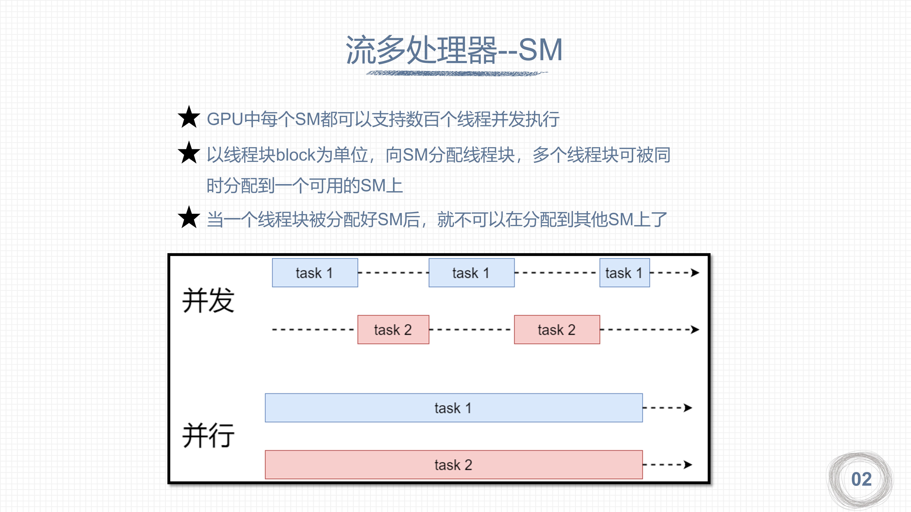

这里记得区分一下并行和并发的区别，并行是真正的多线程并行，并发实际上还是单线程，只不过快速切换来执行不同的任务，GPU中的每个SM可以支持数百个线程并发执行，并且以线程块为单位向SM分配，多个线程块可以被同时分配到一个可用的SM上，一个线程块被分配好SM后就不可能分配到其他SM上了

当然，由于计算资源限制，一个SM在分配了多个线程块之后并不会同时执行，而是根据内部的线程调度器去调度，即时分配的线程块很多，但是也只能同时执行固定数量的线程块，其他线程处于等待状态

## 线程模型与物理结构

下图左边是线程的模型或者说逻辑结构，右边则是物理结构，最小单元是CUDA核心，核心构成流多处理器，多个流多处理器构成硬件设备

线程模型是以线程块为单元在SM上分配执行的


那么什么是线程束（warp）呢？一个warp是一组同时执行的线程。在大多数NVIDIA GPU中，一个warp包含32个线程，大小是固定的（通常是32个线程），并且不受线程块大小或其他因素的影响。一般一个线程块中的相邻的32个线程属于同一个线程束，表情一个线程束不能包括多个线程块中的线程

但是硬件资源是有限的，同一时刻，SM只能执行一个线程束，或者说，同一时刻，真正意义上并行执行的只有这个线程束内的32个线程


## 内存模型

CUDA内存是很重要的，处理好了可以带来很大的性能提高，CUDA的内存大多是可以进行编程管理的，想开发高效的程序，必须管理好

GPU在执行计算任务时，需要反复从内存中读取和加载数据，访问内存是很耗时的，也是影响GPU性能的一个重要因素，所以在进行计算任务的时候，要尽可能选择低延迟高带宽的内存，有利于提高计算性能，但是实际上这种的内存造价高且难以做大，所以CPU和GPU都设计了多层的内存结构

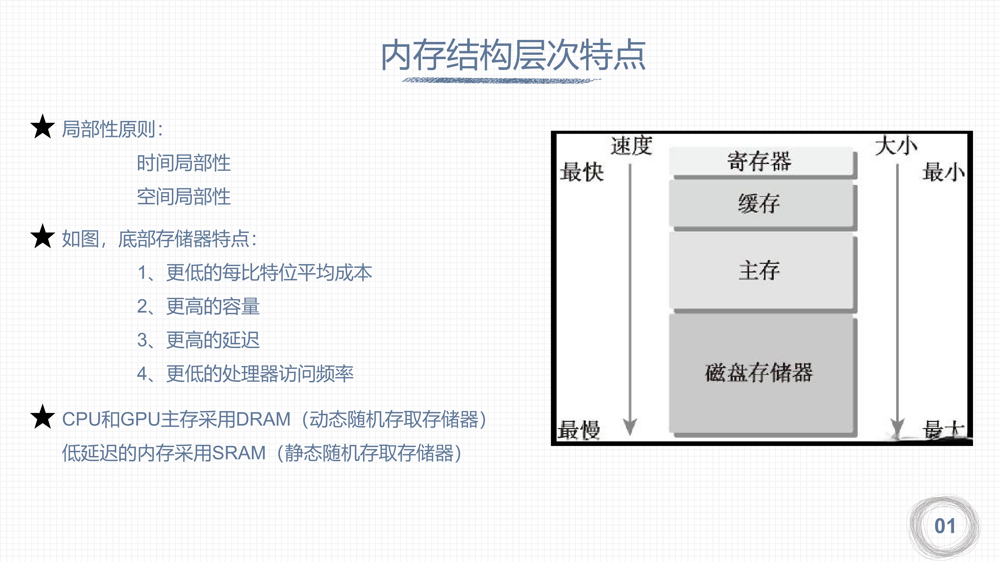

局部性原则

- 时间局部性：如果一个数据在一段时间内被访问，那么就有可能短时间内再一次被访问，随着时间推移，被再次访问的可能性降低
- 空间局部性：如果一段地址被访问，那么这段地址附近的地址也可能被访问，被访问的可能性随着距离增加而降低

内存层级结构由速度、带宽、容量不同的多级内存组成，一般来说，延迟（速度）与容量成反比（如上图所示），主存就是内存

CUDA编程模型向开发者提供了更多控制权，来显式地控制内存模型的行为


每种内存都有相应的作用域、生命周期、访问权限和物理存储位置

如上图所示

- 内存：最下层，通过PCIE总线链接GPU，可以与多种内存直接通信
- 寄存器：这是线程独有的，每个线程只能访问属于自己的寄存器，或者可以理解为局部内存，延迟最低、带宽最大
- 本地内存：也叫局部内存，是线程独有的，但是速度相比寄存器慢了很多
- 常量内存：所有线程可以读取，但是不能修改，用于避免线程读数据冲突
- 纹理内存：所有线程可以读取，但是不能修改，tex可以实现硬件插值
- 全局内存：可以被所有的线程读取和修改，是GPU中最大的内存
- 共享内存：在线程块内共享，此线程块内所有的线程都可以访问和进行读写，并且与其他线程进行数据交互，并且共享内存是片上内存，离处理器比较近，延迟低、带宽大、具有高速缓存的特性，需要频繁访问的数据可以保存至此，以提供程序效率


### CPU内存

对于整个Host Memory内存条而言，操作系统区分为两个大类（逻辑区分，物理上是同一个东西）：

- Pageable memory，可分页内存
- Page lock memory，页锁定内存

你可以理解为Page lock memory是vip房间，锁定给你一个人用。而Pageable memory是普通房间，在酒店房间不够的时候，选择性的把你的房间腾出来给其他人交换用，这就可以容纳更多人了。造成房间很多的假象，代价是性能降低

基于前面的理解，我们总结如下：

- pinned memory具有锁定特性，是稳定不会被交换的（这很重要，相当于每次去这个房间都一定能找到你）
- pageable memory没有锁定特性，对于第三方设备（比如GPU），去访问时，因为无法感知内存是否被交换，可能得不到正确的数据（每次去房间找，说不准你的房间被人交换了）
- pageable memory的性能比pinned memory差，很可能降低你程序的优先级然后把内存交换给别人用
- pageable memory策略能使用内存假象，实际8GB但是可以使用15GB，提高程序运行数量（不是速度）
- pinned memory太多，会导致操作系统整体性能降低（程序运行数量减少），8GB就只能用8GB。注意不是你的应用程序性能降低，这一点一般都是废话，不用当回事
- GPU可以直接访问pinned memory而不能访问pageable memory（因为第二条），所以想访问pageable Memory的数据就需要先将其复制到Pinned Memory再传到GPU

### 内存与GPU的数据交互

GPU可以直接访问pinned memory，称之为（DMA，Direct Memory Access）

对于GPU访问而言，距离计算单元越近，效率越高，所以PinnedMemory<GlobalMemory<SharedMemory

代码中，由new、malloc分配的，是pageable memory，由`cudaMallocHost`分配的是PinnedMemory，由`cudaMalloc`分配的是GlobalMemory

尽量多用PinnedMemory储存host数据，或者显式处理Host到Device时，用PinnedMemory做缓存，都是提高性能的关键

**总结**

- **Pinned Memory**：适合高频率的、大数据量的 CPU-GPU 数据传输，可以显著提高传输效率，但应谨慎使用以避免资源耗尽。
- **Host Memory**：适合普通应用和少量数据传输，易于管理，但传输效率不如 pinned memory。

## 寄存器和局部内存

寄存器是片内存储器，速度更快，并为线程独有，带宽大，局部内存就，性质如下


共享内存在核函数内是可以定义的，使用限定符shield修饰的变量，就会保存在共享内存中的，不加限定符的变量和内建变量都是保存在寄存器中的

但是数组不一样，数组会占用大量内存，如果不加限定，可能出现在寄存器中或者本地内存中

寄存器的参数和性质如下

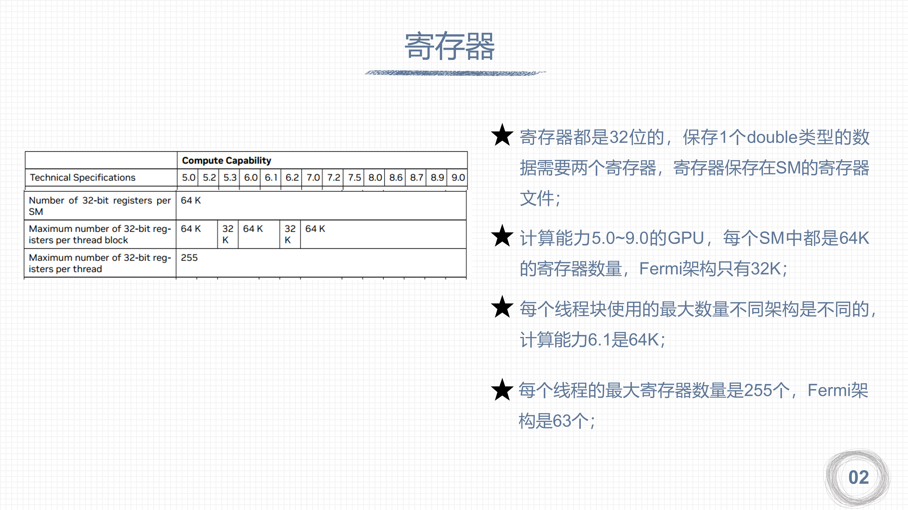

共享内存是寄存器的扩展，会存放寄存器放不下的数据，具体情况如下图所示

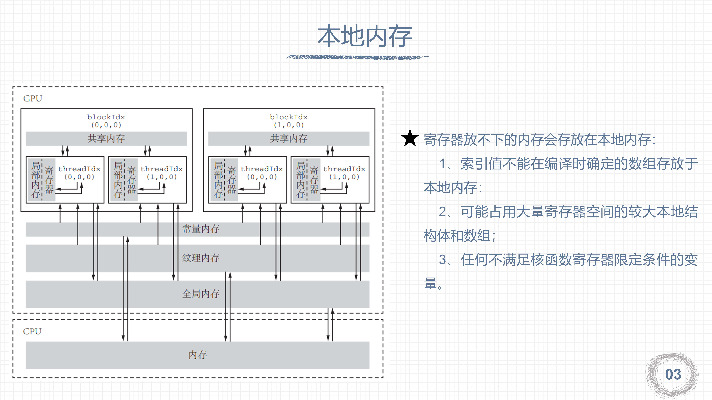

当然本地内存也有各种限制

- 每个线程最多使用512KB的本地内存
- 本地内存从硬件角度看只是全局内存的一部分，延迟也较高，过多使用的话也会降低程序性能，我们在设计程序中药尽可能让数据保存在寄存器中
- 对于计算能力2.0以上的设备，本地内存的数据存储在每个SM的一级缓存和设备的二级缓存中，这样子可以提高程序性能

**寄存器溢出**

每个寄存器的存储是有限制的，比如说64KB是很多GPU的寄存器容量，如果核函数所需的寄存器超出硬件设备支持，数据就会溢出保存到本地内存

寄存器溢出有两种情况：

- 一个流多处理器并行运行了多个线程块/线程束，总的寄存器需求容量大于64KB
- 单个线程运行所需的寄存器超过255个

寄存器溢出会降低程序运行性能

- 本地内存时全局内存的一部分，延迟较高
- 寄存器溢出的部分可以进入GPU缓存中，提高性能

## 共享内存

### 基础概念与使用方法

我们来看一个矩阵乘法的例子

当两个矩阵相乘，结果矩阵中的一行元素，会在计算的时候重复加载A矩阵的一行元素，这就很不效率，我们在想能不能读取一次然后反复使用，同样的，在计算结果矩阵的某一列的时候，也会重复读取B矩阵的一列，这对于存放在全局内存中的数据来说，读取是很慢的，会限制程序的性能

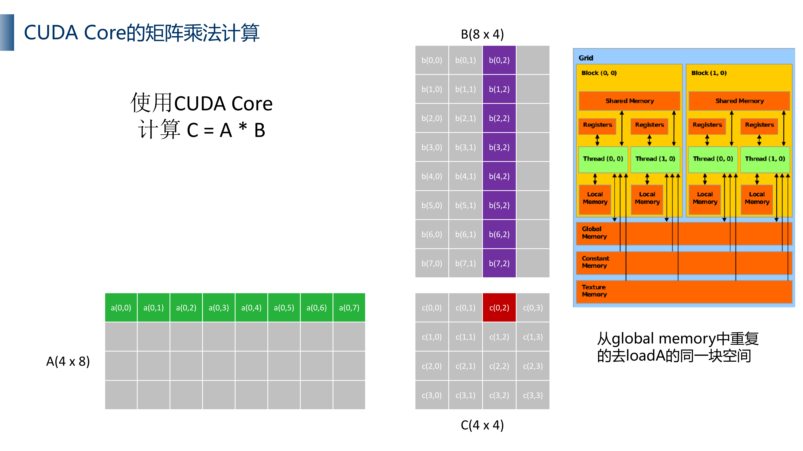

我们就可以将这种数据，放在里计算单元更近的共享内存中


上图左边是安培架构的GPU，右边是SM

左边蓝色的是L2缓存（L2 Cache），这个属于是片上内存

在SM最上面，有一个L1 Cache，或者说是L1指令缓存，最下面是一个L1的数据缓存（L1 Data Cache）或者说Shared Memory，然后里面有四个线程束调度器

内存我们可以分两种，片上内存（on-chip Memory）和片外内存（off-chip Memory），前者的速度更快，但是容量更小，全局内存的延迟最高，`cudaMalloc`函数就是在全局内存上访问

当然，不同架构的带宽不一样，甚至新架构的全局内存的带宽都可以高于老架构的L1 Cache带宽

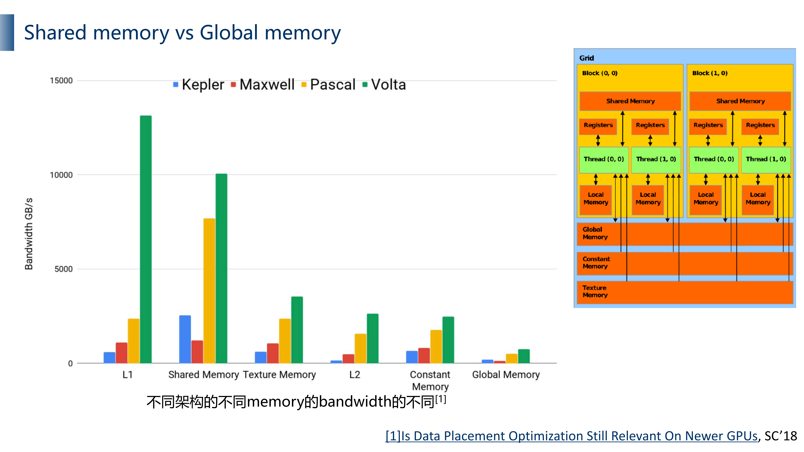

```c++
__shared__ float var;
```

想使用共享内存，就需要使用限定符`__shared__`

如果使用动态共享变量，方法流程跟静态是一样的，但需要注意几个点：

- 动态申请的时候需要是一维的
- 动态申请的变量地址都是一样的
- 使用动态共享变量速度会慢一点

### 存储体冲突（bank conflict）

如果发生存储体冲突，会导致程序性能严重下降

我们知道，在cuda中，32个线程组成一个线程束，程序执行就是以线程束为单位去并行执行，同样的，为了高效的访问存储，shared Memory中也对应的分成了32个存储体（也就是bank），对应warp中的32个线程


bank的宽度代表了存储数据的大小宽度

但是bank的存储方式很特别，一行填满之后就填写下一行，或者可以理解为矩阵，一个bank就是一列，然后一行行填写，填满一行就进入下一行，如下图所示


非常理想的情况就是，32个线程互不冲突的访问不同的bank，形成一一对应的关系，没有bank confli，一个Memory周期就可以完成所有的Memory读写操作


最坏的情况是，32个线程一起访问一个bank，那就是bank conflict的最坏情况，需要32个Memory周期才可以完成读写操作，这种情况常见于矩阵转置的时候


缓解方法由英伟达工程师提出，使用padding来缓解，在申请共享内存的时候多添加一列，但是stride的情况不变


之后就会变成这样，可以让数据错开，改变布局，缓解冲突

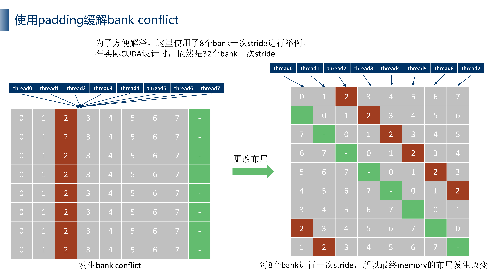
