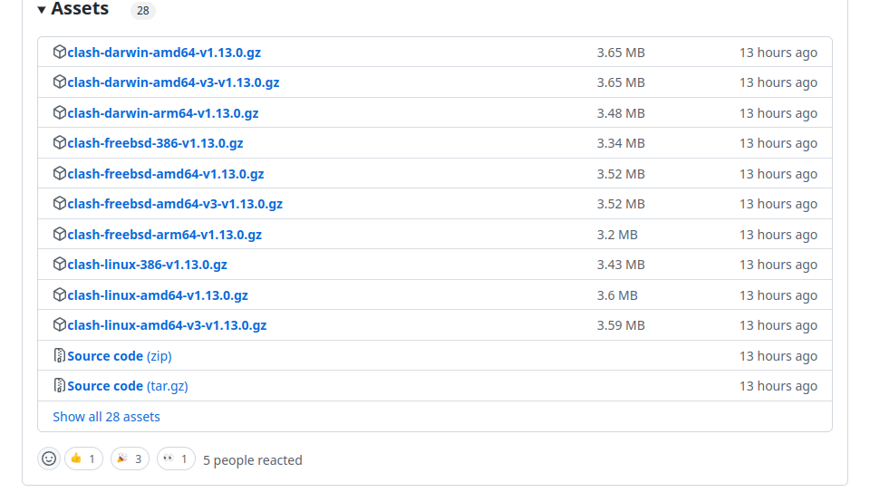
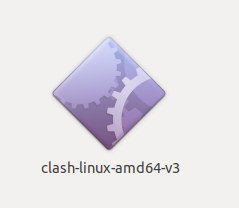

# 什么是科学上网

如果你想要使用谷歌搜索和谷歌学术这种，就需要进入国外网络，但是一般来说是无法进行的 ，因为国内网络会限制，所以就需要你使用一些手段来完成这个任务，这个也就是科学上网，在搞学术的人群中，这是很常见的一种操作

clash是一个平台，可以提供科学上网，当然这需要你有订阅链接以及流量

如果我们进行一个比喻，那么你想科学上网可以类比成想用手机上网，clash这个软件就是你的手机，可以解析手机卡并且提供上网的基础，你需要找服务商注册一个手机卡（也就是找一个可以提供翻墙服务的服务商，注册一个账号），然后充值和购买流量（购买可以翻墙的流量套餐），这样你才可以使用手机上网

首先我们要做的就是在ubuntu电脑上下载clash这个软件，这个软件有图形化界面和命令行两种，个人建议图形化界面的，方便一些

# 一、命令行方式的clash软件下载

这个的启动就是需要以命令行中输入指令完成的，包括订阅文件的下载等等，相对复杂一些

打开下面的链接，可以找到一系列的文件

https://github.com/Dreamacro/clash/releases



选择Linux-amd64的即可，v1/v3貌似没有区别

下载文件是一个.gz格式压缩包，解压之后就是一个可执行文件，我们单独创建一个clash文件夹存放这个可执行文件，并且将这个可执行文件改名为clash



# 二、下载配置文件（这个是命令行的方式）

在clash文件夹下，打开终端，下载配置文件

```shell
sudo wget -O config.yaml [订阅链接]
sudo wget -O Country.mmdb https://www.sub-speeder.com/client-download/Country.mmdb
```

我们用自己的订阅链接替换掉第一行的[订阅链接]，就像这样


然后回车，就可以根据订阅链接下载配置文件了，可以发现文件夹下多了一个config.yaml文件

然后输入第二个指令，下载第二个配置文件，如果这里下载不成功，可以删除文件夹下的Country.mmdb文件，在后面加载程序的时候会自动下载

然后打开config.yaml文件，找到secret，这里表示密钥，初试状态为“”，将其改为“123456”（后面要用，也可以是其他的密码，这里为了方便记忆）


# 三、启动clash

在clash文件夹中启动终端，输入

```shell
chmod +x clash
./clash -d .
```

第一个指令是赋予clash文件可执行权限，第二个是启动clash文件并且告诉它，它所需的配置文件在当前目录下，这里注意一下./clash -d后还有一个点