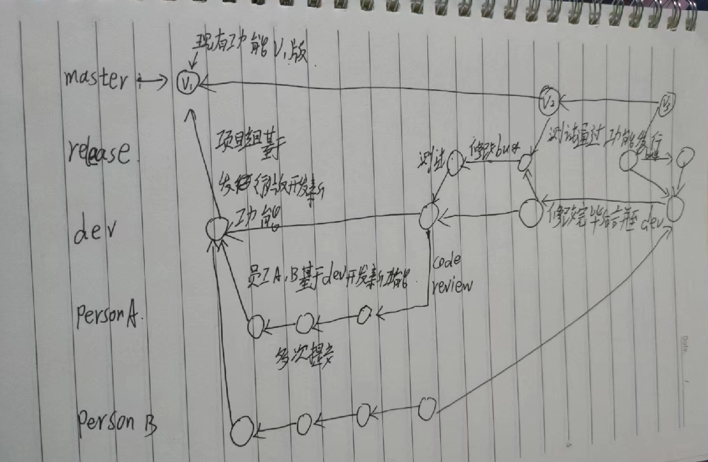
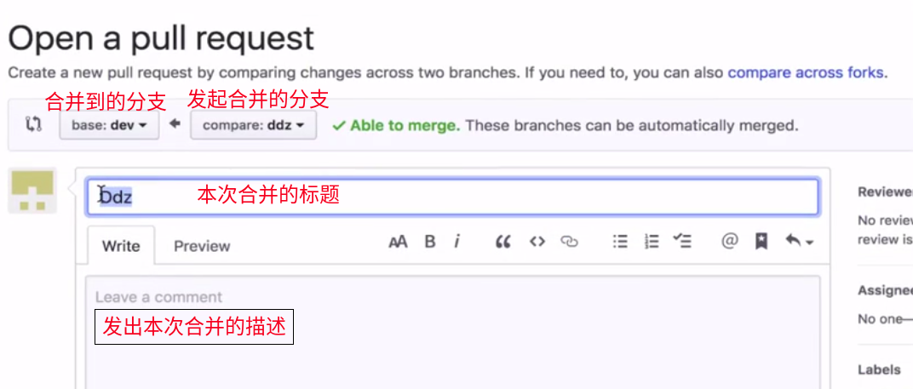
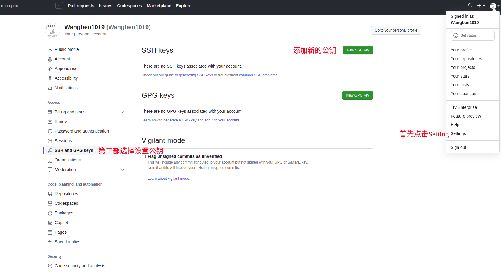
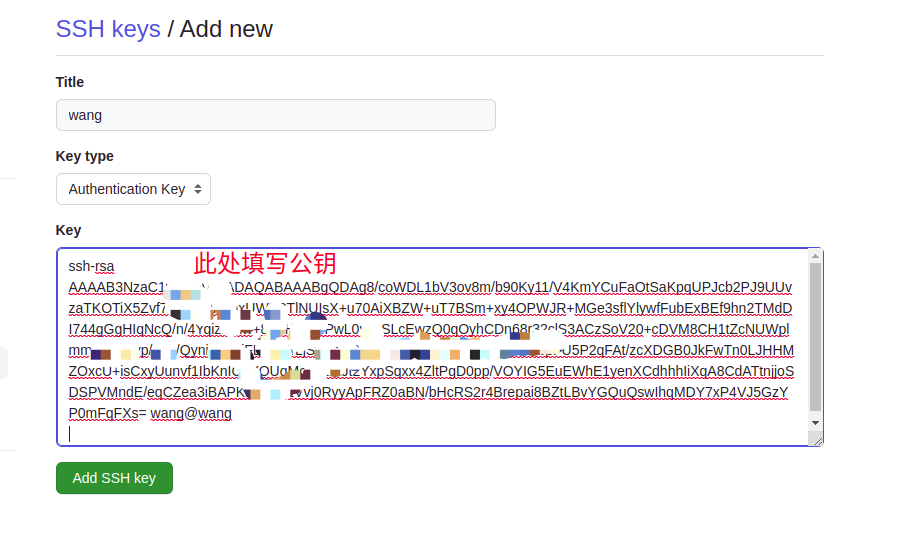
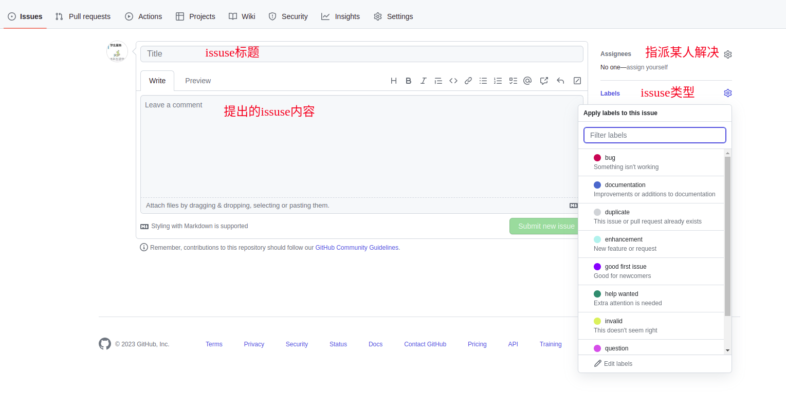

# Git是什么

## 背景

​		项目的开发是一个不断迭代的过程，而不是一次性就可以完成的（实际上一个项目的代码可能以万行为单位），开发过程中程序员需要不断的对代码进行编写和更正（甚至在项目完成后还需要进行维护）。这就带来很多的问题。

​		首先，开发中代码会存在多个版本，我们如何将代码在多个版本间进行切换？第二，代码上线后，如何在不影响现行开发工作的情况下对代码进行维护？第三，开发时某段代码被多人修改时（因为一个项目往往需要很多人共同完成），如何处理代码的冲突问题？除此之外，还有存储效率、远程仓库等问题。

git是一个免费开源的版本控制系统，它被设计用来快速高效地管理项目开发的源码。通过git可以跟踪代码的状态，也可以在修改代码后对代码状态进行存储，还可以在需要时将已经修改过的代码恢复到之前存储的状态。更强大的是使用git管理代码时，可以创建代码分支（branch），代码分支相当于一段独立的代码记录，我们可以在分支上对代码进行任意的修改，而这个修改只会影响当前分支，不会对其他分支产生影响。同时，可以对分支进行合并，合并后一个分支的修改便可在另一分支上生效。Git或许可以理解为代码的一个时光机，或者是代码的平行宇宙（一种可以合并为一个的平行宇宙）。总之，git是当今最优秀的版本控制工具！

笔记来自于教程[7小时学会Git实战（完整版）通俗易懂](https://www.bilibili.com/video/BV1kK4y1S7H2/?spm_id_from=333.337.search-card.all.click&vd_source=aaea66fb42b001c99446f0cabb957919)

## 一、本地

### 1.什么是Git

Git是一个**分布式版本控制软件**

* 分布式：针对一个项目，本地拥有一个仓库，中心服务器也拥有一个仓库（中心 + 本地）
* 版本控制：能够存储经过修改等操作过后的前后多个版本
* 软件：安装到电脑上的工具


### 2.Git的安装

特别注意：Git安装的位置为个人电脑（本地），安装后可在本地做版本控制

[官网安装教程](https://git-scm.com/book/en/v2/Getting-Started-Installing-Git)

#### 2.1Linux

```shell
sudo apt install git-all
```

如果出现报错，运行

```shell
sudo apt-get update
```

#### 2.2Windows

[Git官网](https://git-scm.com/)下载安装包，一路下一步即可，注意存储路径尽量不要出现中文、特殊符号、空格等


### 3配置(只需配置一次)

* 配置用户名

```shell
git config --global user.name "your_name"
```

- 配置邮箱

```shell
git config --global user.email "your_email"
```


### 4.版本控制的步骤

1. 进入要管理的文件夹
2. 初始化本地仓库

```shell
git init
# 初始化，让git帮助管理当前文件夹
#这一步操作，实际上就是在当前目录下新建了一个名为.git的隐藏文件夹
#这个隐藏文件夹里面会有当前仓库的信息，即用来存储代码的版本信息
```

3. 管理

```shell
git status
```

可以查看分支各种状态，文件的状态（已提交，未提交等）,也可以检测到文件被修改

git中的文件有两种状态，已跟踪和未跟踪
未跟踪指的是文件并没有被git所管理，已跟踪指的是文被git管理，其中已跟踪的文件有三种状态：未修改、修改和暂存

暂存，表示文件修改已经保存，但是尚未提交到git仓库。

未修改，表示磁盘中的文件和git仓库中文件相同，没有修改。

已修改，表示磁盘中文件已被修改，和git仓库中文件不同。

三种状态的颜色

- 红色：新增的文件/修改的老文件，表示的是一种**未跟踪**的状态。经过git add file_name/git add . 变为绿色
- 绿色：git已经管理的文件，表示一种**暂存**的状态，但是还没有提交到仓库。经过git commit -m "submit information"  变为白色(生成版本)
- 白色：已经生成版本，都是未修改的文件，表示所有文件已经在本地仓库中

```shell
git add file_name
# 将文件添加到暂存区，添加所有文件可以用 git add .  (.为当前文件夹下所有文件)  ，由git管理
```


4. 生成版本

```shell
git commit -m "submit information"
# 生成版本并附带提交信息
git log
# 打印版本信息，可以看到以前提交时的信息
```

一般来说，提交的信息要有价值，比如说修改了什么什么功能，完善了什么什么bug

```shell
git commit -a -m "submit information"
```

可以提交所有已修改的文件到仓库中（只提交已跟踪的）

#### VScode使用Git

我们先使用vscode打开一个文件夹，可以在vscode左侧看到有Git图标


这个是使用图形界面进行初始化的方式，与``git init``效果一致，只不过换了一种方式

如果我们创建或者修改了一个文件，那么可能就会有这种图标


一个绿色的U，代表的是未跟踪（Untracked），还没有被管理


我们在修改文件后，想提交的话可以通过这个进行提交，简化了操作

### 5.Git三大区(对应上文红色、绿色、白色)

#### 5.1工作区

工作区就是使用者操作的文件夹，工作区一般分为两部分：

* 已管理部分
* 新文件/修改文件部分：这部分表现为红色

将工作区的所有文件提交到暂存区``git add .``

#### 5.2暂存区

将暂存区的文件提交到版本库``git commit``

#### 5.3版本库

### 6.版本回滚

#### 6.1回滚至之前版本

```shell
git restore file_name
```

回滚到上一次commit提交的版本，然后文件会从已修改的状态回到未修改

```shell
git reset --hard 版本号
# 版本号可以通过git log查询，如
wang@wang:~/demo_sentry_ws$ git log
commit 62fac5fd37cac6e39ff1c6e6f8a270024f84689a (HEAD -> dev, origin/dev)
Author: wangben <2782760102@qq.com>
Date:   Thu Apr 13 14:22:41 2023 +0800

    The sentry has achieved obstacle avoidance
    
62fac5fd37cac6e39ff1c6e6f8a270024f84689a  就是版本号
# ex：版本号写想要回滚到的版本号
git reset --hard 62fac5fd37cac6e39ff1c6e6f8a270024f84689a
```

#### 6.2回滚至之后版本

```shell
git reflog
# 查看版本信息，如：
wang@wang:~/demo_sentry_ws$ git reflog 
62fac5f (HEAD -> dev, origin/dev) HEAD@{0}: commit: The sentry has achieved obstacle avoidance
cf6290b (master) HEAD@{1}: checkout: moving from master to dev
cf6290b (master) HEAD@{2}: commit (initial): computer_to_pc_temp
# 此处，前方的既是版本号，如 62fac5f  cf6290b  

#执行向当前版本回滚
git reset --hard 版本号
# ex：版本号写入需要回滚到的版本
git reset --hard 62fac5f
```

#### 6.3取消暂存

```shell
git restore file_name 
git restore --staged file_name 
```

第一个命令是恢复文件状态，第二个命令表示将文件从暂存状态取消，但是不会取消操作（不能恢复删除操作等）

### 7.删除操作/重命名操作

```shell
git rm file_name
```

可以在磁盘和暂存区中删除文件，同时这个操作可以上传仓库

然后，如果提交的话，那么版本库中的文件也会被删除

```shell
git rm filename -f
```

上面是一个强制删除的命令

```shell
git mv old_name new_name
```

可以将文件重命名，其中old_name是要修改的文件名，new_name是新文件名

例子：git mv 1.txt 2.txt

这就是将1.txt文件重命名为2.txt

### 8.分支

#### 8.1 什么是分支

git在存储文件的时候，每一次提交代码，都会在仓库创建一个对应的节点，用来存储当前代码的状态，所有的节点构成树状结构，也就是说会存在分支

每个节点都有唯一的标识，这个标识可以通过``git log``进行查看

各个分支开发进度互不干扰		

这里有一个很实际的应用场景，比如说项目要上线，但是我们需要同时去继续开发这个项目那么怎么办？我们不可能直接在上面开发并且发布，否则很容易出问题，这个时候就需要再开一个分支了，一个分支就是一个独立的代码仓库，后面还可以进行合并分支操作

多分支示意图如下


#### 8.2 创建/切换/删除分支

```shell
git branch # 查询所有分支，分支前带 * 的为当前所在分支
git branch dev # 创建分支"dev"
git branch -d dev#删除分支"dev"
git checkout dev # 切换到分支"dev"
git switch dev#切换分支到dev
git switch -c dev#创建并且切换到dev分支
```

- 至于为什么会有两个看起来功能一模一样的切换分支命令，是因为``git checkout``这个命令，承担了过多的功能，不但可以切换分支还可以用来恢复工作区文件，容易造成混淆，所以Git社区发布了新命令（在2.23版本之后发布），其中``git switch``只有切换分支功能，``git restore``只有恢复文件功能，这两个命令替换了原来的``git cheackout``功能

#### 8.3 合并分支

```shell
# 将bug分支合并到master分支
git branch bug
git switch bug
git switch master	# 切换到master分支
git merge bug	# 将bug分支合并到master分支，并且commit好
git branch -d bug # 删除bug分支，这时候bug1分支就没用了
```


如果我们使用命令将bug1分支合并到master分支中，会出现Fast-forward消息（也就是快速合并），这是因为bug1分支领先多个版本（多出多个节点），并且在同一条线上

合并之后，会有这种情况


* **注意：**如果合并的时候，两个分支不是单纯的前后关系，或者说存在同一个文件在两个分支中都有修改的情况，那么合并的时候就会出现冲突的问题，需要手动修改，比如说下图中，我们需要合并update分支到master分支，但是这两个分支是两条线上的，并且两个分支都对同一个文件有不同的修改，那么就无法直接合并


如果不同分支，没有对同一个文件的不同修改，那么就可以直接合并，比如说master分支只修改了文件1，update分支只修改了文件2，那么可以直接进行合并，而不会产生冲突

#### 8.4 变基

在开发中，还可以通过变基（rebase）来完成分支的合并

如果每一次的修改都新建一次分支，我们将两个分支合并，并且删除一个分支之后，这个分支的记录还在，这样反复的创建合并和删除操作会造成提交记录非常混乱和臃肿

在下图中，update分支的根是C4节点，或者说C4是update分支的base


我们可以将update的基变为C8，类似于换花盆种花，这样子之后，原本是两支，现在就是一支了，那么合并分支的时候就可以快速合并，并且不会产生多余记录

那么如何进行变基操作呢？

- 首先，我们需要找到最近的共同祖先——也就是C4节点，尽管两个分支有很多的共同节点，但是C4才是最近的，所以Git会找到这个
- 然后对比当前分支相比于祖先的历史提交，查看发生了哪些变化，并且将祖先不同提取出来，存储到一个临时文件中
- 将当前部分指向目标的基底
- 以当前基底开始，重新执行历史操作，也就是说，把从共同祖先到最新分支的历史操作，重新在新基底上进行操作，变基之后的分支如下图所示
- 

```shell
git switch update#先切换到要变基的分支，也就是update分支
git rebase master#进行变基，但是类似于merge操作，如果两个分支都对同一个文件有新操作，那么基会有冲突
```

然后就可以进行合并分支操作，这样就可以完成快速合并操作了

注意一下，变基和合并两种操作，对于合并分支这个操作来说，最终结果一致，但是变基可以让代码的提交记录更为整洁

注意一下，大多数情况下合并和变基是可以互换的，但是如果分支已经提交给了远程仓库，那么这时候就尽量不要变基

### 9.工作流

关于分支使用规范，实际开发过程中，开发中的版本要创建一个dev等其他名称的分支进行开发和测试，master分支中永远存放稳定的版本·


## 二、GitHub(云端托管仓库)

目前我对于 git 所有操作都是在本地进行的。在开发中显然不能这样的，这时我们就需要一个远程的 git 仓库。

远程的 git 仓库和本地的本质没有什么区别，不同点在于远程的仓库可以被多人同时访问使用，这种在团队开发的时候非常方便，比如说团队里面若干人，云端仓库可以被多个人拉取代码并且修改，修改完成之后继续提交，方便协同开发。在实际工作中，git 的服务器通常由公司搭建内部使用或是购买一些公共的私有 git 服务器。

我们学习阶段，直接使用一些开放的公共 git 仓库。目前我们常用的库有两个：GitHub 和 Gitee（码云）


```shell
git remote
#列出关联的远程库的仓库名
git remote add 远程仓库名字 远程仓库地址
# 添加远程仓库链接，完成关联，示例如下，一般主仓库名为origin
git remote add origin https://github.com/lilichao/git-demo.git
git remote remove <远程仓库名>#删除远程库关联
git branch -M main#修改当前分支名字为main
git push -u 远程仓库名字 分支
# 将本地分支内的内容推送到远程分支（上传并关联），前提是分支名一致
# 注意：一般情况下远程仓库名字用 origin
#如果关联之后，再次提交只需要git push即可，第一次提交需要进行关联
#如果远程库的版本更新，则无法推送
git clone 仓库地址 [path]
# 将云端仓库克隆(拉取)到本地
#可以自定义路径，如果自定义路径，那么项目内容就会克隆到指定路径下
```

```shell
# 当克隆的时候，本地的仓库已经实现了下方这一步，所以一般情况下远程仓库统一同origin
git remote add origin 远程仓库地址
# 并且，如果远程仓库存在其他分支，克隆到本地之后使用 git branch 查看可能查看不到除master之外的其他分支，但是其他分支仍是实际存在的
```

```shell
# 当远程仓库已经更新，但是本地未更新时，比如开发者用一台电脑开发并上传并想使用另一台电脑继续开发， 多人协作时其他人更新仓库之后，开发者在其基础上开发，需使用命令
git pull origin dev
#git fetch是将远程主机的最新内容拉到本地，用户在检查了以后决定是否合并到工作本机分支中。
#而git pull 则是将远程主机的最新内容拉下来后直接合并，即：git pull = git fetch + git merge，这样可能会产生冲突，需要手动解决。
# 注意，拉取之前首先切换到dev分支
git fetch
git merge origin/master#将远程库的内容合并进本地库
git switch dev
# 首次开发更新一下dev分支
git merge master
# 然后拉取远程仓库的更新
git pull origin dev
```

### 1.rebase(变基)

使git提交记录变得简洁

#### 1.1应用场景一

将多个记录整合成一个记录：开发过程中，有的时候多次的提交的记录只对于开发者对工程做版本控制有实际效果。但是对于验收工程的人，或者是第三方等非开发者是不必要的，这类人只关心代码的最终版本，所以，利用rebase将多个纪录整合成一个记录，让代码变得更加简洁。

用法：

```shell
git rebase -i 版本号
# 本句会把从当前版本，到所输入版本号版本之间的所有版本整合成一个记录(包含当前版本和版本号版本)

git rebase -i HEAD~3
# 本句会把从当前版本开始，检索最近的 3 次提交来整合记录
# 执行本句后，会列出搜索到如下的三条记录
pick 0aa4591 v2
pick 4fd40b3 v3
pick 0aade34 v4

# 其中需要更改这些前缀
p, pick = use commit
r, reword = use commit, but edit the commit message
e, edit = use commit, but stop for amending
s, squash = use commit, but meld into previous commit
f, fixup = like "squash" , but discard this commit's log message
x, exec = run command (the rest of the line) using shell
d, drop = remove commit

# 将后两个的pick修改成s，意在将第三个合到第二个，然后将第二个合并到第一个，并提交
pick 0aa4591 v2
s 4fd40b3 v3
s 0aade34 v4

# 保存后会填写提交信息，修改后再次保存即成功合并

# 注意：尽量不要合并那些已经push到远程仓库的
```

#### 1.2应用场景二

多个分支开发合并之后，能够省略分支开发过程，将分支开发的功能插入到主分支来表示

```shell
wang@wang:~/Wang_found/ces$ git log --graph --pretty=format:"%h %s"
*   23bafc1 merge first
|\  
| * 5fb6e3e 4
* | 4ba1462 5
|/  
* 3eb22a7 3
* 82504ef 2
* 51e2c11 1

# 上为原本的情况，master和分支同时开发然后合并

wang@wang:~/Wang_found/ces$ git checkout dev 
切换到分支 'dev'
wang@wang:~/Wang_found/ces$ git rebase master 
首先，回退头指针以便在其上重放您的工作...
应用：dev branch commit 1
wang@wang:~/Wang_found/ces$ git checkout master
切换到分支 'master'
wang@wang:~/Wang_found/ces$ git merge dev 
更新 a0dde07..46e1ccc
Fast-forward
 dev.txt | 0
 1 file changed, 0 insertions(+), 0 deletions(-)
 create mode 100644 dev.txt
wang@wang:~/Wang_found/ces$ git log --graph --pretty=format:"%h %s"
* 46e1ccc dev branch commit 1
* a0dde07 master branch commit 1
*   23bafc1 merge first
|\  
| * 5fb6e3e 4
* | 4ba1462 5
|/  
* 3eb22a7 3
* 82504ef 2
* 51e2c11 1

# 可以看出 * 46e1ccc dev branch commit 1 和 * a0dde07 master branch commit 1 在一条分支
```

#### 1.3应用场景三

当双方负责一个项目的部分开发时，由于各种原因，不可避免的让双方的代码在本地都有变动。当一方上传到远程仓库另一个人拉取时，会导致出现合并的情况，向同行的代码出现分叉，利用git rebase可以避免这一情况

```shell
# 原来的操作：
git pull origin dev
# git pull 可以分为两部分
git fetch origin dev	# 拉取远程仓库项目到本地版本库
git merge origin/dev	# 将本地版本库代码拉到工作区

# 为了避免合并出现的问题，我们不用 git merge origin/dev 一句，而使用
git fetch origin dev
git rebase origin/dev

```

使用`rebase`的注意事项：使用`rebase`的时候，一般认为合并的时候没有冲突。但是产生冲突时，需要解决冲突，手动解决完冲突之后，根据提醒执行 git add . 等命令，最后执行 `git rebase --continue`

```shell
# 使用rebase产生冲突
wang@wang:~/Wang_found/ces$ git rebase master 
首先，回退头指针以便在其上重放您的工作...
应用：x1
使用索引来重建一个（三方合并的）基础目录树...
M	1.txt
回落到基础版本上打补丁及进行三方合并...
自动合并 1.txt
冲突（内容）：合并冲突于 1.txt
error: 无法合并变更。
打补丁失败于 0001 x1
提示：用 'git am --show-current-patch' 命令查看失败的补丁
Resolve all conflicts manually, mark them as resolved with
"git add/rm <conflicted_files>", then run "git rebase --continue".
You can instead skip this commit: run "git rebase --skip".
To abort and get back to the state before "git rebase", run "git rebase --abort".

# 修改完成后
wang@wang:~/Wang_found/ces$ git status 
变基操作正在进行中；至 f77f65f
您在执行将分支 'dev' 变基到 'f77f65f' 的操作。
  （解决冲突，然后运行 "git rebase --continue"）
  （使用 "git rebase --skip" 跳过此补丁）
  （使用 "git rebase --abort" 以检出原有分支）

未合并的路径：
  （使用 "git restore --staged <文件>..." 以取消暂存）
  （使用 "git add <文件>..." 标记解决方案）
	双方修改：   1.txt

修改尚未加入提交（使用 "git add" 和/或 "git commit -a"）

# 运行 git add 和 git rebase --continue
wang@wang:~/Wang_found/ces$ git add .
wang@wang:~/Wang_found/ces$ git rebase --continue 
应用：x1
wang@wang:~/Wang_found/ces$ git log --graph --pretty=format:"%h %s"
* 7203f84 x1
* f77f65f master xxx
* 46e1ccc dev branch commit 1
* a0dde07 master branch commit 1
*   23bafc1 merge first
|\  
| * 5fb6e3e 4
* | 4ba1462 5
|/  
* 3eb22a7 3
* 82504ef 2
* 51e2c11 1

# 如下为合并后的两个分支项目
* 7203f84 x1
* f77f65f master xxx
```

### 2.Beyond compare：快速解决冲突的工具

1. 安装beyond compare
2. 在git中配置

```shell
git config --local merge.tool bc3 # 将合并工具起别名为 bc3
git config --local mergetool.path 'Beyond Compare Installation Path'
git config --local mergetool.keepBackup false  # 不保留解决冲突的备份
```

3. 应用 beyond compare 解决冲突

​	`git mergetool`

### 3.多人协作



在仓库的设置`Setting`中点击`Collaborators`可以填写**用户名、全名、电子邮件**邀请合作者

或者

创建组织，在组织中创建项目多人开发

项目开发中，往往有多个版本，每次提交的会有哈希值代表版本号，但是版本号太过复杂，可以使用命令对提交打标签。

```shell
git tag -a 标签名 -m "标签描述" 	# 对本地提交加上标签

git push origin --tags 			 # 将标签推送到远程仓库，会在分支处看到Tag选项，并且会将项目发布到Releases
```

#### 3.1多人协作开发

1. 邀请成员进组织：回到组织界面，点击`invite someone`通过用户名、全名、邮箱邀请成员进组织，按键一般位于左下角。邀请完毕之后，被邀请发开者会收到邮件，同意即可加入组织

2. 设置成员权限：组织内可能会多个项目，并不是每个人都开发所有的项目，所以需要修改成员权限。设置权限分为**组织设置权限**和**项目设置权限**。

   1. 组织设置权限：直接在组织页面单击`Settings`选择`Member privileges`设置成员权限
   2. 项目设置权限：项目仓库内单击`Settings`选择`Collaborators & teams`邀请合作者，并赋予权限(Write等)

3. 组织成员开发：组织成员开发时，首先克隆项目到本地电脑上，此时在master分支，首先切换分支到dev，然后创建属于自己的开发分支**(在哪个分支下创建的分支新分支的指针就指向哪里，所以克隆项目之后必须先切换到dev分支再创建分支，否则创建的分支就指向master)**

4. 功能开发完成后的`code review`：利用GitHub中`pull request`实现

   1. 配置`pull request`功能：GitHub仓库页面点击`Settings`后选择`Branches`后添加规则`Add rule`，在添加规则界面选择需要添加的分支并勾选`Require pull request reviews before merging`(合并前需要拉取请求)，并进行属于个人的配置后点击`Create`，此时意味着想要将代码合并到dev，在这之前必须经过code review
   2. 开发者`New pull request`(提交拉取请求)：最后创建拉取请求。管理者会受到邮件和pull request
   3. 仓库管理/拥有者在云端仓库`Add your review`：前往pull request界面选择`Add your review`，开始查看被修改过后的代码，查看完毕后点击`Merge pull request`并点击`Confirm merge`同意合并
   4. 仓库管理/拥有者拉取代码到本地进行review：

   ```shell
   git fetch origin # 拉取代码到本地
   git checkout -b 申请合并的分支 origin/申请合并的分支 # 切换分支，进行review
   # 本句checkout的用意为：本地创建一个名为"申请合并的分支"的分支，并且关联到远程仓库一个名为"申请合并的分支"的分支
   git merge dev # 将dev合并到该分支下(此时的dev是云端的dev)
   
   # 进行code review
   
   git checkout dev 		# 切换到dev分支，准备上传到云端
   git merge -no-ff ddz 	# –no-ff：不使用fast-forward方式合并，保留分支的commit历史 
   git push origin dev 	#上传云端
   ```

   5. 合并完毕后，按照需求选择是否删除分支

5. 功能开发完成进行测试：创建Releases或其他测试分支，进行功能测试。(一般测试阶段开发功能已经完毕，不再添加新功能，只是修改现有功能的bug等)。通过测试后，直接合并到master分支或者合并到dev分支后合并到master分支。

6. 本地打标签推送到远程仓库。此时可在Releases找到发布版本
```shell
git tag -a v2 -m "第二版功能上线"
git push origin --tags
```

7. 注意：如果产生冲突，仍需手动解决冲突后合并

### 4.给开源项目贡献代码

1. fork源代码，将源代码拷贝到我自己的仓库
2. 在自己的仓库对开源代码进行修改：克隆到本地进行修改后推送到云端
3. 给源代码的作者提交修复bug的申请(pull request)
4. 步骤与多人协作中分支合并操作一样

### 5.GitHub知识点

#### 5.1配置文件的三个存放位置

* local：项目配置文件(pwd：项目/.git/config)，在当前仓库下(`git init`生成的配置文件)

```shell
git config --local user.name "xxx"
git config --local user.email "xxx.@xx.com"
```

* global：全局配置文件(pwd：~/.gitconfig)，在当前用户的home目录下

```shell
git config --global user.name "xxx"
git config --global user.email "xxx.@xx.com"
```

* system：系统配置文件(pwd：/etc/.gitconfig)，在系统目录下

```shell
git config --system user.name "xxx"
git config --system user.email "xxx.@xx.com"
# 配置系统文件需要有root权限
```

应用：

```shell
git config --local user.name "xxx"
git config --local user.email "xxx.@xx.com"

git remote add origin 地址 # 默认添加在本地配置文件中(--local)
```

#### 5.2git免密登录

* 在URL中体现

在 git remote add origin 地址 的时候修改地址实现免密登录

原来的地址：https://github.com/Wangben1019/free-programming-books.git
修改的地址：https://用户名:密码@github.com/Wangben1019/free-programming-books.git

* SSH实现

  1. 生成公钥和私钥，终端使用命令 `ssh-keygen`，公钥和私钥默认存放在 ~/.ssh/  生成的文件中有一个名为`id_rsa.pub`的文件，他代表的是公钥。`id_rsa`是私钥

  2. 拷贝公钥的内容，并设置到github中

     1. 通过cat命令查看公钥内容。`cat ~/.ssh/id_rsa.pub`(在主目录下)
     2. 设置到GitHub上： 
     3. 在git本地中配置ssh地址

     ```shell
     git remote add origin git@github.com:Wangben1019/free-programming-books.git
     # 地址处填写ssh地址
     ```

     4. 以后就可以直接使用不输入密码了

* git自动管理凭证

#### 5.3git忽略文件(.gitignore)

git会通过忽略文件所写内容忽略掉部分文件的版本修改，即在git add 之前忽略掉

[git官方提供了各种语言开发时推荐的忽略文件](https://github.com/github/gitignore)

```.gitignore
*.h   			# 忽略所有以 .h 结尾的文件
a.c   			# 忽略文件 a.c
！a.h  			# 不忽略a.h(上文忽略了所有.h文件)
files/ 			# 忽略文件夹files
*.py[c|a|b] 	# 忽略以.pyc .pya .pyb 后缀的文件
```

#### 5.4任务管理相关

* issuse：文档以及任务管理。对项目有疑问，提出问题，提出bug修改等操作。
* wiki：对项目进行介绍，文档，说明。

