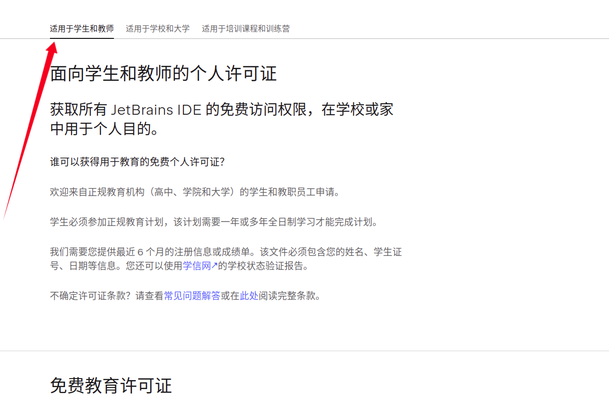
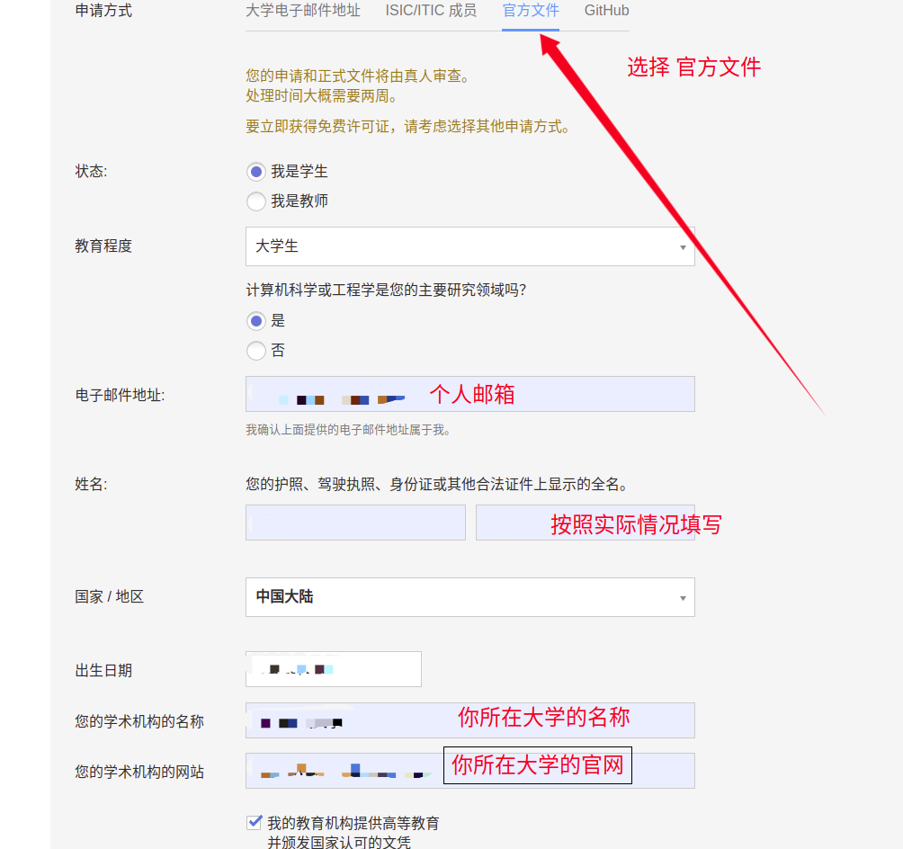
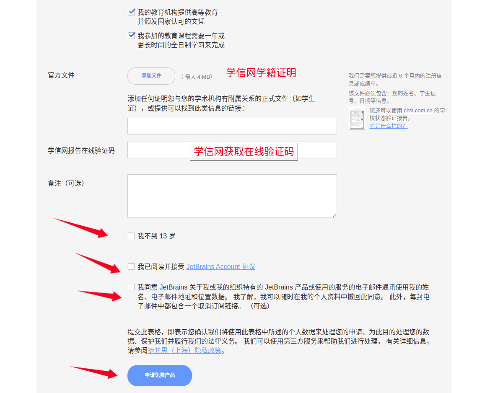
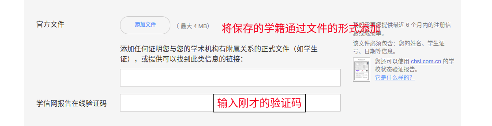
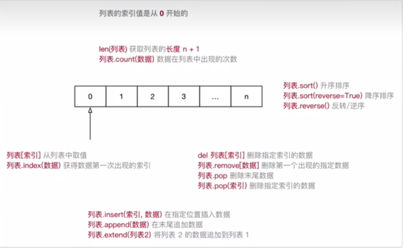
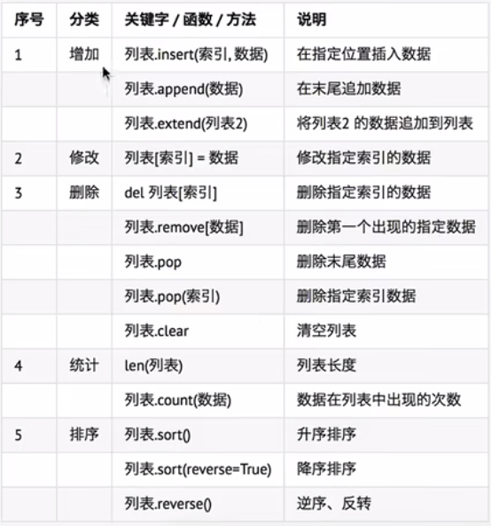

# Python_Study_Notes

## 零、学习前准备

### 1.安装PyCharm

1. 进入[JetBrains官网](https://www.jetbrains.com.cn/)

2. 

3. 单击跳转页面后，点击下载，按照自己需求的系统进行下载

   1. Windows

      下一步即可

   2. Linux ---- 以Ubuntu为例

      1. 首先下载压缩包
      2. 在目录`Downloads`下找到下载的压缩包
      3. 建议：不要在Downloads下直接解压，尽量自己创建一个文件夹在主目录或者是其他位置
      4. 解压压缩包

      ```shell
      tar -xf pycharm-professional-2023.1.tar.gz
      ```

      5. 解压后进入解压目录中的bin目录，运行PyCharm

      ```shell
      # 1.此时在bin目录下，如果快捷键调出终端需要cd进入。或者在bin目录下右键选择在终端打开
      ./pycharm.sh
      # 2.可以把bin目录的路径放入环境变量中，刷新环境变量后在任何目录都能够调用 ./pycharm.sh
      ## 在 .bashrc 下（主目录按下 Ctrl + H显示）添加一下命令
      export PATH="/home/wang/Software/pycharm/pycharm-2023.1/bin:$PATH"
      ## 路径根据自己电脑具体所在位置修改，然后刷新变量
      source .bashrc  # 在主目录下
      ### profile同理，不再赘述
      ```

      6. 生成PyCharm图标和桌面快捷方式

      ```shell
      # 首先终端运行以下指令 (主目录)
      sudo vim /usr/share/applications/Pycharm.desktop
      # 然后写入以下内容 注意需要修改 Exec 和 Icon 两项，改为你自己的bin位置
      [Desktop Entry]
      Type=Application
      Name=Pycharm
      GenericName=Pycharm3
      Comment=Pycharm3:The Python IDE
      Exec=sh /home/wang/Software/pycharm/pycharm-2023.1/bin/pycharm.sh
      Icon=/home/wang/Software/pycharm/pycharm-2023.1/bin/pycharm.png
      Terminal=pycharm
      Categories=Pycharm
      # 然后添加可执行权限
      sudo chmod +x /usr/share/applications/Pycharm.desktop
      # 这样就可以展开左下角来使用PyCharm了
      ```

### 2.申请学生免费资格（学信网材料获取后文有写）

1. 前提：你是在校大学生
2. 进入[JetBrains官网](https://www.jetbrains.com.cn/)
3. 按照如下流程进行申请







### 3.学信网材料获取以及承接上一步操作

1. [登录学信档案](https://my.chsi.com.cn/archive/index.action)
2. 按照以下步骤




**最后，只需等待即可，长则一个月，短则一两周，等待官方向你发送邮箱**

**注意：申请的是JetBrain全家桶，Clion等IDE都可用**

## 一、变量

### 1.变量的类型

* **在`Python`中定义变量是不需要指定数据类型的**
* 数据类型可以分为**数字型**和**非数字型**
* 数字型
  * 整形（int）
  * 浮点型（float）
  * 布尔型（bool）
    * 真`True`非0数 **---非零即真**
    * 假`False`0
  * 复数型（complex）
    * 主要用于科学计算，例如：平面场问题、波动问题、电感电容等问题
* 非数字型
  * 字符串
  * 列表
  * 元组
  * 字典
* 可以使用`type`查看一个变量的类型

```python
    var1 = "abc"
    var2 = 123
    var3 = 1.23
    var4 = True
    print(type(var1))
    print(type(var2))
    print(type(var3))
    print(type(var4))
    
    """
    结果为:
	<class 'str'>
	<class 'int'>
	<class 'float'>
	<class 'bool'>
    """
```

* 也可以通过pycharm调试查看变量

### 2.不同类型变量之间的计算

1. 数字型变量之间可以直接计算，其中bool的True对应1，False对应0

```python
    var1 = "abc"
    var2 = 123
    var3 = 1.23
    var4 = True
    print(var2 + var3)
    print(var3 + var4)
    """
    结果为：
    124.23
    2.23
    """
```

2. 字符串使用`+`拼接
3. 字符串变量 * 整数 = 整数个字符串拼接，数字型和字符串不可进行除此之外其他操作

### 3.输入和输出

* input()
  * 括号内输入提示的输出信息
  * 以字符串的形式返回输入的数据
  * 如果需要数字型，则用函数进行类型转换
    * int(x)  将x转换成一个整数
    * float(x)  将x转换成一个浮点数
  * 为了减少变量的定义数量，可以对输入进行嵌套，如你需要一个int类型的变量
    * ``var = int(input("请输入一个整数"))``
  
* print()

  * `print`函数可以将信息输出到控制台
  * 如果你希望输出文字信息的同时，**输出数据**，就需要用到**格式化操作符**
  * 在默认情况下，`print`函数在输出内容后，会自动在内容末尾增加换行
  * 如果不希望末尾增加换行，可以在`print`函数输出内容的后面增加`end=""`
  * 其中`""`中间可以指定`print`函数输出内容之后，继续希望显示的内容

  ```python
  # 向控制台输出内容结束之后，不会换行
  print("*", end="")
  
  # 单纯的换行
  print("")
  ```

  * `%`被称为格式化操作符，专门用于处理字符串中的格式

    * 包含`%`的字符串，被称为**格式化字符串**
    * `%`和不同的**字符**连用，不同类型的数据需要使用不同的格式化字符

    | 格式化字符 | 含义                                                         |
    | ---------- | ------------------------------------------------------------ |
    | %s         | 字符串                                                       |
    | %d         | 有符号十进制整数，%06d表示输出的整数显示位数，不足的地方用0补全 |
    | %f         | 浮点数，%.02f表示小数点后只显示两位                          |
    | %%         | 输出%                                                        |

```python
    var1 = "abc"
    var2 = 123
    var3 = 1.23
    print("输出自定义字符串:%s" % var1)
    print("输出整数:%d" % var2)
    print("输出整数:%d 和浮点数:%f" % (var2, var3))
    print("输出四位整数:%04d" % var2)
    print("输入一位浮点数:%.01f" % var3)
    print("输出百分号:%f%%" % var3)
    print("输出百分号:%f%%" % var3 * 5)
    
    """
    结果为：
    输出自定义字符串:abc
    输出整数:123
	输出整数:123 和浮点数:1.230000
	输出四位整数:0123
	输入一位浮点数:1.2
	输出百分号:1.230000%
	输出百分号:1.230000%输出百分号:1.230000%输出百分号:1.230000%输出百分号:1.230000%输出	  百分号:1.230000%
    """
    """
    最后一项输出的是字符串拼接的结果，如果需要算术运算加上()
    """
```

### 3.变量的命名

#### 3.1 标识符

* 标识符就是程序员定义的**变量名、函数名**
* 在定义名字的时候，需要做到**见文知意**
* 标识符可以由**字母**、**下划线**和**数字**组成
* **不能以数字开头**
* **不能与关键字重名**

#### 3.2关键字

* 关键字就是在`Python`内部已经使用的标识符
* 关键字具有特殊的功能和含义
* 开发者不允许定义和关键字相同的标识符

通过以下命令可以查看关键字

```python
import keyword
print(keyword.kwlist)
"""
结果为：
['False', 'None', 'True', 'and', 'as', 'assert', 'async', 'await', 'break', 'class', 'continue', 'def', 'del', 'elif', 'else', 'except', 'finally', 'for', 'from', 'global', 'if', 'import', 'in', 'is', 'lambda', 'nonlocal', 'not', 'or', 'pass', 'raise', 'return', 'try', 'while', 'with', 'yield']
"""
```

#### 3.3变量的命名规则

* 命名规则可以被视为一种惯例，并无绝对强制。**目的是为了增加代码的识别和可读性**
* **了解命名规则也可以更好的帮助开发者阅读他人代码**
* **命名区分大小写**
* 定义变量时一般在`=`的左右各加一个空格
* 如果变量名由两个或多个单词组成，按照一下方式命名
  * 每个单词都是用小写字母
  * 单词与单词之间用`_`下划线连接
  * 例如：`first_name`、`last_name`等

* 驼峰命名法
  * 当变量名是由两个或多个单词组成的时，还可以使用驼峰命名法来命名
  * 小驼峰命名法
    * 第一个单词以小写字母开始，后续单词的首字母大写
    * 例如：`firstName`、`lastName`等
  * 大驼峰命名法
    * 每一个单词的首字母都采用大写字母
    * 例如：`FirstName`、`LastName`等

## 二、语法

### 1. if语句

#### 1.1 if/else判断语句的基本语法

```python
if 要判断的条件:
    条件成立时要做的事情
    ......
else:
    条件不成立的情况
    ......
# 注意缩进和冒号即可    
```

```python
    age = int(input("请输入年龄"))
    if age >= 18:
        print("年龄为：%d,已成年" % age)
    else:
        print("年龄为：%d,未成年" % age)
        
    """
    请输入年龄18
	年龄为：18,已成年
	
	请输入年龄15
	年龄为：15,未成年
    """
```

* 注意：不同类型的变量不能直接比较
* `if`和`else`语句以及各自的缩进部分共同是一个**完整的代码块**

### 2. 逻辑运算

* 在程序开发中，通常在**判断条件时**，会需要同时判断多个条件
* 只有多个条件都满足，才能执行后续代码，这个时候需要使用到**逻辑运算符**
* **逻辑运算符**可以把**多个条件**按照**逻辑**进行**连接**，变成**更复杂的条件**
* Python中的**逻辑运算符**包含：**与and / 或or / 非not** 三种

#### 2.1 and

* 与运算符
* 两个或多个条件同时满足，返回`True`
* 只要有一个不满足，就返回`False`
* 多个条件的情况是and连用情况，一个and只能连接两个条件

#### 2.2 or

* 或运算符
* 两个或多个条件只要有一个满足，返回`True`
* 两个或多个条件都不满足，返回`False`
* 多个条件的情况是not连用情况，一个not只能连接两个条件

#### 2.3 not

* 非运算符
* 将原来的条件取反，真变成假，假变成真

### 3. if语句进阶用法

#### 3.1 elif

* 在开发中，使用`if`可以判断条件
* 使用`else`可以处理条件不成立的情况
* 但是，如果希望再增加一些条件，条件不同，需要执行的代码也不同时，就可以用`elif`
* 语法格式如下

```python
if 条件1:
    条件1满足执行的代码
    ......
elif 条件2:
    条件2满足执行的代码
    ......
elif 条件3:
    条件3满足执行的代码
    ......
else:
    以上条件都不满足时，执行的代码
    ......
```

* `elif`和`else`都必须和`if`联合使用，不能单独使用
* 可以将`if`、`elif`和`else`以及各自缩进的代码，看成一个完整的代码块

#### 3.2 if的嵌套

* **elif**的应用场景是：**同时**判断**多个条件**，所有的条件是**平级**的
* 在开发中，使用if进行条件判断，如果希望**在条件成立的执行语句中**再**增加条件判断**，就可以使用**if的嵌套**
* **if的嵌套**的应用场景就是：**在之前条件满足的前提下，在增加额外的判断**
* **if的嵌套**的语法格式，**除了缩进之外**和之前的没有区别
* 语法格式如下

```python
if 条件1:
    条件1满足执行的代码
    ......
    if 条件1基础上的条件2:
        条件2满足时，执行的代码
        ......
    else:
        条件2不满足时，执行的代码
        ......
else:
    条件1不满足时，执行的代码
    ......
```

* 在Python中使用随机数

```python
import random
random.randint(a, b)# 返回a b之间的随机整数，包含a 和 b
```

### 4. 循环

#### 4.1 程序的三大流程

* 顺序：从上向下，顺序执行代码
* 分支：根据条件判断，决定执行代码的分支
* 循环：让特定代码重复执行

#### 4.2 while循环的基本使用

* 循环的作用就是让**指定的代码**重复的执行
* `while`循环最常用的应用场景就是**让执行的代码**按照**特定的次数重复执行**

```python
# 初始条件设置：通常是重复执行的计数器
while 条件(判断计数器是否达到目标次数):
    条件满足，做的事情
    ......
    
    条件处理(改变计数器的值)
```

```python
    i = 1
    while i <= 5:
        print("Hello Python")
        i = i + 1   
    """
    Hello Python
	Hello Python
	Hello Python
	Hello Python
	Hello Python
    """
```

* `while`语句以及缩进部分是一个**完整的代码块**

#### 4.3 赋值运算符

| 运算符 | 描述             | 实例                              |
| ------ | ---------------- | --------------------------------- |
| =      | 简单的赋值运算符 | c = a + b 将 a + b 的结果赋值给 c |
| +=     | 加法赋值运算符   | c += a 等效于 c = c + a           |
| -=     | 减法赋值运算符   | c -= a 等效于 c = c - a           |
| *=     | 乘法赋值运算符   | c *= a 等效于 c = c * a           |
| /=     | 除法赋值运算符   | c /= a 等效于 c = c / a           |
| //=    | 取整除赋值运算符 | c //= a 等效于 c = c // a         |
| %=     | 取余赋值运算符   | c %= a 等效于 c = c % a           |
| **=    | 幂赋值运算符     | c ** = a 等效于 c = c ** a        |

#### 4.4 break 和 continue

* `break` 和 `continue` 是专门在循环中使用的关键字
* `break` 某一条件满足时，退出循环，不再执行后续重复的代码：直接 退出整个循环
* `continue` 某一条件满足时，不执行后续重复的代码：退出当前一轮循环
* `break` 和 `continue` 只针对**当前所在循环**有效

#### 4.5 循环的嵌套

```python
    i = 1
    while i <= 5:
        j = 1
        while j <= i:
            print("*", end="")
            j += 1
        print("")
        i += 1
        
    """
    *
	**
	***
	****
	*****
    """
    
    i = 1
    while i <= 9:
        j = 1
        while j <= i:
            print("%d * %d = %d" % (j, i, j * i), end="\t")
            j += 1
        print("")
        i += 1
        
    """
    1 * 1 = 1	
	1 * 2 = 2	2 * 2 = 4	
	1 * 3 = 3	2 * 3 = 6	3 * 3 = 9	
	1 * 4 = 4	2 * 4 = 8	3 * 4 = 12	4 * 4 = 16	
	1 * 5 = 5	2 * 5 = 10	3 * 5 = 15	4 * 5 = 20	5 * 5 = 25	
	1 * 6 = 6	2 * 6 = 12	3 * 6 = 18	4 * 6 = 24	5 * 6 = 30	6 * 6 = 36	
	1 * 7 = 7	2 * 7 = 14	3 * 7 = 21	4 * 7 = 28	5 * 7 = 35	6 * 7 = 42	7 * 7 		= 49	
	1 * 8 = 8	2 * 8 = 16	3 * 8 = 24	4 * 8 = 32	5 * 8 = 40	6 * 8 = 48	7 * 8 		= 56	8 * 8 = 64	
	1 * 9 = 9	2 * 9 = 18	3 * 9 = 27	4 * 9 = 36	5 * 9 = 45	6 * 9 = 54	7 * 9 		= 63	8 * 9 = 72	9 * 9 = 81
        """
```

#### 4.6 字符串中的转义字符

* `\t`在控制台输出一个**制表符**，协助在输出文本的时候 **垂直方向**保持对齐
* `\n`在控制台输出一个**换行符**

* **制表符**的功能是在不使用表格的情况下在**垂直方向**按列对齐文本

| 转义字符 | 描述       |
| -------- | ---------- |
| \\       | 反斜杠符号 |
| \'       | 单引号     |
| \"       | 双引号     |
| \n       | 换行       |
| \t       | 横向制表符 |
| \r       | 回车       |

## 三、函数

### 1. 函数的快速体验

#### 1.1 快速体验

* 所谓**函数**，就是把**具有独立功能的代码块**组织为一个小模块，在需要的时候**调用**
* 函数的使用包含两个步骤：
  * 定义函数：**封装**独立的功能
  * 调用函数：享受**封装**的成果
* **函数的作用：**在开发程序的时候，使用函数可以提高编写的效率以及代码的**重用**
* 使用def定义函数

```python
def multiple_table(x):
    i = 1
    while i <= x:
        j = 1
        while j <= i:
            print("%d * %d = %d" % (j, i, j * i), end="\t")
            j += 1
        print("")
        i += 1


if __name__ == '__main__':
    multiple_table(9)
    
"""
结果为：
1 * 1 = 1	
1 * 2 = 2	2 * 2 = 4	
1 * 3 = 3	2 * 3 = 6	3 * 3 = 9	
1 * 4 = 4	2 * 4 = 8	3 * 4 = 12	4 * 4 = 16	
1 * 5 = 5	2 * 5 = 10	3 * 5 = 15	4 * 5 = 20	5 * 5 = 25	
1 * 6 = 6	2 * 6 = 12	3 * 6 = 18	4 * 6 = 24	5 * 6 = 30	6 * 6 = 36	
1 * 7 = 7	2 * 7 = 14	3 * 7 = 21	4 * 7 = 28	5 * 7 = 35	6 * 7 = 42	7 * 7 = 49	
1 * 8 = 8	2 * 8 = 16	3 * 8 = 24	4 * 8 = 32	5 * 8 = 40	6 * 8 = 48	7 * 8 = 56	8 * 8 = 64	
1 * 9 = 9	2 * 9 = 18	3 * 9 = 27	4 * 9 = 36	5 * 9 = 45	6 * 9 = 54	7 * 9 = 63	8 * 9 = 72	9 * 9 = 81
"""
```

* 将函数封装进其他`.py`文件，进行模块化编程

```python
# 创建文件 multiple_table.py 在其中添加
def multiple_table(x):
    i = 1
    while i <= x:
        j = 1
        while j <= i:
            print("%d * %d = %d" % (j, i, j * i), end="\t")
            j += 1
        print("")
        i += 1
# 在 main.py 中调包并调用函数
import multiple_table

if __name__ == '__main__':
    multiple_table.multiple_table(9)

"""
结果与上文相同
"""
```
### 2. 函数的基本使用
#### 2.1 函数的定义

定义函数的格式如下：

```python
def 函数名():
    函数封装的代码
    ......
```

1. `def`是英文`define`的缩写
2. **函数名称**应该能够表达**函数封装代码**的功能，方便后续的调用
3. **函数名称**的命名应该**符合标识符的命名规则**
   * 可以由**字母**、**下划线**和**数字**组成
   * **不能以数字开头**
   * **不能与关键字重名**
4. 应该先定义函数才能调用函数

#### 2.2 函数的调用

```python
def say_hello():
    print("Hello Python")


if __name__ == '__main__':
    say_hello()
    
"""
Hello Python
"""
```

#### 2.3 函数的文档注释

* Python官方文档要求，函数定义上两行是空的，否则使用PyCharm的话，会有虚线警告
* 函数的注释放在函数定义的第一行，与最外层函数内容的缩进相同，用`""""""`包裹
* PyCharm中，可以用快捷键`Ctrl + Q`快速查看函数说明信息
* 使用PyCharm时，可以鼠标点击并放在函数定义处，点击黄色小灯泡可以添加文档注释

#### 2.4 函数的参数

* 在函数名的后面的小括号内部填写**参数**
* 多个参数之间使用`,`分隔
* **函数**，把**具有独立功能的代码块**组织为一个小模块，在需要的时候**调用**
* **函数的参数**。增加函数的**通用性**，针对**相同的数据处理逻辑**，能够**适应更多的数据**
  * 在函数**内部**，把参数当做**变量**使用，进行需要的数据处理
  * 函数调用时，按照函数定义的**参数顺序**，把**希望在函数内部处理的数据**，**通过参数**传递

```python
def sum_2_num(num1, num2):
    """两个数字求和"""
    result = num1 + num2
    print("%d + %d = %d" % (num1, num2, result))
    
sum_2_num(10, 20)

"""
10 + 20 = 30
"""
```

* **形参**：**定义**函数时，小括号中的参数，是用来接收参数用的，在函数内部**作为变量使用**
* **实参**：**调用**函数时，小括号中的参数，是用来把数据传递到**函数内部**用的

#### 2.5 函数的返回值

* 在程序开发中，有时候，会希望**一个函数执行结束后**，**告诉调用者一个结果**，以便调用者针对具体的结果做后续的处理
* **返回值**是函数**完成工作**后，**最后**给调用者的**一个结果**
* 在函数中使用`return`关键字可以返回结果
* 调用函数一方，可以**使用变量**来**接收**函数的返回结果
* 注意：`return`表示返回，后续的代码都不会被执行

```python
def sum_2_num(num1, num2):
    """两个数字求和"""
    return num1 + num2


if __name__ == '__main__':
    result = sum_2_num(10, 20)
    print("求和的结果为：%d" % result)
    
"""
求和的结果为：30
"""
```

#### 2.6 函数的嵌套调用

* 一个函数里面有调用了另一个函数，这就是函数嵌套调用
* 如果函数`test2`中，调用了另外一个函数`test1`
  * 那么执行到调用`test1`函数时，会先把函数`test1`中的任务都执行完
  * 然后回到`test2`中调用函数`test1`的位置，继续执行后续代码

```python
def test1():
    print("*" * 20)


def test2():
    print("-" * 20)
    test1()
    print("-" * 20)


if __name__ == '__main__':
    test2()
    
"""
--------------------
********************
--------------------
"""
```

#### 2.7 使用模块中的函数

* **模块是Python程序架构的一个核心概念**
* **模块**就好比是**工具包**，想要使用这个工具包中的工具，就需要**导入`import`**这个模块
* 在模块中定义的**全局变量、函数**都是模块能够提供给外界直接使用的工具
* 每一个以拓展名`.py`结尾的`Python`源代码文件都是一个**模块**

```python
# 创建文件 multiple_table.py 在其中添加
def multiple_table(x):
    i = 1
    while i <= x:
        j = 1
        while j <= i:
            print("%d * %d = %d" % (j, i, j * i), end="\t")
            j += 1
        print("")
        i += 1
# 在 main.py 中调包并调用函数
import multiple_table

if __name__ == '__main__':
    multiple_table.multiple_table(9)

"""
1 * 1 = 1	
1 * 2 = 2	2 * 2 = 4	
1 * 3 = 3	2 * 3 = 6	3 * 3 = 9	
1 * 4 = 4	2 * 4 = 8	3 * 4 = 12	4 * 4 = 16	
1 * 5 = 5	2 * 5 = 10	3 * 5 = 15	4 * 5 = 20	5 * 5 = 25	
1 * 6 = 6	2 * 6 = 12	3 * 6 = 18	4 * 6 = 24	5 * 6 = 30	6 * 6 = 36	
1 * 7 = 7	2 * 7 = 14	3 * 7 = 21	4 * 7 = 28	5 * 7 = 35	6 * 7 = 42	7 * 7 = 49	
1 * 8 = 8	2 * 8 = 16	3 * 8 = 24	4 * 8 = 32	5 * 8 = 40	6 * 8 = 48	7 * 8 = 56	8 * 8 = 64	
1 * 9 = 9	2 * 9 = 18	3 * 9 = 27	4 * 9 = 36	5 * 9 = 45	6 * 9 = 54	7 * 9 = 63	8 * 9 = 72	9 * 9 = 81
"""
```

* 注意：**模块名也是一个标识符**
  * 标识符可以由**字母**、**下划线**和**数字**组成
  * **不能以数字开头**
  * **不能与关键字重名**
  * 如果在给Python文件起名时，**以数字开头**是无法在`PyCharm`中通过导入这个模块的

## 四、列表

### 4.1列表的定义

* `List`（列表）是`Python`中使用**最频繁**的数据类型，在其他语言中通常叫做**数组**
* 专门用于存储**一串信息**
* 列表用`[]`定义，数据之间使用`,`分隔
* 列表的**索引从`0`开始**
  * **索引**就是数据在**列表**中的位置编号，**索引**又可以被称为**下标**
  * 列表的索引是从零开始的
  * 从列表中取值时，如果超出索引范围，程序会报错

```python
name_list = ["name1", "name2", "name3"]
print(name_list)
print(name_list[0])
print(name_list[1])
print(name_list[2])

"""
['name1', 'name2', 'name3']
name1
name2
name3
"""
```

### 4.2 列表常用的操作

```python
In [2]: name_list.
                   append()  count()   insert()  reverse()
                   clear()   extend()  pop()     sort()   
                   copy()    index()   remove()           
```





应用实例

```python
```

